*Model formats (Safetensors, GGUF, ONNX) describe how weights and computation are **represented**; inference engines (vLLM, llama.cpp, ONNX Runtime) decide how that representation is **executed** on hardware.*

When you download a model from Hugging Face, it is easy to assume everything is the same kind of file — that a `.gguf`, a folder of `.safetensors` shards, and an ONNX export are three interchangeable ways of shipping "a model." They are not. And the single most useful habit you can build when reasoning about LLM deployment is to **separate model representation from inference engine**.

That one distinction untangles almost every confusion around `model formats and inference engines`: why you can't just hand a GGUF file to vLLM, why five `.safetensors` files are still one model, why ONNX feels different from Safetensors, and why vLLM and llama.cpp are not "formats" at all.

This post builds that mental model from the ground up.

---

## I. Separating Representation from Execution

Suppose you have a trained Transformer. At its core, the model is basically:

```
Architecture
+
Weights
+
Configuration
+
Tokenizer
```

The weights are conceptually just large tensors:

```
Wq = [ ... billions of numbers ... ]
Wk = [ ... ]
Wv = [ ... ]
Wffn = [ ... ]
...
```

A **model format** is essentially a way of storing those tensors and the metadata needed to reconstruct and use the model. An **inference engine** is the software that actually loads a compatible representation and runs the Transformer on hardware.

These are two different layers, and most confusion comes from collapsing them into one:

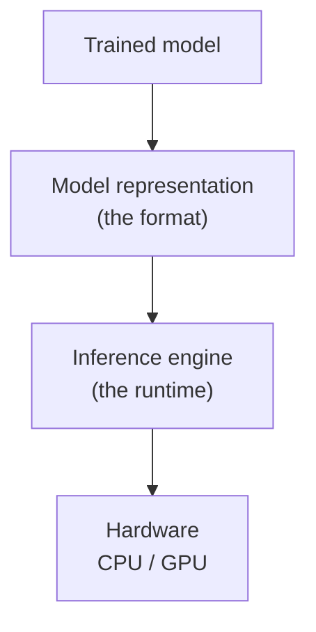

Crucially, changing the *format* does not change the neural network mathematically. It changes how the model is **represented** and **consumed**. The same conceptual model can live in multiple formats, each paired with a different runtime:

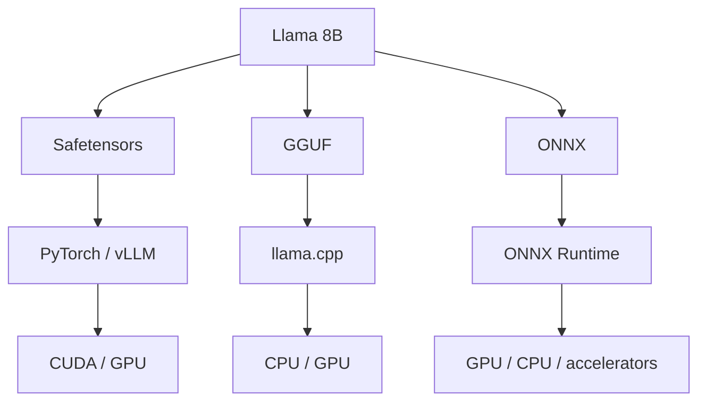

The architecture is conceptually the same across all three branches. The **runtime and kernels** that consume it can be very different.

---

## II. Model Formats: Safetensors, GGUF, and ONNX

There are three formats you will keep running into, and they do **not** sit at the same level of abstraction.

### Safetensors — "What are my weights?"

On Hugging Face today, you very commonly see files like:

```
model-00001-of-00004.safetensors
model-00002-of-00004.safetensors
...
```

Safetensors is primarily a **safe, efficient tensor serialization format**. It stores tensors such as `Wq`, `Wk`, `Wv`, along with metadata describing each tensor's name, shape, dtype, and offset. PyTorch can then load them:

```python
state_dict = load(...)          # read tensors from safetensors
model.load_state_dict(state_dict)
```

The important point: **Safetensors is not the inference engine.** It is the storage representation of the weights.

### GGUF — "Weights + metadata, packaged for the llama.cpp ecosystem"

GGUF is another model-file format, most commonly associated with **llama.cpp**. A GGUF file packages the model's tensors *plus* metadata into a single format designed for efficient loading and inference:

```
model.gguf
│
├── metadata
├── tokenizer information
├── model configuration
├── weights
└── quantized tensors
```

GGUF is especially popular for **quantized local inference**. A large model gets shrunk to fit in far less memory:

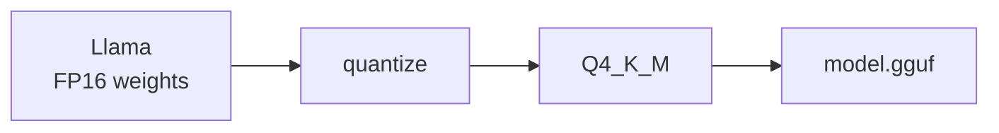

So if you download `llama-3-8b.Q4_K_M.gguf`, you're looking at a quantized GGUF model intended for a GGUF-compatible runtime such as llama.cpp.

### ONNX — "What computation does this network perform?"

ONNX (Open Neural Network Exchange) is a **fundamentally different idea** from "another weight file." Instead of saying *"these are PyTorch tensors,"* ONNX describes the **computation graph**:

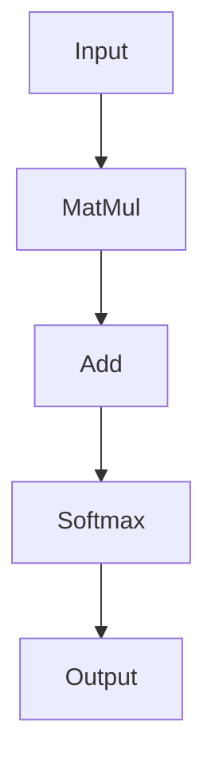

ONNX is designed as an **interchange representation** for neural-network computation. You export from a framework and then run on any backend that supports the graph's operators:

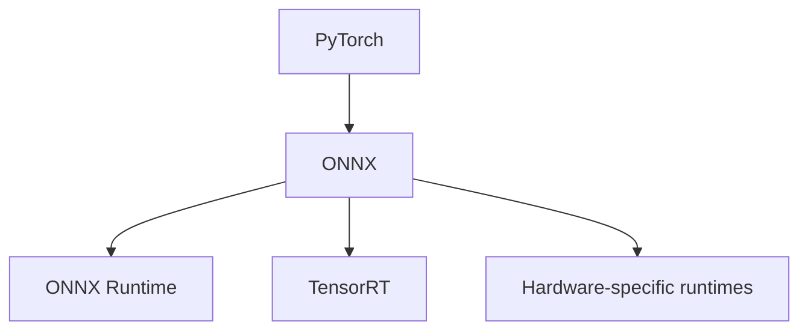

Here is the distinction in one table:

| Format | What it primarily captures | Abstraction level |
|---|---|---|
| Safetensors | Serialized tensors (the weights) | Tensor storage |
| GGUF | Weights + metadata, tuned for its ecosystem | Complete model file |
| ONNX | Computation graph + parameters | Graph interchange |

The takeaway: **GGUF, Safetensors, and ONNX are not three competing "LLM formats" at exactly the same level.** GGUF and Safetensors are model/tensor serialization ecosystems; ONNX is a standardized graph/interchange representation that can also carry model parameters.

---

## III. From Weight Shards to a Working Model

Once you understand formats, the next mystery is: *if I download five `.safetensors` files, do I have five models? Are they groups of layers?* No. The architecture and the weights are stored **separately**, and shards are just storage partitions.

### The repository separates architecture from weights

A Hugging Face repository typically looks like this:

```
model/
├── config.json
├── tokenizer.json
├── model.safetensors.index.json
├── model-00001-of-00005.safetensors
├── ...
└── model-00005-of-00005.safetensors
```

`config.json` holds the architectural hyperparameters — `hidden_size`, `num_hidden_layers`, `num_attention_heads`, `intermediate_size`, `vocab_size` — plus an identifier for which model implementation to instantiate. The `.safetensors` shards hold the tensors.

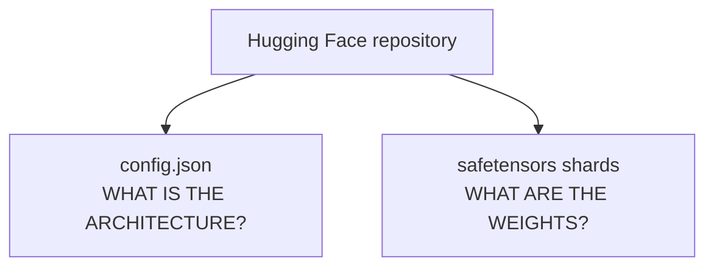

### A shard is a storage partition, not a semantic one

For a 7B model in FP16:

$$7\text{B params} \times 2\text{ bytes} \approx 14\text{ GB}$$

Splitting 14 GB into five files makes downloading, distribution, and management easier — but a shard does **not** mean "layers 0–10." There is no requirement that shard 1 holds the first few layers. Instead, each tensor has a **name**, and an index file maps names to shards:

```
model.safetensors.index.json

"model.layers.7.mlp.up_proj.weight"
                     │
                     ▼
        "model-00002-of-00005.safetensors"
```

So the loader can find any tensor without treating each file as a separate model.

### Architecture construction and weight loading are two independent processes

When you call `AutoModelForCausalLM.from_pretrained(...)`, two things happen in sequence. First, the framework reads `config.json` and builds an **empty** Transformer:

```
TransformerLayer 0
├── q_proj.weight       ← empty
├── k_proj.weight       ← empty
├── v_proj.weight       ← empty
├── mlp.up_proj.weight  ← empty
└── ...
```

Then the loader reads the tensors and matches them **by name** into the right slots:

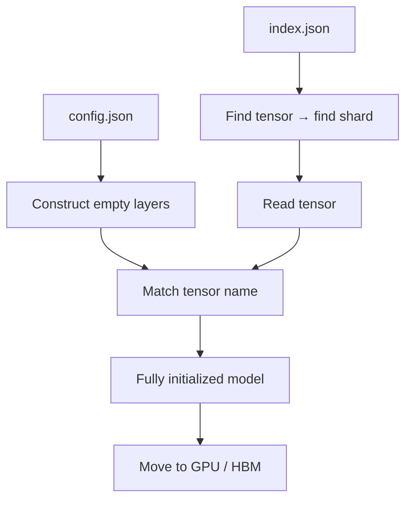

The name itself carries the meaning: `model.layers.0.self_attn.q_proj.weight` decodes as *layer 0 → self-attention → Q projection → weight*. That is why `layers.1.q.weight` can physically live in shard 2 and still land in the correct place — **the shard number has no semantic meaning; the tensor names do.**

---

## IV. Inference Engines: llama.cpp vs vLLM

Now the piece people most often mix up. **llama.cpp is not a format — it is an inference engine.** Its original purpose was to run LLaMA models efficiently in C/C++, especially on CPUs, and it has grown into a broad local inference runtime spanning CPU and GPU.

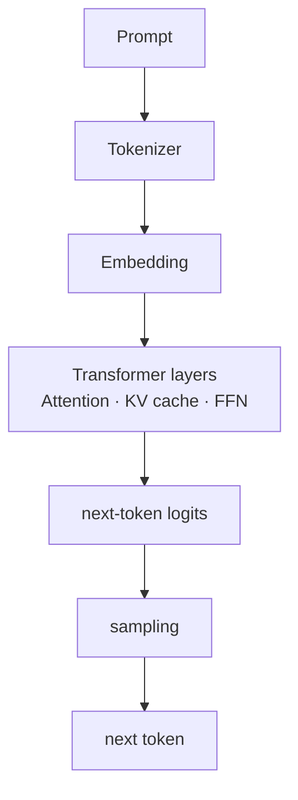

So the mental model is **not** "llama.cpp = convert my model." It is "llama.cpp = a runtime that loads a compatible representation and executes it." GGUF is the file it consumes; the typical workflow is a conversion (and often quantization) step:

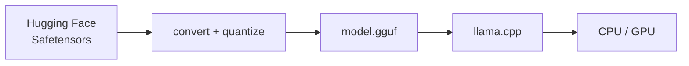

vLLM is a different ecosystem aimed at **GPU serving**. It typically consumes Safetensors directly and layers on scheduling and memory management:

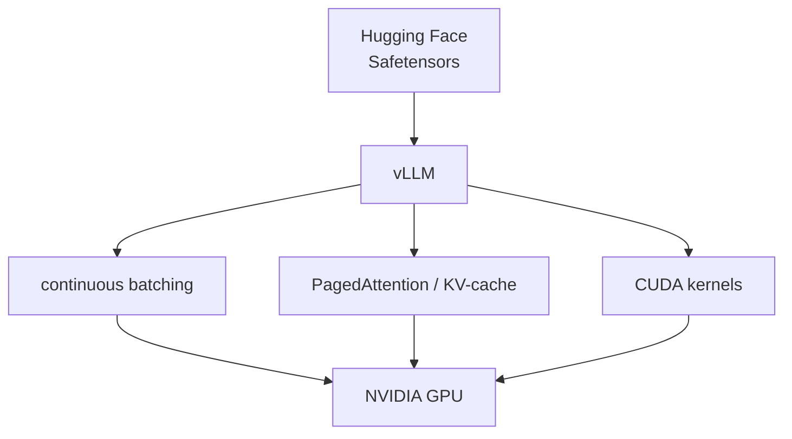

This is exactly why you should **not** download `Llama-3-8B.Q4_K_M.gguf` and expect to hand it to vLLM. GGUF is strongly tied to the llama.cpp ecosystem; modern GPU serving stacks (vLLM, SGLang, TensorRT-LLM) commonly want Safetensors or their own supported quantized formats. The format you choose is partly determined by the runtime you want to use.

| Engine | Typical input | Primary target | Core responsibilities |
|---|---|---|---|
| llama.cpp | GGUF | CPU + GPU, local | Quantized kernels, KV cache, GPU offloading |
| vLLM | Safetensors | NVIDIA GPU, serving | Continuous batching, PagedAttention, CUDA kernels |

### You do not load the model onto the GPU yourself

A related confusion: with vLLM you don't call `AutoModelForCausalLM.from_pretrained(...)` and manually move the model to CUDA. You hand vLLM the model identifier and it does the loading, placement, and tokenizer handling for you:

```python
from vllm import LLM

llm = LLM("meta-llama/Llama-3.1-8B")   # vLLM finds config, weights, tokenizer
outputs = llm.generate("What is CUDA?")
```

It helps to keep three responsibilities distinct:

- **`AutoTokenizer`** — text → token IDs. It does *not* load weights or run the Transformer.
- **`AutoModelForCausalLM`** — construct + load + execute the Transformer (and `device_map="cuda"` is how *you'd* place it on the GPU manually).
- **vLLM** — an end-to-end serving engine that loads the model, uses the tokenizer, places weights on the GPU, manages the KV cache, schedules and batches requests, and runs optimized kernels.

So with vLLM you generally don't separately instantiate `AutoTokenizer` just to generate — the runtime uses the tokenizer files shipped in the repository.

---

## V. ONNX vs XLA: Interchange Format vs Compiler

Because ONNX describes a graph, it is tempting to lump it in with compilers like XLA. They solve different problems.

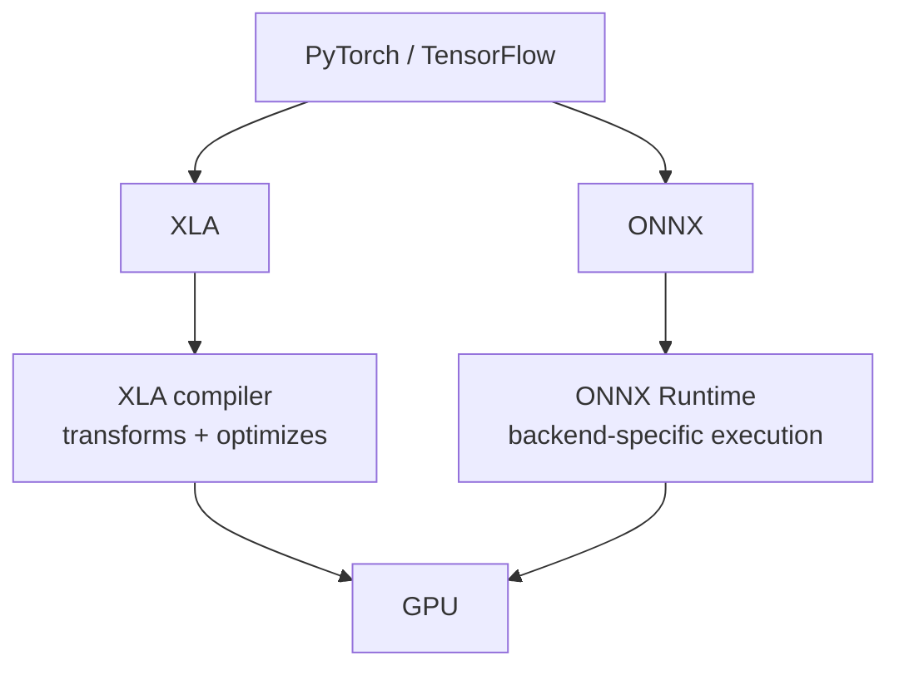

- **XLA** is primarily a **compiler** — it actively transforms and optimizes the computation before execution.
- **ONNX** is primarily an **interchange / model representation standard** — it is the bridge, not the thing that performs inference.

### ONNX does not decide "CPU for sequential, GPU for matmul"

A common misconception is that ONNX itself routes operations to hardware. It does not. ONNX is the *description* of the graph; **ONNX Runtime** (via execution providers) decides how to execute it:

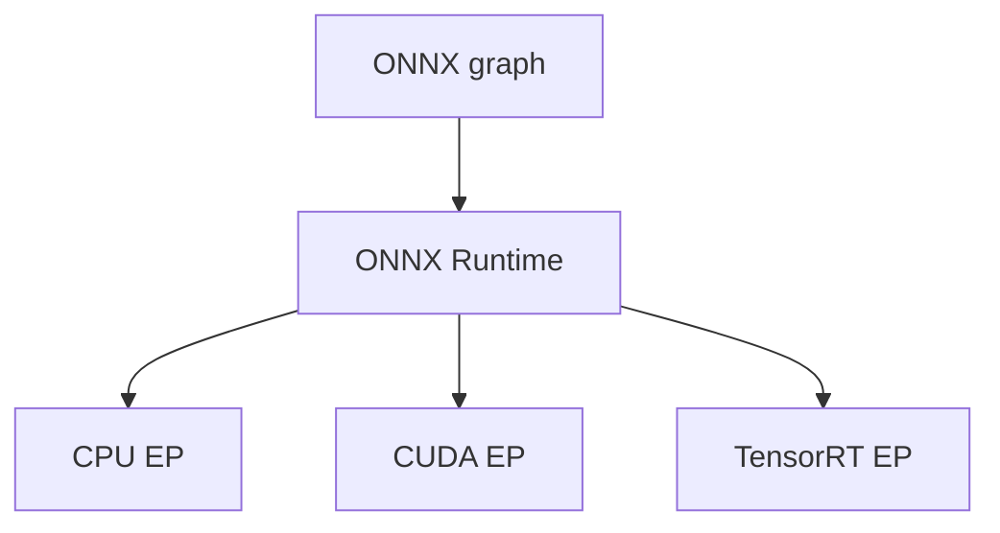

The runtime can partition the graph across providers based on what each supports. But you should **not** assume ONNX automatically pushes non-matmul ops to CPU and matmuls to GPU. In a production LLM deployment you want as much of the Transformer as possible to stay on the GPU, because bouncing tensors across the PCIe/interconnect boundary destroys latency:

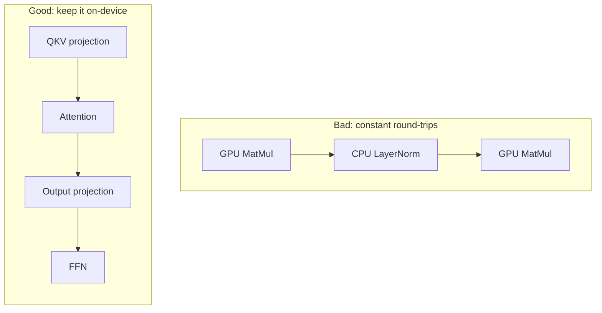

So ONNX provides **portability of the computation graph**; the execution provider determines *where and how* the operations actually run — and it does not mean the same model runs optimally everywhere, since each backend must implement the operators for its hardware.

---

## VI. Why Serving Engines Are More Than Formats: The KV Cache

For a traditional vision model, the mental picture is simple: load weights, run graph. For an LLM **serving** system, generation is autoregressive, and that changes everything:

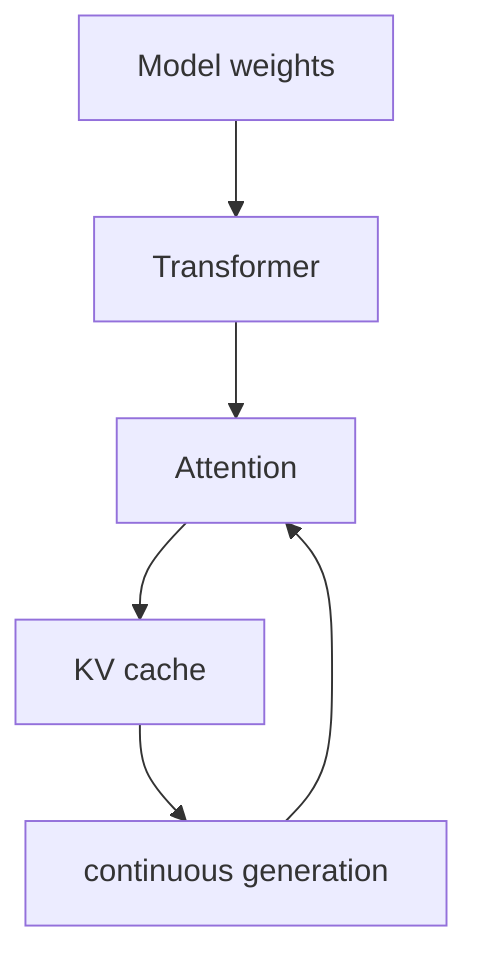

The runtime has to manage KV-cache allocation, batching, variable sequence lengths, attention kernels, memory movement, scheduling, quantization, and GPU execution. That is precisely why **vLLM, SGLang, TensorRT-LLM, and FlashInfer are not model formats** — they are execution and serving systems built around this loop.

---

## VII. The Four-Layer Mental Model

Everything above collapses into four clean layers. When you read about any deployment stack, place each piece into one of them:

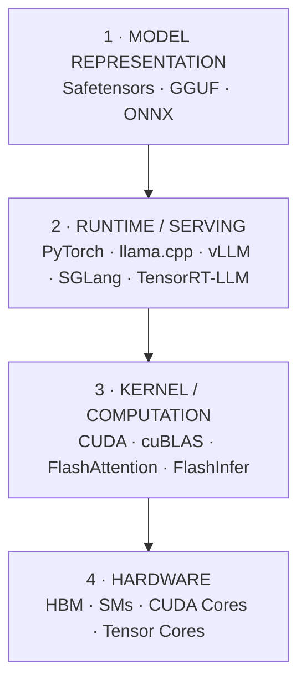

ONNX sits slightly differently from the other formats, because it can represent the computation *graph* itself, not merely serialized weights.

A final analogy makes it stick. Think about a movie:

```
MP4 file          = how the movie is stored        → Safetensors / GGUF
Media player      = software that decodes/executes  → PyTorch / llama.cpp / vLLM
CPU / GPU         = hardware that runs it           → CUDA / GPU
```

The only caveat is that Safetensors and GGUF aren't equivalent: Safetensors is primarily tensor serialization, while GGUF is a fuller model-file format designed around the llama.cpp ecosystem.

So when you download five or ten `.safetensors` files from Hugging Face, you haven't downloaded five models or five independent Transformer sections — you've downloaded **shards that collectively contain one model's weights**. You then choose an inference ecosystem — PyTorch/vLLM/SGLang, TensorRT-LLM, or llama.cpp — that knows how to load an appropriate representation and execute those weights on your hardware.

Get those two layers straight — **representation** and **execution** — and the rest of the LLM deployment landscape stops looking like a pile of interchangeable files and starts looking like a stack.

---

## Related Reading

- [Mastering LLM Inference Optimization: KV Caching, Attention, Parallelism, and the Memory Wall](/2026/04/19/llm-inference-optimization/) — a deeper look at the KV cache and the memory wall referenced in Section VI.
- [Inside GenRec: How Netflix Turned an LLM into a Recommendation Ranker](/ai%20engineering/2026/08/22/genrec-netflix-llm-recommendation-ranker/) — a production system built on top of the prefill/decode inference model.
