<!--
  SEO
    Primary keyword:   XLA compiler
    Secondary:         XLA GPU, operation fusion, CUDA kernels, cuBLAS, cuDNN, Triton,
                       HLO, StableHLO, FlashAttention, FlashInfer, HBM, kernel fusion,
                       LLM inference

  SOURCE / GROUNDING NOTES
    - Primary source: my own learning thread on how XLA relates to CUDA kernels,
      Transformer compilation, and where FlashAttention / FlashInfer sit.
    - My voice, analogies, and ASCII "mental model" diagrams are preserved; the ASCII
      diagrams are re-expressed as Mermaid where they render more clearly.
    - Documented facts (three XLA:GPU lowering routes: libraries / Triton / emitters;
      StableHLO as PyTorch->XLA IR; fusion avoiding HBM materialization) come from the
      OpenXLA docs. FlashInfer framing comes from its 2025 paper.
    - Corrections carried from the thread: ordinary PyTorch CUDA execution does NOT go
      through XLA automatically (that's torch_xla); XLA does not emit handwritten CUDA
      C++ source; XLA is not "training-only" nor FlashInfer "inference-only" in a strict
      sense — the difference is abstraction and purpose.
-->

# How XLA Compiles Deep Learning Models to GPU Kernels


*The whole pipeline in one view: frameworks describe **what** to compute, XLA decides **how** to compile it (fusion, cuBLAS/cuDNN, Triton, custom emitters), and the GPU executes **where** — with FlashAttention/FlashInfer operating as specialized kernel libraries at a different layer.*

If you come from TensorFlow or Keras, you already have most of the mental model you need. You write high-level operations, they form a computation graph, and something turns that graph into work the GPU can actually run.

The missing piece — and the thing that confused me for a while — is that the **XLA compiler** (Accelerated Linear Algebra) sits *between* the computation graph and the low-level GPU kernels.

The single most important sentence in this whole post is this:

> XLA is a **compiler**, not a CUDA kernel library.

Once that clicked, everything else about GPU execution, operation fusion, and why specialized attention engines like FlashAttention and FlashInfer exist started to fall into place. This post is my engineering understanding of what the XLA compiler actually does to a real Transformer, and where CUDA, cuBLAS, Triton, FlashAttention, and FlashInfer each fit.

---

## I. Where XLA Sits in the Stack

Think of XLA as a stage in a pipeline. You describe *what* you want as a graph; XLA decides *how* to compile that computation efficiently for the target hardware; CUDA is the low-level code that finally executes it.

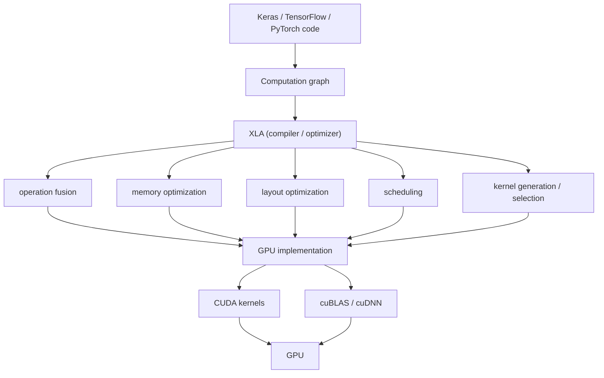

The distinction I want to hammer on:

- The **computation graph** describes *what* you want.
- **XLA** decides *how* to compile that computation efficiently for the target hardware.
- **CUDA kernels** are the actual low-level GPU code that executes the work.

XLA does not simply translate every graph operation into a handwritten CUDA kernel. Depending on the operation and backend, it can either **generate** code or **call** an optimized library such as cuBLAS or cuDNN. Hold onto that idea — it comes back in section V.

---

## II. A First Example: Fusing MatMul → BiasAdd → ReLU

Suppose your graph is a tiny slice of a network:

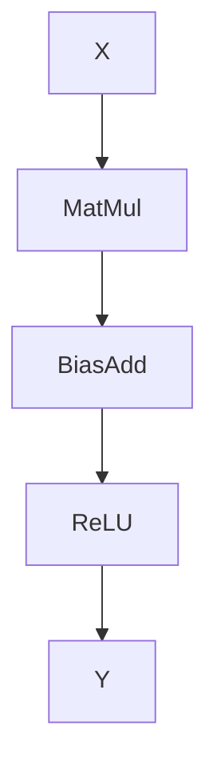

Without aggressive compilation, you conceptually get one kernel per operation, and every intermediate result makes a round trip to HBM (the GPU's global memory):

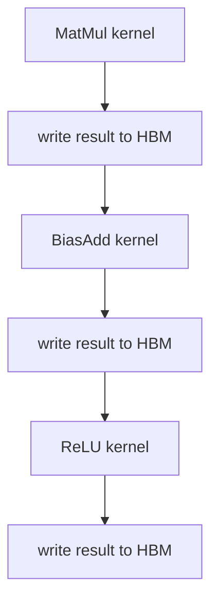

That is multiple kernel launches plus a lot of unnecessary global-memory traffic.

XLA can look at the *whole* graph and reason: "These operations can be fused." So it can generate something conceptually like a **single kernel**:

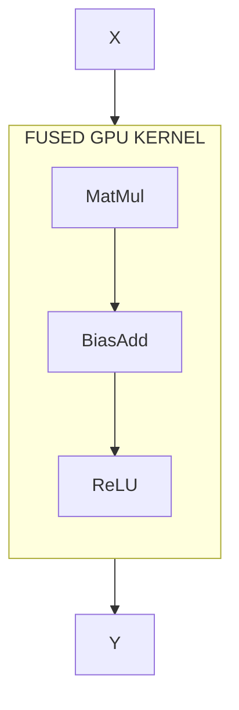

The intermediate values never need to be written to HBM — they can stay in registers or shared memory *inside* the fused kernel. That is the entire point of fusion, and it's a benefit the OpenXLA docs call out explicitly: fused operations compile into one GPU kernel, and the intermediate storage inside the fusion is not materialized in HBM.

---

## III. What XLA Actually Sees: From PyTorch to HLO

Here is a correction worth making up front, because I had it wrong at first:

> Ordinary PyTorch CUDA execution does **not** automatically go through XLA.

PyTorch *can* target XLA through the `torch_xla` ecosystem — you run on an XLA device, and XLA receives the computation in an intermediate representation such as **StableHLO** and compiles it for the target. But if you're running standard eager or `torch.compile` CUDA PyTorch, that's a different path. XLA is opt-in, not the default under PyTorch.

When you *do* go through XLA, the important thing is that XLA doesn't care about your Python line ordering. It wants a graph / IR describing the operations and their data dependencies. Consider a minimal attention forward:

```python
def forward(x):
    x = positional_encoding(x)

    q = self.q_proj(x)
    k = self.k_proj(x)
    v = self.v_proj(x)

    scores = q @ k.transpose(-2, -1)
    scores = scores / math.sqrt(d)
    probs  = softmax(scores)
    attn   = probs @ v

    x = x + self.o_proj(attn)
    x = x + self.ffn(x)
    return x
```

At the Python level this looks strictly sequential. But XLA lowers it into **HLO** (High Level Operations) — `matmul`, `multiply`, `softmax`, `reshape`, `transpose`, `add` — as nodes in a dependency graph:

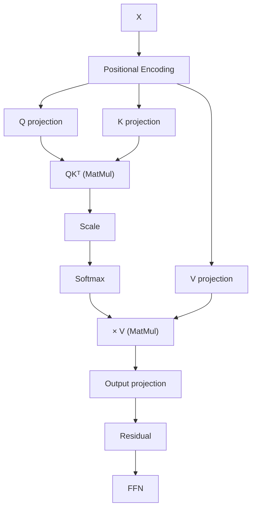

Once XLA has the graph rather than the source text, it can ask the only question that matters: *what can I optimize?*

---

## IV. Fusion and the HBM Problem

This is the same idea as section II, but now it's worth stating *why* it matters so much, because it's the thread that connects XLA to FlashAttention and FlashInfer later.

If you execute operations independently, the pattern for **every** operation is:


HBM traffic is expensive relative to on-chip memory. So the win from fusion is:

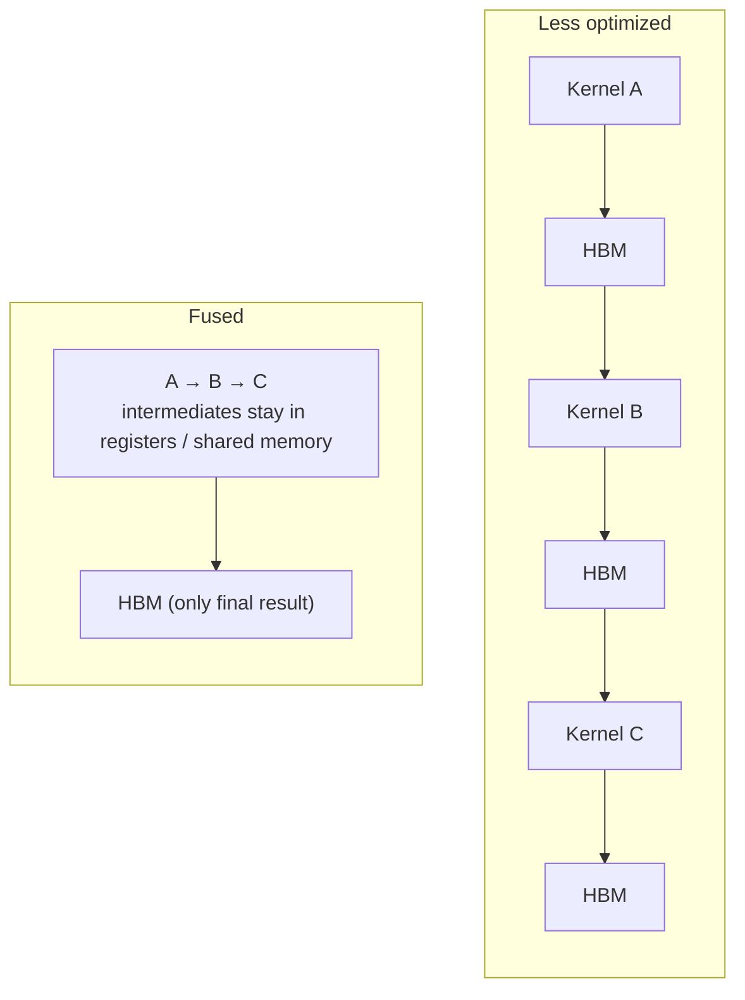

A crucial caveat that I want to be honest about: XLA does **not** fuse your entire Transformer into one giant kernel. That would be unreasonable. Instead it analyzes which operations *can* and *should* be fused, and you end up with a partition — something like a QKV-projection kernel, an attention region, an output-projection-plus-residual kernel, an FFN fusion, and so on. The exact partition depends on the graph, the shapes, the hardware, and the compiler's own cost decisions.

---

## V. How XLA Lowers to the GPU: cuBLAS, Triton, and Emitters

Now the question I actually started with: **does XLA write CUDA code directly?**

The honest answer is: *sometimes it generates GPU code, and sometimes it calls an optimized GPU library.* Do not picture this pipeline:

```text
Python → CUDA C++ source → nvcc
```

Picture this instead. The OpenXLA docs describe three major routes for the `XLA:GPU` backend:

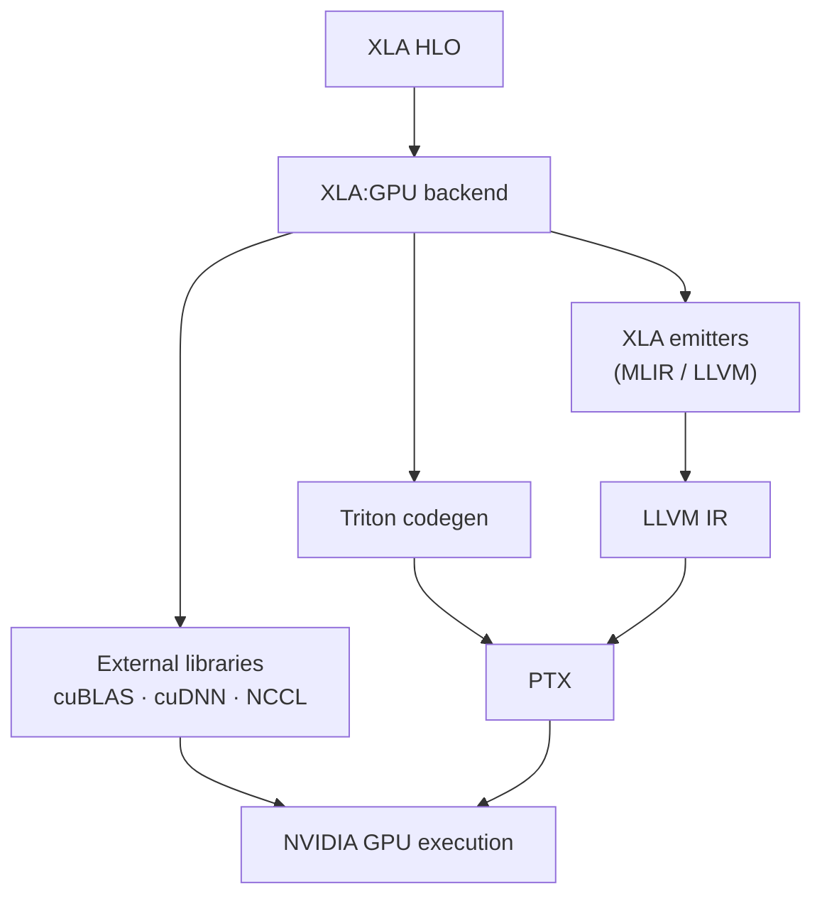

The three routes, concretely:

1. **External libraries.** When XLA sees a big GEMM ($C = AB$), it doesn't necessarily generate the matmul itself — it recognizes it as GEMM and hands it to **cuBLAS**, which already has Tensor-Core-tuned kernels. Convolutions similarly go to **cuDNN**.
2. **Triton-based code generation.** For fusible regions that benefit from custom kernels, XLA can emit Triton, which lowers to PTX.
3. **XLA emitters.** XLA's own lowering path goes through MLIR / LLVM down to PTX for the rest.

So the real shape of the pipeline is:

```text
PyTorch
   ↓
StableHLO / HLO
   ↓
XLA optimization
   ↓
GPU-specific lowering
   ↓
Triton / LLVM / cuBLAS / cuDNN
   ↓
PTX / GPU executable
   ↓
NVIDIA GPU
```

"XLA" does **not** mean "XLA writes every CUDA kernel by hand." It means XLA is the layer that *decides* how each part of your computation becomes real GPU work — and often the best implementation already exists in NVIDIA's libraries.

### Layout is part of the job too

One more thing that isn't about kernels at all: XLA also decides how tensors are laid out in memory. A tensor shaped `[B, S, H, D]` may need a particular layout for efficient execution, and the compiler reasons about shape, stride, layout, fusion, and tiling together — because all of them affect the final GPU execution. So the compilation process is less "HLO → kernel" and more:

```text
HLO
 ├── optimize graph
 ├── determine layouts
 ├── fuse operations
 ├── choose implementations
 ├── lower operations
 ├── generate GPU code
 └── produce executable
```

---

## VI. Attention: Where a General Compiler Meets Its Limits

This is where my CUDA and FlashAttention learning became useful, because attention is *not* just a pile of trivial elementwise ops.

$$\text{Attention}(Q, K, V) = \text{Softmax}(QK^{T})\,V$$

The problem is the intermediate score matrix $S = QK^{T}$. For long sequences it is enormous, and the naive path materializes it in HBM:

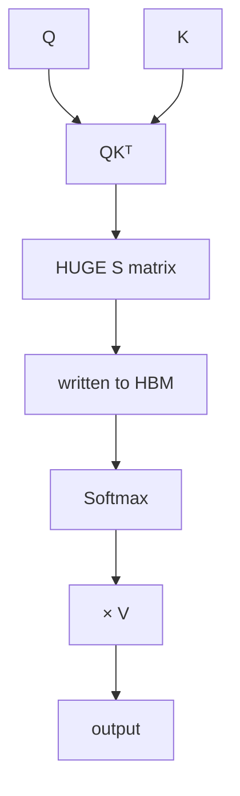

A general compiler *can* fuse portions of this. But it typically won't know the attention-specific trick that a hand-written kernel does. **FlashAttention's** whole philosophy is: *don't materialize that enormous attention matrix in HBM at all.*

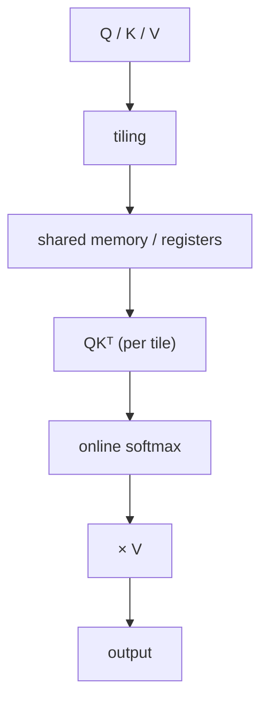

FlashAttention keeps tiles of Q/K/V on-chip, computes partial scores, runs an **online softmax** that never needs the full matrix, and accumulates the output — all in shared memory and registers, using Tensor Cores. That is far more sophisticated than asking a generic compiler to fuse three graph nodes, because it exploits properties of attention that a general optimizer doesn't automatically discover. This is exactly why frameworks reach for specialized attention kernels instead of relying on compiler fusion alone.

---

## VII. XLA vs FlashAttention vs FlashInfer

Here's the mistake I made early on: I was connecting XLA and FlashInfer too closely, as if one fed into the other. They are **not** components of the same stack.

The cleaner picture separates a general compiler from specialized attention machinery:

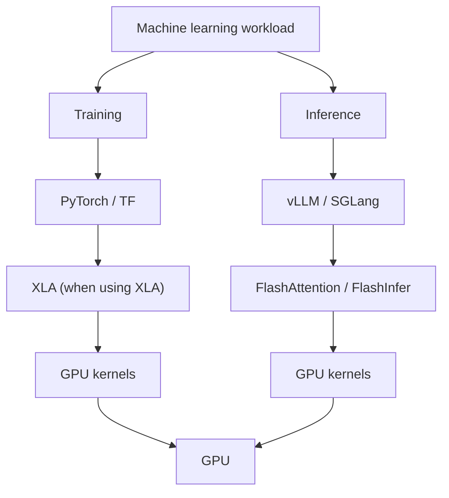

Each one is answering a different question:

- **XLA** asks: *"How can I optimize this computation graph for this hardware?"*
- **FlashAttention** asks: *"How do I compute this attention operation without touching HBM more than necessary?"*
- **FlashInfer** asks: *"How can I optimize this particular attention workload, with this KV-cache layout and this attention variant, for LLM serving?"*

That last one is the most domain-specific. FlashInfer is described in its 2025 paper as an **attention engine for LLM inference serving** — it deals with the messy realities of serving: dynamic KV caches, wildly varying sequence lengths, different attention variants, and the need for highly specialized kernels. So it does things like block-sparse (BSR) KV layouts, KV gathering, tile selection, dynamic scheduling, and JIT-compiled attention variants via CUDA/CUTLASS templates.

| Component | What it is | Core question | Abstraction level |
| --- | --- | --- | --- |
| **XLA** | General tensor-program compiler | Optimize the whole graph | High — graph → kernels |
| **FlashAttention** | Specialized attention algorithm / kernel family | Avoid HBM traffic in attention | Low — one hand-tuned kernel |
| **FlashInfer** | Inference-focused attention *engine* | Serve dynamic attention workloads | Low — kernels + KV-cache + scheduling |

One subtlety, so I don't overstate the split: XLA is *not* "training-only" and FlashInfer is *not* "inference-only" in a strict technical sense. XLA can compile inference workloads too. The real difference is **abstraction and purpose**, not which half of the lifecycle they live in.

So the inference stack I actually keep in my head looks like this — and XLA is *not* a box inside it:

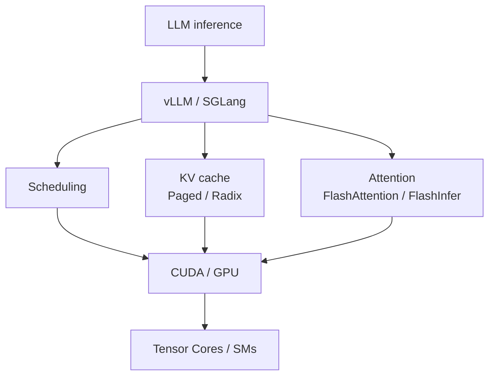

---

## VIII. The Mental Model to Keep

If I compress everything down, this is the diagram I want in my head when I write a model and wonder what happens to it:

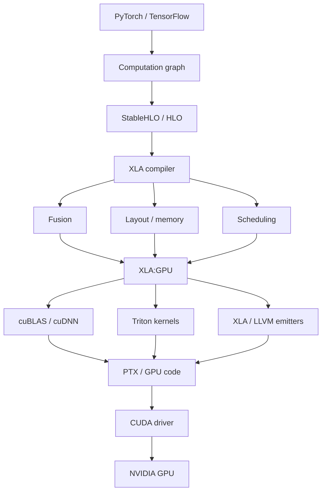

And the reason all of this matters is the same reason FlashAttention and FlashInfer exist: **expensive memory movement**. Compiler fusion, FlashAttention, and FlashInfer are all trying to reduce HBM traffic — they just do it at different abstraction levels.

Which is exactly why the low-level CUDA picture is worth learning underneath all of it:

```text
SMs
├── CUDA cores
├── Tensor Cores
├── registers
└── shared memory
        ↕
       HBM
```

Once you understand the cost of moving data through **HBM → shared memory → registers → Tensor Cores**, you can see that XLA fusion, FlashAttention, and FlashInfer are not competing ideas. They are the same instinct — *keep data on-chip, touch HBM as little as possible* — applied at the compiler layer, the kernel layer, and the serving-engine layer respectively.

So the final, precise answer to "does XLA write CUDA?" is: XLA is the compiler layer that turns a high-level tensor computation into an optimized GPU execution *plan*. CUDA is part of the underlying NVIDIA execution ecosystem that plan runs on — but XLA does not simply translate PyTorch into handwritten CUDA C++.

---

### Related reading

- [Mastering LLM Inference Optimization: KV Caching, Attention, Parallelism, and the Memory Wall](/2026/04/19/llm-inference-optimization/) — where kernel fusion and the memory wall show up in serving.
