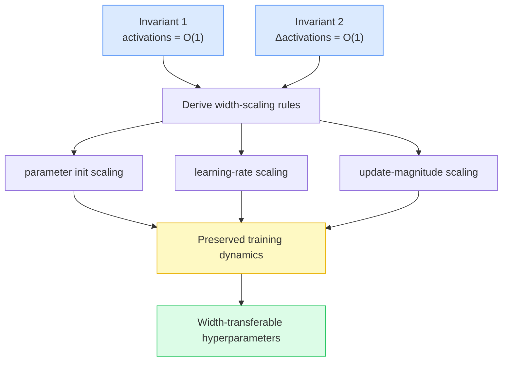
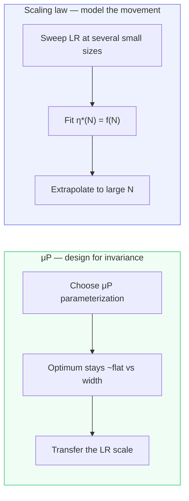
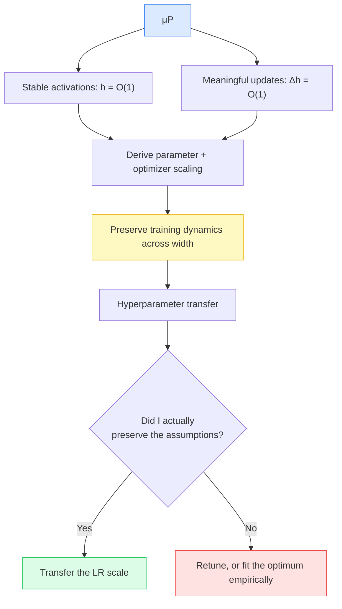

<!--
  SEO
    Primary keyword:   Maximal Update Parameterization (μP)
    Secondary:         hyperparameter transfer, learning rate scaling, model width scaling,
                       feature learning, μP vs scaling laws, cosine annealing, Adam μP,
                       RMSNorm gain, weight decay, LLM pretraining, training dynamics

  SOURCE / GROUNDING NOTES
    - Based on my own engineering notes on μP and large-scale hyperparameter transfer.
    - μP is Yang & Hu et al., "Tensor Programs V" (μTransfer, 2022). Scaling behavior of
      init/LR is standard; optimizer-specific LR scaling (SGD vs Adam) follows the μP work.
    - MiniCPM (μP-style tuning) vs DeepSeek (scaling-law LR fitting) are cited as two real,
      publicly-described philosophies, not as claims about undisclosed internals.
    - Numbers (LRs, losses, the "~3%" gap) are illustrative, not benchmark results.
-->


There is a line you hear constantly around large-model training: *"just use μP — tune the learning rate once on a small model and transfer it to the big one for free."*

That statement is directionally right and operationally dangerous. **Maximal Update Parameterization (μP)** is real, it works, and it can save an enormous amount of compute. But it is *not* a learning-rate transfer trick, and treating it like one is exactly how teams end up with a 7B model that is quietly 3% worse than it should be, with a training curve that looks perfectly healthy and no obvious reason why.

This post unpacks what μP actually does, from first principles: the problem it solves, the two invariants it enforces, why the correct scaling depends on your optimizer, the implementation details that silently break it, and where it stops — because μP solves the **width** dimension of scaling and nothing else. By the end you should be able to reason about μP as an engineering constraint you have to *earn*, not a formula you get for free.

---

## The Problem: Sweeping Hyperparameters at Every Size Is Expensive

Say you are building a family of models:

```text
100M → 500M → 1B → 7B → 30B
```

Under ordinary parameterization, the optimal learning rate moves as the model gets wider. You might sweep and find:

```text
100M     LR = 3e-4
500M     LR = 2e-4
1B       LR = 1e-4
7B       LR = 4e-5
```

Every rung on that ladder is its own hyperparameter sweep, and the sweeps get ruinously expensive as the models grow. You cannot afford to grid-search learning rates at 30B.

The question μP asks is:

> Can we **parameterize** increasingly wide networks so that their training behavior stays *comparable* as width increases?

If the answer is yes, then in principle:

```text
100M model
   ↓ sweep LR once
find LR = 3e-4
   ↓
1B  ──────────→ use the μP-consistent LR
7B  ──────────→ use the μP-consistent LR
```

That is the **hyperparameter transfer** idea (μTransfer). But notice the load-bearing word is *transferability under a parameterization* — not "the learning rate is invariant." Keep that distinction; the whole post hangs on it.

---

## Why Ordinary Parameterization Breaks as You Scale Width

Start with a single linear layer of width $n$:

$$
y = Wx, \qquad y_i = \sum_{j=1}^{n} W_{ij}\,x_j
$$

Each output $y_i$ is a sum of $n$ terms. If every term has roughly constant variance, then

$$
\mathrm{Var}(y_i) \sim n
$$

which **explodes** as the network gets wider. That is why standard initialization scales the weights down:

$$
W_{ij} \sim \mathcal{O}\!\left(\frac{1}{\sqrt{n}}\right)
$$

so the sum stays $\mathcal{O}(1)$ regardless of width. This is the familiar Kaiming/Xavier logic, and it keeps activations well-behaved *at initialization*.

But here is the catch: **initialization stability is only half the story.**

---

## Initialization Isn't Enough — You Also Need Meaningful Updates

Keeping activations sane at step 0 is necessary but not sufficient. You also want training to actually *change* those activations by a meaningful amount as width grows.

Concretely, suppose an activation starts at:

```text
activation = 1.0
```

After a gradient step, you want something like:

```text
activation = 1.0 + O(1)      ✅ meaningful update
```

not:

```text
activation = 1.0 + 0.000001  ❌ lazy — features barely move
activation = 1.0 + 1000      ❌ unstable — training blows up
```

So μP enforces **two** invariants simultaneously:

$$
h = \mathcal{O}(1) \quad\text{(activations stay bounded)}
$$

$$
\Delta h = \mathcal{O}(1) \quad\text{(activations change meaningfully per step)}
$$

That second invariant is the heart of it. It says the network must keep **learning features** at the same effective rate no matter how wide it gets.

---

## Why "Feature Learning" Is the Whole Point

Imagine widening a network and, to stay numerically safe, shrinking the updates as you go:

```text
100 neurons     → update = 0.1
1,000 neurons   → update = 0.01
10,000 neurons  → update = 0.001
```

Everything is stable. But the wider model has become *lazy* — its features barely move during training. In the infinite-width limit this is the "kernel" or "lazy training" regime, where the network stops learning representations and behaves like a fixed feature map.

μP wants the opposite:

```text
100 neurons       → meaningful feature change
1,000 neurons     → meaningful feature change
10,000 neurons    → meaningful feature change
1,000,000 neurons → meaningful feature change
```

That is what **"maximal update"** means: the largest per-step feature update you can take while remaining stable. Enforce that, and wide models keep learning like their small counterparts — which is precisely why their optimal hyperparameters line up.

---

## From Two Invariants to Concrete Scaling Rules

Here is the clever part. Once you commit to:

> activations $\mathcal{O}(1)$, and their per-step change $\mathcal{O}(1)$

you can *derive* how everything else must scale with width. μP gives you coordinated rules for:

- initialization variance,
- learning rates (per parameter group),
- the magnitude of parameter updates,
- output/readout layers,
- embeddings,
- hidden weights.



And critically:

> **The correct learning-rate scaling depends on the optimizer.**

μP does not hand you a single universal "keep LR constant" rule. It tells you how the *effective update* should scale with width, and the parameterization needed to achieve that differs by optimizer.

---

## Optimizer Matters: SGD vs Adam vs Lion

**SGD.** The update is proportional to the raw gradient:

$$
\Delta W = -\eta\, \nabla_W L
$$

The gradient's scaling with width depends on where the parameter sits in the network, so μP derives an LR scaling for each parameter group accordingly.

**Adam.** The update is *normalized* by the second-moment estimate:

$$
\Delta W = -\eta\, \frac{m_t}{\sqrt{v_t} + \epsilon}
$$

Because Adam divides out the gradient magnitude, its width dependence is different from SGD's — so μP prescribes a different LR scaling (for Adam, hidden-layer LRs typically scale like $1/\text{fan\_in}$, whereas SGD scales like $\text{fan\_out}/\text{fan\_in}$).

The upshot: you should never say *"μP means the learning rate is constant."* The precise statement is:

> μP tells you how the effective update should scale with width, and the required parameterization is optimizer-specific.

**Lion.** Lion is sign/update-direction based — very roughly:

$$
\Delta W \propto \operatorname{sign}(\cdot)
$$

That changes the scaling behavior of the update entirely. The original μP derivations were worked out for specific optimizers (notably SGD and Adam); they do not automatically carry over to every optimizer. So `Adam + μP` and `Lion + μP` cannot be assumed to have identical transfer behavior. The honest engineering stance:

> I'd validate the optimizer-specific scaling empirically rather than assuming μP transfers unchanged under a new optimizer.

---

## The Implementation Details That Silently Break μP

μP is a set of assumptions about how parameters and updates scale. Ordinary architectural choices can violate those assumptions *without anything crashing*. Two classic offenders:

### RMSNorm's learnable gain

RMSNorm looks innocent:

$$
\mathrm{RMSNorm}(x) = g \cdot \frac{x}{\mathrm{RMS}(x)}
$$

But $g$ is a **learnable gain** — an extra trainable parameter whose scaling behavior isn't necessarily what the μP derivation assumed. You can have everything else perfectly μP-correct and still break transfer:

```text
✓ μP initialization
✓ correct width scaling
✓ correct optimizer LR rule
✗ learned RMSNorm gain  ← quietly violates the assumptions
        ↓
transfer behavior changes
```

A common mitigation is to drop the learnable gain (or hold it fixed) so it doesn't interfere with the parameterization.

### Weight decay

Plain SGD:

$$
W_{t+1} = W_t - \eta\, g_t
$$

Add decoupled weight decay (AdamW-style):

$$
W_{t+1} = (1 - \eta\lambda)\,W_t - \eta\, g_t
$$

You've introduced a second update term. μP's derivation is about preserving the scaling of the optimization dynamics; if weight decay becomes large relative to the gradient step, it changes those dynamics and the optimal LR can move:

```text
μP scaling  +  large decoupled WD
        ↓
different effective optimization dynamics
        ↓
optimal LR shifts — transfer degrades
```

Weight decay isn't in the core μP derivation, so large decoupled WD is a known way to erode transfer.

---

## The Biggest Trap: μP Only Solves Width

This is the single most important thing to internalize. A realistic scaling ladder never changes only one thing:

| Model | Width | Depth | Tokens | Batch |
| ----- | ----: | ----: | -----: | ----: |
| 100M  |   768 |    12 |    20B |    1M |
| 1B    |  2048 |    24 |   100B |    2M |
| 7B    |  4096 |    32 |     2T |    4M |
| 70B   |  8192 |    80 |    10T |    8M |

You *say* "I'm scaling width," but you are actually changing **four** things at once. μP addresses the **width** dimension. It does not claim:

> the same hyperparameters are optimal when you change everything.

Depth changes optimization and architecture dynamics. Batch size changes the gradient noise scale and the number of optimizer steps. Token budget changes the compute-optimal regime. So:

$$
\text{μP transferability} \ne \text{all hyperparameters are invariant}
$$

$$
\boxed{\text{μP gives width-transferable optimization behavior under its assumptions}}
$$

The correct way to use μP is to **isolate width**: hold depth, batch-size-per-token relationships, and other axes controlled (or handle them separately), so that width is genuinely the variable you're transferring across.

---

## μP vs Scaling-Law Extrapolation: Two Philosophies

There are two legitimate ways to make large-scale hyperparameter selection predictable.

**Approach A — μP: engineer the system so the optimum doesn't move.**

```text
LR
│ ─────────────────────────   (flat optimum across width)
│
└────────────────────────── width
```

You change the parameterization so that the optimal LR is (approximately) width-invariant, then transfer it.

**Approach B — Scaling-law extrapolation: accept that the optimum moves, and model its movement.**

```text
LR
│\
│ \
│  \____
│       \____
└────────────────────────── width
```

You measure the optimal LR at several small sizes:

```text
100M → optimal LR
300M → optimal LR
1B   → optimal LR
3B   → optimal LR
```

fit a relationship $\eta^{*}(N) = f(N)$, and extrapolate to 7B, 70B. You don't require invariance — you learn the trajectory.



Both work. The engineering question is simply: **which gives the more reliable prediction for *my actual training stack*?** Real production architectures are rarely perfectly μP-clean, which is exactly why the scaling-law approach stays popular.

This is the real lesson behind comparisons like **MiniCPM vs DeepSeek**. It isn't "one uses μP and one doesn't." It's that there are multiple valid routes to predictable hyperparameters: MiniCPM leans on μP-style architectural control to keep the LR optimum flat across sizes; DeepSeek has publicly described fitting scaling laws for the optimal learning rate and batch size and extrapolating. Different philosophies, both shipping strong models.

---

## μP and Cosine Annealing Solve Different Problems

A frequent point of confusion: *"If I have μP, can I transfer my whole cosine learning-rate schedule too?"*

No — and seeing why sharpens the whole concept. **μP addresses how the LR *scale* transfers across width. Cosine annealing addresses how the LR changes over *training time*.** Two different axes.

```text
                Learning rate
                     │
     μP determines   │  the SCALE  (peak LR = η*)
                     ↓
        the cosine schedule determines
        how η evolves over steps → toward η_min
```

Suppose your 100M μP model gives a peak LR of `3e-4`. You don't train at `3e-4` for the entire run; you use a schedule:

```text
LR
│         ┌────────┐
│        /          \
│       /            \
│______/              \________
└──────────────────────────────── steps
    warmup     cosine decay
```

μP helps you transfer $\eta_{\max}$ — the peak of that curve. It says nothing automatic about warmup length, total steps, decay duration, or the minimum LR. Consider the standard cosine schedule:

$$
\eta(t) = \eta_{\min} + \tfrac{1}{2}\,(\eta_{\max} - \eta_{\min})\left[1 + \cos\!\left(\frac{\pi t}{T}\right)\right]
$$

μP primarily helps you reason about $\eta_{\max}$. It does **not** tell you $T$, because $T$ depends on how long you're training — and your training horizon usually changes across the ladder:

```text
100M model → 100B tokens
7B model   → 2T tokens        (20× longer horizon)
```

You cannot copy a "100,000-step cosine schedule" verbatim. And it gets worse if **batch size** changes, because then the mapping between tokens and optimizer steps changes:

```text
training in tokens
        ↓ (÷ batch size)
training in optimizer steps
        ↓
LR schedule (defined over steps)
```

Change the batch size and "the same number of steps" becomes meaningless. So the correct procedure is:

```text
μP
 ↓ transfer the peak-LR SCALE
construct a NEW schedule for the large model
 ↓ warmup + cosine decay defined over ITS token/step budget
```

The shape and duration of the curve can (and should) change even when the peak-LR scale transfers.

---

## A Clean Mental Model: Three Buckets of Hyperparameters

The most useful way I've found to keep this straight is to sort hyperparameters into three buckets:

**1. Width-dependent — μP makes these predictable.**

```text
parameterization, initialization, per-group LR scaling, update magnitude
```

**2. Training-horizon-dependent — μP does *not* make these invariant.**

```text
total steps, warmup length, cosine decay duration, token budget, min LR
```

**3. Optimizer / implementation-dependent — these decide whether transfer even holds.**

```text
Adam vs SGD vs Lion, weight decay, normalization (RMSNorm gain),
gradient clipping, batch size
```

μP is a statement about bucket 1. Buckets 2 and 3 are on you.

---

## The "3% Worse and No Idea Why" Failure Mode

Here is the scenario that makes μP an *engineering discipline* rather than a magic formula. You run:

```text
100M → LR 3e-4 works
1B   → LR 3e-4 works
7B   → LR 3e-4 → "μP works!"
```

But your stack actually contains:

```text
✓ μP initialization
✓ correct width scaling
✓ correct optimizer
✗ learned RMSNorm gain
✗ significant decoupled weight decay
✗ changed batch size
✗ changed depth
✗ changed data mixture
```

The 7B model trains fine. The loss goes down smoothly:

```text
loss ↓ ↓ ↓ ↓
```

Nothing crashes. There's no NaN, no divergence, no red flag. You just end up with a model that's a couple percent worse than a properly tuned one:

```text
100M optimum:            3e-4
7B transferred LR:       loss = 1.82
7B independently tuned:  loss = 1.76
```

And when you ask *"why didn't μP work?"*, the answer is usually: **it did — your implementation just wasn't satisfying its assumptions.** That silent, no-crash degradation is exactly why these scaling principles are constraints you have to defend, not formulas you get to trust blindly.

---

## The Mental Model Worth Keeping

Don't memorize *"μP = tune small, transfer large."* Memorize the chain of reasoning:



μP answers one question well: *"How should the optimization scale when I make the network **wider**?"* Cosine annealing answers a different one: *"How should the learning rate **evolve as this particular run progresses**?"* They compose, but they are not the same tool.

---

## Key Takeaways

- **μP is a parameterization, not a learning-rate trick.** It rescales initialization, LRs, and updates so that activations stay $\mathcal{O}(1)$ *and* change by $\mathcal{O}(1)$ per step as width grows.
- **The second invariant — meaningful feature updates — is the point.** It keeps wide models learning features instead of drifting into lazy/kernel behavior.
- **LR scaling is optimizer-specific.** SGD, Adam, and Lion each imply different width scaling; never claim "μP keeps the LR constant."
- **Implementation details silently break it.** Learnable RMSNorm gains and large decoupled weight decay violate the assumptions with no crash — just a worse model.
- **μP only solves width.** Depth, batch size, and token budget are separate axes; isolate width or handle the rest explicitly.
- **μP transfers the LR *scale*, not the whole schedule.** Warmup, decay duration, and min LR depend on your training horizon and must be reconstructed for the larger run.
- **μP and scaling-law extrapolation are two valid philosophies** — design the optimum to be flat, or model how it moves. Pick whichever predicts *your* stack more reliably.

μP buys you predictable transfer under a controlled scaling regime. It does not buy you a free pass on hyperparameter tuning. The difference between knowing μP and knowing how to *use* μP is entirely in whether you check that your training stack actually earns the invariants.
