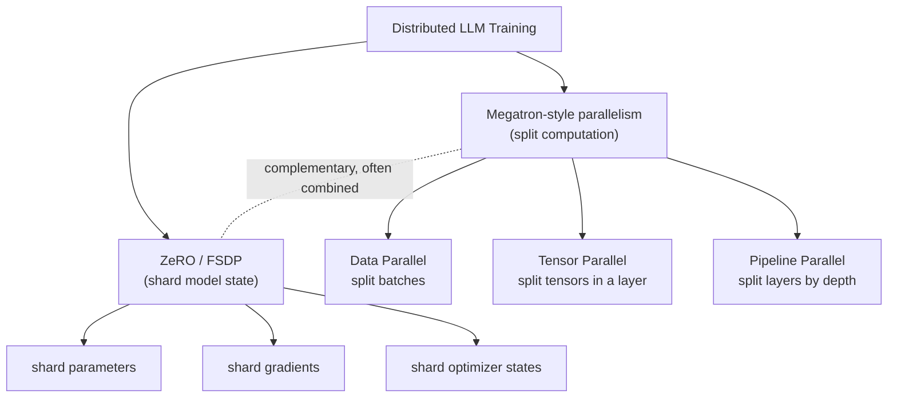
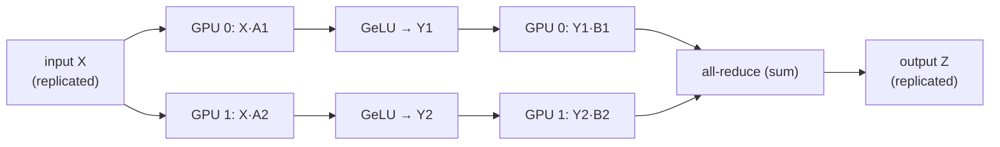
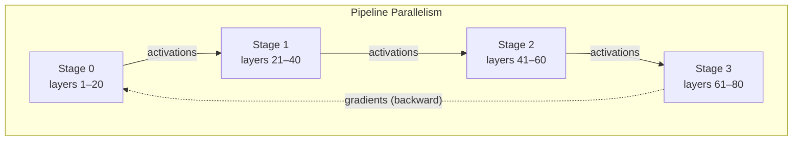
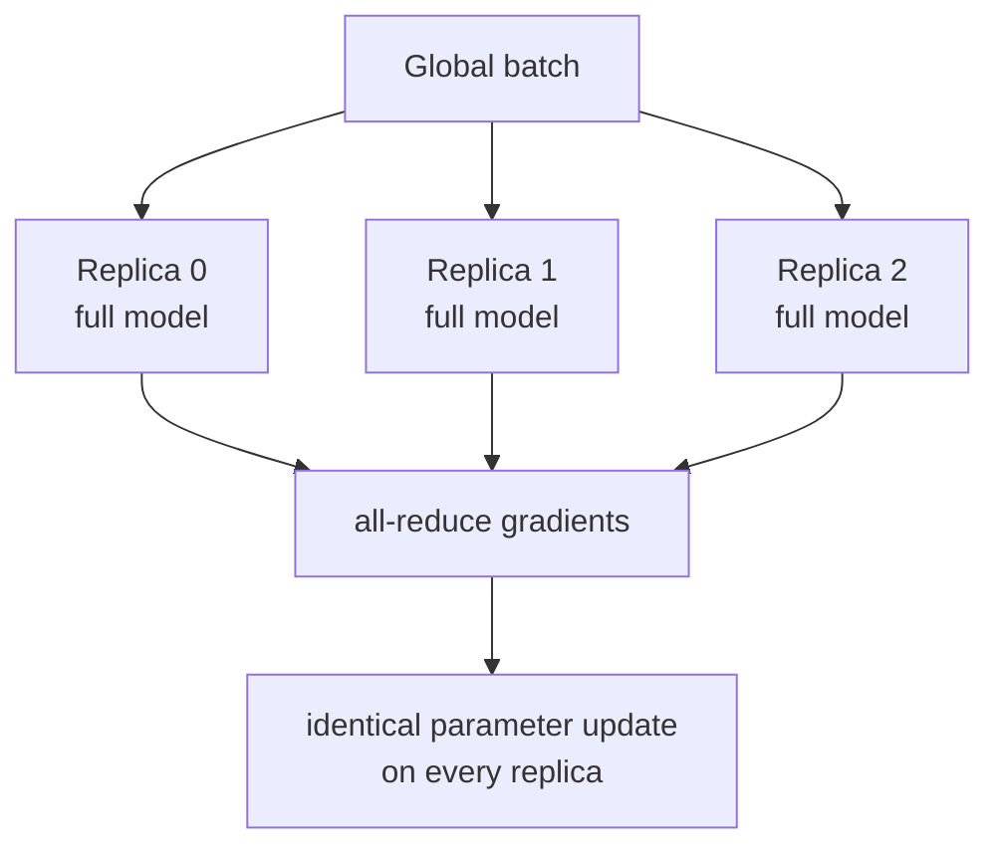
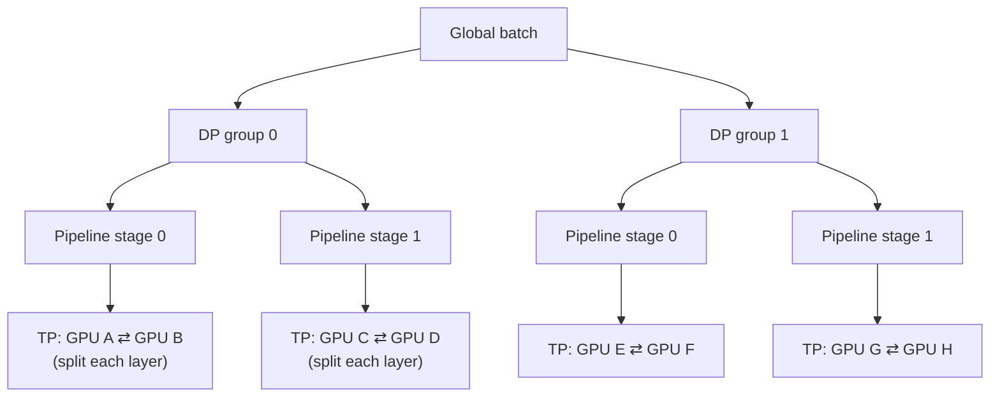
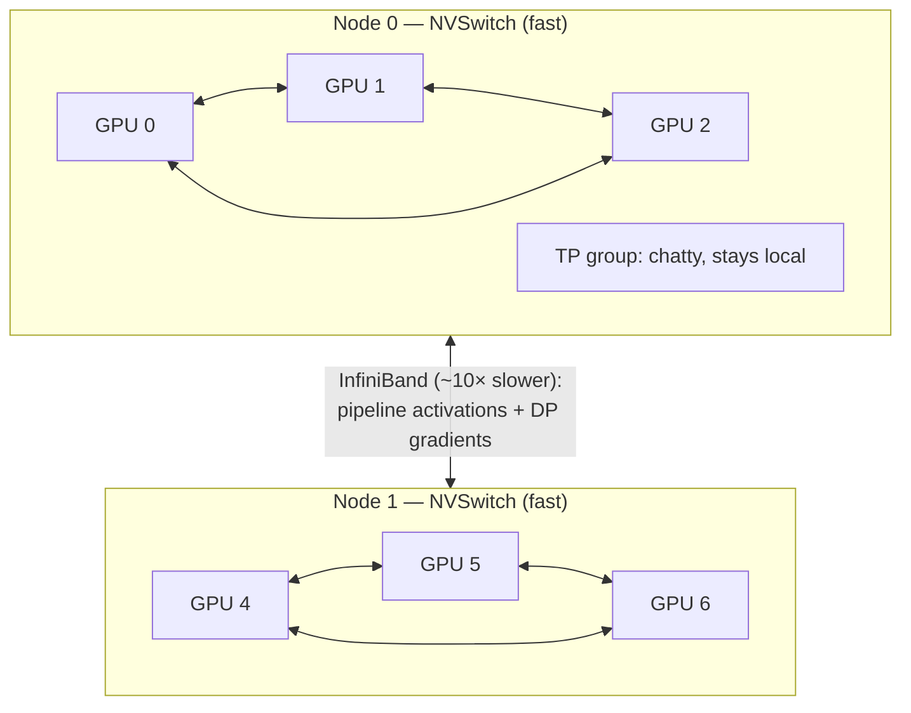
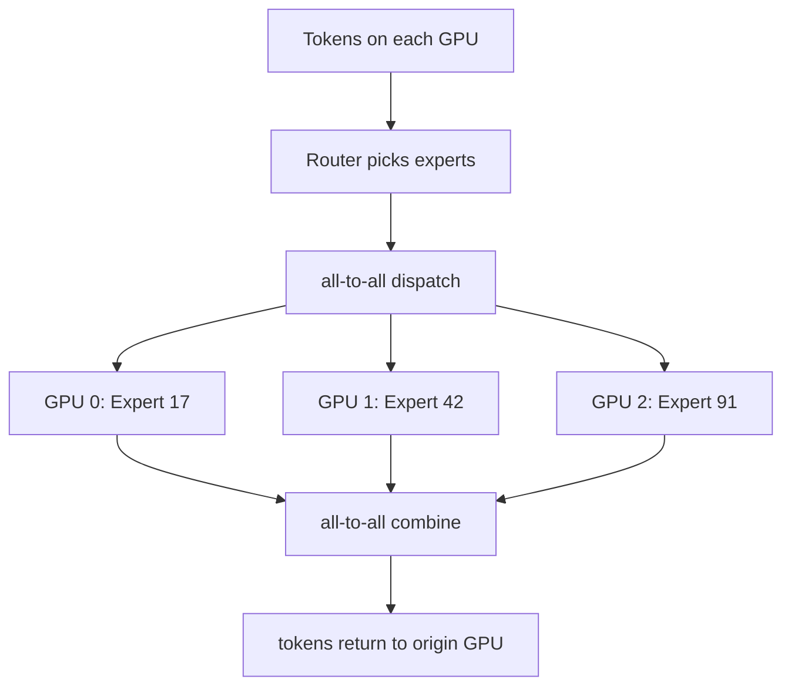

<!--
  SEO
    Primary keyword:   Megatron-LM
    Secondary:         tensor parallelism, pipeline parallelism, data parallelism,
                       3D parallelism, model parallelism, collective communication,
                       all-reduce, pipeline bubble, sequence parallelism, MoE all-to-all,
                       NVLink NVSwitch InfiniBand, distributed training LLM

  SOURCE / GROUNDING NOTES
    - Tensor parallelism (MLP column/row split, attention head split, 2 all-reduce/layer):
      Shoeybi et al., "Megatron-LM", arXiv:1909.08053 (2019).
    - 3D parallelism (PTD-P), interleaved pipeline schedule, ~1T params / 3072 GPUs:
      Narayanan et al., arXiv:2104.04473 (2021).
    - Sequence parallelism + selective activation recomputation:
      Korthikanti et al., arXiv:2205.05198 (2022).
    - Pipeline bubble fraction (p-1)/m is the standard GPipe/1F1B result.
    - ZeRO/FSDP framed as complementary (DeepSpeed / PyTorch), not part of Megatron.
    - Bandwidth comparisons (NVLink vs InfiniBand) kept order-of-magnitude on purpose.
-->


*Hero: the Frontier exascale supercomputer at Oak Ridge National Laboratory. Photo by OLCF at ORNL, [CC BY 2.0](https://creativecommons.org/licenses/by/2.0), via [Wikimedia Commons](https://commons.wikimedia.org/wiki/File:Frontier_Supercomputer_(2).jpg).*

## Introduction

If you have ever asked *"how do you actually train a 100-billion or trillion-parameter model when it doesn't even fit on one GPU?"*, the answer almost always involves **Megatron-LM**. Megatron-LM is NVIDIA's system for training large language models by splitting both the model and the work across many GPUs at once.

Here's the trap most explanations fall into: they describe Megatron-LM as *"putting different layers on different GPUs."* That's one small piece. The real substance of **Megatron-LM** is **tensor parallelism** — splitting the math *inside* a single layer — and, more broadly, how it composes **tensor, pipeline, and data parallelism** into what's called **3D parallelism**.

This post builds that picture from the ground up: what each kind of parallelism divides, the **collective communication** each one triggers, why GPU topology decides your layout, and why Mixture-of-Experts adds a whole new communication pattern. The individual ideas are simple. The engineering is in how they interact at scale.

> **The one-line mental model:** Megatron-LM is not five tricks bolted together. It is a way to **decompose an enormous model across a GPU cluster and carefully orchestrate computation *and* communication across multiple parallelism dimensions.**

## What Megatron-LM Actually Is (and Isn't)

Before the mechanics, let's kill the most common misconception.

**Megatron-LM is *not* just "ZeRO + FSDP + tensor + pipeline + data parallelism" in a wrapper.** That framing conflates two different families:

- **Megatron-style parallelism** — split the *computation* of the model across devices: **tensor parallelism (TP)**, **pipeline parallelism (PP)**, and classic **data parallelism (DP)**.
- **ZeRO / FSDP** — shard the *optimizer states, gradients, and parameters* instead of replicating them. These come from DeepSpeed (ZeRO) and PyTorch (FSDP), and they are **complementary** to Megatron, not part of its definition.

You can — and large runs often do — combine Megatron's TP/PP with a ZeRO/FSDP-style DP. But they solve different problems: Megatron splits *work*, ZeRO shards *state*. Keeping that distinction straight is the first step to reading any real training config.



## The Three Axes of Parallelism

Every parallelism strategy answers one question: **what gets divided?** That single table is the map for the whole post.

| Parallelism | What gets divided | Primary communication |
| --- | --- | --- |
| **Data (DP)** | The batch / data | Collective (gradient sync) |
| **Tensor (TP)** | Tensors *inside* a layer | Collective (within the layer) |
| **Pipeline (PP)** | Layers / model depth | Point-to-point (activations) |
| **Sequence (SP)** | The sequence dimension | Collective (paired with TP) |
| **Expert (MoE)** | Experts across GPUs | All-to-all (dispatch/combine) |

The rest of this article is really just: *for each row, how does it work, and what does it cost in communication?*

## Tensor Parallelism: Splitting the Layer Itself

This is Megatron-LM's signature contribution, and the one worth understanding **first**. The premise: a single Transformer layer's weight matrices can be so large that the layer itself doesn't fit — or is too slow — on one GPU. So we split the matrix multiplies *across* GPUs, and they cooperatively compute one layer.

The clever part is *how* you split so that you communicate as little as possible.

### The MLP block: column-parallel, then row-parallel

A Transformer MLP is essentially two matrix multiplies with a nonlinearity between them:

$$ Z = \text{GeLU}(X A)\, B. $$

Megatron splits the **first** weight $A$ **column-wise** into $[A_1, A_2]$ across two GPUs. Because GeLU is applied element-wise, each GPU can compute its own slice **independently, with no communication**:

$$ [Y_1, Y_2] = [\,\text{GeLU}(X A_1),\ \text{GeLU}(X A_2)\,]. $$

It then splits the **second** weight $B$ **row-wise** into $[B_1; B_2]$, matched to those slices. Each GPU computes a partial product, and the layer output is their **sum**:

$$ Z = Y_1 B_1 + Y_2 B_2. $$

That sum across GPUs is a single **all-reduce**. So the whole two-matmul block costs exactly **one all-reduce in the forward pass** (and, symmetrically, one in the backward pass).



### Self-attention: split across heads

Attention is even more natural to split. Multi-head attention is *already* a set of independent heads, so Megatron assigns **different heads to different GPUs**. Each GPU holds the $Q$, $K$, $V$ projections for its heads and runs their attention fully locally. The final output projection is **row-parallel**, so — just like the MLP — combining the heads needs **one all-reduce**.

### The payoff: minimal communication per layer

Add it up. Per Transformer layer, tensor parallelism needs only:

- **2 all-reduces in the forward pass** (one in attention, one in the MLP), and
- **2 all-reduces in the backward pass.**

That's the whole trick. By choosing column-then-row splits, Megatron keeps the activations replicated at layer boundaries and pays for communication only twice per block. **[This is the design from the original Megatron-LM paper, Shoeybi et al., 2019.]**

The catch: those all-reduces happen on the **critical path of every layer**, many times per step. That's why tensor parallelism is **communication-hungry** and, as we'll see, why you want the TP group to live on the fastest interconnect you have.

## Pipeline Parallelism: Splitting the Model by Depth

Tensor parallelism splits *within* a layer. **Pipeline parallelism** splits *between* layers — the "different layers on different GPUs" idea, done properly.

Say the model has 80 layers and 4 pipeline stages:

```
Stage 0: layers  1–20   →   Stage 1: layers 21–40
Stage 2: layers 41–60   →   Stage 3: layers 61–80
```

A single batch flows stage 0 → 1 → 2 → 3 for the forward pass, then back for gradients. Communication between stages is cheap: it's **point-to-point** — each stage just sends the boundary activations to the next one. No expensive collectives.

The problem is the **pipeline bubble**. If stage 0 processes the batch and hands off, stages 1–3 sat idle waiting, and now stage 0 sits idle. Naively, most GPUs are doing nothing most of the time.

### Microbatching hides the bubble

The fix is to split the batch into **microbatches** and stream them through, so every stage is working on a *different* microbatch at once:

```
time →
Stage 0:  MB1  MB2  MB3  MB4
Stage 1:       MB1  MB2  MB3  MB4
Stage 2:            MB1  MB2  MB3  MB4
Stage 3:                 MB1  MB2  MB3  MB4
```

The bubble never fully disappears — there's still fill-up and drain at the ends. For $p$ pipeline stages and $m$ microbatches, the fraction of time wasted is approximately:

$$ \text{bubble fraction} \approx \frac{p - 1}{m}. $$

The lesson is immediate: **use many more microbatches than stages** ($m \gg p$) to shrink the bubble. Megatron's later work adds an **interleaved 1F1B schedule** (each GPU holds several non-contiguous layer chunks) to cut the bubble further. **[Narayanan et al., 2021.]**



## Data Parallelism: Replicate and Synchronize

The oldest and simplest axis. **Data parallelism** puts a full copy of the model on each replica and feeds each a different slice of the batch:

```
Replica 0 → batch shard A
Replica 1 → batch shard B
Replica 2 → batch shard C
Replica 3 → batch shard D
```

Each replica runs forward and backward independently, then they **synchronize gradients** — an **all-reduce** across replicas — so every copy applies the same update and stays identical.

DP scales *throughput* (more data per step), not *model size*: on its own it requires the whole model to fit on one replica. That's exactly the limit that pushes you toward TP and PP — and toward combining all three.



## 3D Parallelism: Composing DP × TP × PP

Here's where it stops being trivia and becomes engineering. At scale you use **all three at once**, and the product of the dimensions is your GPU count:

$$ \text{GPUs} = \text{DP} \times \text{TP} \times \text{PP}. $$

With 64 GPUs you might pick **DP = 4, TP = 4, PP = 4** ($4 \times 4 \times 4 = 64$). Every GPU now has three coordinates:

$$ \text{GPU} = (\text{data\_rank},\ \text{pipeline\_rank},\ \text{tensor\_rank}). $$

Conceptually: **tensor-parallel groups** cooperatively compute each layer; **pipeline stages** chain those layers by depth; and the entire TP×PP structure is **replicated** across data-parallel groups, each fed different data.



### The part that's actually hard: three communication patterns at once

Follow **one microbatch** through a 3D-parallel system and you'll see three *different* communication styles firing simultaneously:

| Axis | Communication type | What moves |
| --- | --- | --- |
| **TP** | Collective (all-reduce / all-gather / reduce-scatter) | Partial layer results, *inside every layer* |
| **PP** | Point-to-point send/recv | Boundary activations (fwd) and gradients (bwd), *at stage edges* |
| **DP** | Collective (all-reduce / reduce-scatter) | Gradients, *once per step after backward* |

So when someone says *"we train with TP=8, PP=4, DP=16"*, they aren't just saying "512 GPUs." They're describing a **communication topology** — how often each kind of message flies, how big it is, and over which wires. That's the real object you're tuning.

## Where the Communication Happens: A Collectives Primer

Every axis above leans on a small set of **collective communication** primitives. Knowing them makes configs readable:

- **All-reduce** — every GPU ends up with the *sum* (or mean) of a value from all GPUs. Used for TP layer outputs and DP gradient sync.
- **All-gather** — every GPU collects the *concatenation* of shards from all GPUs. Used by ZeRO/FSDP to reconstruct parameters, and by sequence parallelism.
- **Reduce-scatter** — sum across GPUs, but each keeps only its *shard* of the result. The dual of all-gather; an all-reduce is exactly a reduce-scatter followed by an all-gather.
- **All-to-all** — every GPU sends a distinct chunk to every other GPU. The signature pattern of **MoE** expert routing.
- **Point-to-point (send/recv)** — one GPU to one GPU. The cheap backbone of pipeline parallelism.

The volume and *placement* of these collectives — not the FLOPs — is what usually decides whether a big run is fast or a bandwidth-bound crawl.

## Hardware Topology: Why GPU Placement Decides Everything

You do **not** assign parallelism dimensions to GPUs at random. The reason is a brutal bandwidth cliff between talking *inside* a server and *between* servers.

- **Inside a node**, GPUs talk over **NVLink / NVSwitch** — very high bandwidth (hundreds of GB/s per GPU).
- **Between nodes**, traffic crosses the network — **InfiniBand / Ethernet** — which is roughly an **order of magnitude slower** than intra-node NVLink.

Now match that to what each axis needs:

- **Tensor parallelism** does collectives on the critical path of *every layer* → **highest, most frequent** communication → keep the **TP group inside one node**, on NVLink.
- **Pipeline parallelism** sends only boundary activations point-to-point → **lowest** volume → happily spans **across nodes**.
- **Data parallelism** syncs gradients once per step → tolerant of slower links → fills the remaining dimension.



That single rule of thumb — **TP within a node, PP/DP across nodes** — is one of the most important practical takeaways from the Megatron line of work.

## The Broader Ecosystem: Sequence Parallelism and Activation Recomputation

Megatron didn't stop at 3D parallelism. Two more ideas matter because they attack **activation memory**, which often becomes the real ceiling before parameters do:

- **Sequence parallelism (SP).** Tensor parallelism leaves the LayerNorm and dropout regions *replicated* across the TP group, wasting memory. SP partitions those regions along the **sequence dimension** instead. It pairs with TP and cleverly turns TP's all-reduce into an **all-gather + reduce-scatter** — the same total communication volume, but far less activation memory. **[Korthikanti et al., 2022.]**
- **Selective activation recomputation.** Rather than recomputing *every* activation in the backward pass (classic gradient checkpointing), Megatron recomputes only the cheap-to-redo, memory-heavy parts, trading a little compute for a lot of saved memory.

These are why modern Megatron configs mention `sequence-parallel` and `recompute` flags — they're the memory-side companions to the compute-side parallelism.

## MoE Changes the Picture: Enter All-to-All

This is especially relevant if you're studying Mixture-of-Experts models like [Nemotron 3 Nano's MoE hybrid architecture](/engineering/nemotron-3-nano-moe-hybrid-mamba-transformer-agentic-reasoning/). With a **dense** Transformer, TP/PP/DP already give you a rich communication pattern. **MoE adds another one entirely.**

In an MoE layer, a router sends each token to a few **experts** — and those experts may live on **different GPUs**. So each token has to travel to wherever its expert is, get processed, and come back:



That **all-to-all** dispatch and combine is the defining cost of **expert parallelism**, and it's why large MoE training adds a scheduling and load-balancing headache on top of everything above: if the router sends too many tokens to one expert's GPU, that GPU becomes the bottleneck.

## Key Takeaways

- **Megatron-LM's core is tensor parallelism** — splitting the matmuls *inside* a layer (column-then-row for the MLP, by-heads for attention), costing just ~2 all-reduces per layer per pass. Learn this first.
- **Pipeline parallelism** splits layers by depth and hides its bubble with microbatching; the bubble fraction is about $\frac{p-1}{m}$, so use many microbatches.
- **Data parallelism** replicates the model and all-reduces gradients — it scales throughput, not model size.
- **3D parallelism** = DP × TP × PP, and the hard part is that **each axis has a different communication pattern** running at once.
- **GPU topology dictates layout**: put the chatty **TP group inside a node** (NVLink), let **PP and DP** cross the slower network.
- **ZeRO / FSDP shard state and are complementary** to Megatron, not part of it.
- **MoE adds all-to-all communication** on top of everything — the newest and trickiest dimension.

## Related Reading

- [Why We Need Distributed Training and Inference](/ai%20engineering/2026/09/08/why-we-need-distributed-training-and-inference/) — the motivation layer beneath this post: why one GPU stopped being enough.
- [Nemotron 3 Nano: MoE Hybrid Mamba-Transformer](/engineering/nemotron-3-nano-moe-hybrid-mamba-transformer-agentic-reasoning/) — a real MoE model where expert parallelism and all-to-all communication show up in practice.
- [Maximal Update Parameterization (μP)](/ai%20engineering/2026/09/06/mup-maximal-update-parameterization-hyperparameter-transfer/) — the scaling companion: how to set hyperparameters for the giant models Megatron lets you train.
- [XLA, GPU Kernels, and Fusion](/ai%20engineering/2026/09/01/xla-compiler-gpu-kernels-fusion-cublas-triton/) — the single-GPU efficiency layer that sits under all of this.

## Conclusion

Your first instinct — *"the concepts themselves are easy"* — is correct. Data, tensor, and pipeline parallelism are each a one-sentence idea. Reading the **Megatron-LM** papers isn't about decoding the labels.

The reason people spend months on this is the **interaction**: making a trillion-parameter model train efficiently across thousands of GPUs means reasoning about *where* every collective happens, how the pipeline bubble trades against memory, how activation recomputation trades against compute, and how NVLink-versus-InfiniBand bandwidth reshapes your entire layout — all at once.

So the honest advice: learn the mechanisms and the collective behind each one (you now have them), then move quickly to the systems layer. Because the actual skill isn't knowing what tensor parallelism *is*. It's making 1,000+ GPUs behave like one efficient machine — and that's the problem Megatron-LM was built to solve.
