<!--
  SEO
    Primary keyword:   reinforcement learning for LLMs
    Secondary:         RLHF, RLAIF, RLVF, RLEF, SWiRL, DPO, PPO, GRPO,
                       LLM post-training, preference optimization, reward model,
                       verifiable rewards, execution feedback, step-wise RL,
                       Bradley-Terry, policy gradient

  ANGLE (distinct from the 2026-08-29 RL post, which is the connected
  "engineering story"): this article is the FEEDBACK-SOURCE TAXONOMY —
  where the reward/feedback comes from (human / AI / verifier / execution),
  how experience is structured (step-wise), and how that is orthogonal to
  the optimizer (PPO / GRPO / DPO). Links out to the SWiRL, GRPO, and
  DeepSeek-R1 engineering implementations rather than re-deriving them.

  SOURCE / GROUNDING NOTES
    - RLHF preference tuple, Bradley-Terry reward loss, PPO+KL: standard RLHF
      formulation (Ouyang et al., InstructGPT, 2022; Stiennon et al., 2020).
    - RLAIF: AI-judge preferences (Bai et al., Constitutional AI, 2022;
      Lee et al., RLAIF, 2023).
    - RLVF / RLVR: verifiable rewards for math/code/reasoning.
    - RLEF: execution feedback as the learning signal (agent/tool-use setting).
    - SWiRL: Goldie et al., "SWiRL", arXiv:2504.04736 (2025) — step-wise
      decomposition + process filtering + step-wise reward. Engineering
      implementation lives at /engineering/swirl-step-wise-rl-...
    - DPO: Rafailov et al., arXiv:2305.18290 (2023).
    - PPO: Schulman et al., arXiv:1707.06347 (2017).
    - GRPO: Shao et al., DeepSeekMath, arXiv:2402.03300 (2024).
    - Diagrams (hero, rlhf, rlaif, rlvf, rlef, swirl) are author-produced.
-->


*The whole map on one page: five ways feedback enters post-training (RLHF, RLAIF, RLVF, RLEF, SWiRL), a single reward signal, and the optimizers (PPO, GRPO, DPO) that turn that signal into a better policy.*

## Introduction

**Reinforcement learning for LLMs** is the layer that turns a raw next-token predictor into something that follows instructions, reasons, uses tools, and gets objective answers right. Pretraining alone never optimizes for any of those things — it optimizes for one thing only: predicting the next token in web text.

This article is a map of the modern RL / post-training landscape. The central confusion it sets out to fix is that people put **RLHF, RLAIF, RLVF, RLEF, SWiRL, DPO, PPO, and GRPO** in one bucket, as if they were competing algorithms. They are not at the same level of abstraction.

> **The one distinction to keep:** RLHF / RLAIF / RLVF / RLEF describe **where the feedback comes from**. SWiRL describes **how multi-step experience is structured**. PPO / GRPO / DPO describe **how the policy is optimized**. You combine one from each axis — "RLVF + GRPO" or "RLHF + PPO" — they are not alternatives to each other.

We'll build this from first principles: why RL is needed, the four feedback sources, how training data is actually generated, how reward is constructed, and how PPO, GRPO, and DPO optimize the policy. Wherever a concept becomes implementation-heavy, we link to the corresponding **engineering implementation** rather than re-deriving it here.

---

## Why Reinforcement Learning for LLMs?

Pretraining maximizes the likelihood of the next token over a huge corpus. That objective is astonishingly powerful, but it is also *indirect*. Predicting the next token in web text is not the same as:

- following an instruction the way a human wants
- matching human **preferences** (helpful, honest, harmless)
- **reasoning** correctly through a multi-step problem
- calling a **tool** and reacting to what it returns
- getting an **objectively verifiable** answer right (math, code)
- completing a **multi-step task** where later actions depend on earlier ones

A base model has *seen* correct behavior in its data, but nothing in the loss says "prefer the correct one." Post-training is where we attach an objective to those goals directly. The progression is always the same shape:

```text
Pretraining
     ↓
Base LLM
     ↓
Post-Training / Alignment
     ↓
Useful / Reasoning / Agentic LLM
```

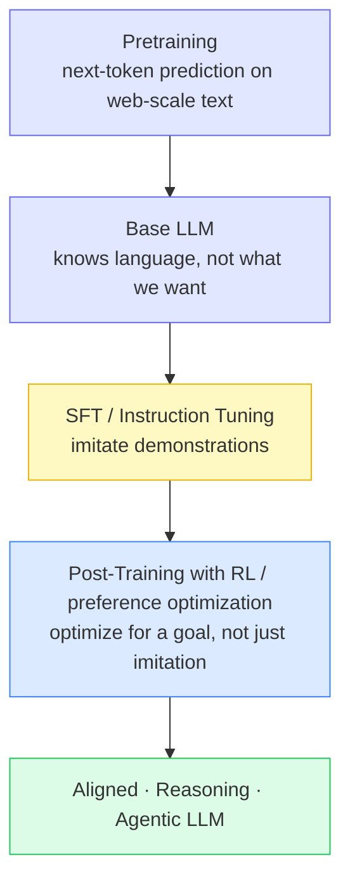

SFT (supervised fine-tuning) already helps — it imitates good demonstrations. But imitation has a ceiling: it can only copy behaviors present in the data, and it never learns *why* one response is better than another. RL adds exactly that missing ingredient — a **reward** that says "this was better than that" — and optimizes the model to produce more of the better behavior.

---

## The RL Post-Training Landscape: Feedback Sources vs Optimizers

Here is the mental model the rest of the article hangs on. A post-training method is really a **choice on two independent axes**:

1. **Feedback source** — who or what produces the signal that says an output is good.
2. **Optimizer** — the algorithm that turns that signal into a parameter update.

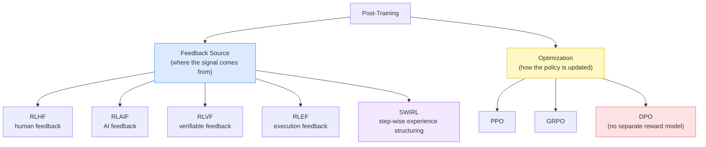

Read across the top row of the hero image and you see the four feedback sources plus SWiRL feeding a single **reward signal**; read the "Optimization" box and you see PPO / GRPO / DPO. That separation is the whole point: **"RLHF" tells you nothing about the optimizer**, and **"PPO" tells you nothing about where the reward came from.**

DPO is the interesting outlier — it collapses "reward model + RL optimizer" into a single supervised-looking objective. We treat it as an optimizer-level choice, but one that changes the feedback plumbing too. More on that in its own section.

With the axes fixed, we can walk each feedback source in turn.

---

## RLHF — Reinforcement Learning from Human Feedback

RLHF is the original recipe, and the cleanest place to learn the machinery. The signal comes from **humans expressing preferences** between model outputs.

### The preference dataset

You start with a prompt $x$, sample multiple candidate responses from a base/SFT model, and ask a human: *which is better?* Each labeled comparison becomes a tuple:

$$
(x,\; y_w,\; y_l)
$$

where $x$ is the prompt, $y_w$ ("win") is the response the human preferred, and $y_l$ ("lose") is the rejected one. Collect many of these and you have a **preference dataset**.

Note what you *don't* have: an absolute score. Humans are far more reliable at "A is better than B" than at "rate this 7.3/10." RLHF is built around that fact.

### The reward model and the Bradley-Terry objective

We can't run RL against sparse human clicks directly, so we first train a **reward model** $r_\phi(x, y)$ — a scalar-output network — to *predict* human preference. The trick is to model the probability that $y_w$ beats $y_l$ with the **Bradley-Terry** model:

$$
P(y_w \succ y_l \mid x) = \sigma\big(r_\phi(x, y_w) - r_\phi(x, y_l)\big)
$$

Here $\sigma$ is the logistic sigmoid. The intuition is simple: the *larger the reward gap* between the preferred and rejected response, the more confident the model is that humans prefer $y_w$. We fit $\phi$ by maximizing the likelihood of the observed preferences, i.e. minimizing:

$$
\mathcal{L}(\phi) = -\,\mathbb{E}_{(x,y_w,y_l)}\Big[\log \sigma\big(r_\phi(x, y_w) - r_\phi(x, y_l)\big)\Big]
$$

This loss pushes $r_\phi(x, y_w)$ **up** and $r_\phi(x, y_l)$ **down** for every human comparison — nothing more exotic than that.

### Optimizing the policy against the reward model

Now the reward model stands in for the human. We optimize the policy $\pi_\theta$ (the LLM) to produce responses the reward model scores highly, while **not drifting too far** from the reference (SFT) model $\pi_{\text{ref}}$:

$$
\max_\theta \;\; \mathbb{E}_{x,\, y \sim \pi_\theta(\cdot \mid x)}\Big[\, r_\phi(x, y) \;-\; \beta \, \mathrm{KL}\big(\pi_\theta(\cdot\mid x)\,\|\,\pi_{\text{ref}}(\cdot\mid x)\big) \Big]
$$

The **KL penalty** (weighted by $\beta$) is essential: without it the policy will "reward-hack" — find weird outputs the imperfect reward model loves but humans hate. The KL term keeps it anchored to sensible language. This maximization is exactly what an optimizer like **PPO** does (see below).

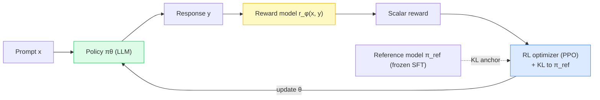


*RLHF end to end. Left: prompts → candidate responses → human comparisons → the preference dataset $(x, y_w, y_l)$. Right: train the reward model with the Bradley-Terry loss, then optimize the policy with PPO under a KL constraint. The expensive part is the human annotation.*

The bottleneck is obvious once you see it: **humans have to label everything.** That does not scale to the volume modern models need — which is exactly what RLAIF attacks.

---

## RLAIF — Reinforcement Learning from AI Feedback

RLAIF keeps the *entire* RLHF pipeline and swaps one component: instead of asking a human "which is better?", it asks **another AI model** — an evaluator, teacher, or "judge" LLM, often guided by an explicit set of criteria or a constitution.

```text
RLHF:   LLM → Responses → Human    → Preference
RLAIF:  LLM → Responses → AI Judge → Preference
```

Everything downstream is unchanged: the AI-generated preferences form the same $(x, y_w, y_l)$ dataset, you train the same style of reward model, and you optimize with the same PPO/GRPO. The judge just replaces the annotator.

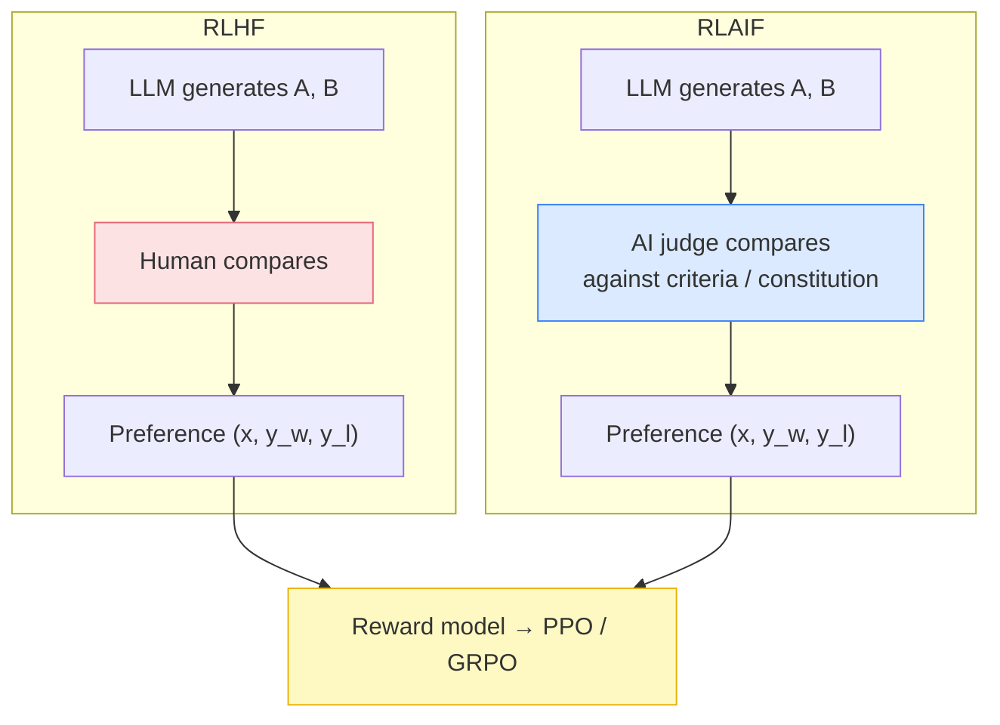

![RLAIF two-panel diagram: top panel shows training-data curation using an evaluator LLM (teacher/judge) instead of humans — prompt collection, a base or instruction-tuned model generating multiple candidate responses, the AI judge comparing them against predefined criteria like helpfulness, correctness, and safety, producing AI-labeled preference pairs; a side box lists why RLAIF scales better than human annotation, is consistent and fast, can use more capable judge LLMs, and can be combined with human and verifiable feedback. Bottom panel shows the same reward-model-then-PPO training loop as RLHF](/assets/blogs/rl_llm_blog/rlaif.png)

*RLAIF replaces the human annotator with an evaluator LLM that scores responses against explicit criteria. The reward-model → PPO training loop is identical to RLHF; only the source of the preference labels changes.*

Why this matters: AI feedback is **cheaper, faster, and more consistent** than human labeling, and it can use a *stronger* model as the judge than the one being trained (a teacher → student setup). The tradeoff is that the whole pipeline inherits the judge's biases and blind spots — the model can only become as discerning as its evaluator.

RLHF and RLAIF share a deeper limitation, though: both judge **subjective quality**. For a 5,000-token proof, "this looks like a good proof" is a guess. For many tasks we can do far better than a guess.

---

## RLVF — Reinforcement Learning from Verifiable Feedback

RLVF (also seen as **RLVR**, "verifiable rewards") changes the game for reasoning: instead of *judging* an answer, you **check** it. The feedback comes from an **objective verifier** — a piece of code, a test suite, a math checker, an environment — not from anyone's opinion.

```text
Model
 ↓
Generate solution
 ↓
Verifier  (rule-based / unit tests / symbolic solver / environment)
 ↓
Correct / Incorrect
 ↓
Reward
 ↓
RL
```

### Reward is grounded, not guessed

For math, the reward is trivially objective. Ask "What is $17 \times 23$?":

$$
r = \begin{cases} 1 & \text{if answer} = 391 \\ 0 & \text{otherwise} \end{cases}
$$

For code, you run the generated program against tests:

$$
r = \begin{cases} 1 & \text{all tests pass} \\ 0 & \text{any test fails} \end{cases}
$$

or a graded version $r = \frac{\text{tests passed}}{\text{tests total}}$. No human, no judge LLM — **reality is the reward function.** This is why RLVF became the backbone of modern reasoning models: once you have a reliable verifier, you can scale RL almost arbitrarily, because generating and checking a million math solutions costs compute, not annotation.

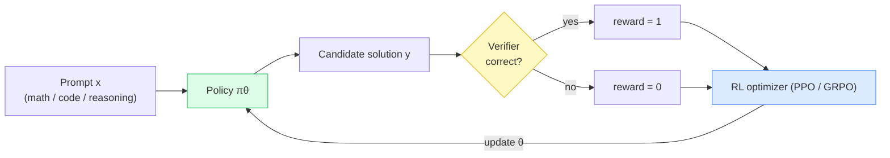

![RLVF two-panel diagram: top panel shows verifiable training-data generation — collect math, coding, reasoning and tool-use tasks, generate candidate responses, verify with objective evaluators (rule-based match, program execution, symbolic solver, environment simulation), assign rewards of 1.0 correct, 0.5 partial, 0.0 incorrect or execution error, and build a verified dataset of (x, y, r); worked math, code, and reasoning examples on the right. Bottom panel shows the training loop — sample prompts, generate responses, verify and compute rewards, optimize with PPO or GRPO, yielding an improved LLM; a side box lists advantages: objective and scalable feedback, no human annotation, ideal for reasoning and code, step-level or final rewards, less subjective bias](/assets/blogs/rl_llm_blog/rlvf.png)

*RLVF uses objective verifiers — exact match, unit tests, symbolic solvers, environment simulation — to produce ground-truth rewards. The dataset becomes $(x, y, r)$, and the optimizer (PPO/GRPO) is unchanged; only the reward source is now objective.*

### Three levels of verification

"Verifiable" is not one thing. A subtlety worth internalizing: **a correct final answer does not mean every step was correct** — a model can make two compensating errors and still land on 42. So RLVF operates at different granularities:

- **Final-answer verification** — "is the last number 42?" Cheap, but rewards lucky-but-wrong reasoning.
- **Step-level verification** — "is *this* step valid?" Stronger; the basis of process rewards.
- **Full-solution verification** — "is the entire proof/derivation valid?" Strongest, and hardest to automate.

Code execution is the cleanest case of all: the environment itself runs the program and returns pass/fail, leaving no room for interpretation. That observation — *let the environment be the judge* — is precisely what generalizes to agents in RLEF.

---

## RLEF — Reinforcement Learning from Execution Feedback

RLEF is RLVF's agentic cousin. For tool-using agents, you don't score the *text* of an answer — you **execute the agent's actions** and use what actually happened as the signal. The environment's response *is* the supervision.

```text
Model
 ↓
Action / Tool Call
 ↓
Execute
 ↓
Observation
 ↓
Feedback
 ↓
Reward
 ↓
RL
```

Consider an agent asked to *"find NVIDIA's latest financial results and plot the 5-year revenue trend."* It reasons, emits a `web_search` tool call, the environment executes it and returns real results, and each execution yields an objective signal: did the tool call succeed? Did it return the right data? Did the task complete?

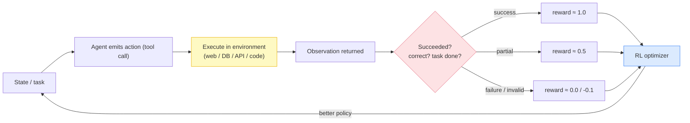

![RLEF two-panel diagram: top panel walks a single agent step — task/prompt with a user goal, the LLM agent generates a thought and a tool call, the environment executes it (web, database, API) and returns an observation with status success, execution feedback evaluates whether the tool call succeeded and the result is correct, a reward signal maps the outcome to 1.0 success / 0.5 partial / 0.0 failure / -0.1 invalid action, and the trajectory (s, a, o, r) is stored including successful, failed, and partial runs. Bottom panel shows training — an execution trajectory dataset, policy model, execute-and-collect-feedback in real or simulated environments, compute rewards, RL optimization with a discounted return objective, producing an improved agent](/assets/blogs/rl_llm_blog/rlef.png)

*RLEF grounds the reward in real execution. The agent acts, the environment runs the action, and the observed outcome — success, partial, failure — becomes the reward. Trajectories are stored as $(s_t, a_t, o_{t+1}, r_t)$ and optimized to maximize discounted return $\mathbb{E}\big[\sum_t \gamma^t r_t\big]$.*

The key advantage: execution gives an **objective signal about whether an action actually worked in the world**, not whether it merely looked plausible. Failed and partial trajectories are kept too — they carry exactly the information the policy needs to stop repeating mistakes.

RLEF answers *where the feedback comes from* (execution). It says nothing about *how a long, multi-step trajectory should be structured for learning* — and that is a separate, hard problem. Which brings us to SWiRL.

---

## SWiRL — Step-Wise Reinforcement Learning

Long-horizon agent tasks expose a real weakness in vanilla RL: a 20-step trajectory produces **one** reward at the very end. That single scalar has to somehow teach the model what it did right or wrong at step 3, step 11, and step 17 all at once. This is the **credit-assignment** problem, and it makes long-horizon RL slow and unstable.

### From one trajectory to many sub-trajectories

A multi-step trajectory is an alternating sequence of actions and observations:

$$
\tau = (s_1, a_1, s_2, a_2, \ldots, s_K, a_K)
$$

Traditional trajectory-level RL treats the whole thing as one training example with one reward:

```text
a₁ → a₂ → a₃ → a₄ → a₅
                  ↓
             final reward  R(τ)
```

**SWiRL decomposes the trajectory into sub-trajectories, one per action**, and attaches feedback to each step. The learning unit becomes a single `state → action` decision, which is exactly the unit the model faces at inference.

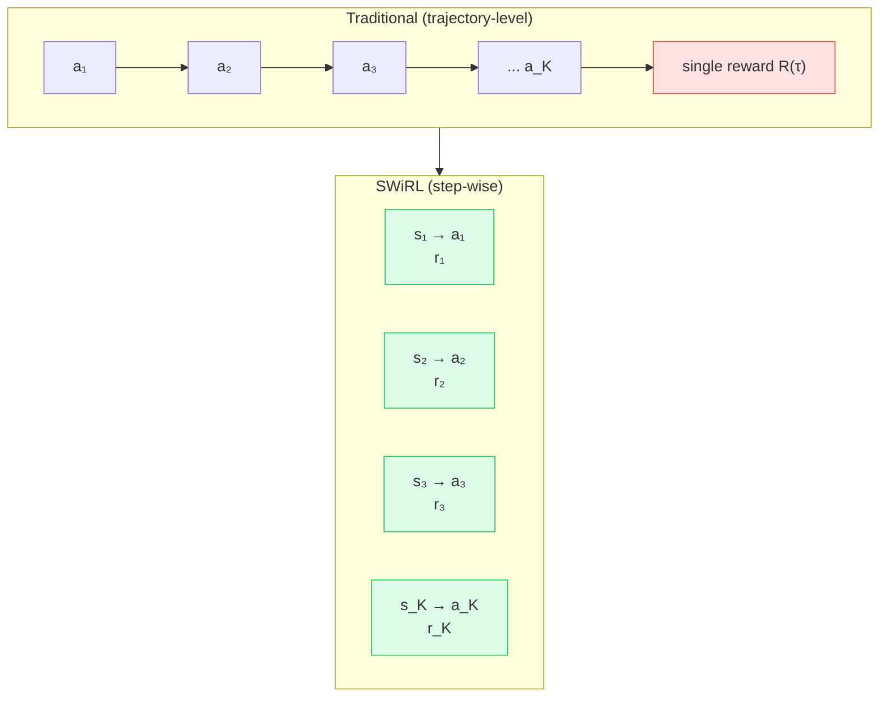

Instead of one reward at the end, the objective sums a reward over **every step** of the trajectory:

$$
J(\theta) = \mathbb{E}_{s \sim T,\; a \sim \pi_\theta(\cdot\mid s)}\big[R(a \mid s)\big] \;\approx\; \mathbb{E}\Big[\textstyle\sum_{i=1}^{K} R(a_i \mid s_i)\Big]
$$

where $T$ is the set of all states occurring across the trajectories. Dense, per-step reward turns an impossible credit-assignment problem into $K$ easy ones — which is why SWiRL learns long-horizon behavior faster and more stably.

![SWiRL infographic: step-wise reinforcement learning that decomposes long-horizon agent tasks into sub-trajectories. Top row walks a Tokyo trip-planning task — the LLM agent generates a multi-step trajectory (search flights, check prices, search hotels, book hotel, plan itinerary), executes actions against web search, APIs and booking systems, receives step-wise feedback with per-step rewards, splits into sub-trajectories (a_i, o_i, r_i), and runs RL training with PPO or GRPO using step-wise rewards. Bottom-left compares traditional trajectory-level RL (single final reward, sparse signal, hard credit assignment) against SWiRL step-wise learning (dense reward, better credit assignment, faster and more stable). Bottom-right shows an example trajectory with per-step rewards](/assets/blogs/rl_llm_blog/swirl.png)

*SWiRL decomposes a long agent trajectory into per-step sub-trajectories, each with its own reward, so credit is assigned locally instead of only at the end. This is what makes complex, multi-tool tasks learnable — dense step-wise reward beats a single sparse outcome reward.*

### RLEF vs SWiRL — do not collapse them

These two are frequently confused because they show up together in agent training. They are answering different questions:

- **RLEF** — *where does the feedback come from?* → from **executing** the actions in an environment.
- **SWiRL** — *how is the multi-step experience structured for learning?* → **decompose** it into step-wise sub-trajectories with per-step feedback.

They are complementary, not competing. A real agentic pipeline often uses **both**: execution feedback (RLEF) as the *source* of per-step rewards, structured step-wise (SWiRL) so those rewards can actually be learned from.

> **Engineering Implementation: SWiRL** — This article stays at the concept/algorithm level. For the full build — the two-stage data pipeline, step-wise decomposition as a data operation, process filtering, offline replay, and the exact component interactions — see the engineering deep-dive: [SWiRL: Step-Wise RL for Multi-Step Reasoning and Tool Use](/engineering/swirl-step-wise-rl-multi-step-reasoning-tool-use/).

---

## DPO — Direct Preference Optimization

Every feedback source above (in its classic form) trains a **separate reward model** and then runs RL against it. DPO asks: if all we have is preference pairs, why build a reward model *and* run PPO at all? Can we optimize the policy on preferences **directly**?

The insight is that the RLHF objective (reward maximization under a KL constraint) has a closed-form optimal policy, and you can re-express the whole thing so the **policy itself acts as its own implicit reward model**. That yields a single supervised-style loss over preference pairs:

$$
\mathcal{L}_{\text{DPO}} = -\,\mathbb{E}_{(x, y_w, y_l)}\left[\log \sigma\!\left(\beta\left[\log \frac{\pi_\theta(y_w\mid x)}{\pi_{\text{ref}}(y_w\mid x)} - \log \frac{\pi_\theta(y_l\mid x)}{\pi_{\text{ref}}(y_l\mid x)}\right]\right)\right]
$$

Term by term:

- $\pi_\theta$ is the policy being trained; $\pi_{\text{ref}}$ is the frozen reference (SFT) model.
- $\log \frac{\pi_\theta(y\mid x)}{\pi_{\text{ref}}(y\mid x)}$ is the **implicit reward** of response $y$ — how much more likely the policy makes $y$ relative to the reference. This *replaces* the explicit $r_\phi$.
- The bracket is the implicit-reward **gap** between preferred and rejected responses — exactly the Bradley-Terry structure from RLHF, but with the policy standing in for the reward model.
- $\beta$ controls how far the policy may move from $\pi_{\text{ref}}$ (the KL anchor, now baked into the loss).
- $\sigma$ + $\log$ make it a classification loss: **push the implicit reward of $y_w$ above that of $y_l$.**

The intuition: DPO increases the probability of preferred responses and decreases the probability of rejected ones, *relative to the reference model*, with $\beta$ preventing runaway drift. No reward model, no sampling loop, no PPO — just a loss you can train like ordinary supervised learning.

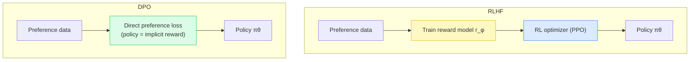

```text
RLHF:  Preference Data → Reward Model → RL Algorithm → Policy
DPO:   Preference Data → Direct Policy Optimization → Policy
```

DPO is simpler and more stable to train, which made it hugely popular. The tradeoff: it is inherently **offline** (it learns from a fixed set of pairs, not from fresh samples the current policy generates), and it is tied to *preference* data — it doesn't naturally consume verifiable or execution rewards the way online RL does.

---

## PPO — Proximal Policy Optimization

PPO is an **optimizer**, not a feedback source. Give it any reward — human, AI, verifiable, execution — and it will improve the policy against it. It is the workhorse behind classic RLHF.

The core problem PPO solves: policy-gradient updates can be *too big*, collapsing the policy after one bad batch. PPO fixes this by **clipping** how much the policy may change per update. Define the probability ratio between the new and old policy:

$$
r_t(\theta) = \frac{\pi_\theta(a_t \mid s_t)}{\pi_{\theta_{\text{old}}}(a_t \mid s_t)}
$$

$r_t > 1$ means the new policy makes action $a_t$ more likely than the old one did; $r_t < 1$ means less likely. The clipped objective is:

$$
L^{\text{CLIP}}(\theta) = \mathbb{E}_t\Big[\min\big(r_t(\theta)\,A_t,\; \operatorname{clip}(r_t(\theta),\, 1-\epsilon,\, 1+\epsilon)\,A_t\big)\Big]
$$

where:

- $A_t$ is the **advantage** — how much better action $a_t$ was than the policy's average at that state. Positive $A_t$ = do more of this; negative = do less.
- $\operatorname{clip}(r_t, 1-\epsilon, 1+\epsilon)$ forbids the ratio from leaving $[1-\epsilon, 1+\epsilon]$ (typically $\epsilon = 0.2$).
- The $\min$ takes the *pessimistic* of clipped and unclipped, so the update never gets extra credit for moving the policy too far.

In words: **improve in the direction the advantage points, but never take a step so large it destabilizes the policy.** In RLHF, $A_t$ is derived from the reward model's score plus the KL penalty to $\pi_{\text{ref}}$.

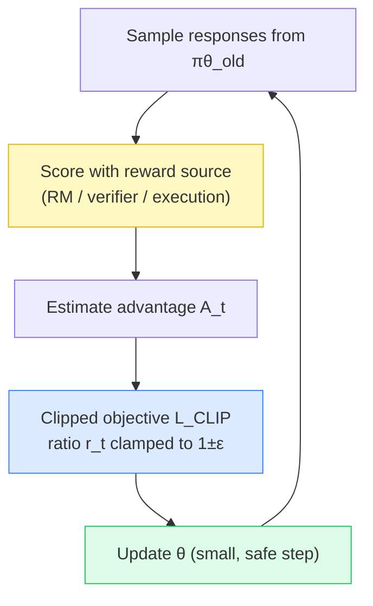

PPO is powerful but heavy: it needs a separate **value network** to estimate advantages, plus the policy, reward model, and reference model all in memory at once. For reasoning-scale training, that overhead motivated a leaner alternative — GRPO.

---

## GRPO — Group Relative Policy Optimization

GRPO (introduced with DeepSeekMath) is the optimizer that made large-scale reasoning RL practical. Its key move: **drop the value network** and estimate advantage from a *group* of responses to the same prompt instead.

For each prompt, sample a **group** of $G$ responses $\{o_1, \ldots, o_G\}$, score each with the reward source, and compute each response's advantage **relative to its group**:

$$
\hat{A}_i = \frac{r_i - \operatorname{mean}(r_1, \ldots, r_G)}{\operatorname{std}(r_1, \ldots, r_G)}
$$

This is the whole idea: a response is "good" if it beats the *other attempts on the same prompt*. The group mean is the baseline — no learned value function required. Responses above the group average get pushed up; those below get pushed down. GRPO then plugs $\hat{A}_i$ into a PPO-style clipped objective, usually with a KL term to a reference model:

$$
J_{\text{GRPO}}(\theta) = \mathbb{E}\Big[\frac{1}{G}\sum_{i=1}^{G} \min\big(r_i(\theta)\hat{A}_i,\; \operatorname{clip}(r_i(\theta), 1-\epsilon, 1+\epsilon)\hat{A}_i\big) - \beta\,\mathrm{KL}(\pi_\theta \,\|\, \pi_{\text{ref}})\Big]
$$

```text
Prompt
 ↓
Generate Group of Responses (G samples)
 ↓
Verify / Score each
 ↓
Relative Rewards (compare within the group)
 ↓
Advantages  Â_i = (r_i − mean) / std
 ↓
Policy Update
```

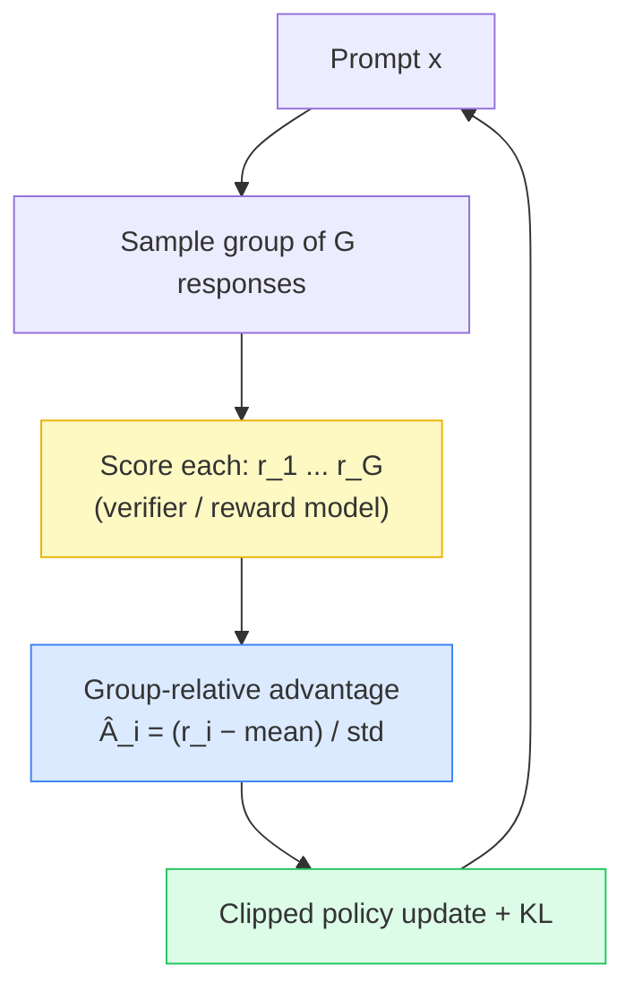

**GRPO vs PPO**, from an engineering angle:

| | PPO | GRPO |
| --- | --- | --- |
| Advantage baseline | Learned **value network** | **Group mean** of sampled rewards |
| Extra model in memory | Yes (value/critic) | No |
| Best fit | General RLHF | Reasoning RL with verifiable rewards |
| Cost | Higher (4 models) | Lower (3 models) |

GRPO pairs especially naturally with **RLVF**: verifiable rewards give clean per-response scores, and the group-relative baseline turns "which of my 8 attempts solved it?" directly into a training signal.

> **Engineering Implementation → Building RL Post-Training Systems.** For concrete, code-level builds of the optimizers and reasoning-RL pipelines discussed here, see the engineering implementations: [GRPO (DeepSeekMath): Group Relative Policy Optimization](/engineering/grpo-deepseekmath-group-relative-policy-optimization/) and [DeepSeek-R1: Incentivizing Reasoning via Reinforcement Learning](/engineering/deepseek-r1-incentivizing-reasoning-via-reinforcement-learning/).

---

## Other Post-Training Methods Worth Knowing

The methods above are the load-bearing ones, but they sit in a small family with a few important relatives. For each, the four questions that matter: what problem it solves, what its training signal is, what it optimizes, and how it differs.

- **REINFORCE / RLOO (leave-one-out baseline).** *Problem:* PPO's value network is expensive. *Signal:* any reward. *Objective:* plain policy gradient $\nabla_\theta \log \pi_\theta(a\mid s)\,A$, with the baseline estimated from other samples (RLOO) rather than a critic. *Difference:* the conceptual ancestor of GRPO — GRPO is essentially a group-baseline policy gradient with clipping.
- **The DPO family (offline preference optimization).** *Problem:* avoid reward models entirely. *Signal:* preference pairs. *Objective:* the implicit-reward classification loss shown earlier. *Difference:* offline and preference-only, versus online reward-driven RL. Variants trade off how the reference model and margins are handled.
- **Process-reward / step-level RL (e.g. SWiRL-style).** *Problem:* sparse end-of-trajectory reward. *Signal:* per-step rewards. *Objective:* sum of step rewards. *Difference:* changes the *granularity* of the reward, orthogonal to the optimizer used.

The naming can mislead — **RLVR and RLVF are the same idea** (verifiable rewards), and "reasoning RL" in practice usually means *RLVF + GRPO*. When you read a modern recipe, decode it along the two axes: feedback source × optimizer.

---

## How RL Training Data Is Generated

This is where a lot of the real engineering lives, and where the feedback sources become concrete. RL data is **not** a static file you download — it is *generated by the model itself* and then scored.

```text
Task / Prompt
      ↓
Base / Instruction-Tuned Model
      ↓
Generate Multiple Trajectories / Responses
      ↓
Execute / Evaluate
      ↓
Human / AI / Verifier / Environment Feedback
      ↓
Reward / Preference Signal
      ↓
Filter / Select / Construct Dataset
      ↓
RL / Preference Optimization
      ↓
Improved Model
```

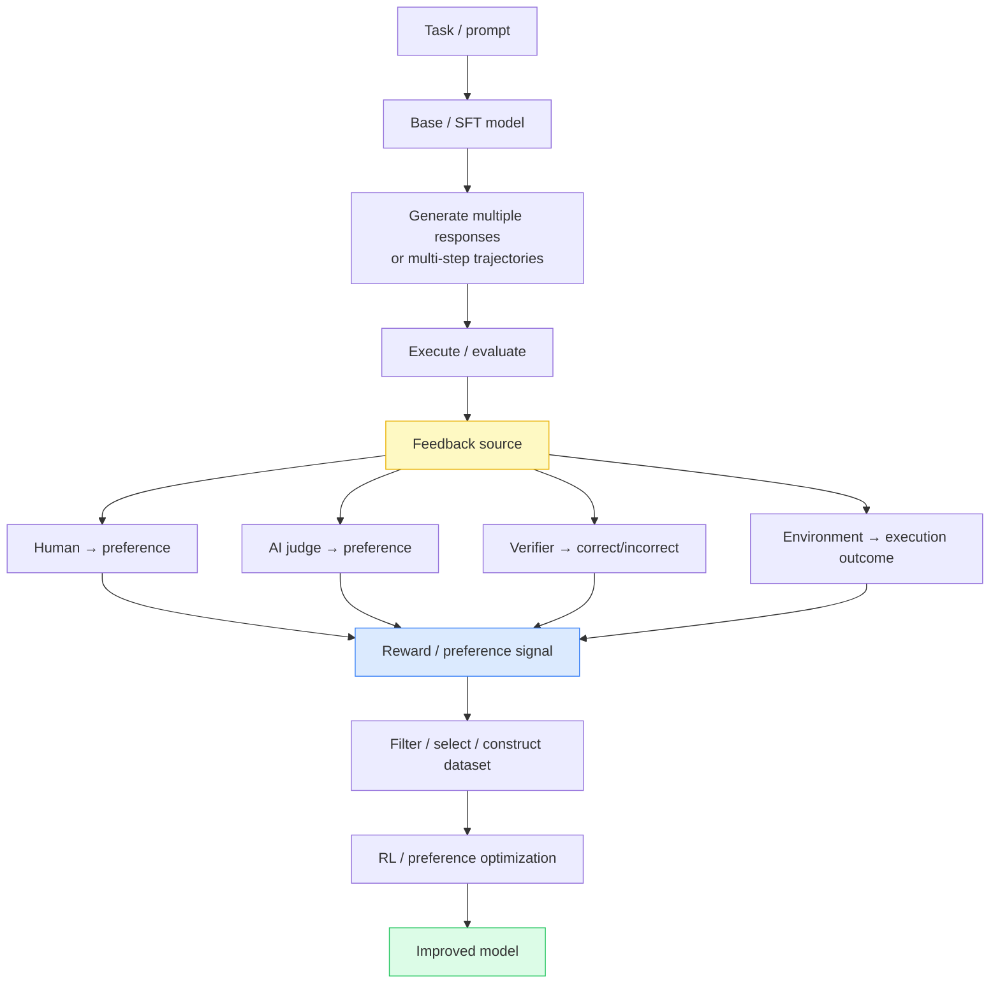

The critical thing is that different methods consume **different shapes of data**:

| Data shape | Looks like | Used by |
| --- | --- | --- |
| **Supervised examples** | $(x, y)$ — prompt + one good answer | SFT |
| **Preference pairs** | $(x, y_w, y_l)$ — chosen vs rejected | RLHF, RLAIF, DPO |
| **RL trajectories** | $(s_1, a_1, \ldots, s_K, a_K)$ | Agentic RL, SWiRL |
| **Verifier rewards** | $(x, y, r)$ — response + objective score | RLVF |
| **Execution experience** | $(s_t, a_t, o_{t+1}, r_t)$ | RLEF |

And the most counterintuitive lesson: **unsuccessful trajectories are valuable training data.** A failed run that reasoned well, or an attempt scored low by a verifier, tells the policy what *not* to do — sparse "only keep the wins" filtering throws that signal away. This is exactly the design behind process-filtered, step-wise data in SWiRL: keep a step if the *decision* was reasonable, regardless of whether the whole trajectory succeeded.

---

## Putting It All Together

Here is the complete modern post-training ecosystem in one diagram — every feedback source flowing into a training signal, the optimizers that consume it, and DPO as the direct path that skips the reward model.

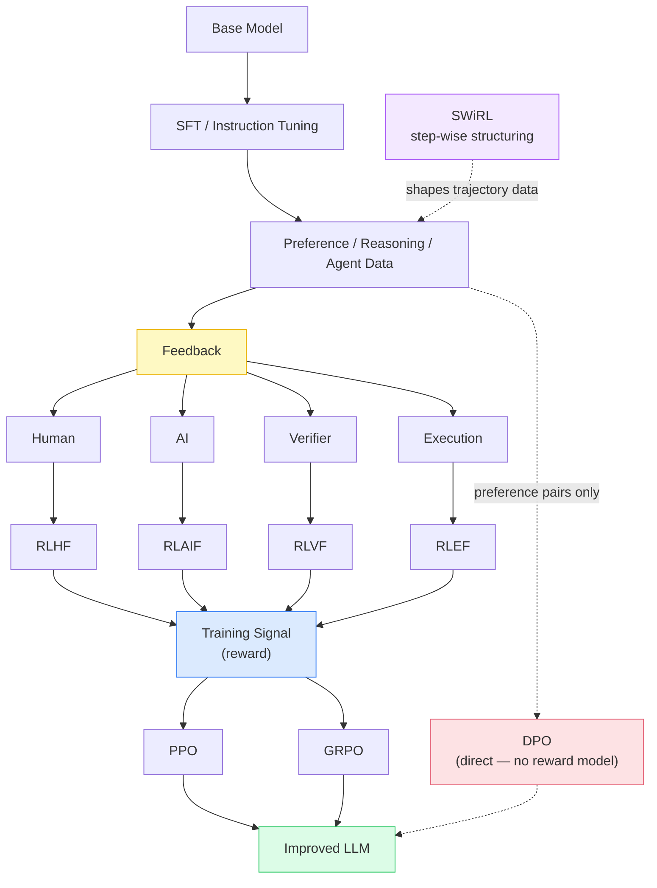

Trace any real recipe through this graph. *Classic RLHF* = Human → RLHF → reward → PPO. *DeepSeek-style reasoning* = Verifier → RLVF → reward → GRPO. *A tool-use agent* = Execution → RLEF, structured step-wise by SWiRL, optimized by GRPO. *Lightweight alignment* = preference pairs → DPO, straight to the policy.

---

## RLHF vs RLAIF vs RLVF vs RLEF vs SWiRL vs DPO vs PPO vs GRPO

The single table to remember — and the point is that **these do not all live at the same level of abstraction**:

| Concept | What it describes | Level |
| --- | --- | --- |
| **RLHF** | Human feedback | Feedback source |
| **RLAIF** | AI feedback | Feedback source |
| **RLVF** | Verifiable feedback | Feedback source |
| **RLEF** | Execution feedback | Feedback source |
| **SWiRL** | Step-wise trajectory learning | Experience structuring |
| **DPO** | Direct preference optimization | Optimizer (no reward model) |
| **PPO** | Clipped policy-gradient optimization | Optimizer |
| **GRPO** | Group-relative policy optimization | Optimizer |

If someone says "we used RLVF," ask *which optimizer*. If they say "we used GRPO," ask *where the reward came from*. Once you're fluent reading recipes on these two axes, the whole field stops looking like an alphabet soup of competing acronyms and starts looking like a small set of composable choices.

## Key Takeaways

- **Post-training has two independent axes:** where feedback comes from (RLHF / RLAIF / RLVF / RLEF), and how the policy is optimized (PPO / GRPO / DPO). You pick one from each — they are not competitors.
- **RLHF** learns a reward model from human preference pairs via a Bradley-Terry loss, then optimizes the policy under a KL constraint. The bottleneck is human annotation.
- **RLAIF** swaps the human annotator for an AI judge — cheaper, faster, scalable, but bounded by the judge's quality.
- **RLVF** replaces judgment with objective **verification** (math checkers, unit tests, symbolic solvers), which is why it powers reasoning models — reward is grounded, not guessed.
- **RLEF** grounds the reward in real **execution** for agents; SWiRL structures long trajectories into per-step sub-trajectories so credit assignment becomes tractable. They are complementary, not the same thing.
- **DPO** skips the reward model and RL loop entirely, optimizing preferences directly — simpler and stable, but offline and preference-only.
- **PPO vs GRPO:** both are optimizers; GRPO drops PPO's value network for a group-relative baseline, making large-scale reasoning RL cheaper.

## Related Reading

- [Reinforcement Learning for LLMs: RLHF, Reward Models, Reasoning RL, and Agentic RL](/ai%20engineering/2026/08/29/reinforcement-learning-for-llms-rlhf-reward-models-reasoning-agentic-rl/) — the connected "engineering story" companion to this taxonomy-first map.
- [SWiRL: Step-Wise RL for Multi-Step Reasoning and Tool Use](/engineering/swirl-step-wise-rl-multi-step-reasoning-tool-use/) — the full engineering implementation of step-wise RL.
- [GRPO (DeepSeekMath): Group Relative Policy Optimization](/engineering/grpo-deepseekmath-group-relative-policy-optimization/) — the optimizer behind modern reasoning RL, built out in detail.
- [DeepSeek-R1: Incentivizing Reasoning via Reinforcement Learning](/engineering/deepseek-r1-incentivizing-reasoning-via-reinforcement-learning/) — RLVF + GRPO applied to a frontier reasoning model.

## Conclusion

The reason "reinforcement learning for LLMs" feels overwhelming is that the vocabulary mixes two different questions into one list. Once you separate **where the feedback comes from** (human, AI, verifier, execution), **how experience is structured** (whole-trajectory vs step-wise), and **how the policy is optimized** (PPO, GRPO, DPO), every method snaps into place as a point in a small design space.

That framing also tells you where the field is heading. As tasks get harder to judge subjectively, feedback keeps moving toward the **objective** end — from human opinion, to AI opinion, to verifiable correctness, to real execution. And as trajectories get longer, reward keeps moving toward the **dense, step-wise** end. The optimizers will keep evolving, but the axes won't. Learn the axes, and every new acronym is just a new point on a map you already have.
