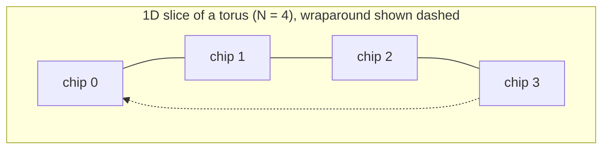
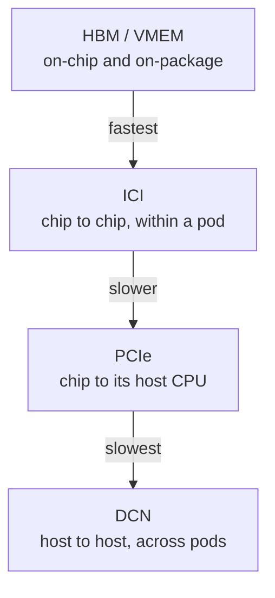
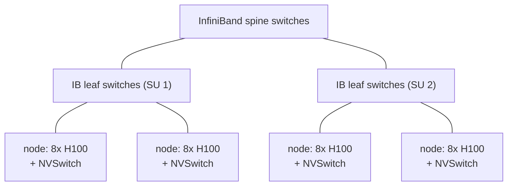
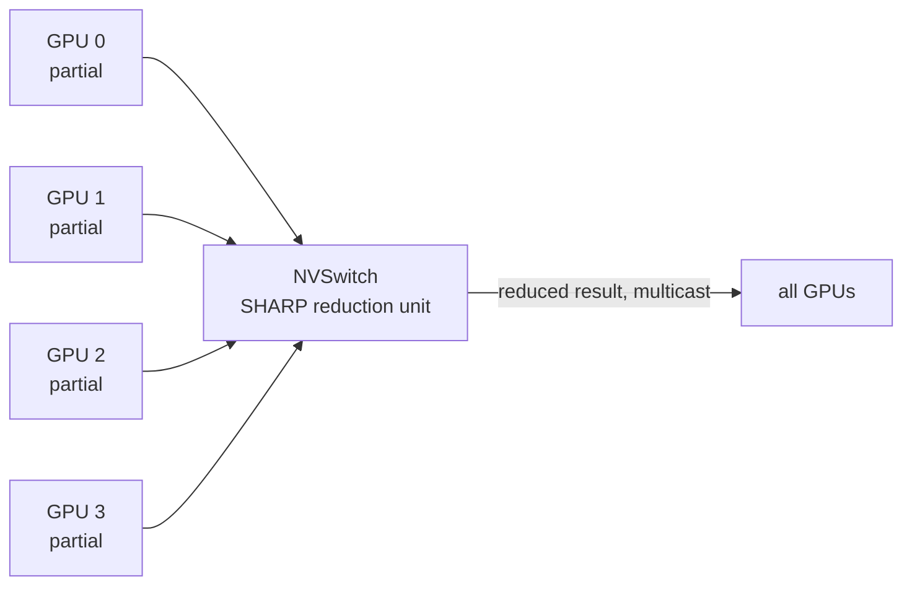

<!--
  SEO
    Primary keyword:   collective communication
    Secondary:         All-Reduce, All-Gather, Reduce-Scatter, All-to-All,
                       TPU torus topology, ICI interconnect, NVLink NVSwitch,
                       InfiniBand fat tree, NCCL, SHARP in-network reduction,
                       bisection bandwidth, ring algorithm, expert parallelism

  GROUNDING NOTES
    - TPU generations and their torus dimensionality (v2/v3/v5e/v6e = 2D,
      v4p/v5p/Ironwood/8t = 3D), pod shapes (v4: 16x16x16 = 4096; v5p:
      16x20x28 = 8960; v5e: 16x16), and the shift to a hierarchical
      high-radix fabric on the 8i inference part: Google Cloud TPU system
      architecture docs + the "TPU 8t and 8i technical deep dive" post.
    - v5e ICI figures used throughout (45 GB/s unidirectional per link,
      ~1 us per-hop latency, one host per 2x4 block): Google Cloud TPU
      v5e system architecture. These are published vendor numbers, not my
      own measurements.
    - DGX H100 SuperPOD numbers (8 GPUs/node, 450 GB/s per-GPU NVLink,
      8 x 50 GB/s = 400 GB/s node injection, 32 nodes per Scalable Unit,
      1024 GPUs): NVIDIA DGX SuperPOD reference architecture.
    - NVSwitch SHARP: 400 GFLOP/s FP32 reduction throughput and hardware
      multicast semantics: NVIDIA NVSwitch Hot Chips 34 (2022) presentation.
    - The ~30% (1.3x) real-world SHARP All-Reduce speedup and the NCCL
      bandwidth-vs-message-size behaviour are REPORTED measurements from
      published benchmarks and practitioner write-ups, explicitly framed
      as such in the text. Not my own benchmarks.
    - All cost models in Part 2 are my own derivation from a hop-count /
      aggregate-capacity argument. They are first-order throughput bounds,
      stated as such, and they reproduce the standard ring results.
    - Worked examples (8 MiB transfer, 32 GiB gather + matmul) are my own
      arithmetic on top of the published v5e link figures.
    - No source links in the body; the single credit line and the primary
      sources live in the References section.
-->

*Two very different machines, one shared problem: getting every accelerator to agree on a tensor as fast as physics allows.*

## Introduction

Every distributed training run you have ever launched spends a large fraction of its wall clock inside **collective communication** — the handful of primitives that move and combine tensors across accelerators. Data parallelism needs an All-Reduce over gradients. Tensor parallelism and FSDP need All-Gather and Reduce-Scatter over shards. Mixture-of-experts routing needs All-to-All.

These four operations are where your FLOP/s go to die. And the reason they behave so differently on a TPU pod versus an H100 cluster has almost nothing to do with the algorithms and almost everything to do with the wires.

This post is a ground-up walkthrough of both machines. I want to get to the point where you can look at a sharding strategy, know which collective it implies, and estimate how long that collective will take on the hardware in front of you — without running it.

> **The one-line mental model:** a collective's cost is *total bytes that must cross a cut* divided by *the bandwidth available across that cut*. Topology decides the cut. Algorithm decides the bytes.

  How this post is organised
  

    
<strong>Part 1 — The TPU cluster.</strong> Torus topology, ICI, pods and slices, the bandwidth hierarchy, and two worked transfers that show where the time actually goes.

    
<strong>Part 2 — A cost model for collectives.</strong> One counting argument that produces every ring result, derived from scratch. This is the load-bearing section.

    
<strong>Part 3 — The four collectives on a torus.</strong> All-Gather, Reduce-Scatter, All-Reduce and All-to-All, each with its schedule and its cost.

    
<strong>Part 4 — The GPU cluster.</strong> NVLink scale-up domains, InfiniBand fat trees, Scalable Units, bisection bandwidth, SHARP, and why hierarchy changes the answer.

  

---

## Part 1 — Anatomy of a TPU Cluster

### TPUs are wired as a torus, not a switch

The single most important structural fact about a TPU pod: **there is no switch**. Chips are connected directly to their nearest physical neighbours by the **ICI** (inter-chip interconnect), and the ends of each dimension wrap around. That is a torus.

Which torus depends on the generation:

| Torus shape | TPU generations | Neighbours per chip |
|---|---|---|
| 2D torus | v2, v3, v5e, v6e | 4 |
| 3D torus | v4p, v5p, TPU7x (Ironwood), 8t | 6 |

A **pod** (or superpod) is the largest ICI-connected island. A v4 pod is a $16 \times 16 \times 16$ grid — 4096 chips. A v5p pod is $16 \times 20 \times 28$ — 8960 chips. A v5e pod is a $16 \times 16$ 2D torus.

A **slice** is any sub-block of a pod that you actually get allocated: $2 \times 2$, $2 \times 4$, $8 \times 8$, and so on. The largest possible slice is the pod itself.

  Not every "3D" slice is a torus
  

    
The smallest genuine 3D torus is <code>4x4x4</code>. A <code>2x2x2</code> slice cannot have wraparound links, because a "wrap" between two adjacent chips would just be a duplicate of the direct link. So it is a <em>mesh</em>, not a torus.

    
This matters more than it sounds. Ring-based collectives along an axis with no wraparound pay roughly a 2x penalty, which is why slice shapes like <code>4x4x8</code> are worth asking for over shapes that leave an axis short.

  

### Why wraparound links earn their keep

Consider a $16 \times 16$ v5e pod and a message from chip $(15, 15)$ to chip $(0, 15)$.

Without wraparound, that is 15 hops along the first axis. With wraparound, it is **one**. The routing becomes $(15,15) \rightarrow (0,15) \rightarrow (1,15) \rightarrow (2,15)$ and so on — the torus turns the worst case into the best case.

More precisely: on a ring of $N$ chips the maximum distance drops from $N-1$ to $\lfloor N/2 \rfloor$, and — the part that matters for collectives — the number of links crossing any cut of the ring goes from 1 to 2. We will cash that in shortly.

  Twisted tori
  

    
Some TPU configurations use a "twisted" torus, where the wraparound links are offset rather than aligned. This lowers average hop counts for traffic patterns like All-to-All. It is a real feature of deployed topologies, but it is an implementation detail on top of everything below — the counting arguments do not change shape, only constants.

  

### The bandwidth hierarchy: ICI, PCIe, DCN

A TPU chip can reach data over three very different paths, and knowing which one a transfer uses explains most surprising slowdowns.

**ICI** is the fast path: direct, nearest-neighbour, no host involvement. On v5e each link carries **45 GB/s** in one direction, with roughly **1 μs** of latency per hop.

**PCIe** connects a chip to its host CPU. On v5e a single host serves a $2 \times 4$ block, so that host owns 8 PCIe links.

**DCN** (data centre networking) is what you cross when you leave a pod. It is not just "a slower link" — it is a *longer path*. A DCN transfer looks like:

> source HBM → PCIe → source host → DCN → target host → PCIe → target HBM

Every DCN transfer therefore pays PCIe twice plus the network in between. That is why DCN throughput lands below PCIe throughput, and why multi-pod training is structured to keep the frequent collectives inside a pod and only cross DCN for the infrequent ones.

  VMEM, briefly
  

    
TPUs have a fast on-chip SRAM called VMEM that feeds the systolic array. The closest GPU analogue is programmer-managed shared memory: small, fast, and explicitly staged into. Data arriving over ICI lands in HBM; the compiler is then responsible for staging it into VMEM in tiles. When a collective looks slower than its link budget predicts, the HBM-to-VMEM stage is often the thing you forgot to count.

  

### Worked transfer 1 — one matrix, two paths

Take a $2048 \times 2048$ bf16 matrix and move it from chip $(3,3)$ to chip $(0,0)$ on a $4 \times 4$ v5e **mesh** (no wraparound, so we cannot cheat).

Size first:

$$2048 \times 2048 \times 2\ \text{bytes} = 8{,}388{,}608\ \text{B} = 8\ \text{MiB}$$

The Manhattan distance is $3 + 3 = 6$ hops. But there are two *edge-disjoint* 6-hop routes: go along $x$ then $y$, or along $y$ then $x$. Split the payload across both and each route carries 4 MiB.

$$T_{\text{transfer}} = \frac{4\ \text{MiB}}{45\ \text{GB/s}} = \frac{4.194 \times 10^{6}}{45 \times 10^{9}} \approx 93\ \mu\text{s}$$

$$T_{\text{latency}} = 6\ \text{hops} \times 1\ \mu\text{s} = 6\ \mu\text{s}$$

$$T_{\text{total}} \approx 99\ \mu\text{s}$$

Using a single route instead would cost about 186 μs. The second path buys a genuine 2x — and this is exactly the trick that a bidirectional ring generalises.

  When does latency stop mattering?
  

    
Multiply bandwidth by per-hop latency to get the message size at which the two are equal:

    
<code>45 GB/s x 1 us = 45 KB</code>

    
Below roughly 45 KB per chunk, hop latency dominates and adding hops hurts. Above it, you are throughput-bound and only bytes-per-second matters. Our 4 MiB chunks are ~90x past the crossover, which is why the 6 us of latency rounded away to nothing. Almost every collective in a real training step lives comfortably on the throughput side — and that is the assumption every model in Part 2 leans on.

  

### Worked transfer 2 — the gather that should never happen

Now a more instructive example, because it fails.

Take a $131072 \times 131072$ bf16 matrix ($128\text{K} \times 128\text{K}$), sharded over a $4 \times 4$ v5e slice. Total size:

$$131072^2 \times 2\ \text{bytes} = 3.436 \times 10^{10}\ \text{B} = 34.4\ \text{GB} = 32\ \text{GiB}$$

Each of the 16 chips owns a $32768 \times 32768$ block — 2 GiB. Say it has been offloaded to host DRAM, and you want to gather all of it onto chip $(0,0)$ and multiply it by a $131072 \times 128$ bf16 matrix.

First, how much compute are we buying?

$$\text{FLOPs} = 2 \times 131072 \times 131072 \times 128 \approx 4.4 \times 10^{12} = 4.4\ \text{TFLOP}$$

Arithmetic intensity is where it gets embarrassing. The big matrix is read exactly once, so:

$$\text{AI} = \frac{2MNK}{2MK} = N = 128\ \text{FLOP/byte}$$

The arithmetic intensity of a skinny matmul is just the narrow dimension. Nice identity, terrible news here.

At v5e's roughly 200 TFLOP/s of bf16 throughput, 4.4 TFLOP is about **22 ms** of compute. Meanwhile, even if the gather ran at full ICI speed with zero contention:

$$T_{\text{comm}} \ge \frac{34.4 \times 10^{9}}{45 \times 10^{9}} \approx 764\ \text{ms}$$

Communication is **~34x** the compute. And that is the optimistic bound — it ignores that the data starts in host DRAM (so it crosses PCIe), that any shard living under a different host crosses DCN, and above all that **every byte must funnel through one chip's single ingress port**. No topology cleverness fixes a funnel.

The lesson generalises past this contrived example: *do not gather to compute.* Shard the matmul so each chip multiplies its own block and reduce the small result, and the 34 GB never moves at all. Which is precisely what tensor parallelism is, and precisely why the collective you choose is a property of your sharding, not an afterthought.

---

## Part 2 — A Cost Model for Collective Communication

This is the part I wish someone had handed me first. Every ring-collective cost formula you have seen memorised falls out of a single argument, and once you have it you can re-derive any of them on a whiteboard.

### The argument

Suppose an algorithm requires a total of $H$ **byte-hops** — the sum, over every byte sent, of the number of links that byte traverses. Suppose the fabric offers $C$ bytes/second of **aggregate link capacity** — the sum of the bandwidths of every directed link.

If the schedule keeps all links busy, then:

$$T \ge \frac{H}{C}$$

That is it. Count byte-hops, count capacity, divide. Every result below is one instance of this.

Notation for the rest of the post:

- $N$ — number of participating chips
- $W$ — unidirectional bandwidth of one link (45 GB/s on v5e ICI)
- $D$ — for All-Gather / Reduce-Scatter, the size of the **full** (gathered or unreduced) array in bytes; each chip owns $D/N$ after a scatter
- $S$ — for All-to-All, the bytes each chip holds locally before the exchange

Capacity for a 1D ring of $N$ chips: there are $N$ links, each full-duplex, so

$$C_{\text{bidir}} = 2NW, \qquad C_{\text{unidir}} = NW$$

### All-Gather, derived

Every one of the $N$ shards (size $D/N$) must reach every other chip. On a **bidirectional** ring, a shard is broadcast both ways, travelling about $N/2$ hops clockwise and $N/2$ counter-clockwise — $N$ link traversals in total. So:

$$H = N \times \frac{D}{N} \times N = ND$$

$$T_{\text{AG}}^{\text{bidir}} = \frac{ND}{2NW} = \boxed{\frac{D}{2W}}$$

On a **unidirectional** ring each shard must traverse $N-1$ links, capacity halves, and you get $T \approx D/W$ — exactly 2x worse.

Stare at that boxed result for a second, because it is the single most useful fact in this post:

> **Ring All-Gather time does not depend on $N$.** Gathering 1 GB across 8 chips and across 8000 chips costs the same, to first order.

That is the whole reason ring collectives are the default. The step *count* grows with $N$ ($N-1$ steps on a unidirectional ring — 3 steps for $N=4$), but each step shrinks proportionally, and the product is constant.

### Reduce-Scatter is All-Gather run backwards

Reduce-Scatter uses the **same schedule**, with one change: when a shard arrives, you add it into the local buffer instead of storing it alongside. The bytes on the wire are identical, so:

$$T_{\text{RS}}^{\text{bidir}} = \frac{D}{2W}$$

This duality is not a coincidence, and it shows up in your autograd graph: **the backward pass of an All-Gather is a Reduce-Scatter, and vice versa.** If your forward pass all-gathers a sharded weight, your backward pass reduce-scatters its gradient. Same cost, same schedule, opposite direction.

### All-Reduce is just the two of them

$$T_{\text{AR}} = T_{\text{RS}} + T_{\text{AG}} = \boxed{\frac{D}{W}}$$

Reduce-scatter so every chip owns the reduced value for one shard, then all-gather so everybody has all of them. Also $N$-independent. Also the reason "ring all-reduce" became the industry default for data-parallel gradient synchronisation.

### All-to-All is the one that scales badly

Here each chip holds $S$ bytes split into $N$ chunks of $S/N$, one per destination. This is a **distributed transpose**.

On a bidirectional ring with uniform destinations, the distances from one chip to the others sum to roughly $2\sum_{d=1}^{N/2} d \approx N^2/4$. So the byte-hops contributed by one source are $(S/N) \times (N^2/4) = SN/4$, and over all $N$ sources:

$$H = \frac{SN^2}{4}$$

$$T_{\text{A2A}}^{\text{bidir}} = \frac{SN^2/4}{2NW} = \boxed{\frac{NS}{8W}}$$

**This one is linear in $N$.** Where All-Gather is topology's free lunch, All-to-All is the bill.

Note also that All-to-All gains a factor of **4** from bidirectional links (halved distances *and* doubled capacity), whereas All-Gather only gains 2 (capacity doubles, but a broadcast still has to cover everything). Two collectives, two different payoffs from the same wire.

### What this predicts about topology

Three corollaries fall straight out of the capacity term:

| Change | Effect on $C$ | Effect on $T$ |
|---|---|---|
| Ring → chain (lose wraparound) | cut has 1 link instead of 2 | **~2x slower** |
| Use 1 axis → use 2 axes on a 2D torus | 2 links per chip → 4 | **~2x faster** |
| Use $A$ axes of an $A$-dimensional torus | scales with $A$ | $T \propto 1/A$ |

Everything here is a consequence of the same division. Topology only ever changes the denominator.

The chain penalty is worth spelling out because it justifies the earlier warning about slice shapes: a cut through the middle of a ring severs **two** links; the same cut on a chain severs **one**. Half the capacity, twice the time.

  What these models deliberately ignore
  

    
These are first-order <em>throughput</em> bounds. They assume messages are far past the latency crossover, that the schedule keeps every link saturated, that routing is contention-free, and that reduction arithmetic is free. Real numbers land above them.

    
Use them the way you use a roofline: to know what "good" would look like, to see which term dominates, and to notice when a measurement is off by a factor rather than a few percent. Do not quote them as predictions.

  

---

## Part 3 — The Four Collectives on a Torus

With the model in hand, the algorithms are almost anticlimactic. Here is what each one actually does.

### All-Gather, step by step

Four chips, each starting with one shard, on a unidirectional ring. Each step, every chip forwards the shard it received last step to its neighbour. After $N-1 = 3$ steps everyone holds everything.

<table>
  <thead>
    <tr><th>Step</th><th>chip 0 holds</th><th>chip 1 holds</th><th>chip 2 holds</th><th>chip 3 holds</th></tr>
  </thead>
  <tbody>
    <tr><td>start</td><td class="hit">A</td><td class="hit">B</td><td class="hit">C</td><td class="hit">D</td></tr>
    <tr><td>1</td><td>A D</td><td>B A</td><td>C B</td><td>D C</td></tr>
    <tr><td>2</td><td>A D C</td><td>B A D</td><td>C B A</td><td>D C B</td></tr>
    <tr><td>3</td><td class="hit">A B C D</td><td class="hit">A B C D</td><td class="hit">A B C D</td><td class="hit">A B C D</td></tr>
  </tbody>
</table>

Unidirectional ring All-Gather, N = 4. Three steps, each moving one shard per link. Total bytes on the wire per chip: 3 x (D/4) — hence (N−1)/N · D/W ≈ D/W.

The variants, all of which we have already priced:

- **Unidirectional 1D ring** — $N-1$ steps, $T \approx D/W$.
- **Bidirectional 1D ring** — split the shards into two halves and send one each way, $T \approx D/(2W)$.
- **Chain / path** — the fallback when an axis has no wraparound. Roughly 2x the ring.
- **Bidirectional 2D ring** — use all four ICI links by running the gather over both axes. Another 2x over one axis.

### Reduce-Scatter, step by step

Same movement, different arithmetic. Each chip starts with a full copy of a 4-part array and ends owning the fully reduced value for exactly one part.

<table>
  <thead>
    <tr><th>Step</th><th>what moves</th><th>what happens on arrival</th></tr>
  </thead>
  <tbody>
    <tr><td>1</td><td class="hit">partial sums for one shard index</td><td>added into the local buffer</td></tr>
    <tr><td>2</td><td class="hit">the now-larger partial sums</td><td>added again</td></tr>
    <tr><td>3</td><td class="hit">final partials</td><td>each chip's target shard is complete</td></tr>
  </tbody>
</table>

Reduce-Scatter on a ring, N = 4. Identical byte movement to All-Gather; the only difference is that arriving data is accumulated rather than appended. Same cost: D/(2W) bidirectional.

Because the schedule is shared, everything you know about tuning All-Gather transfers directly. And **All-Reduce** is literally these two stacked, which is why its cost is $D/W$ and why almost no production system implements All-Reduce as a monolithic algorithm.

### All-to-All: a sharded transpose

All-to-All is the odd one out. Nothing is broadcast and nothing is reduced — every chunk has exactly one destination.

<table>
  <thead>
    <tr><th></th><th>before: chip i holds chunks for…</th><th>after: chip i holds chunks from…</th></tr>
  </thead>
  <tbody>
    <tr><td>chip 0</td><td class="hit">0→0, 0→1, 0→2, 0→3</td><td class="clash">0→0, 1→0, 2→0, 3→0</td></tr>
    <tr><td>chip 1</td><td class="hit">1→0, 1→1, 1→2, 1→3</td><td class="clash">0→1, 1→1, 2→1, 3→1</td></tr>
    <tr><td>chip 2</td><td class="hit">2→0, 2→1, 2→2, 2→3</td><td class="clash">0→2, 1→2, 2→2, 3→2</td></tr>
    <tr><td>chip 3</td><td class="hit">3→0, 3→1, 3→2, 3→3</td><td class="clash">0→3, 1→3, 2→3, 3→3</td></tr>
  </tbody>
</table>

All-to-All as a distributed transpose: the chunk grid is transposed across chips. Read the "before" column as rows of a matrix and the "after" column as its columns.

This is the collective that mixture-of-experts routing needs. With top-1 routing and one expert per chip, each token's hidden state has to travel to whichever chip owns its chosen expert, and the results have to come back.

The ring variants mirror All-Gather's — bidirectional, unidirectional, and chain — but every one of them carries the $N$ in the numerator. That single factor is why expert parallelism is so much more sensitive to cluster shape than tensor or data parallelism, and why MoE systems work so hard to keep routing local.

  A note on balanced routing
  

    
Every All-to-All cost above assumes each chip sends the same number of bytes to every other chip. Real MoE routing is not balanced — experts receive wildly different token counts, and the collective finishes when the <em>slowest</em> pair finishes.

    
That imbalance, not the algorithm, is usually what makes MoE All-to-All disappointing in practice. It is also why auxiliary load-balancing losses and expert-capacity limits exist: they are communication optimisations wearing a machine-learning costume.

  

---

## Part 4 — Anatomy of a GPU Cluster

Now the other machine. I will use the DGX H100 SuperPOD reference architecture as the concrete example: 1024 GPUs, arranged as a fat tree. I am only looking at the compute fabric here — a real deployment also has a separate storage fabric plus in-band and out-of-band management networks, and none of that carries collectives.

### Two networks, stacked

A GPU cluster is not one fabric, it is two, and their bandwidths differ by nearly an order of magnitude.

**Inside a node** is the NVLink scale-up domain. On DGX H100 that is 8 GPUs behind NVSwitch; on GB200 NVL72 it is 72. Topologically this is the opposite of a torus: every GPU can reach every other in **one switch hop**, at full bandwidth. 450 GB/s per GPU, per direction.

**Between nodes** is InfiniBand. Each H100 has its own NIC at 50 GB/s, so a node injects

$$8 \times 50\ \text{GB/s} = 400\ \text{GB/s}$$

into the network — **9x less** than what the same 8 GPUs enjoy internally. Thirty-two nodes hang off a set of IB leaf switches to form a **Scalable Unit** (SU) of 256 GPUs; SUs are joined through spine switches. Four SUs gives you the 1024-GPU cluster.

  What "fat tree" actually promises
  

    
A fat tree gets <em>fatter</em> toward the root: aggregate uplink bandwidth at each tier is designed to match the downstream injection bandwidth. When that holds exactly, the network is non-oversubscribed, and any permutation of traffic can in principle run at full rate.

    
Oversubscription is the compromise. If 32 nodes inject 12.8 TB/s into a leaf tier that only has 6.4 TB/s of uplink, that is a 2:1 oversubscribed tier — and any collective that crosses it inherits the factor of 2. Worth knowing before you blame NCCL.

  

### Bisection bandwidth, tier by tier

The cut-and-divide model from Part 2 applies unchanged; we just have to compute the cut at each tier. Split the machine in half and add up the bandwidth crossing the split.

<table>
  <thead>
    <tr><th>Cut</th><th>Arithmetic</th><th>One-way</th><th>Bidirectional</th></tr>
  </thead>
  <tbody>
    <tr><td class="hit">Inside one node (4 + 4 GPUs)</td><td>4 x 450 GB/s</td><td>1.8 TB/s</td><td>3.6 TB/s</td></tr>
    <tr><td class="clash">One SU (16 + 16 nodes)</td><td>16 x 400 GB/s</td><td>6.4 TB/s</td><td>12.8 TB/s</td></tr>
    <tr><td class="clash">Full cluster (64 + 64 nodes)</td><td>64 x 400 GB/s</td><td>25.6 TB/s</td><td>51.2 TB/s</td></tr>
    <tr><td class="clash">Uneven split (88 + 40 nodes)</td><td>40 x 400 GB/s</td><td>16 TB/s</td><td>32 TB/s</td></tr>
  </tbody>
</table>

Bisection bandwidth for a 128-node DGX H100 cluster, computed from published per-GPU NVLink (450 GB/s) and per-GPU NIC (50 GB/s) figures. Green row is intra-node NVLink; magenta rows cross InfiniBand.

Two things to take from that table. First, the uneven split is limited by the **smaller** side — 40 nodes can only inject 16 TB/s no matter how much capacity the other 88 have. Second, a single node's internal bisection (1.8 TB/s) is 28% of the *entire 32-node SU's* bisection. That ratio is the whole design pressure behind scale-up domains, and behind NVL72.

### Rings on a switch are a fiction (a useful one)

Here is a distinction that took me a while to internalise.

On a TPU, a "ring" is a **physical** object: chip $i$ genuinely has a wire to chip $i+1$, and a ring collective walks real cables. On a GPU node, a ring is a **logical ordering** imposed on an all-to-all switch fabric. NCCL numbers the GPUs, pretends $i$ talks to $i+1$, and NVSwitch routes it.

Which raises the obvious question: if every GPU can already reach every other in one hop, why impose a ring at all?

Because rings **pipeline**. A ring schedule keeps every link busy with a steady stream of chunks, which is exactly what you want for large messages. But for a switched fabric you can do better on the cost model, because there is no relaying: a chunk goes straight to its destination, and the only constraint is each GPU's own port.

**All-to-All on a switch**, ingress-bound:

$$T \approx \frac{S(N-1)/N}{W_g} \approx \frac{S}{W_g}$$

**All-to-All on a bidirectional ring**, from Part 2:

$$T \approx \frac{NS}{8W}$$

For $N = 8$ those are within about 15% of each other — the switch wins, but barely. For $N = 72$ on an NVL72, the ring model gives $9S/W$ against the switch's $\approx S/W$: a **9x** gap. The switch's advantage is structural, and it widens with the size of the scale-up domain. Which is, more or less, the entire argument for building NVL72.

  NVL72 and MoE: sparse, not uniform
  

    
A caveat on the 72-GPU domain, because it cuts the other way. If you route each token to 8 experts across 72 GPUs, that token only ever touches about <code>8/72 = 11%</code> of the domain.

    
So the traffic is not a uniform All-to-All at all — it is sparse and ragged, with a different destination set per token. The uniform model badly overestimates the bytes and badly underestimates the impact of imbalance. Bigger scale-up domains help MoE, but not by the factor the clean model suggests.

  

### SHARP: making the switch do the arithmetic

NVSwitch and InfiniBand switches carry reduction hardware — NVIDIA calls the feature SHARP. Instead of GPUs exchanging partial sums and summing them in their own SMs, **the switch sums packets in flight**.

Two wins, and they are different in kind:

**Bandwidth.** A ring All-Reduce moves each byte twice — once for the reduce-scatter, once for the all-gather. With in-network reduction the theoretical speedup is

$$\text{speedup} = \frac{2(N-1)}{N}$$

which is 1.75x at $N=8$ and approaches 2x as $N$ grows.

**Resources.** The reduction no longer consumes SM cycles or HBM bandwidth. The NVLink 4 NVSwitch provides roughly 400 GFLOP/s of FP32 reduction throughput — modest as FLOP/s go, but it is throughput you were otherwise stealing from your matmuls.

SHARP also accelerates **All-Gather**, via hardware multicast. You register a memory region as a multicast target, and then an ordinary CUDA store gets replicated by the fabric to every participant. No special instruction, no explicit sends — the write just lands in several places.

  Theory: ~1.75x. Reported practice: ~1.3x.
  

    
Published benchmarks and practitioner reports on 8x H100 nodes put the real SHARP All-Reduce gain at roughly <strong>30%</strong> — about 1.3x, against a theoretical 1.75x. I have not measured this myself; treat it as a reported figure, but a consistently reported one.

    
One concrete source of loss: the multicast group includes the source GPU, which already has the data. In an 8-GPU node that wastes 1/8 of the multicast bandwidth on a redundant delivery.

    
Reported NCCL behaviour points the same direction — achieved bandwidth on 8x H100 has been measured still <em>ramping</em> at multi-gigabyte message sizes and falling off sharply below ~100 MB, whereas TPU collectives are reported to approach peak at around 10 MB. Small collectives on GPUs leave a lot on the table.

  

### Trees: when $\log N$ beats $N-1$

Rings are not the only option on a switched fabric. **Tree** algorithms pair GPUs in rounds and double the data each round, finishing in $\log_2 N$ steps instead of $N-1$.

<table>
  <thead>
    <tr><th>Round</th><th>Pairing (N = 8)</th><th>Bytes exchanged per GPU</th></tr>
  </thead>
  <tbody>
    <tr><td>1</td><td class="hit">0↔1, 2↔3, 4↔5, 6↔7</td><td>D/8</td></tr>
    <tr><td>2</td><td class="hit">0↔2, 1↔3, 4↔6, 5↔7</td><td>D/4</td></tr>
    <tr><td>3</td><td class="hit">0↔4, 1↔5, 2↔6, 3↔7</td><td>D/2</td></tr>
  </tbody>
</table>

Recursive doubling All-Gather, N = 8: three rounds instead of seven. Reduce-Scatter is the same schedule run in reverse — recursive halving.

Sum the bytes column: $D/8 + D/4 + D/2 = 7D/8 = (N-1)D/N$. **Identical to the ring.** The ideal-model cost is the same; only the step count differs.

So the choice is not about bytes, it is about which inefficiency you would rather pay:

- **Rings** pipeline well — fewer, larger, steadier transfers. Better for large messages.
- **Trees** finish in fewer rounds — less per-step latency accumulated. Better for small messages.

Which is exactly why NCCL does not pick one. It selects ring, tree, or a hybrid at runtime based on message size and detected topology, and this is the single biggest reason a hand-rolled collective usually loses to it.

### Hierarchical collectives: the model that matters in production

Cross-node collectives are never flat. NCCL does the intra-node part over NVLink, then one cross-node stage over InfiniBand, then distributes locally again. So the naive model is:

$$T_{\text{total}} \approx \frac{D}{BW_{\text{node}}} = \frac{D}{400 \times 10^{9}}$$

But the intra-node and scale-out stages **pipeline**, so a better first-order estimate is:

$$T_{\text{total}} \approx \max\!\left(\frac{D}{BW_{\text{gpu}}},\ \frac{D}{BW_{\text{node}}}\right)$$

With $BW_{\text{gpu}} = 450$ GB/s and $BW_{\text{node}} = 400$ GB/s on DGX H100, those are close enough that the inter-node term dominates but does not run away — the architecture is reasonably balanced for All-Reduce.

Make it concrete. A 70B-parameter model's bf16 gradients are about 140 GB. A hierarchical All-Reduce across nodes is reduce-scatter plus all-gather:

$$T \approx \frac{2 \times 140\ \text{GB}}{400\ \text{GB/s}} = 0.7\ \text{s}$$

That is per optimiser step, and it is why nobody runs a naive synchronous all-reduce at the end of the backward pass. Real frameworks bucket gradients and overlap each bucket's all-reduce with the backward computation still to come, so most of that 0.7 s hides under compute. With SHARP's reported ~1.3x you would shave it to roughly 0.54 s of exposed cost in the worst case.

Two closing wrinkles that bite in practice:

**All-to-All does not compress.** Hierarchical All-Reduce works because the intra-node stage *reduces* data before it crosses the expensive link — 8 GPUs' worth of gradients leave the node as one gradient. All-to-All has no such property: every chunk has a specific destination, so nothing can be combined locally. Cross-node All-to-All pays the full byte count over the 400 GB/s link. This is the real reason expert parallelism wants to stay inside a scale-up domain.

**Node bandwidth is not fungible.** That 400 GB/s figure assumes all 8 NICs are usefully engaged. Clusters are wired with parallel network *rails*, where each GPU has a preferred path through the fabric. If your rank placement is rail-unaware, traffic collides on some rails and idles others, and you see a fraction of nominal bandwidth for no algorithmic reason. Rail-aware placement is unglamorous and routinely worth double-digit percentages.

  A Megatron-shaped subtlety
  

    
Worth being precise about, because it is easy to get backwards. Take a weight sharded across a tensor-parallel axis <code>Y</code>, in a run that is also data-parallel across axis <code>X</code>.

    
There is <strong>no</strong> All-Reduce across the TP ranks for that weight's gradient — those ranks own <em>different shards</em>, so there is nothing to average. The gradient is reduced across the <strong>data-parallel</strong> axis: for each fixed TP shard index, All-Reduce over the corresponding DP replicas.

    
Sharding determines which axis a collective runs along. Get the axis wrong and you either average things that should stay distinct, or skip a reduction you needed.

  

---

## Key Takeaways

- **One model covers everything.** A collective costs *byte-hops divided by aggregate link capacity*. Topology sets the denominator; the algorithm sets the numerator. Every ring formula is one instance of that division.

- **All-Gather, Reduce-Scatter and All-Reduce are $N$-independent.** On a bidirectional ring they cost $D/2W$, $D/2W$ and $D/W$ regardless of how many chips participate. This is why ring collectives scale to pods of thousands.

- **All-to-All is linear in $N$** — $NS/8W$ on a ring. That single factor is why mixture-of-experts routing is the most cluster-shape-sensitive thing in modern training, and why MoE systems fight to keep routing inside one domain.

- **Forward All-Gather implies backward Reduce-Scatter.** They are the same schedule with copy swapped for accumulate, at identical cost. Recognising the pair tells you your backward-pass communication for free.

- **TPUs and GPUs solve the same problem from opposite ends.** A torus gives cheap, uniform nearest-neighbour bandwidth that scales to 8960 chips; a switched NVLink domain gives enormous non-local bandwidth to 8–72 GPUs and then falls off a 9x cliff at the node boundary.

- **Hierarchy is the GPU answer, and it only works when data compresses.** Reducing inside a node before crossing InfiniBand is what makes cross-node All-Reduce affordable. All-to-All cannot be compressed that way, and pays in full.

- **Theory is a bound, not a prediction.** In-network reduction promises ~1.75x and is reported to deliver ~1.3x. GPU collectives are reported to still be ramping at multi-gigabyte messages. Use the models to spot factor-of-two problems, then measure.

- **Never gather to compute.** A 32 GiB gather to feed 4.4 TFLOP of matmul spends ~34x more time moving bytes than doing arithmetic. Shard the computation instead — that is the whole idea behind tensor parallelism.

---

## Related Reading on This Site

- [Why We Need Distributed Training and Inference](/ai%20engineering/2026/09/08/why-we-need-distributed-training-and-inference/) — the motivation layer beneath this post: why a single accelerator stopped being enough.
- [Megatron-LM: Tensor, Pipeline and Data Parallelism](/ai%20engineering/2026/09/09/megatron-lm-tensor-pipeline-data-parallelism/) — where each of these collectives actually gets emitted, and along which mesh axis.
- [Inside NVIDIA GPUs: How High-Performance Matmul Kernels Actually Work](/ai%20engineering/2026/09/20/nvidia-gpu-matmul-kernels-hopper-h100-tensor-cores/) — the intra-chip counterpart. Same cut-and-divide reasoning, applied to the memory hierarchy instead of the network.
- [The XLA Compiler: GPU Kernels, Fusion, cuBLAS and Triton](/ai%20engineering/2026/09/01/xla-compiler-gpu-kernels-fusion-cublas-triton/) — how a sharding annotation becomes the collectives described here.

---

## Conclusion

The thing that finally made collective communication click for me was realising how little of it is about the algorithms.

All-Gather, Reduce-Scatter, All-Reduce and All-to-All are, at heart, four ways to schedule the same primitive: move bytes across a cut. What changes between a TPU pod and an H100 cluster is not the schedule — it is how many wires cross the cut, and whether the data can be made smaller before it gets there.

Once you hold that, the design decisions stop looking like vendor trivia. A torus is a bet that nearest-neighbour bandwidth scales further than switches do. NVL72 is a bet that the node boundary is the thing worth pushing out. SHARP is a bet that the cheapest byte is the one the switch adds for you. Every one of them is an attempt to change a denominator.

Which leaves a question I do not think is settled. As models push harder on sparsity, the collective that matters most is shifting from All-Reduce — the $N$-independent one, the one both architectures are genuinely good at — toward All-to-All, the one that scales linearly and cannot be compressed by hierarchy.

If the dominant collective is changing, does the right topology change with it?

---

## References

This walkthrough builds on Aleksa Gordić's excellent deep dive on collective operations, which is where I first worked through this material end to end; the cost models here are my own derivation, and the primary sources below are worth reading directly.

1. Google Cloud — *TPU system architecture* (per-generation topology, pod and slice shapes, ICI and DCN).
2. Google Cloud — *TPU v5e system architecture* (45 GB/s per-link ICI bandwidth, host-to-chip ratios, $2 \times 4$ host blocks).
3. Google Cloud — *TPU 8t and TPU 8i technical deep dive* (3D torus continuity, and the hierarchical high-radix fabric on the inference part).
4. Google Cloud — *TPU topology visualiser* (useful for building intuition about slice shapes and wraparound).
5. Austin, Douglas, Frostig et al. — *How to Scale Your Model* (JAX scaling book), especially the TPU collectives chapter and the GPU intra-node collectives section.
6. NVIDIA — *DGX H100 SuperPOD Reference Architecture* (node composition, 400 GB/s node injection, 32-node Scalable Units, fat-tree tiers).
7. NVIDIA — *NVSwitch*, Hot Chips 34 (2022) (NVSwitch SHARP reduction throughput and hardware multicast semantics).
8. NVIDIA — *NCCL documentation* (ring and tree algorithm selection, protocols, and the environment variables that expose them).
9. NVIDIA — *Hopper Architecture In-Depth* and the *H100 whitepaper* (per-GPU NVLink 4 bandwidth, NIC configuration).
10. NVIDIA — *GB200 NVL72* platform documentation (the 72-GPU NVLink scale-up domain).
11. Thakur, Rabenseifner & Gropp — *Optimization of Collective Communication Operations in MPICH* (the recursive doubling and halving schedules, and the classic ring cost analysis).
