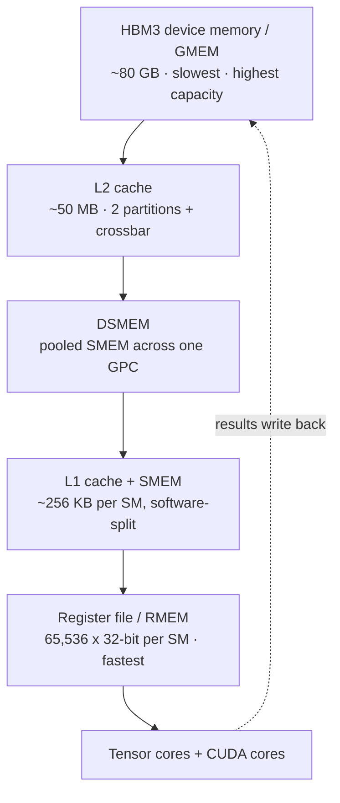
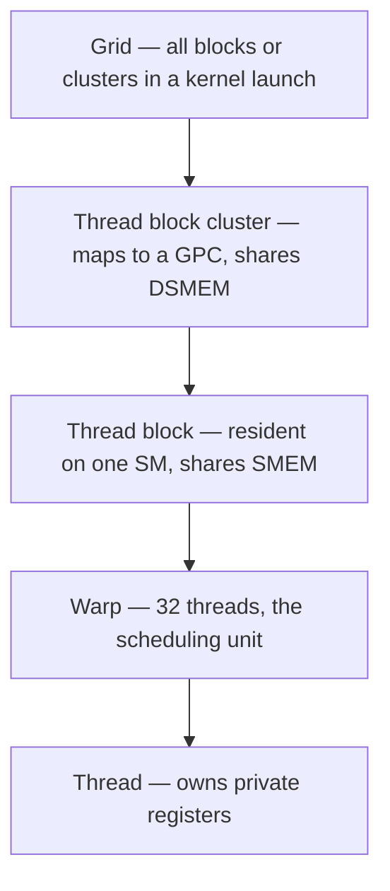
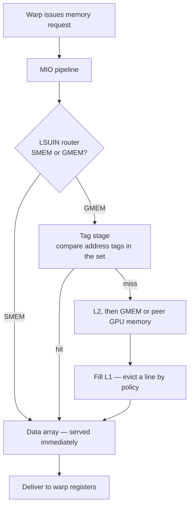
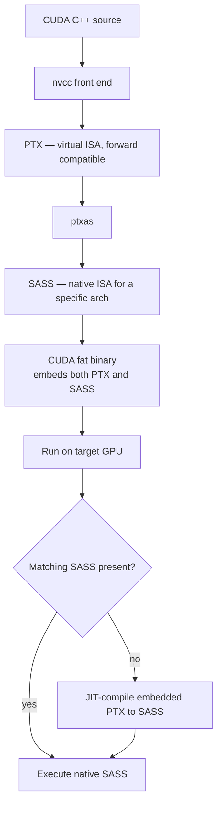
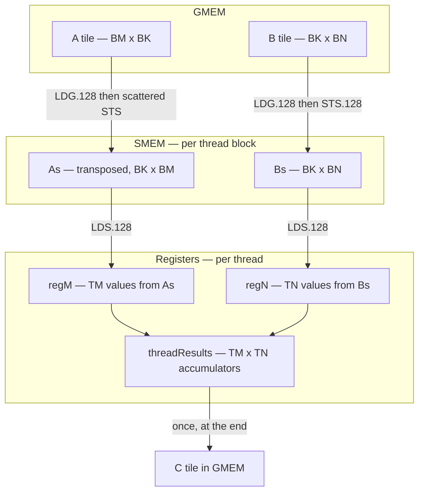
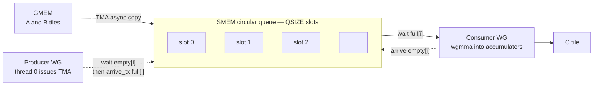

<!--
  SEO
    Primary keyword:   NVIDIA GPU matmul kernels
    Secondary:         Hopper H100, tensor cores, wgmma, TMA, warp tiling,
                       shared memory bank conflicts, PTX SASS, swizzling,
                       CUDA memory hierarchy, GEMM optimization,
                       arithmetic intensity, roofline model

  GROUNDING NOTES
    - Hopper architecture (DSMEM, TMA, thread block clusters, async transaction
      barriers): NVIDIA "Hopper Architecture In-Depth" + H100 whitepaper.
    - Ampere features (bf16/tf32 tensor cores, cp.async, async barriers):
      NVIDIA "Ampere Architecture In-Depth" + A100 whitepaper.
    - wgmma.mma_async semantics, fence/commit_group/wait_group, operand
      placement rules: NVIDIA PTX ISA, asynchronous warpgroup-level matrix
      instructions.
    - cuTensorMapEncodeTiled: CUDA Driver API, Tensor Memory Access docs.
    - Swizzle<B,M,S> XOR derivation: CUTLASS include/cute/swizzle.hpp.
    - SASS bank-conflict tuning result (132 -> 152 GFLOP/s): Jia et al.,
      "Dissecting the NVIDIA Volta GPU Architecture via Microbenchmarking",
      arXiv:1804.06826.
    - Warp-tiling reference kernel: siboehm/SGEMM_CUDA kernel 10.
    - Hopper SOTA kernel progression + TFLOP/s table: pranjalssh/fast.cu
      worklog. Numbers are attributed in the table caption, NOT presented as
      my own benchmarks.
    - Occupancy limits (65,536 regs/SM, 2048 threads/SM on cc 9.0): CUDA C
      Programming Guide, technical specifications per compute capability.
    - Speed-of-light figures kept as a derivation with clock as the free
      variable, because boost clock is not a constant under power/thermal caps.
-->


*The whole post in one picture: a matmul walks down the memory hierarchy until it reaches the tensor cores, and every level it touches on the way is a place you can lose performance.*

## Introduction

Almost every performance conversation I have about large models eventually collapses into the same question: **how fast is your matmul?**

That is not a rhetorical flourish. Transformers spend the overwhelming majority of their FLOPs inside matrix multiplications — MLP projections, QKV projections, attention output projections — in both training and inference. Which means **NVIDIA GPU matmul kernels** are not a niche topic for compiler people. They are the floor under your training run's cost and your inference endpoint's latency.

This post is my attempt to build that floor from scratch. We start at the silicon — what a Hopper H100 actually *is* — climb up through the CUDA programming model and the PTX/SASS instruction sets, build a genuinely fast fp32 kernel using nothing but registers and shared memory, and then rebuild it on Hopper's asynchronous machinery: TMA, swizzling, and `wgmma` tensor core pipelines.

There is a second reason to care. Matrix multiplication is *embarrassingly parallel* and numerically simple, which makes it the ideal vehicle for learning GPU performance engineering. Once you understand why a fast matmul is fast, you have the toolkit for almost any other kernel you will ever write — attention, normalization, MoE routing, quantized GEMMs.

> **The one-line mental model:** a matmul kernel is not a compute problem. It is a **data-movement problem wrapped around a compute primitive**, and essentially every optimization in this post is a way of moving fewer bytes, or moving them earlier.

<div class="ts-note ts-note--key" markdown="0">
  <span class="ts-note-title">How this post is organised</span>
  <div class="ts-note-body">
    <p><strong>Part 1 — The hardware.</strong> H100 memory hierarchy and compute pipelines, the "speed of light", and why it moves.</p>
    <p><strong>Part 2 — The programming model.</strong> Threads, warps, blocks, clusters, and the detailed models of GMEM, SMEM and L1 that explain why access patterns dominate.</p>
    <p><strong>Part 3 — A near-SOTA synchronous kernel.</strong> PTX/SASS, occupancy, quantization effects, the roofline, and warp-tiling in fp32.</p>
    <p><strong>Part 4 — A SOTA asynchronous kernel.</strong> TMA, swizzling, <code>wgmma</code>, producer/consumer pipelines, persistent kernels, cache-aware scheduling, and clusters.</p>
  </div>
</div>

---

## Why NVIDIA GPU Matmul Kernels Are Worth This Much Depth

Before the hardware, the economics, because they justify the obsession.

At frontier scale you are not optimizing for a demo. If you are training across tens of thousands of H100s, a **1% improvement in a core matmul kernel** is millions of dollars and a measurable amount of electricity. A friend of mine has a good line for this: at that scale you stop caring about $O(N)$ and start caring about $O(NR)$ — where NR is *nuclear reactors*.

The asymptotic wins are gone. Nobody is going to discover a sub-$O(N^{2.37})$ matmul that is also cache-friendly on real silicon this quarter. What is left is the last few percent — and the last few percent lives in the memory hierarchy, in instruction scheduling, and in whether your loads are coalesced.

That is why this post spends more time on memory than on arithmetic.

---

## Part 1 — Fundamentals of NVIDIA GPU Architecture

You cannot write a fast kernel against an abstraction. You need a mental model of the machine, accurate enough to predict which of two equivalent-looking code paths will be 13× slower. (That number is not hypothetical — we will hit it in Part 3.)

I am going to focus entirely on the **Hopper H100**. It is the right anchor point: understand Hopper deeply and both directions become easy. Ampere and Volta are Hopper minus features; Blackwell and Rubin are Hopper plus features.

At the highest level, a GPU does exactly two things:

1. **Move and store data** — the memory system.
2. **Do useful work with the data** — the compute pipelines.

Every optimization in this post is an attempt to keep (2) busy despite (1).

### The H100 memory hierarchy, level by level

The memory system is aggressively hierarchical, for the same physical reason CPU caches are. SRAM cells are fast but physically large — the control circuitry that makes them fast also makes them take up area. DRAM cells are dense but slow. So fast memory is small and expensive, slow memory is abundant.

In an ideal world every compute unit would sit next to an enormous pool of ultra-fast memory. Physics says no. So the design compromise is a ladder: a little fast memory close to compute, backed by progressively larger and slower pools further away.



Reading that ladder bottom-up, from device memory down to registers, bandwidth climbs by orders of magnitude while latency and capacity both fall by comparable orders of magnitude.

**1. Device memory (VRAM / GMEM).** In CUDA terms "device" memory is off-chip DRAM — physically separate from the GPU die but packaged on the same board — implemented as stacked HBM. It hosts global memory, plus per-thread "local" memory, which is really just register-spill space.

**2. L2 cache.** A large k-way set-associative SRAM cache, roughly 50 MB on H100. It is physically split into two partitions; each SM connects directly to one partition and reaches the other through a crossbar. That asymmetry is invisible in most code and occasionally very visible in bandwidth-sensitive kernels.

**3. Distributed shared memory (DSMEM).** New in Hopper: the pooled shared memories of a physically adjacent group of SMs (a GPC) become directly addressable by each other. SM-to-SM loads, stores, and atomics without a round trip to L2.

**4. L1 cache and shared memory.** These share the same physical storage per SM, and the split between them is software-configurable. **L1** is a smaller k-way set-associative cache, private to the SM, hardware-managed. **Shared memory (SMEM)** is the same silicon, programmer-managed.

**5. Register file (RMEM).** The fastest storage there is, sitting right next to the compute units, private per thread. GPUs have vastly more registers than CPUs — on Hopper, 65,536 32-bit registers per SM, which is total capacity in the same ballpark as the combined L1/SMEM.

Two implications fall out immediately, and they are the entire strategy of this post:

- Keep the most frequently touched data as close to compute as possible.
- Minimize accesses to the lower levels, and above all to GMEM.

<div class="ts-note" markdown="0">
  <span class="ts-note-title">Note — what I'm leaving out</span>
  <div class="ts-note-body">
    <p>There are additional smaller caches for instructions, plus constant memory and a few other specialised paths. They matter for some kernels. They are not instrumental to understanding matmul, so I'm skipping them deliberately rather than accidentally.</p>
  </div>
</div>

One more component deserves a name now, because Part 4 is built on it: the **Tensor Memory Accelerator (TMA)**, introduced with Hopper. TMA performs *asynchronous* data transfers between global memory and shared memory, and between shared memories within a cluster. It also applies **swizzling** automatically to avoid bank conflicts — which is a sentence that means nothing yet and will mean a great deal by the end of Part 4.

### Compute: the streaming multiprocessor

Switching from memory to compute, the fundamental unit is the **streaming multiprocessor (SM)**. The H100 SXM5 exposes 132 SMs; the PCIe part exposes 114.

SMs are grouped into **graphics processing clusters (GPCs)**. On the full GH100 die each GPC holds 18 SMs, with 8 GPCs on the chip. Four GPCs connect directly to one L2 partition, four to the other.

<div class="ts-note" markdown="0">
  <span class="ts-note-title">Note — where did the missing SMs go?</span>
  <div class="ts-note-body">
    <p>18 SMs × 8 GPCs = 144, but shipping parts expose 132 or 114. The 18×8 layout describes the full GH100 die; in actual products some SMs are fused off for yield.</p>
    <p>This is not trivia — it constrains cluster configuration. You cannot cleanly use every SM with thread block clusters spanning more than 2 SMs, because the SM count is not a nice multiple.</p>
    <p>Also: the "graphics" in GPC is legacy. On server parts these are pure compute/AI blocks. Honestly, same goes for the G in GPU.</p>
  </div>
</div>

Beyond the L1/SMEM/TMA/RMEM already covered — all physically inside the SM — each SM contains:

1. **Tensor cores.** Specialized units that execute matrix multiplications on small tiles (for example `64x16 @ 16x256`) at very high throughput. Large matmuls get decomposed into many such tile ops, so using these well *is* the game.
2. **CUDA cores and SFUs.** "CUDA cores" (a marketing name) execute standard floating-point ops, chiefly FMA — fused multiply-add, `c = a * b + c`. Special Function Units handle transcendentals like `sin`, `cos`, `exp`, `log`, plus algebraic functions like `sqrt` and `rsqrt`.
3. **Load/Store (LD/ST) units.** The circuits servicing ordinary load and store instructions, complementary to TMA.
4. **Warp schedulers.** Each SM has schedulers that issue instructions for groups of 32 threads — **warps**. A warp scheduler issues at most one warp instruction per cycle.

Each SM is physically divided into four quadrants, each holding a subset of those units. Which leads to a distinction people routinely conflate:

<div class="ts-note ts-note--key" markdown="0">
  <span class="ts-note-title">Parallelism is not concurrency</span>
  <div class="ts-note-body">
    <p>An SM issues instructions from at most <strong>four warps</strong> per cycle — 128 threads in genuine parallel execution at any instant.</p>
    <p>But an SM can <em>host</em> up to <strong>2048 concurrent threads</strong> (64 warps). Those warps are resident and get scheduled in and out over time, which is precisely how the hardware hides memory and pipeline latency.</p>
    <p>So: instruction parallelism caps at 128 threads per SM per cycle. Concurrency — threads tracked by the scheduler and eligible to run — extends to 2048. Occupancy is about the second number; throughput depends on having enough of the second to keep the first fed.</p>
  </div>
</div>

### Speed of light, and why it moves

Since we buy these things for compute, the obvious question is: what is the ceiling? This is usually called **speed-of-light (SoL)** performance — the upper bound set by the physical characteristics of the chip.

There are several ceilings depending on data type. For LLM training, bfloat16 has been dominant for years, though fp8 and 4-bit formats matter more every quarter (fp8 is already routine for inference).

Peak throughput is just a product:

$$
\text{perf} = f_{\text{clk}}^{\max} \times N_{\text{TC}} \times \text{FLOP}_{\text{per TC per clk}}
$$

Maximum clock frequency × number of tensor cores × FLOPs per tensor core per cycle. For an H100 SXM5 doing bf16, with 132 SMs at 4 tensor cores each:

$$
1.755 \times 10^{9} \;\times\; (132 \times 4) \;\times\; 1024 \;\approx\; 9.5 \times 10^{14}\ \text{FLOP/s} \;=\; 950\ \text{TFLOP/s}
$$

Which lands in the neighbourhood of the ~990 TFLOP/s dense bf16 figure NVIDIA quotes. The gap is entirely in that first term, and that is the point I want to make.

<div class="ts-note ts-note--warn" markdown="0">
  <span class="ts-note-title">The speed of light is not constant</span>
  <div class="ts-note-body">
    <p>Peak throughput depends on the <em>actual</em> clock, which varies under power and thermal throttling. Run a kernel that hammers the tensor cores hard enough and the clock drops — so the effective ceiling drops with it.</p>
    <p>This is why "we're at 78% of peak" is a meaningless claim unless you say which peak, measured at which clock, under which sustained power draw. A kernel can look like it regressed when all that happened is the card got warm.</p>
  </div>
</div>

<div class="ts-note" markdown="0">
  <span class="ts-note-title">Pedantry — FLOP vs FLOPs vs FLOPS vs FLOP/s</span>
  <div class="ts-note-body">
    <p><strong>FLOP</strong> = one floating-point operation. <strong>FLOPs</strong> (lowercase s) = the plural, a count of operations. <strong>FLOP/s</strong> = a throughput unit, operations per second. <strong>FLOPS</strong> (all caps) gets used for throughput constantly, but strictly it should read as the plural. Using FLOPS to mean FLOP/s is slop.</p>
  </div>
</div>

That is as much hardware as we need for now. Next: the programming model, then one level deeper into the hardware, then back up into CUDA C++.

---

## Part 2 — The CUDA Programming Model and the Memory Models That Matter

### Threads, warps, blocks, clusters, grids

The CUDA programming model maps onto the hardware hierarchy almost one-to-one:



Every thread knows where it sits via built-in variables — `gridDim`, `blockIdx`, `blockDim`, `threadIdx`. Internally these live in special registers, initialized by the CUDA runtime at launch.

That positional information is how you divide work. Say you want to process a 1024×1024 image: partition it into 32×32 thread blocks, each block holding a 32×32 arrangement of threads. Each thread computes its global coordinates:

```cpp
const int x = blockIdx.x * blockDim.x + threadIdx.x;
const int y = blockIdx.y * blockDim.y + threadIdx.y;
```

…then fetches `image[x][y]` from global memory, does something pointwise, writes it back.

In practice you mostly use 1D or 2D grid/block shapes, because you can always relabel logically. If `threadIdx.x` runs 0–1023 (a flat 1D block of 1024 threads), then `x = threadIdx.x % 32` and `y = threadIdx.x / 32` reshapes it into a 32×32 logical 2D layout. The hardware does not care; only your index arithmetic does.

Connecting the model back to the silicon gives us our first hard design rule:

> **A thread block should contain at least 4 warps — 128 threads.**

Why? Because a thread block is resident on a single SM, and each SM has four warp schedulers. Fewer than four warps and you are guaranteeing idle schedulers.

<div class="ts-note ts-note--key" markdown="0">
  <span class="ts-note-title">More reasons 128 is the magic number</span>
  <div class="ts-note-body">
    <p>On Hopper the <strong>warp group</strong> — exactly 4 warps, 128 threads — is the unit of execution for <code>wgmma</code> tensor core instructions. That is not a coincidence, and it is why every kernel in Part 4 uses 128-thread groups.</p>
    <p>Also, with persistent kernels we often launch one block per SM, so structuring work to keep all four schedulers busy stops being a nicety and becomes the whole design.</p>
  </div>
</div>

### The GMEM model: why access patterns are physics

Global memory is stacked DRAM with a logic layer at the bottom (HBM). But what is DRAM, concretely?

A DRAM cell is about as simple as storage gets: **one transistor and one capacitor**. The capacitor holds charge (the bit); the transistor is a switch gated by a *wordline*; reading drains charge onto a *bitline* where a sense amplifier decides whether it was a 1 or a 0.

Two consequences matter enormously:

1. **Reads are destructive and row-granular.** Activating a row pulls the entire row into a row buffer. Reading one byte and reading the whole row cost roughly the same.
2. **Charge leaks.** DRAM needs periodic refresh, which is why it is slower than SRAM on every axis that matters to us.

Put those together and you get the single most important rule about GMEM: **the cost of a read is dominated by how many DRAM rows you touch, not how many bytes you want.**

Here is what that looks like for a row-major matrix, where consecutive elements of a row are contiguous in memory:

<div class="ts-grid" markdown="0">
  <table>
    <thead>
      <tr><th>Access pattern</th><th>t0</th><th>t1</th><th>t2</th><th>t3</th><th>DRAM rows touched</th></tr>
    </thead>
    <tbody>
      <tr>
        <td>Along a row — coalesced</td>
        <td class="hit">A[0][0]</td><td class="hit">A[0][1]</td><td class="hit">A[0][2]</td><td class="hit">A[0][3]</td>
        <td class="hit">1</td>
      </tr>
      <tr>
        <td>Down a column — strided</td>
        <td class="clash">A[0][0]</td><td class="clash">A[1][0]</td><td class="clash">A[2][0]</td><td class="clash">A[3][0]</td>
        <td class="clash">4</td>
      </tr>
    </tbody>
  </table>
</div>

<span class="ts-caption">Same four elements fetched, same number of bytes requested. The strided version pays four row activations instead of one — and the ratio only gets worse as the warp gets wider.</span>

If the matrix were column-major the situation flips exactly: columns become contiguous, so the efficient traversal is down columns with rows in the inner loop.

So when people say *"GMEM coalescing is critical"*, this is the mechanism they are pointing at. Threads in a warp should access contiguous addresses, so the hardware touches the minimum number of DRAM rows and can merge per-thread requests into wide warp-level transactions.

### The SMEM model: 32 banks and the conflict rule

Shared memory has **very** different properties. It is SRAM, not DRAM — many more transistors per bit, so far lower capacity, but no row-activation penalty and no refresh.

SMEM is organized into **32 banks, each 32 bits (4 bytes) wide**. It can serve data from all 32 banks — 128 bytes — in a single cycle, subject to exactly one rule:

> **Threads in a warp must not access different addresses within the same bank.** If they do, those requests are serialized.

This is a **bank conflict**. If N threads hit different addresses in the same bank, you get an N-way conflict and the warp's request takes N cycles. Worst case, all 32 threads target different addresses in one bank and your SMEM throughput drops by 32×.

Suppose, for legibility, the warp size were 5 instead of 32:

<div class="ts-grid" markdown="0">
  <table>
    <thead>
      <tr><th></th><th>bank 0</th><th>bank 1</th><th>bank 2</th><th>bank 3</th><th>bank 4</th><th>cycles</th></tr>
    </thead>
    <tbody>
      <tr>
        <td>Conflict-free</td>
        <td class="hit">t0</td><td class="hit">t1</td><td class="hit">t2</td><td class="hit">t3</td><td class="hit">t4</td>
        <td class="hit">1</td>
      </tr>
      <tr>
        <td>3-way conflict</td>
        <td class="clash">t0, t2, t4</td><td>t1</td><td class="hit">t3</td><td>—</td><td>—</td>
        <td class="clash">3</td>
      </tr>
    </tbody>
  </table>
</div>

<span class="ts-caption">Left pattern: one address per bank, served in a single cycle. Right pattern: three threads want three different addresses in bank 0, so the request serializes into three cycles.</span>

There is one crucial exception. If multiple threads in a warp read the **same address** in a bank, SMEM **broadcasts** (or multicasts) that value to all of them in a single cycle. So a bank serving one address to five threads is free; a bank serving five addresses to five threads costs 5×. Same-address is fine. Different-address-same-bank is the killer.

Keep that exception in mind — it is doing quiet work in the warp-tiling kernel, where every thread in a warp reads the same element of `A`.

### The L1 model: the same silicon, with scaffolding

L1 and SMEM share physical storage; L1 adds a hardware-managed layer around it. The request flow looks like this:



Unpacking the tag stage, because set-associativity is where cache intuition usually breaks:

1. The tag stage receives a GMEM address.
2. The **set id** bits are extracted, and every cache line (tag) in that set is checked in parallel.
3. On a **tag match**, the line's validity flags are examined. Valid → requested sectors are read from the data array into the warp's registers. Invalid → treat it as a miss.
4. On a **miss**, the request goes out to L2 and beyond. When the data returns it is stored into the set — evicting an existing line per the replacement policy, typically pseudo-LRU — and delivered to the requesting warp in parallel.

L2 is structurally similar, with four differences: it is global rather than per-SM, much larger, higher associativity, split into two partitions joined by a crossbar, and it exposes more nuanced persistence and caching policies.

<div class="ts-note" markdown="0">
  <span class="ts-note-title">The gradient across GPU generations</span>
  <div class="ts-note-body">
    <p>I claimed earlier that Hopper is the right anchor. Here is the evidence — the biggest generational jump so far was Ampere → Hopper:</p>
    <p><strong>Hopper added:</strong> DSMEM (direct SM-to-SM loads, stores, atomics across a GPC); TMA (hardware async tensor movement, GMEM ↔ SMEM and SMEM ↔ SMEM); thread block clusters (a new grouping level above the block); and asynchronous transaction barriers — split barriers that count <em>bytes</em>, not just threads.</p>
    <p><strong>Ampere had already added:</strong> tf32 and bf16 in tensor cores; async copy GMEM → SMEM with L1-bypass and L1-access modes; hardware-accelerated async barriers in shared memory; CUDA task graphs (what PyTorch's CUDA graphs are built on, cutting launch and grid-init overhead); and warp-level reductions via Cooperative Groups.</p>
    <p>Learn the Hopper list and Blackwell reads as an extension rather than a new machine.</p>
  </div>
</div>

---

## Part 3 — From PTX and SASS to a Near-SOTA Warp-Tiling Kernel

### What PTX and SASS are, and why you should read them

An **ISA** is the set of instructions a processor can execute, plus their binary encodings and semantics. Assembly is its human-readable form: instead of `0x1fff…3B` you write `FMA R12, R13, R14, R15`.

On NVIDIA GPUs there are two levels:

- **SASS** is the native ISA — what actually executes. It is poorly documented, especially for recent generations. Some older generations have been partly reverse-engineered; official documentation remains thin.
- **PTX** is a **virtual ISA**: an instruction set for an abstract GPU. PTX is not executed directly. It is compiled by `ptxas` into SASS.

The reason PTX exists is forward compatibility. Code compiled to PTX a decade ago still runs on Blackwell today — maybe not efficiently, but correctly.



So why care, if the compiler handles it?

Because this is where the last few percent lives, and at scale the last few percent is the whole budget. The classic demonstration is the Citadel microbenchmarking work on Volta: the authors hand-tuned SASS to avoid memory bank conflicts and took a kernel from **132 GFLOP/s to 152 GFLOP/s — a 15.4% improvement** with no algorithmic change whatsoever.

The practical point is not that you will write kernels in SASS. It is that when writing CUDA C++ you want to stay **tightly coupled to the compiler's output** — verifying that your `#pragma unroll` actually unrolled, that your `float4` cast actually lowered to `LDG.128`, that your "obviously vectorized" load is in fact vectorized. Hints are hints. The assembly is the truth.

And some Hopper instructions have no CUDA C++ equivalent at all. For those you write inline PTX, as we will in Part 4.

### The simplest possible matmul

Start where everyone starts — a naive matmul for a serial processor:

```cpp
for (int m = 0; m < M; m++) {
    for (int n = 0; n < N; n++) {
        float tmp = 0.0f;           // accumulator for one dot product
        for (int k = 0; k < K; k++) {
            tmp += A[m][k] * B[k][n];
        }
        C[m][n] = tmp;
    }
}
```

We loop over rows and columns of the output and compute a dot product at each position: $C[m,n] = \text{dot}(A[m,:],\, B[:,n])$. Textbook definition.

Total work: $M \times N$ dot products, each $K$ multiply-adds, so $2MNK$ FLOPs — the factor of 2 because convention counts an FMA as two operations.

Where is the parallelism? **All of those dot products are independent.** There is no reason computing `C[0,1]` should wait for `C[0,0]`. So we parallelize across the two outer loops.

Here is the simplest GPU version. I will use the slightly more general GEMM form $C = \alpha AB + \beta C$; setting $\alpha = 1, \beta = 0$ recovers plain $C = AB$:

```cpp
// __global__ declares a GPU kernel
__global__ void naive_kernel(int M, int N, int K, float alpha,
                             const float *A, const float *B,
                             float beta, float *C) {
  const int BLOCKSIZE = 32;

  const int row = blockIdx.x * BLOCKSIZE + (threadIdx.x / BLOCKSIZE);
  const int col = blockIdx.y * BLOCKSIZE + (threadIdx.x % BLOCKSIZE);

  if (row < M && col < N) {   // guard: some threads fall outside C
    float tmp = 0.0f;
    for (int i = 0; i < K; ++i) {
      tmp += A[row * K + i] * B[i * N + col];
    }
    // GEMM: C = alpha * A @ B + beta * C
    C[row * N + col] = alpha * tmp + beta * C[row * N + col];
  }
}
```

Launched like this:

```cpp
// enough blocks to cover all of C
dim3 gridDim(CEIL_DIV(M, 32), CEIL_DIV(N, 32), 1);
dim3 blockDim(32 * 32);          // 1024 threads per block
naive_kernel<<<gridDim, blockDim>>>(M, N, K, alpha, A, B, beta, C);
```

Four things worth noticing:

- Kernels are written **from the perspective of a single thread**. This is the SIMT model — Single Instruction, Multiple Threads. You describe one thread's work; CUDA handles grids, clusters, and blocks. (Other models differ: Triton has you write from the perspective of a *tile*.)
- Each thread derives its `(row, col)` in `C` from block and thread indices and writes one dot product.
- We tile the output with 32×32 thread blocks of 1024 threads.
- If `M` or `N` are not divisible by 32, some threads land outside `C`. Hence the guard.

Those last two combine into an effect worth naming.

### Tile quantization and wave quantization

**Tile quantization** is the waste from output dimensions not dividing evenly by tile size. With `M = N = 4096` and 32×32 tiles there is no issue — 32 divides 4096 exactly. But at 33×33, you launch 2×2 tiles covering 64×64, and roughly **75% of your threads do no useful work**. The effect is most brutal when tiles are large relative to the output.

**Wave quantization** is the same idea one level up. Suppose an H100 PCIe with 114 SMs, one block per SM at a time. Launch 114 blocks: one wave, done. Launch **115** blocks: execution time nearly *doubles*, because you need a second wave in which 113 of 114 SMs sit idle waiting for one straggler.

Both effects punish you hardest at small problem sizes and small wave counts — exactly the inference regime where people are most surprised by their numbers.

### Occupancy: how many blocks actually fit?

Let us make this concrete for the naive kernel at `M = N = K = 4096` on an H100 PCIe.

We launch $(4096/32)^2 = 16{,}384$ thread blocks. The card has 114 SMs. So: how many blocks fit concurrently on one SM?

Three resources bound it — **registers**, **shared memory**, and **threads/warps**:

- **Registers.** Profiling shows 32 registers per thread. At 1024 threads per block that is $1024 \times 32 = 32{,}768$ registers per block. With 65,536 registers per SM → **2 blocks**.
- **Threads.** On Hopper (compute capability 9.0) the max is 2048 threads per SM. At 1024 threads per block → **2 blocks**.
- **SMEM.** Even a kernel that uses no shared memory pays ~1024 B of system overhead per block. Against the default 8192 B per-SM allocation → **8 blocks**.

So `max blocks/SM = min(2, 2, 8) = 2`. Which means at most $114 \times 2 = 228$ blocks resident at once, and $16{,}384 / 228 \approx 71.9$ **waves** to finish the matmul.

<div class="ts-note" markdown="0">
  <span class="ts-note-title">Tooling</span>
  <div class="ts-note-body">
    <p>Get these numbers from the profiler — <code>ncu --set full -o out.ncu-rep ./your_kernel</code> — rather than deriving them by hand and hoping. You can also pass <code>--ptxas-options=-v</code> at compile time to have the compiler report register usage and resource counts directly, and <code>nvdisasm</code> is a useful little tool for poking at the binary.</p>
    <p>Terminology note: in CUDA, "occupancy" usually means concurrent blocks per SM. There is a closely related definition — <em>warp occupancy</em>, the ratio of active warps to the maximum warps per SM — where "active" means warps that have been allocated their registers and SMEM at launch.</p>
  </div>
</div>

### Reading the naive kernel's assembly

A few optimizations happen for free in hardware once your GMEM accesses are coalesced:

- **Matrix A.** All 32 threads in a warp read the *same* address of `A`. The hardware merges 32 per-thread `LDG.32` instructions into a single warp-level load and broadcasts the result. (This is the SMEM broadcast exception's GMEM cousin.)
- **Matrix B.** The 32 threads read 32 *consecutive* addresses of `B`. Those merge into one 128 B warp-level load. This works only because they read along the contiguous dimension. Read down a column instead and the hardware must issue multiple warp-level transactions.

When you compile this kernel at `-O3` for `sm_90a` and read the PTX, the high-level flow is:

- Compute `row` and `col`. Curiously, the compiler uses `bfi` (bit field insert) to compute `col` rather than a plain add of two registers. My best guess is pipeline load-balancing — routing work to a less-contended unit — because `bfi` is not inherently faster than `add`.
- Early-exit guard for threads outside `C`.
- If `K < 1`, jump straight to the store (`tmp` stays 0).
- If `K <= 3`, jump to the tail loop.
- Otherwise compute base offsets for `A` and `B` and enter the main loop.
- **Main loop, unrolled ×4.** Four FMA steps per iteration, interleaved with loads and address arithmetic.
- **Tail loop**, up to 3 iterations, not unrolled.
- **Epilogue:** load `C`, apply $\alpha AB + \beta C$, store with `st.global.f32`.

Visible compiler optimizations: early exits, loop unrolling, main/tail splitting, and apparent pipeline load-balancing. Visible compiler *inefficiencies*: redundant zero-initialization of variables, an overly complex address computation for `A`, and a partial-offset calculation where two instructions could have collapsed into one.

The unrolling is the one that matters most, because it exposes **ILP**.

<div class="ts-note ts-note--key" markdown="0">
  <span class="ts-note-title">ILP — instruction-level parallelism</span>
  <div class="ts-note-body">
    <p>ILP is how much work a <em>single warp</em> can keep in flight by issuing independent instructions back-to-back. High ILP lets the scheduler issue a new instruction every cycle while earlier ones are still waiting out their latency — so the warp does not need to be swapped out as aggressively.</p>
    <p>Assume an FMA takes 4 cycles. <strong>Low ILP</strong> — a fully dependent chain:</p>
    <pre><code>y = a * b + 1.0f;   // uses a, b
z = y * c + 1.0f;   // depends on y
w = z * c + 1.0f;   // depends on z</code></pre>
    <p>Each FMA needs the previous result, so nothing overlaps: 3 × 4 = <strong>12 cycles</strong>.</p>
    <p><strong>High ILP</strong> — independent ops:</p>
    <pre><code>c0 = a0 * b0 + 1.0f;
c1 = a1 * b1 + 1.0f;
c2 = a2 * b2 + 1.0f;</code></pre>
    <p>Three independent FMAs issue on cycles 0, 1, 2 and complete at 4, 5, 6: <strong>6 cycles</strong>. Same arithmetic, half the latency.</p>
    <p>That is why unrolling matters — and, incidentally, why you should add <code>#pragma unroll 1</code> when you want <em>readable</em> PTX for debugging. Unrolling also removes branch instructions, which is a smaller but real win.</p>
  </div>
</div>

Now compare against the SASS, which is generated by `ptxas` from that PTX. The interesting diffs:

- The loop is unrolled **×16**, not ×4.
- `LDG` instructions are hoisted to the top of the loop body, overlapping loads with compute. FMAs cluster toward the end of each unrolled chunk.
- There are now **two** tail loops — one unrolled 8×, one 4× — plus a final loop covering the last 3 iterations.

And more compiler quirks:

- The program counter register `R1` is loaded and never used.
- Redundant zero-initializations survive from PTX.
- One predicate is a no-op — always true — so the jump to the 4×-unrolled loop is never taken.
- That 4×-unrolled loop contains a superfluous `BRA`; it can never iterate more than once.
- After the final `EXIT`, control falls into an infinite `while` loop. Implementation detail or glitch, I genuinely do not know.
- Finally, and legitimately, the code is padded with `NOP`s for alignment.

None of this is a criticism of `ptxas`. It is the point: the compiler is doing a great deal on your behalf, some of it surprising, and the only way to know what you actually got is to look.

### The coalescing cliff, and the roofline

Now for the 13× I promised. Take the naive kernel and change exactly two operators:

```cpp
// original
const int row = blockIdx.x * BLOCKSIZE + (threadIdx.x / BLOCKSIZE);
const int col = blockIdx.y * BLOCKSIZE + (threadIdx.x % BLOCKSIZE);

// modified — swap % and /
const int row = blockIdx.x * BLOCKSIZE + (threadIdx.x % BLOCKSIZE);
const int col = blockIdx.y * BLOCKSIZE + (threadIdx.x / BLOCKSIZE);
```

That is it. Swap `%` and `/`.

The result on an H100 PCIe: throughput falls from roughly **3171 GFLOP/s to 243 GFLOP/s** — a **13× slowdown**. Because now consecutive threads in a warp walk *down* a column of `B` instead of along a row, and every one of them activates a different DRAM row. Exactly the strided-access penalty from the GMEM section.

From the outside it looks like a trivial operator swap. Without a mental model of DRAM you would never predict it. This is the single best argument I know for reading Part 1 before writing kernels.

So where is the naive kernel actually living? The **roofline model** answers that.

<div class="ts-note ts-note--math" markdown="0">
  <span class="ts-note-title">The roofline model</span>
  <div class="ts-note-body">
    <p>Plot achieved performance (FLOP/s) on the y-axis against <strong>arithmetic intensity</strong> (AI) on the x-axis. AI is FLOPs performed per byte loaded from device memory.</p>
    <p>The curve has two regimes joined at a <strong>ridge point</strong> at AI = peak performance ÷ GMEM bandwidth. Below the ridge you are <em>memory-bandwidth-bound</em>: adding compute does nothing. Above it you are <em>compute-bound</em>, which is where you want to be, because that is what you paid for.</p>
    <p>On an H100 PCIe the ridge point works out to roughly <strong>AI ≈ 410 FLOP/byte</strong>. Only above that can a kernel be compute-bound. The naive kernel is nowhere close — it loads two floats to do two FLOPs, an AI of about 0.25.</p>
  </div>
</div>

We are paying NVIDIA a great deal of money for tensor cores. We should get to the right side of the ridge.

### Loop order, outer products, and why square tiles win

Back to the sequential code, because the fix is visible there. The semantics of matmul are **invariant to loop order** — you can permute the three nested loops in any of $3! = 6$ ways and still compute a correct matmul.

The most interesting permutation hoists `K` outermost:

```cpp
for (int k = 0; k < K; k++) {
    for (int m = 0; m < M; m++) {
        float a = A[m][k];               // one load, reused across all of N
        for (int n = 0; n < N; n++) {
            C[m][n] += a * B[k][n];
        }
    }
}
```

If those loads came from GMEM we just cut loads of `A` from $N^3$ to $N^2$ — roughly a 2× bandwidth saving.

But the bandwidth is the minor prize. The real prize is conceptual: **this version computes matmul as a sum of partial outer products.** Instead of "compute one output element completely, then move on", it is "take a column of `A` and a row of `B`, form their outer product, add it into `C`, repeat." Every step touches all of `C` and finishes none of it.

That reframing unlocks everything else, via two equivalences:

1. **A dot product equals a sum of partial dot products.** Split the $K$ dimension into chunks, compute a partial dot product per chunk, add them up.
2. **Therefore a matmul equals a sum of block matmuls.** Each block matmul produces partial results for a tile of `C`.

Which is precisely what lets us stage data in SMEM: chunk the computation small enough that the operands fit in shared memory, do the partial matmul there at SRAM speed, accumulate, move to the next chunk. Without chunking, the operands could never fit.

And to raise arithmetic intensity we need two more things:

1. **Compute multiple output elements per thread.** One output per thread means every load is used once. Compute a $T_M \times T_N$ patch per thread and each loaded element gets reused across a whole row or column of that patch.
2. **Make output tiles as square as possible.** For a $T_M \times T_N$ output patch you load $T_M + T_N$ elements and perform $2 \, T_M T_N$ FLOPs. AI scales as $T_M T_N / (T_M + T_N)$, which for a fixed perimeter is maximized when $T_M = T_N$. A 1×64 tile and an 8×8 tile both produce 64 outputs; the 1×64 loads 65 elements, the 8×8 loads 16.

That last calculation is the whole reason tiled matmuls look the way they do.

### Warp-tiling: near-SOTA with nothing but registers and SMEM

Now we build a kernel that is close to state of the art under deliberately harsh constraints:

- No TMA
- No asynchronous memory instructions
- No tensor cores
- fp32 only

In other words: SOTA on a pre-Volta machine, and near-SOTA on Volta/Ampere. (Volta introduced tensor cores, Ampere async memory, Hopper TMA.) The technique is **warp-tiling**, and it is a three-level decomposition of the same idea applied recursively.

I will use tile sizes `BM = BN = 128, BK = 16` with 256 threads per block.



The structure is: **block tile → warp tile → thread tile**, with each level loading into progressively faster memory. Since every block's computation is independent, and we have convinced ourselves that partial results accumulate correctly, we only need to reason about **one block, one step of the K loop**. The other 1023 blocks ($4096/128 \times 4096/128 = 1024$) do the same thing.

<div class="ts-note" markdown="0">
  <span class="ts-note-title">Mantra</span>
  <div class="ts-note-body">
    <p>I find it genuinely hard to stop thinking about the other blocks. So: <em>everything else is correct; I only need to get the next step right. Local correctness gives global correctness.</em></p>
  </div>
</div>

**Step 1 — load `B` into `Bs`.** This one is easy, because `Bs` is not transposed. Each warp fetches a row of `B`, each thread issuing a vectorized load (`LDG.128`, 128 bits = four fp32) followed by a vectorized store (`STS.128`). Each warp loops 4 times with a stride of 4 rows:

```cpp
for (uint offset = 0; offset + rowStrideB <= BK; offset += rowStrideB) {
    // reinterpret_cast is what forces LDG.128 / STS.128 (4 x 4B floats)
    reinterpret_cast<float4 *>(
        &Bs[(innerRowB + offset) * BN + innerColB * 4])[0] =
        reinterpret_cast<const float4 *>(
            &B[(innerRowB + offset) * N + innerColB * 4])[0];
}
```

**Step 2 — load `A` into `As`, transposed.** This is the subtle one. We store `As` transposed so that during the compute phase we can issue vectorized `LDS.128` loads from it.

The trade-off: the *stores* can no longer be vectorized. The four floats fetched from a row of `A` must be scattered into a *column* of `As`, and a column of `As` maps into the same bank — so those stores conflict. We accept it, because each element of `As` is read many times during compute while being written exactly once. Optimize the frequent side.

```cpp
for (uint offset = 0; offset + rowStrideA <= BM; offset += rowStrideA) {
  const float4 tmp = reinterpret_cast<const float4 *>(
      &A[(innerRowA + offset) * K + innerColA * 4])[0];
  As[(innerColA * 4 + 0) * BM + innerRowA + offset] = tmp.x;
  As[(innerColA * 4 + 1) * BM + innerRowA + offset] = tmp.y;
  As[(innerColA * 4 + 2) * BM + innerRowA + offset] = tmp.z;
  As[(innerColA * 4 + 3) * BM + innerRowA + offset] = tmp.w;
}
```

Then `__syncthreads()`, so every thread sees complete `As` and `Bs`.

**Step 3 — compute.** Each thread pulls `TM` values from `As` and `TN` values from `Bs` into registers, then computes a $T_M \times T_N$ outer product into its private accumulators. The warp-level tiling parameters (`WM`, `WN`, `WMITER`, `WNITER`) control how the block tile is carved among the four warps:

```cpp
for (uint dotIdx = 0; dotIdx < BK; ++dotIdx) {        // outermost: the K step
  // WM = 64, so As is split into 2 x 64 parts
  // TM = 8, so each thread takes 8 rows from As
  // WMITER = 1, so a single slice of As
  for (uint wSubRowIdx = 0; wSubRowIdx < WMITER; ++wSubRowIdx) {
    for (uint i = 0; i < TM; ++i) {                   // As -> regM
      regM[wSubRowIdx * TM + i] =
          As[(dotIdx * BM) + warpRow * WM + wSubRowIdx * WSUBM +
             threadRowInWarp * TM + i];
    }
  }
  // WN = 64, so Bs is split into 2 x 64 parts
  // TN = 4, so 4 columns per slice of Bs
  // WNITER = 4, so four slices; WSUBN = WN / WNITER = 16
  for (uint wSubColIdx = 0; wSubColIdx < WNITER; ++wSubColIdx) {
    for (uint i = 0; i < TN; ++i) {                   // Bs -> regN
      regN[wSubColIdx * TN + i] =
          Bs[(dotIdx * BN) + warpCol * WN + wSubColIdx * WSUBN +
             threadColInWarp * TN + i];
    }
  }

  // the warptile matmul itself: a sum of partial outer products
  for (uint wSubRowIdx = 0; wSubRowIdx < WMITER; ++wSubRowIdx) {
    for (uint wSubColIdx = 0; wSubColIdx < WNITER; ++wSubColIdx) {
      for (uint resIdxM = 0; resIdxM < TM; ++resIdxM) {
        for (uint resIdxN = 0; resIdxN < TN; ++resIdxN) {
          threadResults[(wSubRowIdx * TM + resIdxM) * (WNITER * TN) +
                        (wSubColIdx * TN) + resIdxN] +=
              regM[wSubRowIdx * TM + resIdxM] *
              regN[wSubColIdx * TN + resIdxN];
        }
      }
    }
  }
}
```

Note that the innermost two loops are a pure outer product — no reduction, no dependencies between iterations. Maximum ILP, all in registers.

**Step 4 — advance and repeat.** Synchronize again (without this, fast threads would start overwriting `As` and `Bs` while slow threads are still reading them), then walk the pointers:

```cpp
A += BK;        // move BK columns right
B += BK * N;    // move BK rows down
```

When the K loop finishes, the accumulators hold *complete* dot products, and the threads flush their private `threadResults` into the output tile of `C`. One write per output element, at the very end.

In production you would autotune `BM`, `BN`, `BK`, `TM`, `TN`, `WM`, `WN` for your specific GPU. But as good as this gets, it is no longer the method of choice — because the hardware grew features that make most of this manual choreography obsolete.

---

## Part 4 — SOTA Asynchronous Matmul Kernels on Hopper

Now we bring out everything: **TMA** for async load/store, **tensor cores** via `wgmma`, and **bf16**. These features simultaneously *simplify* the kernel and improve throughput by close to an order of magnitude — published worklogs report going from ~32 TFLOP/s to ~317 TFLOP/s on the first rewrite alone.

Two structural changes to start:

- We need only **128 threads (4 warps)** per block — one warp group.
- Tile sizes become `BM = BN = BK = 64`.
- **`A` stays row-major, but `B` is now column-major.** This is the standard convention here and it matters for the descriptors later.

The high-level block-tiling structure is unchanged. What changes is who does the work.

### Async loads into SMEM via TMA

TMA replaces that entire intricate warp-level loading pattern with three things:

1. Construct **tensor maps** for `A` and `B`.
2. Trigger the TMA operation — from a **single thread** in the block.
3. Synchronize with shared-memory barriers.

And TMA does not just move data; it **swizzles it on the way in**, which dissolves the bank-conflict problem we hand-managed in warp-tiling.

Tensor maps are built with `cuTensorMapEncodeTiled`, which encodes all the metadata needed to move tiles of a GMEM tensor into SMEM. One map per operand, structurally identical. For `A`:

- Data type: `bf16`
- Rank: 2 (a matrix)
- Pointer: `A`
- Shape: `(K, M)` — fastest-stride dimension first
- Row stride: `K * sizeof(bf16)`
- Destination `sA` shape: `(BK, BM)`
- Swizzle mode: 128 B pattern

Then the barriers:

```cpp
__shared__ barrier barA;    // SMEM barriers for A and B
__shared__ barrier barB;

if (threadIdx.x == 0) {
    init(&barA, blockDim.x);              // arm with all 128 threads
    init(&barB, blockDim.x);
    cde::fence_proxy_async_shared_cta();  // publish init to the async proxy
}
__syncthreads();                          // barriers visible to all threads
```

The barriers are initialized with all 128 threads because every thread in the block must arrive before the barrier can flip to ready.

That `fence_proxy_async_shared_cta()` call is part of Hopper's **proxy memory model**. It orders visibility between the "async proxy" (TMA) and the "generic proxy" (ordinary thread loads and stores) at CTA scope. We issue it right after initialization so the async engine observes the barrier's initialized state. Completion of the copies themselves is signalled by the mbarrier.

<div class="ts-note ts-note--warn" markdown="0">
  <span class="ts-note-title">Honest caveat</span>
  <div class="ts-note-body">
    <p>I do not claim to fully grok every corner of Hopper's memory consistency and proxy model, and the official documentation does not make it easy. Memory consistency is the GPU equivalent of the tokenizer: the component that quietly makes everything work while remaining opaque to most of the people depending on it. It deserves its own post, which I intend to write.</p>
  </div>
</div>

Inside the outer `K` loop:

```cpp
for (int block_k_iter = 0; block_k_iter < num_blocks_k; ++block_k_iter) {
    if (threadIdx.x == 0) {               // exactly one thread launches TMA
        // A tile at GMEM offset (block_k_iter * BK, num_block_m * BM)
        cde::cp_async_bulk_tensor_2d_global_to_shared(
            &sA[0], tensorMapA, block_k_iter * BK, num_block_m * BM, barA);
        // arm the barrier with the byte count it must wait for
        tokenA = cuda::device::barrier_arrive_tx(barA, 1, sizeof(sA));

        cde::cp_async_bulk_tensor_2d_global_to_shared(
            &sB[0], tensorMapB, block_k_iter * BK, num_block_n * BN, barB);
        tokenB = cuda::device::barrier_arrive_tx(barB, 1, sizeof(sB));
    } else {
        tokenA = barA.arrive();           // thread-only arrival, no bytes
        tokenB = barB.arrive();
    }
    barA.wait(std::move(tokenA));         // unblocks when: all threads arrived
    barB.wait(std::move(tokenB));         //          AND all bytes landed
```

Step by step, for each operand:

1. Thread 0 launches the copy with `cp_async_bulk_tensor_2d_global_to_shared(...)`, naming the SMEM destination, the tensor map, and the GMEM offsets.
2. It immediately calls `barrier_arrive_tx(bar, 1, sizeof(sX))`, which both counts one thread arrival *and* arms the barrier with the **expected byte count**.
3. Every other thread calls `bar.arrive()`, contributing an arrival but no bytes.
4. All 128 threads call `bar.wait(token)`, which completes only when **both** conditions hold: all threads arrived, and the async engine wrote all expected bytes into SMEM.

That dual condition — threads *and* bytes — is what "asynchronous transaction barrier" means, and this load pattern is the standard Hopper idiom. You will see it in every modern kernel.

### Swizzling: what it is and how the XOR trick works

During that copy, TMA swizzled the data using the 128 B format. This is worth unpacking properly, because I could not find a clear explanation anywhere and had to derive it.

**The motivation.** Suppose data sits in SMEM in its natural layout and we want to read a *column*. Every element of a column maps to the same bank at different addresses — a maximal bank conflict. If the tile is 8 elements wide, that is an 8-way conflict and an 8× throughput loss.

Swizzling permutes the layout so that the elements of any logical column land on the **diagonal** — one per bank:

<div class="ts-grid" markdown="0">
  <table>
    <thead>
      <tr><th>row \ bank</th><th>b0</th><th>b1</th><th>b2</th><th>b3</th></tr>
    </thead>
    <tbody>
      <tr><td>r0</td><td class="hit">c0</td><td>c1</td><td>c2</td><td>c3</td></tr>
      <tr><td>r1</td><td>c1</td><td class="hit">c0</td><td>c3</td><td>c2</td></tr>
      <tr><td>r2</td><td>c2</td><td>c3</td><td class="hit">c0</td><td>c1</td></tr>
      <tr><td>r3</td><td>c3</td><td>c2</td><td>c1</td><td class="hit">c0</td></tr>
    </tbody>
  </table>
</div>

<span class="ts-caption">Logical column c0 after swizzling, highlighted. It now occupies a different bank in every row, so a warp reading the whole column hits four distinct banks and the request completes in one cycle instead of four.</span>

Read a row: trivially conflict-free, as before. Read a column: also conflict-free, because no two threads share a bank. The same property holds for **any** row or column, and for **stores** as well — which is why an in-SMEM transpose, normally a guaranteed 8-way conflict, becomes free.

<div class="ts-note" markdown="0">
  <span class="ts-note-title">Note</span>
  <div class="ts-note-body">
    <p>TMA <em>unswizzles</em> automatically when moving data back from SMEM to GMEM, so the round trip is transparent. You do have to be careful with your own indexing while the data is in its swizzled state.</p>
  </div>
</div>

**So how does TMA generate the pattern?** It XORs the address with a mask. That is genuinely all it is.

Recall XOR: `0^0=0`, `0^1=1`, `1^0=1`, `1^1=0`. The useful reading is *when one bit is 1, XOR flips the other*.

NVIDIA associates each swizzle mode with a swizzle function, parameterized as `Swizzle<BBits, MBase, SShift>`:

| Swizzle mode | Swizzle function |
| --- | --- |
| 128 B | `Swizzle<3, 4, 3>` |
| 64 B | `Swizzle<2, 4, 3>` |
| 32 B | `Swizzle<1, 4, 3>` |

Let us decode `Swizzle<3, 4, 3>` — `BBits = 3`, `MBase = 4`, `SShift = 3`. I will label the input address bits A–P and group in 8s for readability:

```text
// Step 1. bit_msk = (1 << BBits) - 1
bit_msk  = (0b00000000_00000001 << 3) - 1  =  0b00000000_00000111

// Step 2. yyy_msk = bit_msk << (MBase + max(0, SShift))
yyy_msk  = 0b00000000_00000111 << 7        =  0b00000011_10000000

// Step 3. mask the input address
input    = 0bABCDEFGH_IJKLMNOP
masked   = input & yyy_msk                 =  0b000000GH_I0000000

// Step 4. shift right by SShift
shifted  = masked >> 3                     =  0b00000000_0GHI0000

// Step 5. XOR with the original
output   = input ^ shifted
         = 0bABCDEFGH_IJKLMNOP ^ 0b00000000_0GHI0000
         = 0bABCDEFGH_IWYZMNOP        where  WYZ = GHI ^ JKL
```

In plain language: **the function looks at bits `GHI` (positions 9, 8, 7) and uses them to flip bits `JKL` (positions 6, 5, 4).** Every other bit is untouched. That is the entire swizzle.

The other modes are the same idea with fewer control bits: 32 B gives `0bxxxxxxxx_IxxZxxxx` and 64 B gives `0bxxxxxxxH_IxYZxxxx`. Fewer control bits, fewer lower bits flipped, a shorter permutation cycle.

And that is both the *why* and the *how* of swizzling. The diagonal pattern in the table above is literally just those XORs playing out across row indices.

### Tensor cores and `wgmma`

We now have swizzled tiles of `A` and `B` sitting in `sA` and `sB`, ready for tensor core consumption.

NVIDIA exposes several matrix-multiply-accumulate instruction families:

| Instruction | Scope | Sync | Introduced |
| --- | --- | --- | --- |
| `wmma` | warp-cooperative | synchronous | older generations |
| `mma.sync` | warp-cooperative | synchronous | Ampere |
| `wgmma.mma_async` | **warp-group**-cooperative | **asynchronous** | Hopper |

We want `wgmma.mma_async`. It is asynchronous and uses four collaborating warps — which is exactly why we chose 128 threads per block.

For bf16 operands, `wgmma` supports shapes `m64nNk16` where $N \in \{8, 16, 24, \dots, 256\}$. We will start with `m64n64k16`, meaning the tensor core computes a `64x16 @ 16x64` matmul in one instruction. Larger `N` is generally faster, provided you have the registers and SMEM to back it.

The operand placement rules are strict and worth memorizing:

- `sA` may live in **registers or SMEM**.
- `sB` **must** live in SMEM.
- The accumulator (`BM × BN`) **always** lives in registers.

That last one raises an obvious problem: a `64 × 64` fp32 accumulator is 4096 registers, far beyond any single thread. The resolution is that the accumulator is **partitioned across the warp group**:

```cpp
float d[WGMMA_N / 16][8];    // accumulator; D = A @ B + D
memset(d, 0, sizeof(d));
```

With `WGMMA_M = WGMMA_N = BM = BN = 64`:

- 128 threads in the warp group
- each thread holds $\frac{64}{16} \times 8 = 32$ registers
- total: $128 \times 32 = 4096 = 64 \times 64$ ✓

Exactly the accumulator size, just distributed. Here is the full tensor core sequence:

```cpp
asm volatile("wgmma.fence.sync.aligned;" ::: "memory");
wgmma64<1, 1, 1, 0, 0>(d, &sA[0],             &sB[0]);
wgmma64<1, 1, 1, 0, 0>(d, &sA[WGMMA_K],       &sB[WGMMA_K]);
wgmma64<1, 1, 1, 0, 0>(d, &sA[2 * WGMMA_K],   &sB[2 * WGMMA_K]);
wgmma64<1, 1, 1, 0, 0>(d, &sA[3 * WGMMA_K],   &sB[3 * WGMMA_K]);
asm volatile("wgmma.commit_group.sync.aligned;" ::: "memory");
asm volatile("wgmma.wait_group.sync.aligned %0;" :: "n"(0) : "memory");
```

<div class="ts-note" markdown="0">
  <span class="ts-note-title">Reading inline PTX</span>
  <div class="ts-note-body">
    <p>Some Hopper instructions simply are not exposed in CUDA C++, so you drop into inline PTX with <code>asm(...)</code>.</p>
    <p><code>::: "memory"</code> is a <em>memory clobber</em>: it tells the compiler "do not move surrounding memory accesses past this point", forbidding reordering around the asm statement.</p>
    <p><code>volatile</code> tells the compiler the block must not be deleted or hoisted, even when it looks redundant.</p>
  </div>
</div>

The three bookend instructions:

**`wgmma.fence.sync.aligned`** establishes ordering between prior accesses to warp-group registers and subsequent accesses to those same registers by a `wgmma.mma_async`. All four warps must execute this fence before the first `wgmma`. Notably, we do *not* need fences between the four calls — there is a specific exception for back-to-back MMAs of the same shape accumulating into the same registers, which is exactly our case. It is boilerplate; omit it and the compiler quietly reinserts it.

**`wgmma.commit_group`** closes all prior uncommitted `wgmma.mma_async` operations into a single wgmma-group.

**`wgmma.wait_group 0`** blocks until every group prior to this point has completed. Since we launched one group, it reads as "wait until those four MMAs are done and the results are actually in the accumulator registers."

So the rhythm is: **fence → fire a batch of async MMAs → commit → wait.**

The instruction itself is `wgmma.mma_async.sync.aligned.m64n64k16.f32.bf16.bf16`, and the opcode is self-describing: `f32` is the accumulator type, `bf16 bf16` are the input types. Semantics are the usual fused accumulate, $D = AB + D$. (There is a flag to make it $D = AB$ instead, which we will use shortly.)

Why four calls rather than one? Because `m64n64k16` consumes only 16 of the 64 elements along `K`. Four calls at `k = 0, 16, 32, 48` accumulate into the same registers, and by the equivalence from Part 3 — a dot product is a sum of partial dot products — the sum is the full `64x64 @ 64x64` result.

I am deliberately skipping how the SMEM **descriptors** for `sA` and `sB` are constructed. They encode the SMEM base address, the swizzle mode, and `LBO`/`SBO` (leading and stride dimension byte offsets) so the tensor core can navigate the layout. It is a real metadata layer and it deserves its own write-up rather than a paragraph here — just know it exists and that I have omitted it.

The genuinely remarkable thing is how much disappeared. All the warp-tiling and thread-tiling choreography from Part 3 — the transposed `As`, the manual register staging, the conflict bookkeeping — collapsed into a handful of boilerplate instructions and four declarative calls. The hardware absorbed it.

### Pipelining: producer and consumer warp groups

We are still wasting cycles. While TMA copies, the tensor cores idle. While the tensor cores compute, TMA idles. Serialized, when they are independent units.

The fix is to **pipeline**. Turn `sA` and `sB` into a **circular queue** of tiles — say 5 slots — and split the warp groups by role:

- The **producer** warp group keeps TMA busy streaming new tiles of `A` and `B` into the queue.
- The **consumer** warp group drains the queue to keep the tensor cores saturated.

Coordination comes from a queue of SMEM barriers: one `full[i]` / `empty[i]` pair per slot.



Setup:

```cpp
__shared__ barrier full[QSIZE], empty[QSIZE];       // queue of barriers
constexpr int WGMMA_M = 64, WGMMA_K = 16, WGMMA_N = BN;
```

```cpp
if (threadIdx.x == 0) {
  for (int i = 0; i < QSIZE; ++i) {
      // num_consumers == 1 here:
      // 128 threads from the consumer WG + 1 producer thread
      init(&full[i],  num_consumers * 128 + 1);
      init(&empty[i], num_consumers * 128 + 1);
  }
  cde::fence_proxy_async_shared_cta();
}
__syncthreads();
```

Two changes from before: we upgraded to a larger MMA shape (`m64nBNk16` instead of `m64n64k16`), which empirically maximizes compute throughput; and because the queue is multi-slot, barrier initialization loops over every entry.

The main loop:

```cpp
// ---- Producer ----
if (wg_idx == 0) {                     // wg_idx = threadIdx.x / 128
    if (tid == 0) {                    // only thread 0 issues TMA
        int qidx = 0;                  // index into the circular buffer
        for (int block_k_iter = 0; block_k_iter < num_blocks_k;
             ++block_k_iter, ++qidx) {
            if (qidx == QSIZE) qidx = 0;               // wrap
            // block until this slot is free to write
            empty[qidx].wait(empty[qidx].arrive());
            cde::cp_async_bulk_tensor_2d_global_to_shared(
                &sA[qidx * BK * BM], tensorMapA,
                block_k_iter * BK, num_block_m * BM, full[qidx]);
            cde::cp_async_bulk_tensor_2d_global_to_shared(
                &sB[qidx * BK * BN], tensorMapB,
                block_k_iter * BK, num_block_n * BN, full[qidx]);
            // arm with expected bytes; non-blocking
            barrier::arrival_token _ = cuda::device::barrier_arrive_tx(
                full[qidx], 1, (BK * BN + BK * BM) * sizeof(bf16));
        }
    }
} else {
    // ---- Consumer ----
    for (int i = 0; i < QSIZE; ++i) {
        // initially every slot is empty and ready for writing;
        // all 128 consumer threads arrive on each barrier
        barrier::arrival_token _ = empty[i].arrive();
    }
    float d[BM / WGMMA_M][WGMMA_N / 16][8];   // distributed accumulators
    memset(d, 0, sizeof(d));

    int qidx = 0;
    for (int block_k_iter = 0; block_k_iter < num_blocks_k;
         ++block_k_iter, ++qidx) {
        if (qidx == QSIZE) qidx = 0;
        full[qidx].wait(full[qidx].arrive());   // wait for TMA to fill it

        warpgroup_arrive();                     // the fence boilerplate
        #pragma unroll
        for (int m_it = 0; m_it < BM / WGMMA_M; ++m_it) {
            bf16 *wgmma_sA = sA + qidx * BK * BM + BK * m_it * WGMMA_M;
            #pragma unroll
            for (int k_it = 0; k_it < BK / WGMMA_K; ++k_it) {
                wgmma<WGMMA_N, 1, 1, 1, 0, 0>(
                    d[m_it], &wgmma_sA[k_it * WGMMA_K],
                    &sB[qidx * BK * BN + k_it * WGMMA_K]);
            }
        }
        warpgroup_commit_batch();
        warpgroup_wait<0>();

        // release the slot so the producer can refill it
        barrier::arrival_token _ = empty[qidx].arrive();
    }

    // finally: write accumulators d back out to C
}
```

That is the shape of every modern Hopper GEMM: a specialized producer feeding a deep queue, and consumers that never wait on memory because the memory arrived several iterations ago.

### Growing the tile, and why you need two consumers

The natural next move is to grow the output tile from 128×128 to 128×256. More output per block means higher arithmetic intensity.

The catch is registers. At 128×256, a single consumer warp group would need **256 fp32 registers per thread** just for the accumulator — past the per-thread budget, which means **register spilling to device memory**. Spilling in the hot loop of a matmul is about the worst outcome available to you.

The fix is to shard the accumulator across **two** consumer warp groups. One producer, two consumers, `3 × 128 = 384` threads per block:

- **WG0** — producer (TMA)
- **WG1** — consumer A, computes the upper half of the 128×256 tile
- **WG2** — consumer B, computes the lower half

Each consumer owns a 64×256 half-tile, halving the per-thread accumulator footprint and eliminating the spill.

### Persistent kernels and scheduling

We have now hidden load latency. The stores are still exposed — at the end of every tile, the block writes out its accumulators and then dies, and the next block starts cold.

**Persistent kernels** fix this. Instead of launching one block per output tile, launch a small fixed number of long-lived blocks — often exactly one per SM — and give each an internal loop that pulls new tiles from a work queue until the job is done. Now a block's output store for tile $i$ overlaps with its input loads for tile $i+1$.

Which raises a scheduling question that turns out to matter more than you would expect: **which output tiles should each SM process, and in what order?**

Consider a toy setup: 64 output tiles, 10 SMs, so ~6.4 tiles per SM.

**Naive schedule** — hand out tiles in linear row-major order. Simple, and it wastes L2. Two SMs working on tiles from opposite corners of `C` share no operand rows or columns, so nothing either loads helps the other.

**Block-wise cache-aware schedule** — group tiles so that each SM's assigned tiles form a compact 2D patch. Now the tiles an SM processes consecutively share operand rows and columns, and L2 hit rates jump, because the second tile's `A` rows are already resident from the first.

**Space-filling curve schedule** — do better still with a **Hilbert curve**. A Hilbert traversal has the property that points close in traversal order are close in 2D space, and it holds that property at every scale. So consecutive tiles maximally overlap in the operand data they need, not just within a patch but across patch boundaries too. This is a small win in absolute terms and a genuinely elegant one.

### Clusters: the super-SM

The last big idea is Hopper's cluster-level execution model, used to cut L2 and GMEM traffic.

The observation: SMs within a cluster can directly access each other's shared memory through **DSMEM**. So you can treat a cluster as a single **"super-SM"** with a pooled SMEM several times larger than any individual SM's.

From a scheduling perspective nothing radical changes. Instead of each SM owning an independent output tile, the whole cluster collaborates on a larger **super-tile**. The algorithm is identical; the SMs coordinate loads and reuse each other's data rather than each fetching the same operand rows from L2.

And since the Hilbert traversal was designed to maximize locality, super-SMs can follow the same traversal at coarser granularity. The scheduling policy composes with the clustering for free.

There is a related trick here: **TMA multicast**. When several SMs in a cluster need the same tile, TMA can fetch it once and broadcast it into all of their shared memories — one GMEM read serving many consumers.

### The last few percent

To actually get past cuBLAS you have to tighten the synchronization itself. Up to now we have been careless with arrive/wait calls:

- **Consumer threads do not need to signal arrival on `full[qidx]`.** The only condition that matters for a full slot is *all bytes have arrived*, which the producer's `arrive_tx` already tracks. Dropping those redundant arrivals saves 256 tokens per iteration.
- **Similarly for `empty[qidx]`:** once the consumers with `tid == 0` have arrived, the producer can safely start filling, because `wgmma` executes in lock-step across the warp group. One arrival per group, not 128.

Plus a handful of lower-level tricks, very much in the spirit of $O(NR)$:

- **Rebalance registers between warp groups.** The producer is register-light; the consumers are register-starved during `wgmma`. Move the budget: `asm volatile("setmaxnreg.{inc,dec}.sync.aligned.u32 %0;\n" :: "n"(RegCount));`
- **Do not pollute caches on the way out.** Use `__stwt` to bypass L1/L2 on the store, or better, do an **async store**: spill accumulators to SMEM, then let TMA move SMEM → GMEM asynchronously. This overlaps write-back with compute, exactly as we did on the input side.
- **Skip redundant initialization.** Rather than zeroing the accumulators with `memset`, arrange the tensor core sequence so the *first* MMA computes $C = AB$ and subsequent ones compute $C = AB + C$. The `wgmma` flag exists precisely for this.

### What each idea is worth

Here is how the optimizations stack, one on top of the previous:

| Optimization | Before (TFLOP/s) | After (TFLOP/s) |
| --- | --- | --- |
| Warp-tiling baseline → tensor cores + TMA | 32 | 317 |
| Increase output tile size | 317 | 423 |
| Pipeline: overlap TMA loads with TC compute | 423 | 498 |
| Tile growth 128×128 → 128×256, 2 consumer WGs | 498 | 610 |
| Persistent kernels, hide store latency | 610 | 660 |
| Faster PTX barriers | 660 | 704 |
| Clusters and TMA multicast | 704 | 734 |
| Micro-optimizations | 734 | 747 |
| TMA async stores, regs → SMEM → GMEM | 747 | 758 |
| Hilbert-curve scheduling | 758 | 764 |

<span class="ts-caption">Measured bf16 throughput on H100, from the published fast.cu worklog (pranjalssh/fast.cu). These are not my own benchmarks — I reproduce the progression because the shape of the curve is the lesson. A further ~1% came from optimizing the async store with <code>stmatrix</code>.</span>

Read the shape of that table, not the endpoints. The first row is worth **285 TFLOP/s** — that is the hardware, and you get it by using tensor cores and TMA at all. Everything after it adds another 447 TFLOP/s in nine increments, and the last five rows combined are worth about 100. At the top, the worklog reports around **107% of cuBLAS** on some matrix shapes.

The lesson I take from that curve: the big win is showing up with the right primitives. The long tail is where engineering discipline lives, and at frontier scale that tail is still worth a power plant.

---

## Key Takeaways

- **Matmul is a data-movement problem.** Arithmetic is the easy part. Every meaningful optimization here reduces bytes moved, moves them earlier, or moves them closer.
- **Coalescing is physics, not style.** Swapping `%` and `/` in an index expression cost 13× throughput, because strided access activates a fresh DRAM row per thread. You cannot predict this without a model of the hardware.
- **Square tiles win.** Arithmetic intensity for a $T_M \times T_N$ tile scales as $T_M T_N / (T_M + T_N)$, maximized when the tile is square. This is why tiled GEMMs look the way they do.
- **A dot product is a sum of partial dot products.** That single equivalence is what licenses block tiling, SMEM staging, multi-call `wgmma`, and pipelined K loops. It is the most load-bearing idea in the post.
- **Hopper's features remove work, not just add speed.** TMA plus `wgmma` deleted most of the manual warp-tiling choreography *and* delivered ~10×. Hardware abstraction and performance usually trade off; here they aligned.
- **Async everything.** Producer/consumer warp groups over a circular SMEM queue, persistent kernels to hide stores, TMA multicast across clusters — the pattern is always "keep the independent engines independent."
- **Read the assembly.** `ptxas` unrolled ×16 where PTX unrolled ×4, and also emitted dead predicates and unused loads. Your `#pragma` is a suggestion; SASS is the truth.

---

## Related Reading on This Site

- [XLA, GPU Kernels, and Fusion: cuBLAS vs Triton](/ai%20engineering/2026/09/01/xla-compiler-gpu-kernels-fusion-cublas-triton/) — the layer above this one: how compilers decide which kernels to generate and fuse in the first place.
- [Megatron-LM: Tensor, Pipeline, and Data Parallelism](/ai%20engineering/2026/09/09/megatron-lm-tensor-pipeline-data-parallelism/) — what happens when the matmul is larger than one GPU and the communication pattern becomes the bottleneck.
- [Why We Need Distributed Training and Inference](/ai%20engineering/2026/09/08/why-we-need-distributed-training-and-inference/) — the motivation layer beneath both: why one GPU stopped being enough.

---

## Conclusion

We started at the silicon: the H100's memory hierarchy, its compute pipelines, and a "speed of light" that turns out to move under power and thermal pressure. We built models of GMEM, SMEM, and L1 detailed enough to predict a 13× regression from a two-character code change.

Then we climbed. PTX and SASS, and how to steer a compiler into emitting what you meant. Tile and wave quantization, occupancy, ILP, the roofline. The equivalences that make everything else possible — a dot product as partial dot products, a matmul as a sum of outer products, and why square tiles carry more arithmetic per byte.

With that foundation we built a near-SOTA kernel out of nothing but CUDA cores, registers, and shared memory. Then we threw it away and rebuilt on Hopper: TMA, swizzling, `wgmma`, async load/store pipelines, Hilbert-curve scheduling, clusters with multicast, and barrier micro-surgery.

If there is one thing I want to leave you with, it is not any particular instruction. It is the conviction that got me through writing this: **computers can be understood.** The `wgmma` docs are opaque, the SASS is undocumented, the swizzle function looks like magic — and all of it yields to patient reading and a willingness to check the assembly. Nothing here is beyond you. It is just deep.

The follow-ups I want to write next: SOTA matmul on Blackwell, GPU architecture explored through microbenchmarking, multi-GPU kernels, and a serious attempt at memory consistency models — the GPU equivalent of the tokenizer, quietly making everything work while puzzling nearly everyone who depends on it.

---

## References

This walkthrough builds on Aleksa Gordić's excellent deep dive on high-performance matmul kernels, which is where I first worked through this material end to end; the primary sources below are worth reading directly.

1. **NVIDIA Hopper Architecture In-Depth** — [developer.nvidia.com](https://developer.nvidia.com/blog/nvidia-hopper-architecture-in-depth/)
2. **NVIDIA Ampere Architecture In-Depth** — [developer.nvidia.com](https://developer.nvidia.com/blog/nvidia-ampere-architecture-in-depth/)
3. **CUDA C++ Programming Guide**, technical specifications per compute capability — [docs.nvidia.com](https://docs.nvidia.com/cuda/cuda-c-programming-guide/)
4. **PTX ISA**, asynchronous warpgroup-level matrix instructions (`wgmma`) — [docs.nvidia.com](https://docs.nvidia.com/cuda/parallel-thread-execution/index.html#asynchronous-warpgroup-level-matrix-instructions)
5. **Inline PTX Assembly in CUDA** — [docs.nvidia.com](https://docs.nvidia.com/cuda/inline-ptx-assembly/)
6. **CUDA Driver API**, Tensor Memory Access / `cuTensorMapEncodeTiled` — [docs.nvidia.com](https://docs.nvidia.com/cuda/cuda-driver-api/group__CUDA__TENSOR__MEMORY.html)
7. **CUDA Binary Utilities** (SASS, `nvdisasm`, `cuobjdump`) — [docs.nvidia.com](https://docs.nvidia.com/cuda/cuda-binary-utilities/index.html)
8. Jia et al., **Dissecting the NVIDIA Volta GPU Architecture via Microbenchmarking** — [arXiv:1804.06826](https://arxiv.org/abs/1804.06826)
9. **CUTLASS**: Efficient GEMM in CUDA, and `cute/swizzle.hpp` — [github.com/NVIDIA/cutlass](https://github.com/NVIDIA/cutlass)
10. **Deep Dive on CUTLASS Ping-Pong GEMM Kernel** — [pytorch.org/blog](https://pytorch.org/blog/cutlass-ping-pong-gemm-kernel/)
11. `siboehm/SGEMM_CUDA` — warp-tiling reference kernel — [github.com](https://github.com/siboehm/SGEMM_CUDA/)
12. `pranjalssh/fast.cu` — Hopper SOTA kernel progression and the TFLOP/s table — [github.com](https://github.com/pranjalssh/fast.cu/)
13. **Demystifying the Characteristics of High Bandwidth Memory for Real-Time Systems** — [upcommons.upc.edu](https://upcommons.upc.edu/handle/2117/379888)
14. **How CUDA Programming Works**, Stephen Jones, GTC — [nvidia.com/on-demand](https://www.nvidia.com/en-us/on-demand/session/gtcfall22-a41101/)
15. **Introduction to SASS & GPU Microarchitecture**, GPU MODE lecture 37 — [youtube.com](https://www.youtube.com/watch?v=we3i5VuoPWk)
16. **Triton** — a tile-level programming model for GPU kernels — [github.com/triton-lang/triton](https://github.com/triton-lang/triton)
