<!--
  SEO
    Primary keyword:   JEV
    Secondary:         what is JEV, JEV explained, JEV use cases, JEV inference,
                       JEV AI, JEV architecture, JEV implementation,
                       JEV in production, JEV LangChain, JEV LangGraph,
                       JEV Langfuse, AI inference, LLM inference
    Slug:              jev-decoded
-->


## Why We Need JEV: The Agent Loop Problem

Agents run in a loop: an LLM decides what to do, a tool executes, a model evaluates the results, and the loop continues until the task is complete.

Agents and LLMs were initially difficult to integrate into software applications, which depend on structured data and predictable interfaces. Two primitives emerged that made this much easier:

- **Tool calling** let models make structured requests and receive structured results.
- **Structured outputs** let models return structured results.

But even with those in place, the agent loop is still slow and costly: **every decision requires another model call.**

### Enter JEV

JEV is a new model released by TypeSafe AI. The company reports up to **200x faster inference** and **400x lower cost** than comparable LLMs on classification tasks.

## What Is JEV? A System One Model for Fast, Structured Decisions

JEV is not a traditional LLM — it doesn't generate text. It's what the TypeSafe AI team calls a **System One model**:

> 📖 **System One models** are a class of AI models built to make fast, structured decisions that software can use directly. A System One model evaluates a state and returns typed answers and probabilities.

JEV is trained using **reinforcement learning for calibrated decisions (RLCD)**.

Your code uses those results to guide what an agent does next, without a full chat LLM call for each decision.

### How to Invoke a JEV Model: State and Questions

To invoke a JEV model, you send it a **state** (the context) and **questions** about that state. Here's a single-question version of the support-ticket example in their docs:

```json
{
  "model": "jev-latest",
  "state": "Hi, I've been trying to connect my Stripe account for 3 days and it keeps failing. I'm losing sales. Please help ASAP.",
  "questions": {
    "is_urgent": {
      "type": "noul",
      "instructions": "The message conveys urgency or time-sensitivity"
    }
  }
}
```

The docs' example gives this urgency answer, shown here without the rest of the response:

```json
{
  "is_urgent": {
    "type": "noul",
    "noul": 0.999
  }
}
```

That's a **99.9% probability** that the message is urgent, which your application can use to prioritize the ticket.

### JEV Question Types: Choice, Score, and Noul

There are three types of supported questions:

- **Choice:** Pick from a set of options. Returns a probability for each option and an overall confidence score.
- **Score:** Rate an input against ordered levels, such as low, medium, and high. Returns a continuous score, the underlying distribution, and a confidence value.
- **Noul:** Answer a yes-or-no question. Returns the probability that a statement is true.

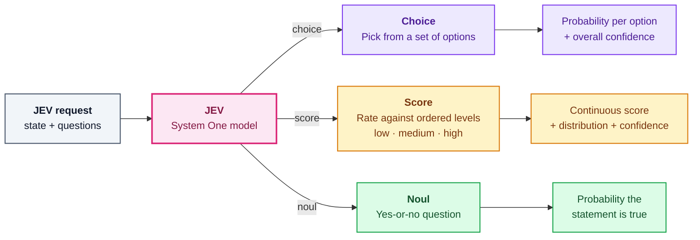
```mermaid
flowchart LR
  accTitle: JEV question types
  accDescr: A JEV request sends a state and questions to the JEV System One model, which answers Choice, Score, and Noul questions in parallel and returns typed answers with probabilities.

  REQ["<b>JEV request</b><br/>state + questions"]
  JEV["<b>JEV</b><br/>System One model"]

  REQ --> JEV

  JEV -->|choice| C["<b>Choice</b><br/>Pick from a set of options"]
  JEV -->|score| S["<b>Score</b><br/>Rate against ordered levels<br/>low · medium · high"]
  JEV -->|noul| N["<b>Noul</b><br/>Yes-or-no question"]

  C --> CO["Probability per option<br/>+ overall confidence"]
  S --> SO["Continuous score<br/>+ distribution + confidence"]
  N --> NO["Probability the<br/>statement is true"]

  classDef req fill:#f1f5f9,stroke:#475569,stroke-width:1.5px,color:#0f172a
  classDef jev fill:#fce7f3,stroke:#db2777,stroke-width:2.5px,color:#831843
  classDef choice fill:#ede9fe,stroke:#7c3aed,stroke-width:1.5px,color:#4c1d95
  classDef score fill:#fef3c7,stroke:#d97706,stroke-width:1.5px,color:#78350f
  classDef noul fill:#dcfce7,stroke:#16a34a,stroke-width:1.5px,color:#14532d

  class REQ req
  class JEV jev
  class C,CO choice
  class S,SO score
  class N,NO noul
```

*JEV question types at a glance: one request carries the state and its questions, and each question type comes back as a typed answer with probabilities.*

### Asking Multiple Questions in One JEV Request

One key feature here is that you can ask **multiple questions about the same state in one request**.

> 💡 System One models evaluate every question in a request in parallel. Adding questions barely changes the response time and costs only the tokens for the extra questions, which are cheap.

For an example of asking multiple questions about a support ticket, see the [TypeSafe Quickstart](https://docs.typesafe.ai/introduction/quickstart).

In sum, unlike traditional LLMs, JEV is constrained by neither text generation nor sequential decision-making.

## JEV Decomposed: The Architecture, Part by Part

### Part 1: System One

JEV is TypeSafe's flagship model and the **first System One model**. Everything else in the JEV architecture builds on this idea, so it's worth pinning down exactly what it means.

Like an LLM, a System One model understands natural-language input. The difference is on the output side: it returns **typed decisions and probabilities**, not generated text.

**Input today is text only.** JEV evaluates strings, JSON objects, and arrays of text. Images, audio, and video are not supported (yet).

#### How a System One Model Differs from an LLM

System One models are trained for **calibrated decisions**: their probabilities are optimized against outcomes so they reflect real uncertainty.

One caveat matters in practice. Calibration is measured across *groups* of predictions — it does not guarantee that any individual answer is correct.

System One models also don't write replies, produce code, or explain their reasoning. Instead, **you define the possible answers** through primitives:

| Primitive | Question | Example answer space | Example output |
|---|---|---|---|
| Choice | Which team should handle this ticket? | billing, technical, or account | `choice: "billing"` |
| Score | How frustrated is this customer? | 0 = calm, 1 = frustrated, 2 = very frustrated | `score: 1.4` |
| Noul | Does this message request a refund? | True or false | `noul: 0.95` |

These are illustrative configurations and values from TypeSafe's docs; the primitive reference pages there list every configuration option and response field.

#### Why It's Called "System One"

The name comes from the concept Daniel Kahneman popularized in *Thinking, Fast and Slow*. **System 1** thinking is fast and intuitive; **System 2** is slower and more deliberate.

JEV is built for the first kind: fast, focused judgments — not long-form deliberation.

#### Fast Judgments Inside a Larger Workflow

A System One model is one component of a larger system, not the whole system. Take a refund request. Your application can:

1. **Build a state** containing the customer's message, the relevant transactions, and the refund policy.
2. **Ask independent questions together:** was a refund requested, does the evidence indicate a duplicate charge, and does the policy support a refund?
3. **Combine the answers with deterministic checks in code**, then route the case for action or review.

Because the outputs are typed and constrained rather than free-form text, your code can inspect and combine them into **predictable workflows**.

And because every answer carries a confidence value, you get a natural decision boundary: act automatically when confidence is high, and escalate to a person or a reasoning model when it isn't.

#### Calling a System One Model

You call a System One model through one of TypeSafe's client SDKs or with `POST /v1/systemone` in the HTTP API.

The `model` field selects which model handles the request. The examples in this post use `jev-latest`, which is also the SDK default; TypeSafe's [Models page](https://docs.typesafe.ai/models) lists the available models, their prices, and their aliases.

The two inputs to every call — the **state** and the **primitives (questions)** — are the next parts of the JEV architecture.

### Part 2: State

**State** is the content you ask a System One model to evaluate. It could be a support message, a passage of text, or the current state of your application.

You pass it in the `state` field of the API request, alongside the questions you want answered.

Three rules govern how JEV treats state:

- **One state per request**, evaluated against one or more questions.
- **Every question sees the same state** and is evaluated independently.
- **Question types can be mixed** — Choice, Score, and Noul can all appear in one request.

#### JEV State Formats: String, Object, or Array

The simplest state is a plain string:

```python
state = "My card was charged twice."
```

State can also be a **JSON object or array** holding related context, examples, and anything else that helps the model answer the questions.

A useful mental model: state is the material you'd hand a panel of experts *before* asking them to make a judgment. In Python, you pass the matching string, dictionary, or list straight to `client.system_one(state=...)`.

| Format | Useful for | Example |
|---|---|---|
| String | A message, article, or passage | `"My card was charged twice."` |
| Object | Named fields, related records, or application state | `{"message": "My card was charged twice.", "order_id": "A-104"}` |
| Array | A sequence of messages or records | `["Hi", "My customer number is TS1337.", "My card was charged twice."]` |

**Default to an object.** Descriptive field names keep each part of the state labeled and the relationships between parts clear. Reach for a plain string only when the use case needs a single piece of text.

#### JEV Input Limits: Text Only, English First

- **Text only.** State must be a string, JSON object, or array of text values. Images, audio, and video are not supported (yet).
- **English first.** JEV's primary training language is English. Other languages, including CJK scripts, are accepted but currently have lower accuracy — TypeSafe's [Models page](https://docs.typesafe.ai/models) has the details.

#### Example: A Support Conversation as State

```json
{
  "ticket": {
    "subject": "Duplicate charge",
    "messages": [
      {"from": "customer", "text": "I was charged twice for order A-104. Please refund the duplicate."},
      {"from": "support", "text": "We are checking the charges."}
    ]
  },
  "order": {
    "id": "A-104",
    "charges": [
      {"amount_usd": 49, "status": "captured"},
      {"amount_usd": 49, "status": "captured"}
    ]
  },
  "refund_policy": "Duplicate charges are eligible for a refund."
}
```

This object is **one state**, even though it holds a conversation, an order, and a policy.

That's deliberate: when a decision requires *comparing* pieces of information — two captured charges against a duplicate-charge policy — those pieces belong together in the same state.

#### State, Expanded: The Unified Evaluation Context of an Agent

The examples so far are single support tickets. In a real agentic system, it helps to think of state more broadly — as the **unified evaluation context** of the whole system at one moment, not as any particular database record.

> **State is the contextual snapshot of an agentic system at a particular point in execution.** It can combine persistent workflow state, short- and long-term memory, retrieved knowledge, tool results, metadata, previous agent outputs, and the current task into a single structured representation that a System One model can evaluate.

##### Building Unified State for Autonomous Agents

An agent's context is scattered across several systems. A **state builder** pulls the relevant pieces together into one snapshot, and that snapshot is what JEV sees:

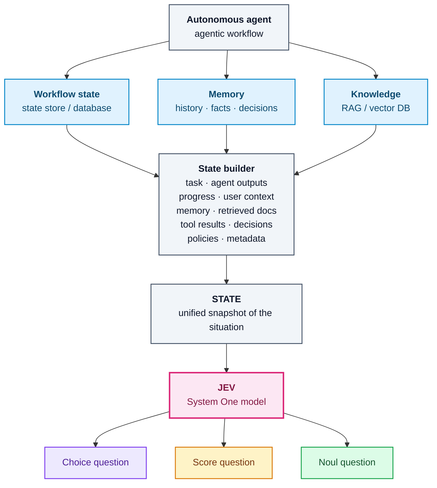
```mermaid
flowchart TD
  accTitle: Building a unified JEV state for an autonomous agent
  accDescr: An autonomous agent's workflow state, memory, and retrieved knowledge feed a state builder, which assembles one unified state that JEV evaluates with Choice, Score, and Noul questions.

  AGENT["<b>Autonomous agent</b><br/>agentic workflow"]

  AGENT --> WF["<b>Workflow state</b><br/>state store / database"]
  AGENT --> MEM["<b>Memory</b><br/>history · facts · decisions"]
  AGENT --> KN["<b>Knowledge</b><br/>RAG / vector DB"]

  WF --> SB
  MEM --> SB
  KN --> SB

  SB["<b>State builder</b><br/>task · agent outputs<br/>progress · user context<br/>memory · retrieved docs<br/>tool results · decisions<br/>policies · metadata"]

  SB --> ST["<b>STATE</b><br/>unified snapshot of the situation"]
  ST --> JEV["<b>JEV</b><br/>System One model"]

  JEV --> C["Choice question"]
  JEV --> S["Score question"]
  JEV --> N["Noul question"]

  classDef req fill:#f1f5f9,stroke:#475569,stroke-width:1.5px,color:#0f172a
  classDef src fill:#e0f2fe,stroke:#0284c7,stroke-width:1.5px,color:#0c4a6e
  classDef jev fill:#fce7f3,stroke:#db2777,stroke-width:2.5px,color:#831843
  classDef choice fill:#ede9fe,stroke:#7c3aed,stroke-width:1.5px,color:#4c1d95
  classDef score fill:#fef3c7,stroke:#d97706,stroke-width:1.5px,color:#78350f
  classDef noul fill:#dcfce7,stroke:#16a34a,stroke-width:1.5px,color:#14532d

  class AGENT,SB,ST req
  class WF,MEM,KN src
  class JEV jev
  class C choice
  class S score
  class N noul
```

*JEV sits after the state builder: it never reads your databases directly, only the unified snapshot you assemble for it.*

For an autonomous research agent, that unified state might look like this:

```json
{
  "task": {
    "goal": "Research the latest developments in LLM inference"
  },
  "workflow": {
    "current_agent": "research_agent",
    "step": 4,
    "completed_steps": ["query_generation", "web_search", "source_collection"]
  },
  "memory": {
    "previous_findings": [
      "PagedAttention reduces KV-cache fragmentation",
      "Disaggregated inference separates prefill and decode"
    ],
    "user_preferences": {"depth": "technical"}
  },
  "retrieved_knowledge": [
    {"source": "paper_A", "content": "...", "similarity": 0.91},
    {"source": "paper_B", "content": "...", "similarity": 0.87}
  ],
  "tool_results": {
    "search_results": ["..."],
    "database_results": ["..."]
  },
  "current_agent_output": {
    "answer": "...",
    "claims": ["..."]
  },
  "metadata": {
    "session_id": "...",
    "timestamp": "...",
    "agent_version": "v2.1"
  }
}
```

##### Where Each Piece of Agent State Comes From

| State component | Typical source |
|---|---|
| Current task | Agent runtime / orchestrator |
| Workflow progress | State store / database |
| Previous agent outputs | Workflow state |
| Long-term memory | Memory system |
| Retrieved documents | Vector DB / search engine |
| Metadata | Vector DB + application DB |
| Tool results | Tool execution layer |
| User/context information | Application state |
| Current agent response | LLM execution |
| Policies/constraints | Configuration / application DB |
| Execution metadata | Agent runtime |

##### Memory Is One Component of State, Not the State Itself

It's tempting to equate the two. Don't:

> **Memory ≠ State.** Memory is *one component* that can be included in state — as long as it's relevant to the judgment you're asking JEV to make.

Memory typically holds history, established facts, and earlier decisions. In a support workflow, it might look like:

```json
{
  "case_history": [
    "Customer reported a duplicate charge on order A-104",
    "Support confirmed both charges were captured",
    "A previous refund request on this account was approved"
  ],
  "established_facts": [
    "Customer is on the Pro plan",
    "Order A-104 was paid by card"
  ],
  "previous_decisions": [
    "Triage classified the ticket as a billing issue"
  ]
}
```

Include it in the state next to the current output, and JEV can judge that output **against the history** rather than in isolation:

```text
Does the current agent's conclusion remain consistent
with the established facts and previous case history?
```

##### Evaluating Multi-Agent Systems in Context

This matters most in **multi-agent systems**. Take a simple pipeline: a Planner, a Researcher, an Analyst, and a Writer.

Evaluating the Writer on the Writer's output alone misses most of what can go wrong. Its evaluation state should carry the upstream work too:

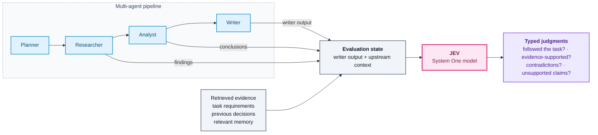
```mermaid
flowchart LR
  accTitle: Evaluating a multi-agent pipeline in context with JEV
  accDescr: A Planner, Researcher, Analyst, and Writer pipeline. The writer's output is combined with the researcher's findings, the analyst's conclusions, retrieved evidence, task requirements, previous decisions, and memory into one evaluation state that JEV evaluates.

  subgraph PIPE["Multi-agent pipeline"]
    direction TB
    P["Planner"] --> R["Researcher"] --> A["Analyst"] --> W["Writer"]
  end

  W -->|writer output| ES
  R -->|findings| ES
  A -->|conclusions| ES
  CTX["Retrieved evidence<br/>task requirements<br/>previous decisions<br/>relevant memory"] --> ES

  ES["<b>Evaluation state</b><br/>writer output + upstream context"] --> JEV["<b>JEV</b><br/>System One model"]
  JEV --> Q["<b>Typed judgments</b><br/>followed the task? · evidence-supported?<br/>contradictions? · unsupported claims?"]

  classDef req fill:#f1f5f9,stroke:#475569,stroke-width:1.5px,color:#0f172a
  classDef src fill:#e0f2fe,stroke:#0284c7,stroke-width:1.5px,color:#0c4a6e
  classDef jev fill:#fce7f3,stroke:#db2777,stroke-width:2.5px,color:#831843
  classDef choice fill:#ede9fe,stroke:#7c3aed,stroke-width:1.5px,color:#4c1d95

  style PIPE fill:#f8fafc,stroke:#94a3b8,stroke-dasharray:4 3,color:#334155
  class P,R,A,W src
  class CTX,ES req
  class JEV jev
  class Q choice
```

*JEV evaluates the Writer's behavior in context: its output is judged against everything the upstream agents produced.*

With that state, JEV can answer questions like:

- Did the agent follow the task requirements?
- Is the output supported by the retrieved evidence?
- Did the agent contradict an earlier established fact?
- Did it preserve information from previous agents?
- Did it introduce unsupported claims?
- Did it make an appropriate decision given the available state?
- Did the agent successfully complete its assigned role?

The architectural principle:

> **An agent's output should rarely be evaluated in isolation.** In autonomous and multi-agent systems, the meaningful unit of evaluation is the agent's output *together with* the relevant state that existed when it was produced.

##### Workflow State vs. JEV State: Where JEV Fits in an Agent DAG

Most agentic systems already persist a **workflow state** — a record in a state store or database, updated as each node in the DAG runs:

```json
{
  "run_id": "123",
  "documents": ["..."],
  "classification": {"...": "..."},
  "extracted_facts": ["..."],
  "issues": ["..."],
  "previous_agent_outputs": ["..."],
  "current_node": "analysis",
  "draft": "...",
  "citations": ["..."]
}
```

That record *could* become the JEV state, but you usually wouldn't send it wholesale. Instead, you **construct an evaluation state** from the parts relevant to the judgment:

```python
jev_state = {
    "task": task_requirements,
    "evidence": {
        "facts": extracted_facts,
        "documents": relevant_documents,
        "issues": issues,
    },
    "agent_output": current_agent_output,
    "previous_analysis": previous_agent_outputs,
    "memory": relevant_memory,
    "policies": relevant_policies,
}
```

The questions then define what System One should judge about it:

- Is the analysis supported by the evidence?
- Are there unsupported claims?
- Are the citations relevant?
- Does the conclusion follow from the facts?

That gives you **three distinct layers** to keep separate when designing a JEV integration:

| Your system | JEV concept |
|---|---|
| Workflow state in your database | Persistent application/workflow state — the **source of truth** |
| Evaluation state constructed from it | **JEV `state`** — a snapshot for one specific evaluation |
| Evaluation criteria | **JEV questions** |

You also don't need to persist a JEV state after every agent runs. Save the **evaluation result**, and rebuild the state when you need it. JEV slots in between agent steps like this:

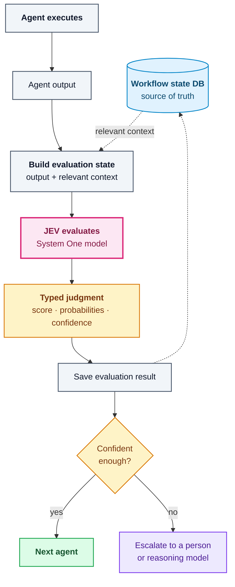
```mermaid
flowchart TD
  accTitle: Where JEV fits in an agent DAG
  accDescr: After an agent executes, its output and relevant context from the workflow state database are built into an evaluation state. JEV evaluates it, and the typed judgment is saved. High-confidence results proceed to the next agent, while low-confidence results escalate to a person or reasoning model.

  DB[("<b>Workflow state DB</b><br/>source of truth")]

  AG["<b>Agent executes</b>"] --> OUT["Agent output"]
  OUT --> BUILD["<b>Build evaluation state</b><br/>output + relevant context"]
  DB -. relevant context .-> BUILD

  BUILD --> JEV["<b>JEV evaluates</b><br/>System One model"]
  JEV --> RES["<b>Typed judgment</b><br/>score · probabilities · confidence"]
  RES --> SAVE["Save evaluation result"]
  SAVE -.-> DB

  SAVE --> GATE{"Confident<br/>enough?"}
  GATE -->|yes| NEXT["<b>Next agent</b>"]
  GATE -->|no| ESC["Escalate to a person<br/>or reasoning model"]

  classDef req fill:#f1f5f9,stroke:#475569,stroke-width:1.5px,color:#0f172a
  classDef src fill:#e0f2fe,stroke:#0284c7,stroke-width:1.5px,color:#0c4a6e
  classDef jev fill:#fce7f3,stroke:#db2777,stroke-width:2.5px,color:#831843
  classDef score fill:#fef3c7,stroke:#d97706,stroke-width:1.5px,color:#78350f
  classDef noul fill:#dcfce7,stroke:#16a34a,stroke-width:1.5px,color:#14532d
  classDef choice fill:#ede9fe,stroke:#7c3aed,stroke-width:1.5px,color:#4c1d95

  class AG,OUT,BUILD,SAVE req
  class DB src
  class JEV jev
  class RES,GATE score
  class NEXT noul
  class ESC choice
```

*JEV sits between agent steps as a fast evaluation gate: the database stays the source of truth, while the JEV state is a disposable snapshot built for one judgment.*

The distinction to carry into your design: **your database state is the source of truth; JEV state is the snapshot of context presented to System One for a specific evaluation.**

#### Separate Content from Questions

The cleanest JEV designs keep a hard line between the two inputs:

- **State** holds the content and supporting facts.
- **Questions** define the judgments the model should make about that material.

In the refund example, the refund request and the policy live in the state. The questions then ask whether the customer requested a refund, and whether the policy supports it.

How to write those questions — instructions, criteria, and question types — is the next part of the JEV architecture. For the full request schema and SDK details (installation, typed inputs, response handling), see TypeSafe's [API reference](https://docs.typesafe.ai/api) and [client SDK docs](https://docs.typesafe.ai/sdk).

### Part 3: Primitives (Questions)

If state is *what* JEV looks at, **primitives** are *how you ask*. They're the small, typed building blocks you compose in code, and they come in pairs:

- A **question** defines one judgment for the System One model to make about a state.
- Its **answer** is the typed value that comes back.

Your code composes the answers into decisions. Each of the three question types returns a different shape of answer:

| Type | What it answers | Returns |
|---|---|---|
| [Choice](https://docs.typesafe.ai/primitives/choice) | Which of these options? | `choice`, `probabilities`, `confidence` |
| [Score](https://docs.typesafe.ai/primitives/score) | Which level? | `score`, `legend`, `probabilities`, `confidence` |
| [Noul](https://docs.typesafe.ai/primitives/noul) | Is this true? | `noul` (0 to 1) |

Every question in a request sees the same state, is evaluated independently, and returns its typed answer under the ID you chose.

#### Ask for One Snap Judgment per Question

This is the single most important design rule for JEV questions. Ask for a judgment **a knowledgeable person could make in a second**, given the right context.

- ✅ "Does this message convey urgency?"
- ❌ "Analyze this message and determine the best course of action."

The second one needs slow reasoning — System 2 work. When you catch yourself writing a question like that, it's the signal to **break the task into small questions and compose the answers in code**.

The same goes for judgments that depend on several independent factors. Don't ask JEV to "rate this startup pitch". Ask about market size, technical feasibility, and differentiation separately, then weight them in code.

When priorities shift, you change a weight — not a prompt.

#### Anatomy of a JEV Question

Every question has three required parts, plus one that depends on the type:

- **ID** — the key you pick, such as `refund_requested`. It identifies the answer in the response.
- **`type`** — one of `choice`, `score`, or `noul`.
- **`instructions`** — the question you're asking about the state. This is where your evaluation logic lives. Write it as a clear, specific question, or as a statement for the model to judge. A string is enough for most questions; it can also be an object or array that puts the question in one field and the data it refers to in others.
- **`criteria`** — the possible answers. A map of options for Choice, an ordered list of levels for Score, and an *optional* clarification of what yes and no mean for Noul.

Here's a minimal Noul question in the Python SDK:

```python
from typesafe_sdk import Noul

questions = {
    "refund_requested": Noul(
        instructions="Does the customer request a refund?",
    ),
}
```

> ⚠️ **Question IDs are never sent to the model.** They exist for your code. Always write the complete question in `instructions`, even when the ID looks self-explanatory.

#### How to Choose a JEV Question Type

Pick the type that matches the **shape of the answer** you need:

- **Choice** — the answer is one of a known set of options with **no order** between them: routing a ticket to a department, classifying a document type, detecting a programming language. List every option, and add an `other` or `none of the above` option if the list might not cover every input.
- **Score** — the answer falls on a **spectrum** and you can describe each point on it: bug severity, customer frustration, skill level. You define the levels; the model returns a position along them.
- **Noul** — a clean **yes/no** question where the probability itself is the useful signal: does this message contain personally identifiable information, is the customer requesting a refund, does the resume mention distributed systems.

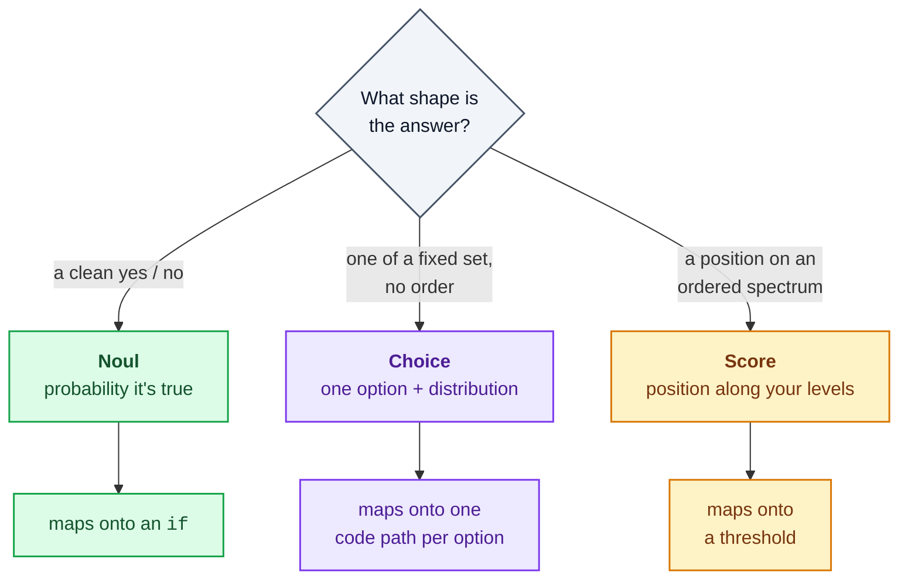
```mermaid
flowchart TD
  accTitle: How to choose a JEV question type
  accDescr: A decision flow for picking a JEV primitive. A clean yes-or-no question maps to Noul and an if statement. One of a fixed set of unordered options maps to Choice and a code path per option. A position on an ordered spectrum maps to Score and a threshold.

  Q{"What shape is<br/>the answer?"}

  Q -->|"a clean yes / no"| N["<b>Noul</b><br/>probability it's true"]
  Q -->|"one of a fixed set,<br/>no order"| C["<b>Choice</b><br/>one option + distribution"]
  Q -->|"a position on an<br/>ordered spectrum"| S["<b>Score</b><br/>position along your levels"]

  N --> NC["maps onto an <code>if</code>"]
  C --> CC["maps onto one<br/>code path per option"]
  S --> SC["maps onto<br/>a threshold"]

  classDef req fill:#f1f5f9,stroke:#475569,stroke-width:1.5px,color:#0f172a
  classDef choice fill:#ede9fe,stroke:#7c3aed,stroke-width:1.5px,color:#4c1d95
  classDef score fill:#fef3c7,stroke:#d97706,stroke-width:1.5px,color:#78350f
  classDef noul fill:#dcfce7,stroke:#16a34a,stroke-width:1.5px,color:#14532d

  class Q req
  class C,CC choice
  class S,SC score
  class N,NC noul
```

*Choosing a JEV primitive: match the shape of the answer, and prefer the type your code can act on directly.*

The tie-breaker when two types both seem to fit: **prefer the one your code can act on directly.** A Choice between `refund`, `rebook`, and `information` maps straight onto three code paths. A frustration Score maps onto a threshold. A Noul maps onto an `if`.

##### The Noul vs. Score Trap

The most common mistake is using a Noul where you need a Score.

Take "Is this candidate strong in Python?". A Noul of **0.5** doesn't mean the candidate has *medium* skill — it means the model gives yes and no **equal probability**. Without a clear definition of "strong", that number is hard to interpret.

- To **measure** skill, use a Score with defined levels: no experience, some familiarity, daily use, deep expertise.
- To **decide** yes/no, define the condition precisely: "Does the resume state that the candidate has used Python at work?"

#### What Comes Back: Typed, Composable Answers

Answers are primitives too. Your code can compare, threshold, sort, or pass them into further logic — or put them into the state of a follow-up request.

| Type | Answer fields | How to read it |
|---|---|---|
| Choice | `choice`, `probabilities`, `confidence` | `choice` is the selected option. `probabilities` is the distribution across every option. `confidence` summarizes how peaked that distribution is. |
| Score | `score`, `legend`, `probabilities`, `confidence` | `score` is a position along your levels and can fall *between* two of them. `legend` repeats the levels by number. `probabilities` is the distribution across levels. |
| Noul | `noul` | The probability the answer is yes. Near 1 is a strong yes, near 0 a strong no, near 0.5 uncertain. No separate `confidence`. |

Two properties make these answers composable:

1. **Every answer is constrained to the options you supplied.** The model returns a distribution over *your* options or levels, never a value outside them. Your code never has to parse a value out of generated prose.
2. **Every answer is independent.** One answer is never hidden context for another, so you can add or remove questions without changing the other results.

#### Reference Specific Fields in a Structured State

When state is a JSON object with several parts, point each question at the part it's about. Name it in `instructions` with a **dot-and-index path, backticks included**.

Using the support conversation from Part 2:

```python
questions = {
    "refund_requested": {
        "type": "noul",
        "instructions": "Does `ticket.messages[0].text` request a refund?",
    },
    "policy_supports_refund": {
        "type": "noul",
        "instructions": (
            "Does `refund_policy` support the refund requested "
            "in `ticket.messages[0].text`, given `order.charges`?"
        ),
    },
}
```

Explicit paths remove any doubt about which parts of the state should inform each judgment.

#### Ask Multiple Questions Together

Send **every question that uses the same state in one request**, mixing types freely. Because questions run in parallel, adding one barely changes latency and costs only its own tokens — asking a question you *might* not need is close to free.

This request classifies a customer message, checks urgency, and scores frustration in one call:

```json
{
  "state": "Our API integration started returning 500 errors on every request about 20 minutes ago, and we can't process any customer orders until this is fixed.",
  "questions": {
    "department": {
      "type": "choice",
      "instructions": "Which team should handle this",
      "criteria": {
        "billing": "Payment or subscription issues",
        "technical": "Bugs or integration problems",
        "sales": "Pricing or account questions"
      }
    },
    "is_urgent": {
      "type": "noul",
      "instructions": "The message conveys urgency or time-sensitivity"
    },
    "frustration": {
      "type": "score",
      "instructions": "How frustrated the customer appears",
      "criteria": [
        "Calm, just stating facts",
        "Frustrated but civil",
        "Very angry, strong language"
      ]
    }
  }
}
```

The same pattern with the [Python SDK](https://docs.typesafe.ai/sdk), where `Choice`, `Noul`, and `Score` objects give you typed questions and typed answers:

```python
from typesafe_sdk import Choice, Noul, Score, TypeSafeClient

state = {
    "ticket_message": "My flight was cancelled. Can I get a refund?",
    "refund_policy": "Cancelled flights are eligible for a full refund.",
}

with TypeSafeClient() as client:
    response = client.system_one(
        state=state,
        questions={
            "refund_requested": Noul(
                instructions="Does `ticket_message` request a refund?",
            ),
            "request_type": Choice(
                instructions="What is the main request in `ticket_message`?",
                criteria={
                    "refund": "The customer wants money returned.",
                    "rebooking": "The customer wants a replacement flight.",
                    "information": "The customer is asking for information only.",
                },
            ),
            "frustration": Score(
                instructions="How frustrated does the customer appear in `ticket_message`?",
                criteria=[
                    "Calm and neutral.",
                    "Concerned but civil.",
                    "Very angry or using strong language.",
                ],
            ),
        },
    )

print(response.answers["refund_requested"].noul)
print(response.answers["request_type"].choice)
print(response.answers["frustration"].score)
```

##### Ask Speculative Questions (Speculative Fan-Out)

Go one step further: ask **every question your code might need**, including ones that only matter for some inputs, and let the code decide which answers to use. If the ticket turns out not to be a bug report, just ignore the severity answer.

TypeSafe calls this the [Speculative fan-out](https://docs.typesafe.ai/patterns/fan-out) pattern. Their [Parallel questions cookbook](https://docs.typesafe.ai/cookbooks/parallel_questions) reports that batching 13 questions into one call is **12.2x cheaper and 10.0x faster** than 13 separate calls, with no change in the answers.

A practical note: coding agents fall into the one-question-per-call habit even more than people do. TypeSafe ships an [agent skill](https://docs.typesafe.ai/agent-skill#installation) that nudges your coding agent to batch questions instead.

##### Split a Complex Judgment into Several Questions (Composite Scoring)

A judgment that depends on several things is best split into **one question per thing**, with the answers combined in code using weights you own.

Ticket priority, for example, might combine three Score questions: how severe the bug is, how frustrated the customer is, and how much the report gives an engineer to work with. When the combined result doesn't match what your team would decide, you adjust the weights and run again.

Because the questions run in parallel, the split costs a few extra question tokens and almost no latency. TypeSafe calls this the [Composite scoring](https://docs.typesafe.ai/patterns/composite-scoring) pattern.

##### When One Question Depends on Another

Questions in one request can't see each other's answers. If a later judgment truly depends on an earlier answer, make a **second request** from code.

The dependency is real only when your code *can't build* the second request without the first answer — because it needs that answer to:

- fetch more data for the state,
- decide what the state is made of, or
- pick the next question's options.

Otherwise, ask everything up front and let the code ignore what it doesn't need. Two requests are the exception, not the rule. TypeSafe's cookbooks show three legitimate cases:

- [Skill suggestion](https://docs.typesafe.ai/cookbooks/skill_suggestion) — ranks 182 skills in one request, then fetches the full text of the top three and judges them again against that better evidence.
- [Structure recovery](https://docs.typesafe.ai/cookbooks/autoformat) — asks whether each line break split a sentence, merges lines into blocks from those answers, then classifies blocks that didn't exist until the first request answered.
- [Hierarchical classification](https://docs.typesafe.ai/cookbooks/hierarchical_classification) — uses each Choice answer to decide which options the next request offers.

Every Choice and Score answer above carries a `confidence` value. That value is what turns JEV from a classifier into something you can safely build control flow on — which is the next part.

### Part 4: Confidence

Every Choice and Score answer includes `probabilities`: the distribution across your options (Choice) or levels (Score). The **shape** of that distribution tells you how certain the model is:

- **Concentrated on one outcome** → a confident answer.
- **Spread out** → an uncertain one.

The `confidence` field collapses that shape into a single number from **0 to 1**, so you can threshold on it directly. It's 1 when all the probability sits on one outcome and 0 when it's spread evenly. Noul answers don't carry one — more on that below.

#### Confidence Is Derived from the Probabilities

`confidence` isn't a separate prediction. It's a **statistic computed from the distribution the answer already gives you**, returned on every Choice and Score answer so the common case needs no math on your side.

A flatter distribution means lower confidence, and it usually means something specific:

- **Low confidence on a Choice** → none of the options is a clear winner.
- **Low confidence on a Score** → the levels are ambiguous or multi-dimensional, or the state doesn't contain enough to go on.

#### Why "I Don't Know" Is a Useful Signal

If an intelligent system — human or machine — can't express honest uncertainty, it can't be trusted.

Confidence is JEV's built-in way of saying *"I'm not sure about this one."* That lets your code behave differently at different levels of certainty, which is the foundation of systems you can actually rely on.

#### Three Paths for Using Confidence in Code

A good starting pattern splits confidence into three ranges, each with its own behavior:

- **High confidence → act automatically.** The model has a clear read; proceed without a human.
- **Medium confidence → proceed with caution.** Ask the user to confirm, flag for review, or gather more information first.
- **Low confidence → don't act.** Route to a human, ask for clarification, or fall back to another system.

#### Confidence Thresholds Scale with Risk

A threshold isn't one number. **Different actions in the same system deserve different gates**, depending on what it costs to get them wrong:

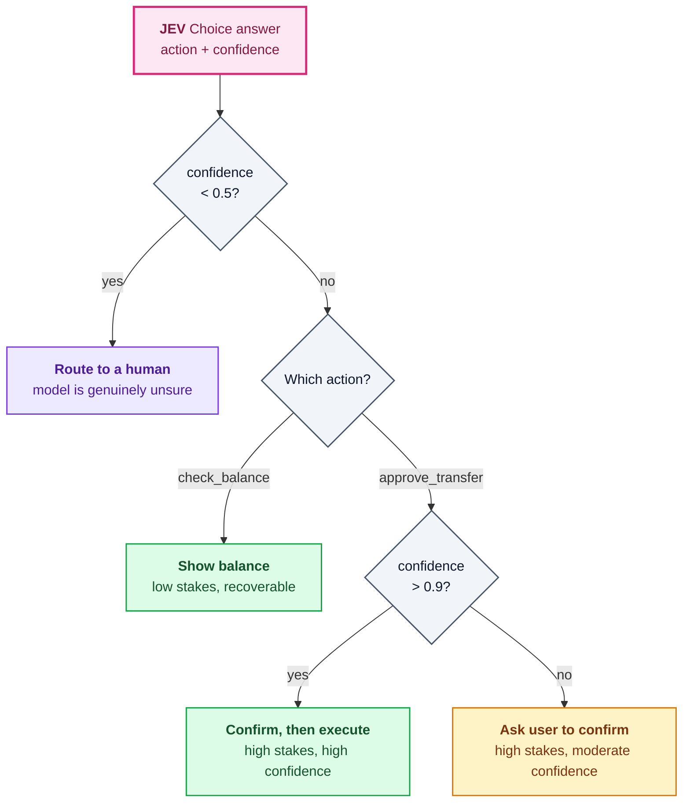
```mermaid
flowchart TD
  accTitle: Risk-scaled confidence thresholds with JEV
  accDescr: A JEV Choice answer is checked against a 0.5 confidence floor and routed to a human below it. Above it, a low-stakes check balance action runs directly, while a high-stakes approve transfer action runs with confirmation above 0.9 confidence and asks the user to verify otherwise.

  JEV["<b>JEV</b> Choice answer<br/>action + confidence"] --> FLOOR{"confidence<br/>&lt; 0.5?"}

  FLOOR -->|yes| HUMAN["<b>Route to a human</b><br/>model is genuinely unsure"]
  FLOOR -->|no| ACT{"Which action?"}

  ACT -->|check_balance| LOW["<b>Show balance</b><br/>low stakes, recoverable"]
  ACT -->|approve_transfer| HIGH{"confidence<br/>&gt; 0.9?"}

  HIGH -->|yes| EXEC["<b>Confirm, then execute</b><br/>high stakes, high confidence"]
  HIGH -->|no| VERIFY["<b>Ask user to confirm</b><br/>high stakes, moderate confidence"]

  classDef req fill:#f1f5f9,stroke:#475569,stroke-width:1.5px,color:#0f172a
  classDef jev fill:#fce7f3,stroke:#db2777,stroke-width:2.5px,color:#831843
  classDef choice fill:#ede9fe,stroke:#7c3aed,stroke-width:1.5px,color:#4c1d95
  classDef score fill:#fef3c7,stroke:#d97706,stroke-width:1.5px,color:#78350f
  classDef noul fill:#dcfce7,stroke:#16a34a,stroke-width:1.5px,color:#14532d

  class JEV jev
  class FLOOR,ACT,HIGH req
  class HUMAN choice
  class VERIFY score
  class LOW,EXEC noul
```

*Risk-scaled gating: one confidence floor for everything, and a stricter bar for the destructive action.*

The same logic in code:

```python
response = client.system_one(
    state=user_message,
    questions={
        "action": Choice(
            instructions="What is the user trying to do?",
            criteria={
                "check_balance": "View account balance",
                "approve_transfer": "Approve the pending withdrawal request",
                "support": "Get help with an issue",
            },
        ),
    },
)

action = response.answers["action"]
confidence = action.confidence

if confidence < 0.5:
    # Model is genuinely unsure. Don't guess.
    route_to_human(user_message)

elif action.choice == "check_balance":
    # Low stakes. Showing the wrong screen is recoverable.
    show_balance(account_id)

elif action.choice == "approve_transfer":
    if confidence > 0.9:
        # High stakes, high confidence. Proceed with confirmation.
        confirm_then_execute(account_id)
    else:
        # High stakes, moderate confidence. Verify first.
        ask_user_to_confirm(account_id)
```

The 0.5 floor catches anything the model reports as genuinely uncertain. Above it, the bar for acting without confirmation is higher for a destructive operation than for a read-only one. **Your code encodes the risk tolerance**, not the model.

> 💡 The right threshold values depend on your domain and on how the model performs for your use case. Start conservative, test on your own data, and adjust as you observe results.

#### How JEV Confidence Is Calculated

Each question type summarizes its distribution a little differently, because the outcomes have different structure: a Noul has two, a Choice has any number in no order, and a Score's levels are ordered. Each formula builds on the previous one.

TypeSafe's `confidence` is *one reasonable summary*, not the only one. It's a fixed default so you can gate on the same 0–1 scale from your first call. Because every answer also returns its full `probabilities`, you can always compute a different measure if your application needs one.

##### Noul Confidence

A Noul is a single probability $p$ that the answer is yes, and it has **no separate `confidence`**. The probability already carries the uncertainty: a value near 0.5 *is* the model saying it's unsure.

If you want a confidence-style number anyway — say, to gate Nouls and Choices with the same code — use the distance from 0.5:

$$
\text{confidence} = \lvert 2p - 1 \rvert
$$

That's 0 at $p = 0.5$ and 1 at $p = 0$ or $p = 1$. It's also exactly the Choice formula below applied to a two-option Choice, so it sits on the same scale.

##### Choice Confidence

For a Choice with $n$ options, where $p_{\max}$ is the probability of the selected option:

$$
\text{confidence} = \frac{p_{\max} - \frac{1}{n}}{1 - \frac{1}{n}}
$$

It measures how far the top probability sits above an even split of $1/n$ per option, rescaled so the even split is 0 and certainty is 1.

Only the top probability counts. So $(0.6, 0.3, 0.1)$ and $(0.6, 0.2, 0.2)$ both have confidence **0.4**.

```python
def choice_confidence(probabilities: list[float]) -> float:
    n = len(probabilities)
    return (max(probabilities) - 1 / n) / (1 - 1 / n)


choice_confidence(list(answer.probabilities.values()))
```

Two simpler measures from the same `probabilities` often work very well in practice, and are worth trying alongside `confidence`:

- **Top probability** — how likely the selected option is. Easy to reason about, but its meaning depends on the number of options: 0.5 is weak among two options and strong among ten, so set its threshold per question.
- **Top-to-second ratio** — how clearly the winner beats the runner-up, ignoring how the rest is spread. Many real decisions come down to the top two candidates, and this targets exactly that.

##### Score Confidence

A Score's levels are ordered, so its formula also accounts for **how far** probability sits from the most likely level. For $n$ levels numbered $0$ to $n - 1$, where $p_i$ is the probability of level $i$ and $m$ is the most likely level:

$$
\text{confidence} = \max\left(0,\ 1 - \frac{\sum_i p_i \, \lvert i - m \rvert}{\text{MAD}_{\text{unif}}}\right)
\qquad
\text{MAD}_{\text{unif}} = \frac{1}{n} \sum_i \left\lvert i - \frac{n - 1}{2} \right\rvert
$$

- The **numerator** is the probability-weighted average distance, in levels, between the answer and the most likely level.
- **MAD (unif)** is the same kind of average distance for an even spread across all levels, measured from the middle level.
- Confidence compares the two, floored at 0 when the answer is at least as spread out as an even spread.

The payoff: probability on a **neighboring** level costs less confidence than the same probability on a distant one. That's exactly what the Choice formula can't see:

| Score probabilities (3 levels) | What the model is doing | Score confidence | Choice formula |
|---|---|---|---|
| (0, 0.5, 0.5) | Torn between two **adjacent** levels | 0.25 | 0.25 |
| (0.5, 0, 0.5) | Torn between **opposite ends** | 0 | 0.25 |

```python
def score_confidence(probabilities: list[float]) -> float:
    n = len(probabilities)
    m = probabilities.index(max(probabilities))
    spread = sum(p * abs(i - m) for i, p in enumerate(probabilities))
    even_spread = sum(abs(i - (n - 1) / 2) for i in range(n)) / n
    return max(0.0, 1 - spread / even_spread)


levels = sorted(answer.probabilities)
score_confidence([answer.probabilities[level] for level in levels])
```

**Worked example.** The `bug_severity` answer in TypeSafe's [Score response example](https://docs.typesafe.ai/primitives/score#response-structure) has probabilities $(0, 0.57, 0.43)$. The most likely level is 1, the weighted spread is $0.43$, and the even-spread average for three levels is $2/3$. So:

$$
\text{confidence} = 1 - \frac{0.43}{2/3} \approx 0.35
$$

The model leans toward level 1 but is split with its neighbor. Under the 0.5 floor from the gating example above, this answer would be routed to a human rather than acted on automatically.

## How to Use JEV with LangChain, LangGraph, and Langfuse

With the four parts in place — System One, state, primitives, and confidence — the practical question is where JEV goes in a real agent stack.

The short answer: JEV is **not another model provider** you swap in for your LLM. It's a **decision model**, and in a LangChain/LangGraph/Langfuse stack each tool has a distinct job:

- **LangGraph** orchestrates the workflow.
- **LangChain** provides the integration layer for invoking JEV.
- **JEV** makes fast, typed decisions over the workflow state.
- **Langfuse** observes and evaluates those decisions in the context of complete agent traces.

Keeping those roles separate is what makes the architecture clean.

> ⚠️ **API stability note.** The LangChain integration (`langchain-typesafe`) is at an early alpha release (`0.0.1a3` at the time of writing). The code below reflects its current API and is illustrative — treat names and signatures as subject to change, and check the package docs before building on it.

### How to Use JEV with LangChain

LangChain is a natural integration point because JEV isn't meant to replace the model that generates an agent's response. It acts as a **decision layer around the agent**.

A conventional LLM answers with prose: *"Here is the response to the user…"*. JEV answers bounded questions:

- Which route should this request take?
- Is this tool call risky?
- Is the task complete?
- Does this output satisfy the required criteria?
- Should this request be escalated?
- Does the current state satisfy a particular condition?

#### TypeSafeClassifier: JEV as a LangChain Runnable

LangChain exposes JEV through **`TypeSafeClassifier`**, which behaves as a standard LangChain `Runnable`. You pass a **state and one or more typed questions** to `.invoke()`, and you get structured decision results back — not generated text.

```python
from langchain_typesafe import Noul, TypeSafeClassifier

classifier = TypeSafeClassifier()

response = classifier.invoke({
    "state": (
        "The deploy failed twice and customers are seeing 500s. "
        "Can someone look now?"
    ),
    "questions": {
        "urgent": Noul(
            instructions="Does this need attention right now?"
        ),
    },
})

urgency = response.nouls["urgent"].noul
print(urgency)
```

Two details worth knowing:

- **Both `state` and `questions` go into the `invoke()` input.** Keeping the complete request in the Runnable input is what makes it visible to LangChain composition, batching, callbacks, and tracing. Use `ainvoke()` in async code.
- **State can be a string, structured JSON, or LangChain message objects.** `HumanMessage`/`SystemMessage` objects can sit at the root of the state or anywhere inside it; the integration converts them to `role`/`content` objects and preserves the surrounding data.

#### The LLM Generates, JEV Decides

The architectural distinction: the LLM stays responsible for **generation and reasoning**, while JEV handles **narrow, typed decisions**.

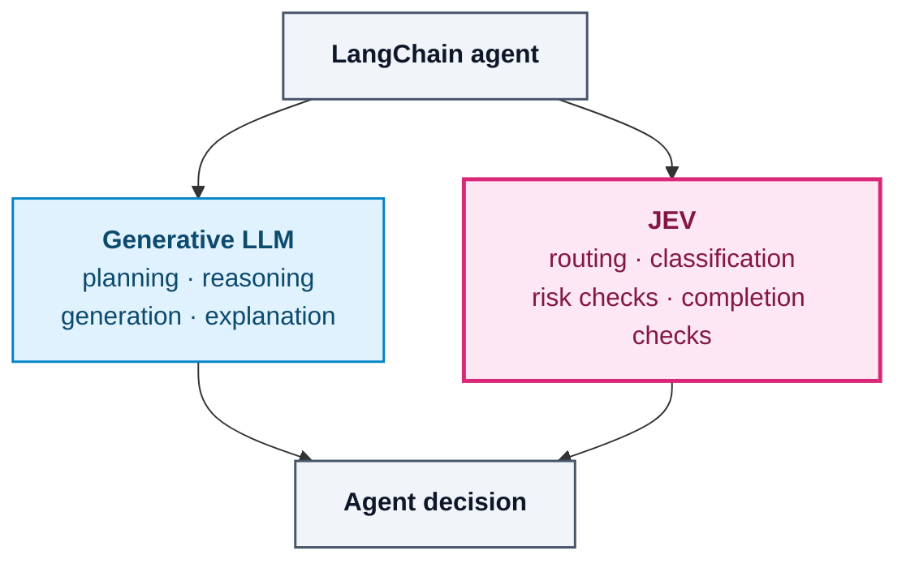
```mermaid
flowchart TD
  accTitle: Generative LLM and JEV roles inside a LangChain agent
  accDescr: A LangChain agent uses a generative LLM for planning, reasoning, generation, and explanation, and uses JEV for routing, classification, risk checks, and completion checks. Both feed into the agent's decision.

  AGENT["<b>LangChain agent</b>"]

  AGENT --> LLM["<b>Generative LLM</b><br/>planning · reasoning<br/>generation · explanation"]
  AGENT --> JEV["<b>JEV</b><br/>routing · classification<br/>risk checks · completion checks"]

  LLM --> DEC["<b>Agent decision</b>"]
  JEV --> DEC

  classDef req fill:#f1f5f9,stroke:#475569,stroke-width:1.5px,color:#0f172a
  classDef src fill:#e0f2fe,stroke:#0284c7,stroke-width:1.5px,color:#0c4a6e
  classDef jev fill:#fce7f3,stroke:#db2777,stroke-width:2.5px,color:#831843

  class AGENT,DEC req
  class LLM src
  class JEV jev
```

*Two models, two jobs: the LLM writes and reasons, JEV makes the bounded calls at the agent's control points.*

That's why JEV is most useful at **control points inside an agent**, not as the agent's primary language model.

#### Experimental: JEV Middleware for LangChain Agents

The package also ships **experimental** agent middleware (under `langchain_typesafe.experimental`, installed with the `[experimental]` extra) that packages two of those control points:

- **`ModelRouterMiddleware`** — uses a Choice question to route an agent run to the cheapest model suited to the task, keeping the full answer (probabilities and confidence) in agent state.
- **`AutoModeMiddleware`** — classifies calls to tools you configure and **blocks risky calls before they execute**, using a Noul with your own definition of risky vs. safe.

The package marks these APIs as liable to change without notice, so treat them as a preview of the pattern rather than a stable interface.

### Using JEV Inside LangGraph

The same pattern carries over to **LangGraph**. A LangGraph workflow already maintains a shared state that flows between nodes, so a JEV evaluation becomes **just another node** in the graph.

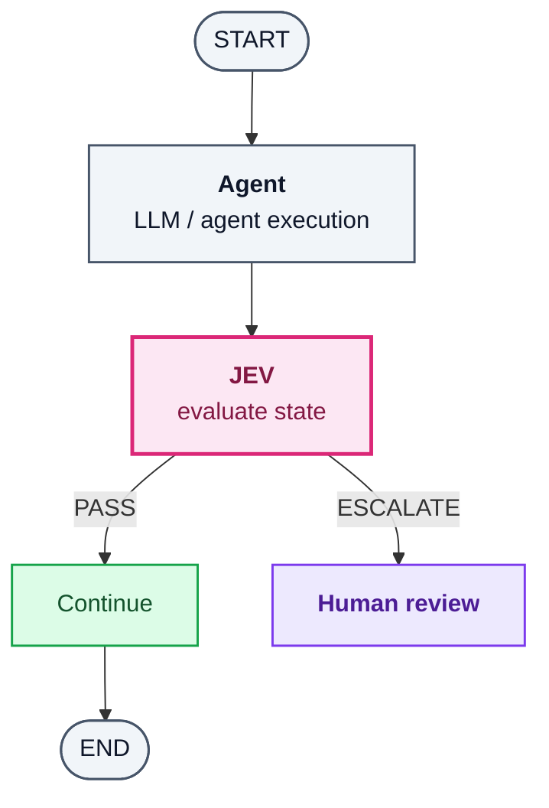
```mermaid
flowchart TD
  accTitle: JEV as an evaluation node in a LangGraph workflow
  accDescr: A LangGraph workflow runs from START to an agent node, then to a JEV evaluate-state node. On pass the graph continues to END; on escalate it routes to human review.

  START(["START"]) --> AGENT["<b>Agent</b><br/>LLM / agent execution"]
  AGENT --> JEV["<b>JEV</b><br/>evaluate state"]
  JEV -->|PASS| CONT["Continue"]
  JEV -->|ESCALATE| HUMAN["<b>Human review</b>"]
  CONT --> FIN(["END"])

  classDef req fill:#f1f5f9,stroke:#475569,stroke-width:1.5px,color:#0f172a
  classDef jev fill:#fce7f3,stroke:#db2777,stroke-width:2.5px,color:#831843
  classDef choice fill:#ede9fe,stroke:#7c3aed,stroke-width:1.5px,color:#4c1d95
  classDef noul fill:#dcfce7,stroke:#16a34a,stroke-width:1.5px,color:#14532d

  class START,FIN,AGENT req
  class JEV jev
  class CONT noul
  class HUMAN choice
```

*JEV as a LangGraph node: its typed answer picks which conditional edge the graph follows.*

Because `TypeSafeClassifier` is a Runnable, you call it from inside a node and use its result to choose a **conditional edge**. No separate JEV-specific LangGraph API is needed.

#### A LangGraph + JEV Example

A simplified implementation:

```python
from typing import TypedDict

from langgraph.graph import StateGraph, START, END
from langchain_typesafe import Noul, TypeSafeClassifier


class AgentState(TypedDict):
    task: str
    agent_output: str
    jev_result: float


classifier = TypeSafeClassifier()


def agent_node(state: AgentState):
    # Your normal LLM/agent execution happens here.
    output = "The requested operation has been completed."
    return {"agent_output": output}


def evaluate_node(state: AgentState):
    evaluation_state = {
        "task": state["task"],
        "agent_output": state["agent_output"],
    }
    response = classifier.invoke({
        "state": evaluation_state,
        "questions": {
            "complete": Noul(
                instructions="Is `agent_output` sufficient to complete `task`?"
            ),
        },
    })
    return {"jev_result": response.nouls["complete"].noul}


def human_review_node(state: AgentState):
    # Hand the run to a review queue.
    return {}


def route_after_evaluation(state: AgentState) -> str:
    # Illustrative threshold; tune it on your own data.
    return "continue" if state["jev_result"] >= 0.8 else "escalate"


graph = StateGraph(AgentState)
graph.add_node("agent", agent_node)
graph.add_node("evaluate", evaluate_node)
graph.add_node("human_review", human_review_node)

graph.add_edge(START, "agent")
graph.add_edge("agent", "evaluate")
graph.add_conditional_edges(
    "evaluate",
    route_after_evaluation,
    {"continue": END, "escalate": "human_review"},
)
graph.add_edge("human_review", END)

app = graph.compile()
```

Notice that `evaluate_node` doesn't pass the whole graph state to JEV. It **builds an evaluation state** from the relevant fields — the same workflow-state vs. JEV-state distinction from Part 2.

#### The Pattern: LangGraph State as a JEV Control Signal

The interesting part isn't the code — it's the pattern. Your LangGraph state already holds everything a judgment needs:

- task
- memory
- retrieved context
- tool results
- agent output
- metadata

JEV evaluates a snapshot of it and returns a **typed decision**, and that decision becomes a **control signal** for the graph: continue, retry the agent node, or escalate.

### Tracing JEV + LangGraph with Langfuse

**Langfuse** sits in a different part of the architecture:

- **LangGraph** controls execution.
- **JEV** makes bounded decisions.
- **Langfuse** observes and evaluates the execution.

#### Two Ways to Trace JEV Calls in Langfuse

How you trace JEV depends on how you call it:

| How you call JEV | How it gets traced in Langfuse |
|---|---|
| `typesafe-sdk` directly (`TypeSafeClient.system_one`) | **OpenInference instrumentation** — Langfuse's TypeSafe integration patches `system_one`, so each call appears as an OpenTelemetry span next to the rest of your traces |
| `langchain-typesafe` (`TypeSafeClassifier` inside LangChain/LangGraph) | **Langfuse's LangChain callback handler** — the classifier is a Runnable with the full request in its input, so it's captured with the rest of the graph run |

This distinction matters: `langchain-typesafe` makes its own HTTP calls rather than going through `typesafe-sdk`, so the SDK instrumentation alone won't capture classifier calls made inside a LangGraph graph.

#### Setting Up Langfuse Tracing

Install the packages:

```bash
pip install langfuse typesafe-sdk openinference-instrumentation-typesafe
```

Configure credentials:

```python
import os

os.environ["LANGFUSE_PUBLIC_KEY"] = "pk-lf-..."
os.environ["LANGFUSE_SECRET_KEY"] = "sk-lf-..."
os.environ["LANGFUSE_BASE_URL"] = "https://cloud.langfuse.com"
os.environ["TYPESAFE_API_KEY"] = "sk-..."
```

Initialize Langfuse, then turn on the TypeSafe instrumentation for direct SDK calls:

```python
from langfuse import get_client
from openinference.instrumentation.typesafe import TypeSafeAIInstrumentor

langfuse = get_client()

if langfuse.auth_check():
    print("Langfuse is connected")

TypeSafeAIInstrumentor().instrument()
```

The instrumentation records each System One call as an OpenInference **`DECISION` span**: the request (`state`, `model`, `questions`), the answers, the resolved model version, and token counts. Usage is recorded under `decision.*` rather than `llm.*`, so JEV calls aren't priced or counted as LLM generations.

For the LangGraph app from the previous section, pass Langfuse's callback handler when you run the graph:

```python
from langfuse.langchain import CallbackHandler

langfuse_handler = CallbackHandler()

result = app.invoke(
    {"task": "Close the duplicate-charge ticket", "agent_output": "", "jev_result": 0.0},
    config={"callbacks": [langfuse_handler]},
)
```

> 🔒 **Sensitive data.** The span's input holds the full state and question instructions. The OpenInference instrumentation supports masking via `TraceConfig(hide_inputs=True)` and `hide_outputs=True` if your state contains data that shouldn't leave your environment.

### LangGraph + JEV + Langfuse Together

This is where the architecture pays off for production agentic systems. Take a multi-agent workflow where JEV gates the output and Langfuse traces everything:

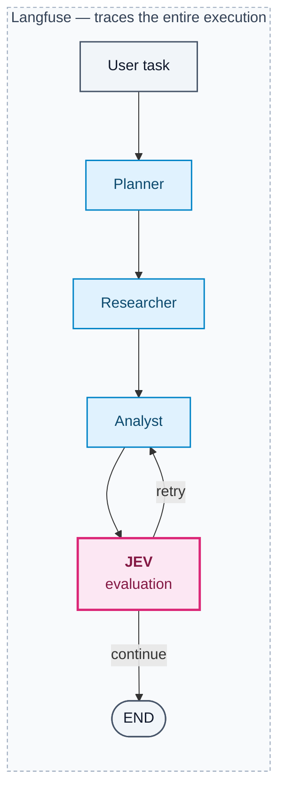
```mermaid
flowchart TD
  accTitle: LangGraph, JEV, and Langfuse in one multi-agent workflow
  accDescr: A user task flows through Planner, Researcher, and Analyst agents to a JEV evaluation node, which either continues to END or retries. Langfuse traces the entire execution, including every agent and the JEV decision.

  subgraph LF["Langfuse — traces the entire execution"]
    direction TB
    TASK["User task"] --> P["Planner"] --> R["Researcher"] --> A["Analyst"]
    A --> JEV["<b>JEV</b><br/>evaluation"]
    JEV -->|continue| FIN(["END"])
    JEV -->|retry| A
  end

  classDef req fill:#f1f5f9,stroke:#475569,stroke-width:1.5px,color:#0f172a
  classDef src fill:#e0f2fe,stroke:#0284c7,stroke-width:1.5px,color:#0c4a6e
  classDef jev fill:#fce7f3,stroke:#db2777,stroke-width:2.5px,color:#831843

  class TASK,FIN req
  class P,R,A src
  class JEV jev
  style LF fill:#f8fafc,stroke:#94a3b8,stroke-dasharray:4 3,color:#334155
```

*Langfuse wraps the whole run: every agent step and the JEV decision that chose the path end up in one trace.*

A single Langfuse trace then shows:

```text
Trace
│
├── Planner
│   ├── LLM generation
│   └── Tool calls
│
├── Researcher
│   ├── Retrieval
│   └── LLM generation
│
├── Analyst
│   └── LLM generation
│
├── JEV
│   ├── State
│   ├── Question
│   └── Decision + probability
│
└── Final response
```

That lets you investigate not just **what** the final agent produced, but **why the workflow took a particular path** — the JEV decision, its probability, and the state it saw are all in the same trace.

### JEV as a Production Evaluator in Langfuse

There's a second pattern: JEV doesn't have to run synchronously inside the graph. You can also use it as a **judge over production traces** after the fact.

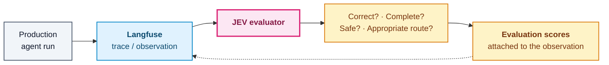
```mermaid
flowchart LR
  accTitle: JEV as an offline evaluator over Langfuse production traces
  accDescr: A production agent run is traced in Langfuse. Each trace or observation is passed to a JEV evaluator, which answers correctness, completeness, safety, and routing questions, and the answers are stored as evaluation scores back in Langfuse.

  RUN["Production<br/>agent run"] --> LF["<b>Langfuse</b><br/>trace / observation"]
  LF --> JEV["<b>JEV evaluator</b>"]
  JEV --> Q["Correct? · Complete?<br/>Safe? · Appropriate route?"]
  Q --> SC["<b>Evaluation scores</b><br/>attached to the observation"]
  SC -.-> LF

  classDef req fill:#f1f5f9,stroke:#475569,stroke-width:1.5px,color:#0f172a
  classDef src fill:#e0f2fe,stroke:#0284c7,stroke-width:1.5px,color:#0c4a6e
  classDef jev fill:#fce7f3,stroke:#db2777,stroke-width:2.5px,color:#831843
  classDef score fill:#fef3c7,stroke:#d97706,stroke-width:1.5px,color:#78350f

  class RUN req
  class LF src
  class JEV jev
  class Q,SC score
```

*Offline evaluation: JEV scores production traces after the fact, and the scores land next to the original run in Langfuse.*

Langfuse supports JEV as a **decision-model evaluator**, where each typed JEV question becomes a score on the relevant observation. That's useful when you want to evaluate large numbers of agent runs **without paying for a generative LLM judge on every decision**.

After an agent completes a run, the evaluation might look like:

| Evaluation question | JEV primitive |
|---|---|
| Was the agent's answer correct? | Noul |
| Did the agent satisfy all requirements? | Noul |
| What quality level does this output achieve? | Score |
| Which failure category applies? | Choice |

…evaluated against a state built from the trace: the task, retrieved context, agent output, tool results, and relevant memory. The resulting scores sit alongside the original LangGraph trace.

### The Overall Architecture: Orchestration, Decisions, Observability

Putting it all together:

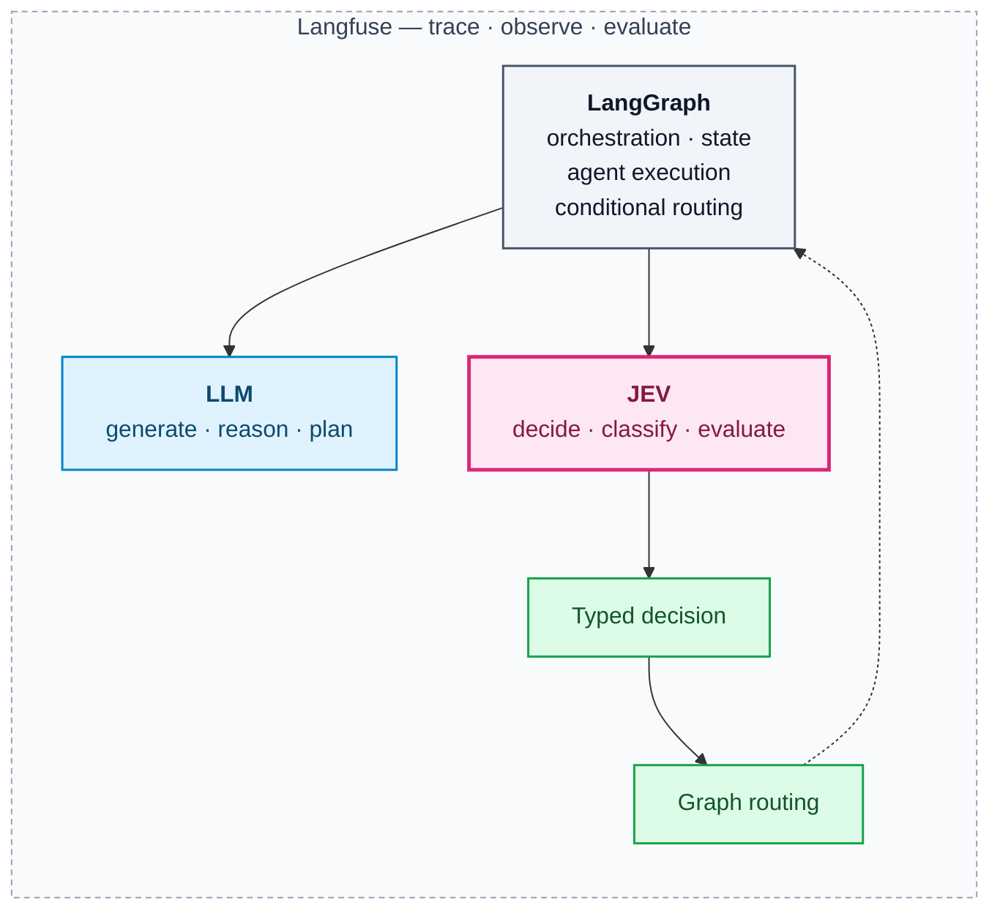
```mermaid
flowchart TD
  accTitle: Overall architecture of LangGraph, LLM, JEV, and Langfuse
  accDescr: LangGraph handles orchestration, state management, agent execution, and conditional routing. It calls an LLM to generate, reason, and plan, and calls JEV to decide, classify, and evaluate. JEV's typed decision drives graph routing. Langfuse traces, observes, and evaluates the whole system.

  subgraph OBS["Langfuse — trace · observe · evaluate"]
    direction TB
    LG["<b>LangGraph</b><br/>orchestration · state<br/>agent execution<br/>conditional routing"]

    LG --> LLM["<b>LLM</b><br/>generate · reason · plan"]
    LG --> JEV["<b>JEV</b><br/>decide · classify · evaluate"]

    JEV --> TD["Typed decision"]
    TD --> ROUTE["Graph routing"]
    ROUTE -.-> LG
  end

  classDef req fill:#f1f5f9,stroke:#475569,stroke-width:1.5px,color:#0f172a
  classDef src fill:#e0f2fe,stroke:#0284c7,stroke-width:1.5px,color:#0c4a6e
  classDef jev fill:#fce7f3,stroke:#db2777,stroke-width:2.5px,color:#831843
  classDef noul fill:#dcfce7,stroke:#16a34a,stroke-width:1.5px,color:#14532d

  class LG req
  class LLM src
  class JEV jev
  class TD,ROUTE noul
  style OBS fill:#f8fafc,stroke:#94a3b8,stroke-dasharray:4 3,color:#334155
```

*The full stack: LangGraph orchestrates, the LLM generates, JEV decides, and Langfuse observes all of it.*

In one sentence:

> **LangGraph orchestrates the agentic workflow, LangChain provides the integration layer for invoking JEV, JEV provides fast typed decisions over the workflow state, and Langfuse provides the observability and evaluation layer for understanding those decisions in the context of complete agent traces.**

That framing is much stronger than treating JEV as just another model provider. JEV is a **decision model**; LangGraph is the **orchestration layer**; Langfuse is the **observability and evaluation layer**.

## JEV vs. Fireworks Qwen3 Reranker: Managed Decision API vs. Managed Ranking Model

JEV evaluates a state against questions, so it does **classification and ranking-style judgment** over the input rather than generating a chat response. That makes managed rerankers the closest comparison — and the **Qwen3 Reranker** models on **Fireworks AI** are a useful reference point.

This is a comparison of **two managed inference services**. With Fireworks, you call Qwen3 Reranker through an API, the same way you call JEV through TypeSafe's API. Neither approach asks you to manage GPUs, CUDA, inference servers, model loading, or autoscaling — the provider runs all of it.

So the real question isn't who runs the infrastructure. It's **what each API is designed to do**.

### Qwen3 Reranker on the Fireworks Model Marketplace

The Fireworks marketplace currently lists these reranking models:

| Model | Provider | Listing | Price | Context |
|---|---|---|---|---|
| Qwen3 Reranker 8B | Fireworks | **Serverless** | **$0.20 / 1M tokens** | 40K |
| Qwen3 Reranker 4B | Fireworks | Qwen3 Reranker | No serverless price listed | 40K |
| Qwen3 Reranker 0.6B | Fireworks | Qwen3 Reranker | No serverless price listed | 40K |
| Voyage ReRank 2.5 | Voyage AI by MongoDB | Reranker | — | 32K |

*Source: the Fireworks AI model marketplace, as of October 2026. The [Qwen3 Reranker 8B model page](https://fireworks.ai/models/fireworks/qwen3-reranker-8b) lists serverless availability at $0.20 per 1M tokens, 8.18B parameters, and a 40.9K context. Voyage ReRank 2.5 is listed for completeness; the comparison below focuses on Qwen3 Reranker.*

#### The Three Qwen3 Reranker Sizes: One Family, Different Capacity

Qwen3 Reranker 0.6B, 4B, and 8B are **the same architecture family at different parameter scales**, not three fundamentally different architectures. Per the [Qwen3 Reranker model card](https://huggingface.co/Qwen/Qwen3-Reranker-8B), all three are instruction-aware text rerankers; the 0.6B has 28 layers, and the 4B and 8B have 36.

What changes across them is **model capacity**:

| | Qwen3 Reranker 0.6B | Qwen3 Reranker 4B | Qwen3 Reranker 8B |
|---|---|---|---|
| Parameters | 0.6B | 4B | 8B (8.18B on Fireworks) |
| Layers | 28 | 36 | 36 |
| Context on Fireworks | 40K | 40K | 40K |
| Fireworks serverless | Not listed | Not listed | **Yes — $0.20 / 1M tokens** |
| Capacity | Smallest | Middle | Largest |
| Latency / throughput | Generally fastest per call | In between | Generally slowest per call |
| Best fit | High-volume, latency-sensitive ranking where "good enough" is fine | A balance of ranking quality and speed | The hardest ranking decisions, where quality matters most |

The latency and throughput rows reflect the general rule that fewer parameters mean less compute per token. Fireworks doesn't publish per-variant latency figures in the marketplace listing, so benchmark the sizes on your own queries before choosing. The only verified per-token price is the 8B's serverless listing.

### Architectural Purpose: Ranking vs. Decisions

The two APIs take different inputs and return different outputs — and that's the heart of the comparison.

**Fireworks Qwen3 Reranker** takes a **query and candidate documents** and returns **relevance scores**:

```text
Query: "What is the refund policy?"

Document A → 0.91
Document B → 0.72
Document C → 0.18
```

**JEV** takes **arbitrary application state and explicit questions** and returns **structured decisions**:

```text
State:    { customer_message, account_history, policy, previous_actions }
Question: "Does this request require escalation?"
        → typed decision + probability
```

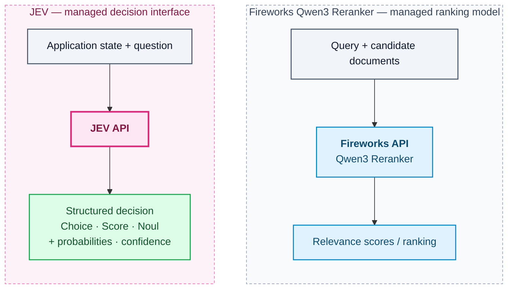
```mermaid
flowchart LR
  accTitle: JEV API versus Fireworks Qwen3 Reranker API
  accDescr: With JEV, application state plus a question goes to the JEV API, which returns a structured decision. With Fireworks Qwen3 Reranker, a query plus candidate documents goes to the Fireworks API, which returns relevance scores and a ranking.

  subgraph JV["JEV — managed decision interface"]
    direction TB
    JS["Application state + question"] --> JM["<b>JEV API</b>"]
    JM --> JD["Structured decision<br/>Choice · Score · Noul<br/>+ probabilities · confidence"]
  end

  subgraph FW["Fireworks Qwen3 Reranker — managed ranking model"]
    direction TB
    RQ["Query + candidate documents"] --> RM["<b>Fireworks API</b><br/>Qwen3 Reranker"]
    RM --> RS["Relevance scores / ranking"]
  end

  JV ~~~ FW

  classDef req fill:#f1f5f9,stroke:#475569,stroke-width:1.5px,color:#0f172a
  classDef src fill:#e0f2fe,stroke:#0284c7,stroke-width:1.5px,color:#0c4a6e
  classDef jev fill:#fce7f3,stroke:#db2777,stroke-width:2.5px,color:#831843
  classDef noul fill:#dcfce7,stroke:#16a34a,stroke-width:1.5px,color:#14532d

  class JS,RQ req
  class RM,RS src
  class JM jev
  class JD noul
  style JV fill:#fdf2f8,stroke:#f472b6,stroke-dasharray:4 3,color:#831843
  style FW fill:#f8fafc,stroke:#94a3b8,stroke-dasharray:4 3,color:#334155
```

*Two managed APIs, two abstractions: Qwen3 Reranker scores query–document relevance; JEV makes whatever judgment the application defines.*

The distinction:

- **Qwen3 Reranker is primarily a specialized retrieval/ranking model.** Its job is to answer one kind of question very well: *how relevant is this document to this query?*
- **JEV is a broader decision model and interface.** It evaluates arbitrary structured state against explicit questions — relevance is one judgment it can make, alongside routing, risk, completion, and policy checks.

TypeSafe doesn't publish JEV's underlying architecture or parameter count, so this comparison stays at the API and behavior level.

### Where Qwen3 Reranker Fits: The RAG Pipeline

Qwen3 Reranker is especially relevant to **retrieval-augmented generation (RAG)**. Fast retrieval (vector search or BM25) pulls a broad set of candidates; the reranker re-scores them so only the most relevant context reaches the LLM:

```text
Query → retrieval → candidate documents → Qwen3 Reranker → ranked documents → LLM
```

### JEV in Retrieval and Reranking Workflows

JEV can participate in the same kind of workflow — but the step becomes a **decision over a candidate state** rather than a pure relevance score.

TypeSafe's [Re-ranking cookbook](https://docs.typesafe.ai/cookbooks/rerank_typesafe) shows this directly. It asks one Noul per query–candidate pair ("could this candidate passage be from the cited precedent?") and sorts the shortlist by the noul. On 40 legal queries from the CLERC dataset with 30-passage BM25 shortlists, TypeSafe reports **top-1 accuracy rising from 5% to 18%** and **top-10 from 38% to 62%** compared with BM25 alone.

TypeSafe's [Classifying RAG passages](https://docs.typesafe.ai/cookbooks/classifying_rag_passages) cookbook takes the decision framing further: score each retrieved passage, then decide **in code** which ones reach the answering model.

Those cookbook results compare JEV against BM25 alone, not against Qwen3 Reranker. They show that JEV *can* rerank — not how it ranks relative to a dedicated reranker.

### A Concrete RAG Comparison

Here are the two pipelines side by side:

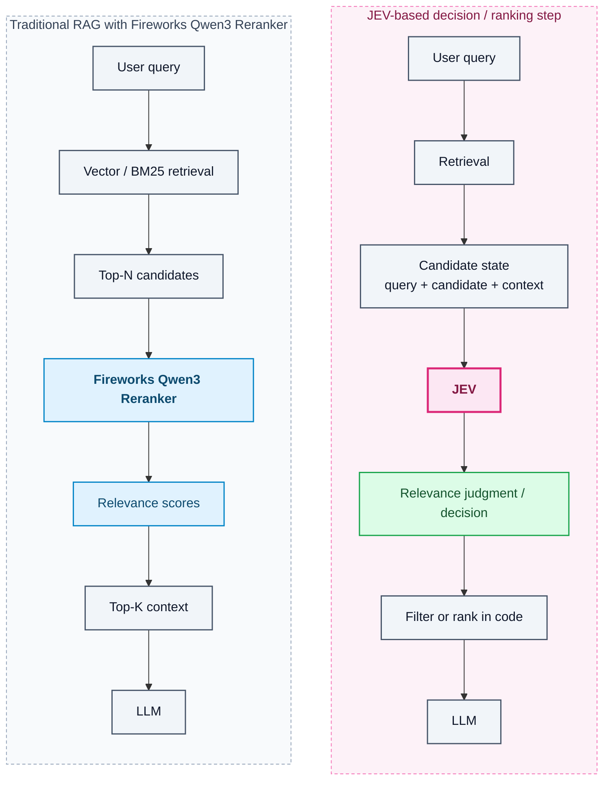
```mermaid
flowchart LR
  accTitle: RAG pipeline with Fireworks Qwen3 Reranker versus a JEV-based decision step
  accDescr: In the traditional pipeline, a user query goes through vector or BM25 retrieval to top-N candidates, then to Fireworks Qwen3 Reranker, which returns relevance scores used to pick top-K context for the LLM. In the JEV-based pipeline, a user query goes through retrieval to a candidate state, then to JEV, which returns a relevance judgment or decision used to filter or rank context for the LLM.

  subgraph TRAD["Traditional RAG with Fireworks Qwen3 Reranker"]
    direction TB
    Q1["User query"] --> R1["Vector / BM25 retrieval"] --> N1["Top-N candidates"]
    N1 --> RR["<b>Fireworks Qwen3 Reranker</b>"] --> S1["Relevance scores"]
    S1 --> K1["Top-K context"] --> L1["LLM"]
  end

  subgraph JEVP["JEV-based decision / ranking step"]
    direction TB
    Q2["User query"] --> R2["Retrieval"] --> CS["Candidate state<br/>query + candidate + context"]
    CS --> JEV["<b>JEV</b>"] --> D2["Relevance judgment / decision"]
    D2 --> F2["Filter or rank in code"] --> L2["LLM"]
  end

  TRAD ~~~ JEVP

  classDef req fill:#f1f5f9,stroke:#475569,stroke-width:1.5px,color:#0f172a
  classDef src fill:#e0f2fe,stroke:#0284c7,stroke-width:1.5px,color:#0c4a6e
  classDef jev fill:#fce7f3,stroke:#db2777,stroke-width:2.5px,color:#831843
  classDef noul fill:#dcfce7,stroke:#16a34a,stroke-width:1.5px,color:#14532d

  class Q1,R1,N1,K1,L1,Q2,R2,CS,F2,L2 req
  class RR,S1 src
  class JEV jev
  class D2 noul
  style TRAD fill:#f8fafc,stroke:#94a3b8,stroke-dasharray:4 3,color:#334155
  style JEVP fill:#fdf2f8,stroke:#f472b6,stroke-dasharray:4 3,color:#831843
```

*Same retrieval front end. The reranker returns a relevance score per candidate; JEV returns whatever judgment the question defines, and your code filters or ranks on it.*

The practical difference shows up in what you can ask at the ranking step:

- With **Qwen3 Reranker**, the step answers *"how relevant is this candidate to the query?"* — with a model built specifically for that.
- With **JEV**, the step can ask relevance *and* other questions about the same candidate in one request — *"Does this passage contain the answer?"*, *"Does it contradict the policy?"*, *"Is it current?"* — because questions in one JEV request run in parallel against the same state.

### Cost Comparison: JEV vs. Fireworks Qwen3 Reranker

Both are pay-per-token managed APIs, so list prices compare directly:

| | JEV 1.13 (TypeSafe API) | Qwen3 Reranker 8B (Fireworks serverless) |
|---|---|---|
| Price | **$0.042 / 1M input tokens** ($42 / 1B) | **$0.20 / 1M tokens** |
| Output tokens | Free | Included in token price |
| Context per request | 64K total; 32K for state + longest question | 40K (40.9K on the model page) |
| Infrastructure you manage | None | None |
| What you get back | Typed decisions + probabilities + confidence | Relevance scores |

*Prices from [TypeSafe's Models page](https://docs.typesafe.ai/models) and [Fireworks' Qwen3 Reranker 8B page](https://fireworks.ai/models/fireworks/qwen3-reranker-8b), as of October 2026. Both change over time — check before relying on them. The 4B and 0.6B variants have no serverless per-token price in the marketplace listing, so they're left out of this table.*

On list price alone, JEV's input tokens are about **4.8x cheaper** than Qwen3 Reranker 8B serverless ($0.042 vs. $0.20 per million).

To make that concrete, take the workload from TypeSafe's re-ranking cookbook: 1,200 calls (40 queries × 30 candidates) using **1,536,002 input tokens**, which TypeSafe reports cost **$0.0645**. The same token volume at Fireworks' 8B serverless price would be roughly **$0.31**.

Treat that as an order-of-magnitude guide, not a verdict:

- **Tokenizers differ**, so the same text isn't the same token count on both services.
- **The abstractions differ.** A reranker scores query–document pairs; JEV answers arbitrary typed questions.
- **Multi-question requests change the math.** JEV ingests the state once and answers every question against it, so asking several questions about one candidate doesn't multiply the state's token cost.
- **Ranking quality isn't compared here.** Price per token says nothing about which model ranks *your* data better — benchmark both on your own queries.

### Key Takeaway: A Ranking Model vs. a Decision Interface

Neither is simply "better". They're optimized for **different abstractions**:

- Reach for **Fireworks Qwen3 Reranker** when the step is pure relevance ranking — the classic RAG rerank — and you want a model specialized for exactly that.
- Reach for **JEV** when the step is a *decision* — relevance plus filtering, policy, risk, or routing judgments over the same state — and you want to define that judgment explicitly.

> **Fireworks Qwen3 Reranker is a managed specialized ranking model, while JEV provides a managed decision interface where the application supplies state and explicitly defines the judgment it wants the model to make.**

## JEV vs. DistilBERT: Task-Specific Classifier Heads vs. Question-Conditioned Decisions

Rerankers are one comparison. The other one engineers reach for is closer to home: *couldn't I just fine-tune a small encoder like [DistilBERT](/engineering/distilbert-a-distilled-version-of-bert/) with a few classification heads?*

Partly, yes. A DistilBERT with task-specific heads can reproduce some of what JEV exposes. But the two differ substantially in **generality, training, deployment, and how decisions are specified** — and the differences are what make the comparison useful.

### The Surface-Level Similarity

Both take context in and produce structured decisions out:

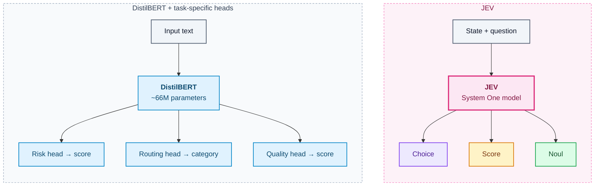
```mermaid
flowchart LR
  accTitle: DistilBERT with fixed heads versus JEV
  accDescr: A DistilBERT encoder with fixed risk, routing, and quality heads returns a risk score, a route category, and a quality score. JEV takes a state plus a question and returns a Choice, Score, or Noul answer for whatever question is asked.

  subgraph DB["DistilBERT + task-specific heads"]
    direction TB
    IN["Input text"] --> ENC["<b>DistilBERT</b><br/>~66M parameters"]
    ENC --> H1["Risk head → score"]
    ENC --> H2["Routing head → category"]
    ENC --> H3["Quality head → score"]
  end

  subgraph JV["JEV"]
    direction TB
    SQ["State + question"] --> JM["<b>JEV</b><br/>System One model"]
    JM --> C["Choice"]
    JM --> S["Score"]
    JM --> N["Noul"]
  end

  DB ~~~ JV

  classDef req fill:#f1f5f9,stroke:#475569,stroke-width:1.5px,color:#0f172a
  classDef src fill:#e0f2fe,stroke:#0284c7,stroke-width:1.5px,color:#0c4a6e
  classDef jev fill:#fce7f3,stroke:#db2777,stroke-width:2.5px,color:#831843
  classDef choice fill:#ede9fe,stroke:#7c3aed,stroke-width:1.5px,color:#4c1d95
  classDef score fill:#fef3c7,stroke:#d97706,stroke-width:1.5px,color:#78350f
  classDef noul fill:#dcfce7,stroke:#16a34a,stroke-width:1.5px,color:#14532d

  class IN,SQ req
  class ENC,H1,H2,H3 src
  class JM jev
  class C choice
  class S score
  class N noul
  style DB fill:#f8fafc,stroke:#94a3b8,stroke-dasharray:4 3,color:#334155
  style JV fill:#fdf2f8,stroke:#f472b6,stroke-dasharray:4 3,color:#831843
```

*Same shape on the outside: context in, structured decision out. The difference is where the task is defined — in trained heads, or in the question.*

### Fixed Heads: DistilBERT Is a Multi-Task Classifier

Train DistilBERT with risk, escalation, routing, and quality heads, and you've built a **multi-task classifier**:

```text
Input: "Customer is requesting a $10,000 refund."
                     ↓
                 DistilBERT
       ┌─────────────┼─────────────┐
       ↓             ↓             ↓
   Risk head    Route head   Escalate head
       ↓             ↓             ↓
     0.82         Billing         Yes
```

It works — but **each head is trained for one task**. If tomorrow you want to know *"Does this agent output satisfy the user's requirements?"*, you need another trained head, or another model.

### Question-Conditioned: JEV Makes the Question Part of Inference

With JEV, the question is an **input**, not a trained component. You change the question without changing the architecture:

```text
State = { task, agent_output, retrieved_context, memory }

Question A: "Does the output satisfy the user's requirements?"
Question B: "Does this action require human approval?"
Question C: "Is the answer supported by the retrieved evidence?"
```

Same state, different questions, no retraining. That's **question-conditioned classification**, not a fixed-head architecture.

### You Could Make DistilBERT Question-Conditioned Too

This is where the comparison gets interesting. Nothing stops you from feeding the question into the encoder alongside the state:

```text
(state, question) → DistilBERT → Choice / Score / binary heads → decision
```

instead of:

```text
state → DistilBERT → fixed head → decision
```

That's conceptually much closer to JEV. **There's nothing magical about the interface** — a smaller model can implement the same `(state, question) → decision` pattern.

### So Why Use JEV? Capability and Infrastructure

The difference moves to everything around the model. Build a question-conditioned DistilBERT yourself, and you own the whole lifecycle:

1. Dataset creation and labeling
2. Training and fine-tuning
3. Evaluation and model versioning
4. CPU/GPU serving and scaling
5. Monitoring and updating

And your model only recognizes what you trained it to recognize. JEV gives you the decision model **as a service**.

### The Biggest Difference: Open-Ended Natural-Language Criteria

Consider this pair:

```text
State:    "The agent recommends cancelling the customer's account
           because the customer complained three times."

Question: "Does the proposed action unnecessarily harm the customer
           given the available evidence?"
```

A generic DistilBERT classifier won't inherently know what "unnecessarily harm the customer" means — you need training data that represents that task. A larger instruction-following decision model can potentially **interpret the criterion itself**.

| | Traditional classifier | Question-conditioned decision model |
|---|---|---|
| What defines the task | **Training** — "what does this model know how to classify?" | **The question** — "what judgment should be made over this state?" |
| Adding a new decision | New labeled data + new head or model | New question |
| Novel criteria | Only what it was trained on | Can interpret natural-language criteria |
| Typical size | Small (DistilBERT ≈ 66M parameters) | Larger model, more compute per call |

### JEV Is Closer to a Judge Than to a Classifier

In an agentic workflow, the evaluator asks *Correct? Safe? Complete?* about an agent's output. DistilBERT can implement each of those — but you'd end up with either a **separate model per check** (correctness, safety, completeness, routing) or **one encoder with a growing stack of heads**.

JEV instead offers a single, general **state + question → decision** abstraction, which puts it much closer to an [LLM-as-judge evaluator](/engineering/evaluation-and-monitoring-for-production-llm-agents/) than to a fixed classifier — just with typed, calibrated outputs instead of generated text.

### Where DistilBERT Wins: Scale and Cost

The scale difference is the most practical one.

- **DistilBERT** has about **66M parameters**. It's very cheap and can run on a CPU, a small GPU, or edge infrastructure.
- **A larger decision model** will generally cost more compute per call.

So if your task is **extremely well-defined and stable** — *"Is this request spam?"* — a fine-tuned DistilBERT can be far better economically. You don't need a big model for a narrow, fixed task.

### The Best of Both: A DistilBERT → JEV Cascade

The interesting production architecture uses **both**, as a cascade. The cheap classifier handles the obvious cases; JEV handles the ones that need judgment:

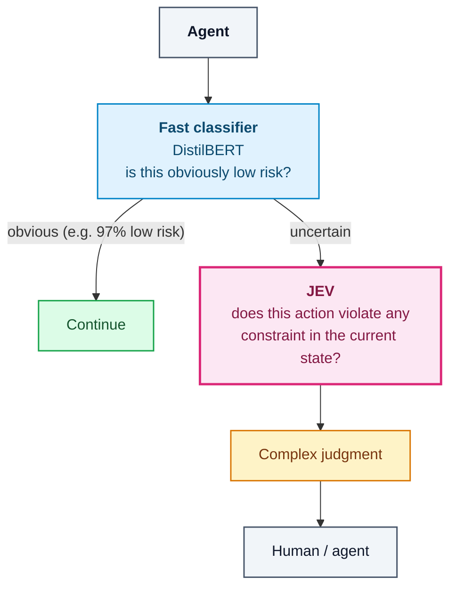
```mermaid
flowchart TD
  accTitle: DistilBERT to JEV cascade
  accDescr: An agent's action first goes to a fast DistilBERT classifier. Obvious low-risk cases continue immediately. Uncertain cases go to JEV, which makes a complex judgment against the constraints in the current state, and the result goes to a human or back to the agent.

  AG["<b>Agent</b>"] --> FAST["<b>Fast classifier</b><br/>DistilBERT<br/>is this obviously low risk?"]
  FAST -->|"obvious (e.g. 97% low risk)"| CONT["Continue"]
  FAST -->|uncertain| JEV["<b>JEV</b><br/>does this action violate any<br/>constraint in the current state?"]
  JEV --> DEC["Complex judgment"]
  DEC --> OUT["Human / agent"]

  classDef req fill:#f1f5f9,stroke:#475569,stroke-width:1.5px,color:#0f172a
  classDef src fill:#e0f2fe,stroke:#0284c7,stroke-width:1.5px,color:#0c4a6e
  classDef jev fill:#fce7f3,stroke:#db2777,stroke-width:2.5px,color:#831843
  classDef noul fill:#dcfce7,stroke:#16a34a,stroke-width:1.5px,color:#14532d
  classDef score fill:#fef3c7,stroke:#d97706,stroke-width:1.5px,color:#78350f

  class AG,OUT req
  class FAST src
  class JEV jev
  class CONT noul
  class DEC score
```

*A cascade: the ~66M-parameter classifier filters the easy cases cheaply, and only the uncertain ones pay for JEV's broader judgment.*

### The Core Distinction

> **JEV is not fundamentally different from a neural classifier at the mathematical level.** A sufficiently capable model could implement many of the same state-to-decision mappings. The difference is the **abstraction**: instead of building and maintaining a separate classifier or classification head for every decision task, JEV exposes a general state-and-question interface designed for making bounded decisions over arbitrary application context.

```text
Fixed classifier
────────────────
State → DistilBERT → Head → Decision

JEV-style abstraction
─────────────────────
State + Question → Decision Model → Structured Decision
```

From an inference-engineering angle, that raises a genuinely interesting open question: could a JEV-like System One model be implemented efficiently with a **small encoder plus multiple heads, a cross-encoder, or a distilled judge model**? That trade-off — generality vs. per-call cost — is where the design space really opens up.

## Production Use Cases for JEV

With the architecture and the comparisons in place, here's where JEV earns its keep in production agentic systems.

### Use Case 1: JEV for Human-in-the-Loop (HITL) Gating in Agentic Workflows

A strong agentic-workflow pattern puts JEV **between the agent and the human**, sorting each agent step into one of three paths:

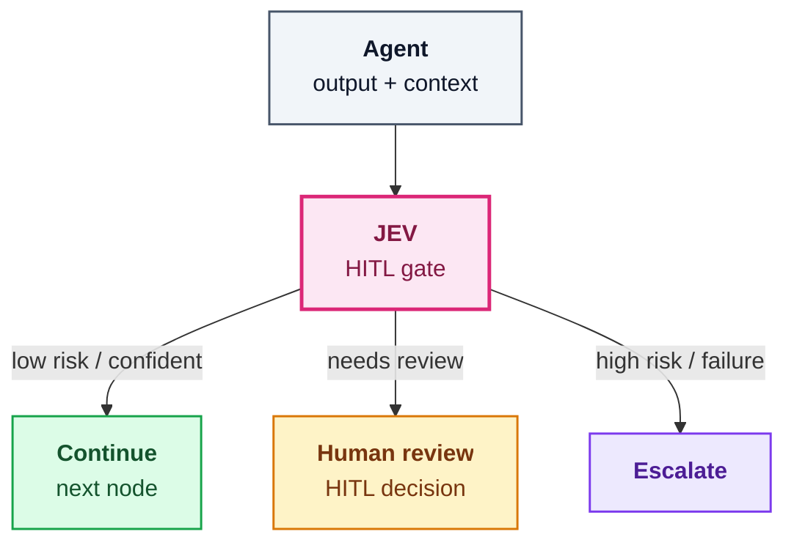
```mermaid
flowchart TD
  accTitle: JEV as a three-way HITL gate in an agentic workflow
  accDescr: An agent's step goes to JEV, which routes low-risk confident cases to continue to the next node, cases that need review to a human-in-the-loop decision, and high-risk or failed cases to escalation.

  AG["<b>Agent</b><br/>output + context"] --> JEV["<b>JEV</b><br/>HITL gate"]

  JEV -->|"low risk / confident"| CONT["<b>Continue</b><br/>next node"]
  JEV -->|"needs review"| HITL["<b>Human review</b><br/>HITL decision"]
  JEV -->|"high risk / failure"| ESC["<b>Escalate</b>"]

  classDef req fill:#f1f5f9,stroke:#475569,stroke-width:1.5px,color:#0f172a
  classDef jev fill:#fce7f3,stroke:#db2777,stroke-width:2.5px,color:#831843
  classDef noul fill:#dcfce7,stroke:#16a34a,stroke-width:1.5px,color:#14532d
  classDef score fill:#fef3c7,stroke:#d97706,stroke-width:1.5px,color:#78350f
  classDef choice fill:#ede9fe,stroke:#7c3aed,stroke-width:1.5px,color:#4c1d95

  class AG req
  class JEV jev
  class CONT noul
  class HITL score
  class ESC choice
```

*JEV as the HITL gate: most steps continue automatically, and humans see only the ones that need human judgment.*

#### JEV Instead of an LLM Judge as the HITL Gate

A common architecture uses a general-purpose LLM to decide whether a human is needed:

```text
Agent → LLM judge → if uncertain → Human
```

JEV can take that seat instead:

```text
Agent → JEV → if uncertain → Human
```

The gate is a bounded decision — *does this need a human?* — which is exactly JEV's shape. You get a typed answer with a calibrated probability, rather than paying for a generative call and parsing its verdict.

#### HITL Gating in Code

Build the evaluation state from the agent's step, and ask JEV whether it needs review:

```python
from langchain_typesafe import Noul, TypeSafeClassifier

classifier = TypeSafeClassifier()

response = classifier.invoke({
    "state": {
        "task": task,
        "agent_output": output,
        "retrieved_context": context,
        "tool_results": tools,
    },
    "questions": {
        "requires_human": Noul(
            instructions=(
                "Does this action require human review "
                "before the workflow can continue?"
            )
        ),
    },
})

requires_human = response.nouls["requires_human"].noul
```

Then the LangGraph routing function turns that probability into an edge — the `evaluate → continue / escalate` pattern from the LangGraph section:

```python
def route_after_gate(state) -> str:
    # Illustrative threshold; tune it on your own data.
    return "hitl" if state["requires_human"] >= 0.5 else "next_node"
```

#### Where JEV HITL Gating Is Particularly Useful

The same gate shape covers four common control points:

| Control point | Trigger | JEV question | Yes → | No → |
|---|---|---|---|---|
| **High-risk actions** | Agent proposes an action | Is this high-risk? | Human approval | Continue |
| **Low-confidence decisions** | Agent produces an output | Does this satisfy the required criteria? | Continue | Human review |
| **Tool authorization** | Agent wants to execute a tool | Is this action allowed? | Execute | Human |
| **Multi-agent handoffs** | Research agent finishes | Is the research sufficient? | Hand off to Analyst | Back to Researcher |

Tool authorization is the one the LangChain package already ships as an experimental pattern: `AutoModeMiddleware` (covered in the LangChain section) classifies configured tool calls and blocks risky ones before they execute.

For the broader set of input, output, tool, and memory defenses these gates fit into, see [Guardrails & Safety for Production LLM Agents](/engineering/guardrails-and-safety-for-production-llm-agents/).

#### Framing: A Gate Before HITL, Not a Replacement for It

It's tempting to call this "HITL replacement". It isn't, and framing it that way overstates what a decision model should do. The accurate framing:

> **JEV can reduce unnecessary human intervention by acting as a decision gate before HITL.** Instead of sending every agent decision to a human — or using a general-purpose LLM judge to decide whether human review is necessary — an agentic workflow can use JEV to make bounded decisions about whether the workflow can continue, should retry, or requires human intervention.

The division of labor:

- **LLM** → generate and reason
- **JEV** → make the bounded decision
- **Human** → intervene when the decision requires human judgment

### JEV as a Decision Layer Across the Agentic Stack

HITL gating is one place JEV fits. It's far from the only one — and seeing the rest is what shows JEV isn't simply an "LLM evaluator".

A useful way to think about it: stop treating JEV as another LLM that generates an answer.

> **JEV is a decision layer that sits between application state and an action** — a small decision step between deterministic code and expensive generative models.

An LLM is the right tool for *"What should I do?"*. JEV is suited to the bounded versions of that question:

- *Should I do X?*
- *Which option should I choose?*
- *How relevant is this?*
- *Does this satisfy the criteria?*
- *Should I ask a human?*
- *Which model should handle this?*

Each maps onto a primitive from Part 3: **Noul** for yes/no judgments, **Choice** for picking among defined outcomes, and **Score** for ordered rubrics. That gives six more production patterns.

### Use Case 2: JEV for Model Routing

The first is **deciding which model should handle a request**. Instead of sending every request to your largest, most expensive model, put JEV in front and route by difficulty:

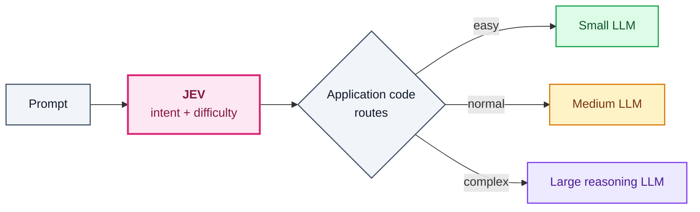
```mermaid
flowchart LR
  accTitle: JEV model routing
  accDescr: A prompt goes to JEV, which assesses intent and difficulty. Application code then routes easy requests to a small LLM, normal requests to a medium LLM, and complex requests to a large reasoning LLM.

  P["Prompt"] --> JEV["<b>JEV</b><br/>intent + difficulty"]
  JEV --> CODE{"Application code<br/>routes"}
  CODE -->|easy| S["Small LLM"]
  CODE -->|normal| M["Medium LLM"]
  CODE -->|complex| L["Large reasoning LLM"]

  classDef req fill:#f1f5f9,stroke:#475569,stroke-width:1.5px,color:#0f172a
  classDef jev fill:#fce7f3,stroke:#db2777,stroke-width:2.5px,color:#831843
  classDef noul fill:#dcfce7,stroke:#16a34a,stroke-width:1.5px,color:#14532d
  classDef score fill:#fef3c7,stroke:#d97706,stroke-width:1.5px,color:#78350f
  classDef choice fill:#ede9fe,stroke:#7c3aed,stroke-width:1.5px,color:#4c1d95

  class P,CODE req
  class JEV jev
  class S noul
  class M score
  class L choice
```

*JEV decides; application code routes. Expensive inference is reserved for the requests that need it.*

Take an AI coding assistant. *"Rename this variable"* has little reason to reach your most expensive reasoning model. *"Refactor this distributed inference engine to eliminate a KV-cache synchronization bottleneck while preserving the existing scheduling semantics"* probably deserves the strongest one.

JEV assesses the request; deterministic code maps the answer to a model:

```python
from langchain_typesafe import Choice, Score, TypeSafeClassifier

classifier = TypeSafeClassifier()

response = classifier.invoke({
    "state": {"request": user_request},
    "questions": {
        "intent": Choice(
            instructions="What kind of task is `request`?",
            criteria={
                "coding": "Writing, editing, or debugging code",
                "question": "Asking for an explanation or information",
                "other": "Anything else",
            },
        ),
        "difficulty": Score(
            instructions="How much reasoning does `request` need?",
            criteria=[
                "Trivial, mechanical edit",
                "Standard, well-scoped task",
                "Deep multi-step reasoning across a large system",
            ],
        ),
    },
})

# Score positions run 0-2 across three levels; normalize to 0-1.
difficulty = response.scores["difficulty"].score / 2

if difficulty < 0.3:
    model = "small-model"
elif difficulty < 0.7:
    model = "medium-model"
else:
    model = "large-model"
```

The architectural principle:

> **JEV decides; application code routes.**

You don't want a router that replies *"Use the large model because I think…"* and then forces you to parse prose. You want a constrained result your software consumes directly. TypeSafe documents this as the [Intent routing](https://docs.typesafe.ai/patterns/intent-routing) pattern: classify each request, then send it to deterministic logic, a specialist LLM, or a human.

**Why it matters:** without routing, 100 requests means 100 expensive LLM calls. With routing, the same 100 might split, say, 70 / 25 / 5 across small, medium, and large models — the split is illustrative and depends entirely on your traffic.

### Use Case 3: JEV Guardrails Before and After the LLM

The second pattern puts JEV **on either side of an LLM** as a guardrail:

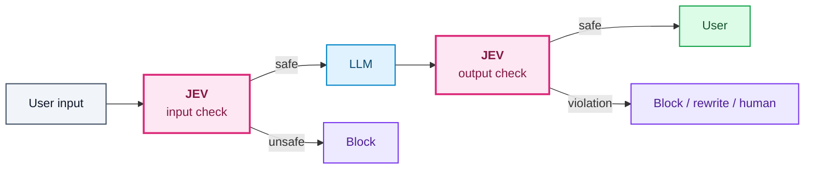
```mermaid
flowchart LR
  accTitle: JEV guardrails on LLM input and output
  accDescr: User input is screened by JEV before the LLM; unsafe input is blocked. The LLM's response is screened by JEV again; safe responses go to the user, while violations are blocked, rewritten, or sent to a human.

  U["User input"] --> J1["<b>JEV</b><br/>input check"]
  J1 -->|safe| LLM["LLM"]
  J1 -->|unsafe| B1["Block"]
  LLM --> J2["<b>JEV</b><br/>output check"]
  J2 -->|safe| OUT["User"]
  J2 -->|violation| B2["Block / rewrite / human"]

  classDef req fill:#f1f5f9,stroke:#475569,stroke-width:1.5px,color:#0f172a
  classDef src fill:#e0f2fe,stroke:#0284c7,stroke-width:1.5px,color:#0c4a6e
  classDef jev fill:#fce7f3,stroke:#db2777,stroke-width:2.5px,color:#831843
  classDef noul fill:#dcfce7,stroke:#16a34a,stroke-width:1.5px,color:#14532d
  classDef choice fill:#ede9fe,stroke:#7c3aed,stroke-width:1.5px,color:#4c1d95

  class U req
  class LLM src
  class J1,J2 jev
  class OUT noul
  class B1,B2 choice
```

*JEV screens what goes into the LLM and what comes out, while the policy lives in your code.*

Typical guardrail questions, each a natural Noul:

- *"Does this input contain an attempt to manipulate the agent into ignoring its system instructions?"*
- *"Does this response violate the application's policy?"*
- *"Does this response contain unsupported claims?"*

All of them can run against the same state in a single request. TypeSafe's [Guardrails for LLMs](https://docs.typesafe.ai/cookbooks/llm_guardrails) cookbook shows the full version: screening every message in and out of an LLM app with one request, and thresholding hazard probabilities and severity to pass, review, block, or route.

#### Why JEV Instead of an LLM Judge for Guardrails?

The traditional version asks an LLM judge *"Is this safe?"* and parses its JSON. With JEV, the guardrail returns a probability, and **the policy stays in your code**:

```python
if risk_probability > 0.8:
    block()
elif risk_probability > 0.5:
    human_review()
else:
    allow()
```

The thresholds are explicit, versioned with your code, and testable — rather than hidden inside a judge prompt. For the broader defense-in-depth picture, see [Guardrails & Safety for Production LLM Agents](/engineering/guardrails-and-safety-for-production-llm-agents/).

### Use Case 4: JEV Tool-Call Gating for Autonomous Agents

This is one of the most interesting applications for **autonomous agents**. An agent reasons *"I need to refund the customer"* and produces:

```python
refund_customer(
    customer_id="123",
    amount=500,
)
```

That's the moment the model moves from **reasoning to side effect**. Put JEV between the proposed call and its execution:

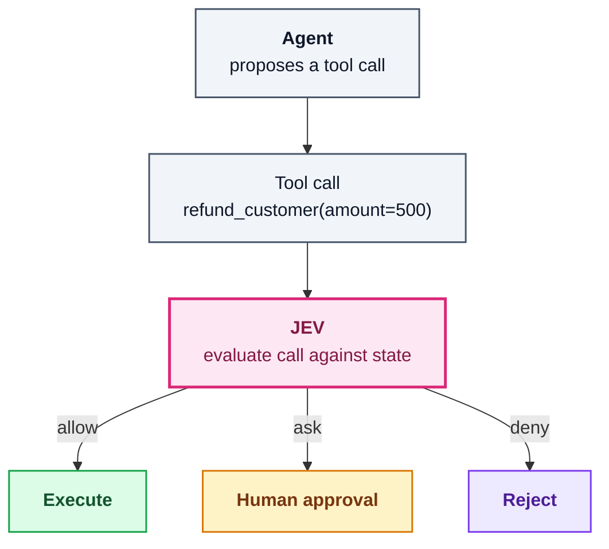
```mermaid
flowchart TD
  accTitle: JEV tool-call gating
  accDescr: An agent proposes a tool call. JEV evaluates the call against the full state and returns allow, ask, or deny. Allowed calls execute, ask routes to a human for approval, and deny rejects the call.

  AG["<b>Agent</b><br/>proposes a tool call"] --> TC["Tool call<br/>refund_customer(amount=500)"]
  TC --> JEV["<b>JEV</b><br/>evaluate call against state"]
  JEV -->|allow| EX["<b>Execute</b>"]
  JEV -->|ask| HU["<b>Human approval</b>"]
  JEV -->|deny| RJ["<b>Reject</b>"]

  classDef req fill:#f1f5f9,stroke:#475569,stroke-width:1.5px,color:#0f172a
  classDef jev fill:#fce7f3,stroke:#db2777,stroke-width:2.5px,color:#831843
  classDef noul fill:#dcfce7,stroke:#16a34a,stroke-width:1.5px,color:#14532d
  classDef score fill:#fef3c7,stroke:#d97706,stroke-width:1.5px,color:#78350f
  classDef choice fill:#ede9fe,stroke:#7c3aed,stroke-width:1.5px,color:#4c1d95

  class AG,TC req
  class JEV jev
  class EX noul
  class HU score
  class RJ choice
```

*The gate sits exactly where reasoning turns into a side effect.*

JEV evaluates the complete state around the call:

```json
{
  "user_request": "...",
  "agent_reasoning": "...",
  "tool": "refund_customer",
  "arguments": {"amount": 500},
  "recent_messages": ["..."],
  "relevant_policy": "..."
}
```

…and answers questions like:

- *Is the proposed tool call consistent with the user's request?*
- *Does the action create an irreversible side effect?*
- *Does the tool call violate the policy?*
- *Should this action require human approval?*

This gets more powerful combined with **confidence gating** (Use Case 7): execute above a high confidence bar, confirm in the middle band, and send everything below it to a human. TypeSafe's [Function calling](https://docs.typesafe.ai/cookbooks/function_calling) cookbook uses the same idea to map natural-language requests onto typed function calls with confidence-aware questions, and the LangChain package's experimental `AutoModeMiddleware` (from the LangChain section) blocks risky configured tool calls before they run.

### Use Case 5: JEV for RAG Reranking and Passage Filtering

A conventional RAG pipeline retrieves candidates, often applies **MMR (Maximal Marginal Relevance)**, and hands the top few to the LLM:

```text
Query → embedding → vector DB → top 20 → MMR → top 5 → LLM
```

JEV can slot in as a **semantic reranker**: score each query–passage pair, then let your code sort and filter. Take the query *"How does paged KV caching reduce memory fragmentation?"*. The retriever returns 20 documents; JEV scores each pair (A → 0.94, B → 0.81, …), and your code sorts:

```python
ranked_documents = sorted(
    documents,
    key=lambda doc: doc.relevance,
    reverse=True,
)
top_k = ranked_documents[:5]
```

TypeSafe's [Re-ranking](https://docs.typesafe.ai/cookbooks/rerank_typesafe) cookbook (covered in the Qwen3 Reranker comparison) does exactly this, and the [Classifying RAG passages](https://docs.typesafe.ai/cookbooks/classifying_rag_passages) cookbook goes further. Per passage, it asks whether the passage is **relevant**, whether it **states usable evidence**, whether it **contradicts the query's premise**, and whether it's **trying to instruct the model**. That last question makes reranking and prompt-injection screening one step.

#### JEV Reranking vs. MMR: Not the Same Operation

This distinction matters: **JEV can be used where you'd use MMR, but it isn't semantically equivalent to MMR.**

- **MMR** explicitly optimizes **relevance *and* diversity**. It picks the most relevant passage, then favors passages that are relevant but *different* from what's already selected — so your top 5 isn't five near-duplicates. Instead of five passages saying the same thing, you get a primary explanation, an implementation detail, a limitation, a benchmark, and an alternative approach.
- **JEV reranking** answers *"How relevant is this passage to the query?"* for each passage independently. Each answer is independent by design (Part 3), so on its own it **doesn't account for redundancy** between passages.

| | MMR | JEV reranking |
|---|---|---|
| Optimizes | Relevance + diversity | Per-passage relevance (or any judgment you define) |
| Sees other candidates when scoring | Yes — penalizes similarity to already-selected passages | No — each query–passage pair is judged independently |
| Signal | Embedding similarity | Question-conditioned judgment with calibrated probability |
| Can also filter, check evidence, screen injections | No | Yes, via extra questions on the same state |

So they're **not direct substitutes in the mathematical sense** — and they compose well.

#### A Better RAG Architecture with JEV: Three Stages

Rather than "replace MMR with JEV", separate the concerns:

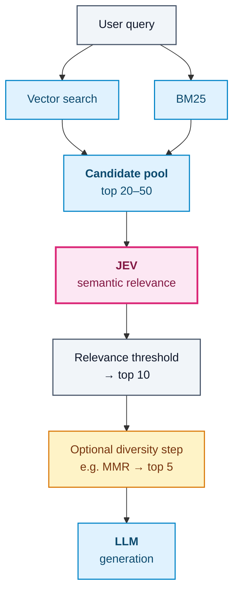
```mermaid
flowchart TD
  accTitle: Three-stage RAG architecture with JEV reranking and an optional diversity step
  accDescr: A user query runs hybrid retrieval with vector search and BM25 into a candidate pool of 20 to 50 passages. JEV scores semantic relevance, a relevance threshold keeps the top 10, an optional diversity step such as MMR picks the final top 5, and the LLM generates the answer.

  Q["User query"] --> VS["Vector search"]
  Q --> BM["BM25"]
  VS --> POOL["<b>Candidate pool</b><br/>top 20–50"]
  BM --> POOL
  POOL --> JEV["<b>JEV</b><br/>semantic relevance"]
  JEV --> TH["Relevance threshold<br/>→ top 10"]
  TH --> DIV["Optional diversity step<br/>e.g. MMR → top 5"]
  DIV --> LLM["<b>LLM</b><br/>generation"]

  classDef req fill:#f1f5f9,stroke:#475569,stroke-width:1.5px,color:#0f172a
  classDef src fill:#e0f2fe,stroke:#0284c7,stroke-width:1.5px,color:#0c4a6e
  classDef jev fill:#fce7f3,stroke:#db2777,stroke-width:2.5px,color:#831843
  classDef score fill:#fef3c7,stroke:#d97706,stroke-width:1.5px,color:#78350f

  class Q,TH req
  class VS,BM,POOL,LLM src
  class JEV jev
  class DIV score
```

*Each stage owns one concern: retrieval generates candidates, JEV judges relevance, a diversity step shapes the context, and the LLM generates.*

That separation:

- **Retrieval** → candidate generation
- **JEV** → semantic relevance (plus any filtering questions)
- **Diversity algorithm** → context diversity
- **LLM** → generation

If diversity matters, run *hybrid retrieval → JEV reranking → MMR → LLM*. If your corpus naturally returns diverse results, *hybrid retrieval → JEV reranking → top K → LLM* may be enough. **Benchmark both on your own data** rather than assuming either is universally better.

### Use Case 6: JEV for LLM and Agent-Trace Evaluation

The most obvious use case is evaluation. The traditional version sends an agent's output to an LLM judge with *"Score this from 1–5"*. With JEV, the state is the full context — user question, retrieved documents, agent answer, tool calls — and you ask several **independent** questions against it in one request:

| Evaluation question | JEV primitive | Illustrative answer |
|---|---|---|
| Is the answer grounded in the provided evidence? | Noul | 0.94 |
| Does the answer directly address the user's question? | Noul | 0.91 |
| Does the answer contain unsupported claims? | Noul | 0.07 |
| How well does the answer satisfy the rubric? | Score | position on your rubric levels |

*The answers are illustrative, not measured.*

The advantage is structural: **multiple independent questions against the same state**, rather than a separate judge prompt per criterion. Applied to a full LangGraph trace — planner, retriever, tool calls, researcher, analyst, final answer — JEV becomes an **agent-trace judge** answering *correct? safe? complete?*. The Langfuse section above shows how those answers become scores attached to the original trace.

### Use Case 7: Confidence-Gated Autonomy

The last pattern is less about *what* JEV decided and more about **how confident it is**.

Part 4 covered the mechanics. The production payoff is that you don't have to choose between **100% automation** and **100% human-in-the-loop**:

```mermaid
flowchart TD
  accTitle: Confidence-gated autonomy with JEV
  accDescr: An agent's step goes to JEV, which returns a decision with confidence. High confidence acts automatically, medium confidence asks for confirmation, and low confidence goes to human review.

  AG["<b>Agent</b>"] --> JEV["<b>JEV</b><br/>decision + confidence"]
  JEV -->|high| ACT["<b>Act automatically</b>"]
  JEV -->|medium| CONF["<b>Confirm</b>"]
  JEV -->|low| HUM["<b>Human review</b>"]

  classDef req fill:#f1f5f9,stroke:#475569,stroke-width:1.5px,color:#0f172a
  classDef jev fill:#fce7f3,stroke:#db2777,stroke-width:2.5px,color:#831843
  classDef noul fill:#dcfce7,stroke:#16a34a,stroke-width:1.5px,color:#14532d
  classDef score fill:#fef3c7,stroke:#d97706,stroke-width:1.5px,color:#78350f
  classDef choice fill:#ede9fe,stroke:#7c3aed,stroke-width:1.5px,color:#4c1d95

  class AG req
  class JEV jev
  class ACT noul
  class CONF score
  class HUM choice
```

*Confidence-gated autonomy: automation, confirmation, and human review become three bands of one signal.*

An illustrative set of bands — *above 0.90 execute, 0.60–0.90 confirm, below 0.60 send to a human* — gives a workflow that automates the clear cases and escalates the rest. As Part 4 stressed, **calibrate those thresholds on your own workload**; they aren't universal constants. TypeSafe documents this as [Confidence-gated routing](https://docs.typesafe.ai/patterns/confidence-routing): the answer tells you *what*, confidence tells you *whether to act*.

### Putting It Together: JEV as a Decision Plane

Seen together, these aren't seven unrelated features. They're one interface inserted at different **decision boundaries**:

```mermaid
flowchart TD
  accTitle: JEV as a decision plane around an agentic system
  accDescr: A user request passes through JEV model routing and input guardrails into the agentic workflow. Inside the workflow, JEV gates tool calls and reranks RAG context. After generation, JEV evaluates the answer, and confidence decides whether to act, ask, or hand off to a human.

  USER["<b>User</b>"] --> ROUTE["<b>JEV</b> · model routing<br/>small / medium / large LLM"]
  ROUTE --> GUARD["<b>JEV</b> · input guardrail<br/>allow / block / review"]
  GUARD --> WF["<b>Agentic workflow</b>"]

  WF --> TOOLS["<b>JEV</b> · tool gating<br/>allow / ask / deny"]
  WF --> RAG["<b>JEV</b> · RAG reranking<br/>relevant context"]
  RAG --> LLM["<b>LLM</b><br/>generated answer"]
  TOOLS --> LLM

  LLM --> EVAL["<b>JEV</b> · evaluation<br/>correct · safe · complete"]
  EVAL --> GATE{"<b>JEV</b> confidence"}
  GATE -->|high| ACT["Act"]
  GATE -->|medium| ASK["Ask"]
  GATE -->|low| HUMAN["Human"]

  classDef req fill:#f1f5f9,stroke:#475569,stroke-width:1.5px,color:#0f172a
  classDef src fill:#e0f2fe,stroke:#0284c7,stroke-width:1.5px,color:#0c4a6e
  classDef jev fill:#fce7f3,stroke:#db2777,stroke-width:2.5px,color:#831843
  classDef noul fill:#dcfce7,stroke:#16a34a,stroke-width:1.5px,color:#14532d
  classDef score fill:#fef3c7,stroke:#d97706,stroke-width:1.5px,color:#78350f
  classDef choice fill:#ede9fe,stroke:#7c3aed,stroke-width:1.5px,color:#4c1d95

  class USER,WF req
  class LLM src
  class ROUTE,GUARD,TOOLS,RAG,EVAL,GATE jev
  class ACT noul
  class ASK score
  class HUMAN choice
```

*Every pink node is the same state + question interface, inserted at a different decision boundary.*

> **The interesting property of JEV is not any individual use case.** It's that the same state-and-question interface can be inserted at many decision boundaries in an AI system: before an expensive model call, before a tool execution, inside retrieval, after generation, or before handing control to a human.

That changes how responsibilities divide:

| Traditional AI architecture | Agentic architecture with JEV |
|---|---|
| **LLM** generates, routes, evaluates, decides, guards, and calls tools | **LLM** → generate and reason |
| | **JEV** → route, guard, rank, evaluate, gate, escalate |
| | **Code** → enforce the policy |

## Key Takeaways

- **JEV is a decision model, not a text generator.** It takes a state plus typed questions and returns Choice, Score, and Noul answers with calibrated probabilities.
- **State is the evaluation context you build**, not your database record — workflow state, memory, retrieved knowledge, and agent output assembled for one judgment.
- **Questions are the interface.** Change the question and you change the decision, with no retraining — the key difference from fixed-head classifiers like DistilBERT.
- **Confidence turns answers into control flow**: act, confirm, or escalate, with thresholds you own and calibrate.
- **JEV fits at decision boundaries** — routing, guardrails, tool gating, RAG reranking, evaluation, and HITL — alongside LangGraph (orchestration) and Langfuse (observability), not in place of them.
- **It complements, rather than replaces**, rules, classifiers, rerankers, MMR, LLMs, and human judgment.

## Related Topics

- [DistilBERT: Distilling BERT into a Model 40% Smaller and 60% Faster](/engineering/distilbert-a-distilled-version-of-bert/) — the small fine-tuned classifier JEV is compared against above
- [Evaluation & Monitoring for Production LLM Agents](/engineering/evaluation-and-monitoring-for-production-llm-agents/) — LLM-as-judge, metrics, and trajectory evaluation
- [Guardrails & Safety for Production LLM Agents](/engineering/guardrails-and-safety-for-production-llm-agents/) — input, output, tool, and memory defenses

## Conclusion: JEV Is a Decision Primitive, Not a Universal Solution

**JEV is a useful decision primitive for agentic systems, but it is not the only option.** The right choice depends on the problem being solved:

| If the problem is… | Often the better fit | Why |
|---|---|---|
| Simple, deterministic rules | **Application code / if-else logic** | Free, exact, and testable — no model needed |
| Highly specialized, fixed classification | **A small fine-tuned model** such as DistilBERT | Cheaper and faster for one stable, well-labeled task |
| RAG retrieval and document ranking | **Specialized rerankers** such as Qwen3 Reranker or Voyage ReRank | Specifically optimized for query–document relevance |
| Diversity-aware retrieval | **MMR** | Explicitly balances relevance and diversity |
| Complex, open-ended generation and reasoning | **A general-purpose LLM** | Generation and multi-step reasoning are its job |
| Bounded, state-based decisions across changing criteria | **JEV** | The application supplies the state and explicitly defines the decision |
| Human-in-the-loop workflows | **JEV as a gating layer** | Decides whether an action proceeds, needs confirmation, or escalates to a human |

These components are **complementary, not mutually exclusive**:

```mermaid
flowchart TD
  accTitle: Complementary layers of a production agentic system
  accDescr: A layered stack of deterministic code, specialized models, rerankers, general-purpose LLMs, JEV and other decision models, and human review. Each layer handles the decisions it is best suited for, and production systems usually combine several.

  CODE["<b>Deterministic code</b><br/>exact rules"] --> SPEC["<b>Specialized models</b><br/>fixed classification"]
  SPEC --> RR["<b>Rerankers</b><br/>relevance ranking"]
  RR --> LLM["<b>General-purpose LLMs</b><br/>generation · reasoning"]
  LLM --> JEV["<b>JEV / decision models</b><br/>bounded, state-based judgments"]
  JEV --> HUMAN["<b>Human review</b><br/>judgment calls"]

  classDef req fill:#f1f5f9,stroke:#475569,stroke-width:1.5px,color:#0f172a
  classDef src fill:#e0f2fe,stroke:#0284c7,stroke-width:1.5px,color:#0c4a6e
  classDef jev fill:#fce7f3,stroke:#db2777,stroke-width:2.5px,color:#831843
  classDef choice fill:#ede9fe,stroke:#7c3aed,stroke-width:1.5px,color:#4c1d95

  class CODE,SPEC req
  class RR,LLM src
  class JEV jev
  class HUMAN choice
```

*Complementary layers: a production agentic system usually combines several of these rather than choosing one technology for everything.*

A production agentic system will often combine several of these approaches. Rules handle what's exact, small classifiers handle what's narrow and stable, rerankers handle relevance, LLMs handle generation, and humans handle what genuinely needs human judgment.

JEV is most interesting when a system needs a **reusable, structured decision layer between context and action** — one interface for many bounded judgments, instead of a new classifier, judge prompt, or rule set for each.

> **JEV is not a replacement for LLMs, rerankers, classifiers, rules, or human judgment. Its value is in providing another abstraction: state + question → structured decision.** In an agentic system, that abstraction can be inserted wherever the system needs to make a bounded judgment — routing, gating, evaluation, ranking, guardrails, or HITL escalation.
