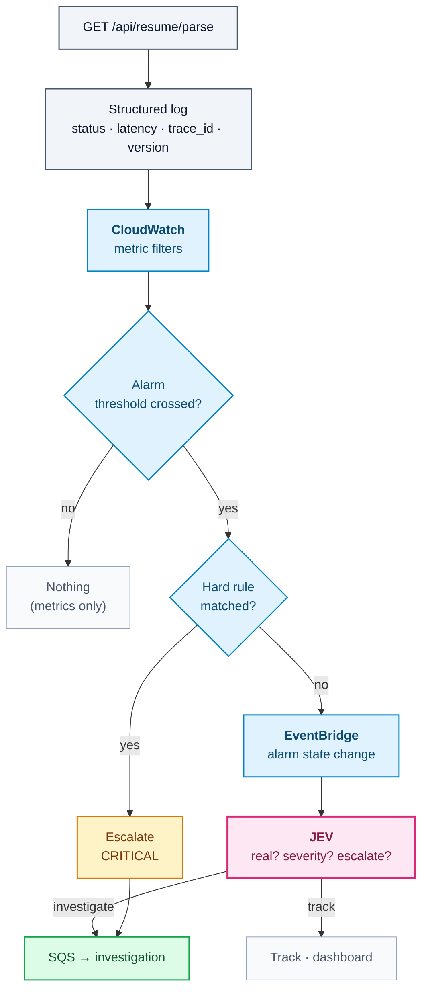
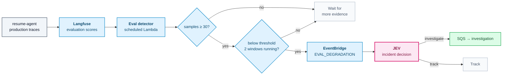
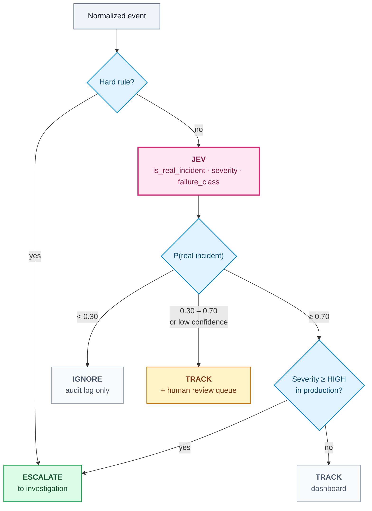
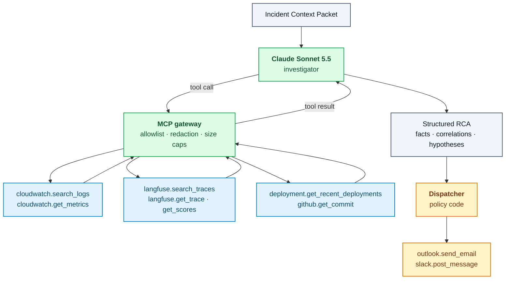
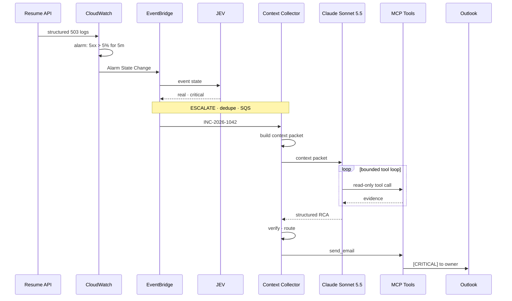

<!--
  SEO
    Primary keyword:   Agent SRE
    Secondary:         AI SRE, AI incident response, LLM observability,
                       AI agent monitoring, Langfuse observability,
                       AWS CloudWatch AI monitoring, MCP observability,
                       LLM incident detection, AI root cause analysis,
                       agent evaluation monitoring, JEV, Claude Sonnet 5.5,
                       Amazon Bedrock
    Slug:              agent-sre-ai-incident-response-jev
-->


## Introduction: Why an Agent SRE Needs a Decision Layer

An **Agent SRE** is a system that does part of an on-call engineer's job for AI-heavy production stacks. It watches APIs, infrastructure, and LLM agents. It decides which signals are real incidents. Then it investigates them and routes a useful summary to the people who own the problem.

This post is a case study of an Agent SRE I designed using **JEV**, **AWS CloudWatch**, **Amazon EventBridge**, **Langfuse**, **MCP**, and **Claude Sonnet 5.5 on Amazon Bedrock**.

The core design decision is simple to state and easy to get wrong:

> **The LLM is not the first thing that looks at an event.** Deterministic detectors measure, JEV decides, and the LLM investigates only what survived that decision.

Everything else in the architecture follows from that split:

**DETECT → DECIDE → INVESTIGATE → EXPLAIN → ESCALATE → RESOLVE**

> 📌 **Scope note.** This is an architecture write-up, not a production report. The code is illustrative: it shows the shape of each component, not a drop-in implementation. I don't quote production metrics, because none of them would be honest in a design document. Where a capability belongs to my design rather than to a product (JEV, Langfuse, AWS, MCP), I say so.

---

## The Problem: Observability Tells You Something Broke

Traditional observability is good at one thing: telling you a number crossed a line. A CloudWatch alarm fires, a dashboard turns red, a pager goes off.

What it doesn't tell you is whether you should care. An on-call engineer still has to answer eight questions, usually at 3 a.m.:

1. Did something actually go wrong?
2. Is it severe enough to matter?
3. Is it noise, or a real incident?
4. What evidence explains it?
5. Which agent, service, or version is responsible?
6. What's the probable root cause?
7. Who needs to know?
8. What should the team do next?

Dashboards answer none of these directly. Engineers answer them by opening five tabs, scrolling logs, cross-referencing a deploy timeline, and building a mental model of the failure.

An Agent SRE automates that first-responder work. The goal isn't to remove the engineer. It's to hand them a **pre-investigated incident** instead of a raw alarm.

---

## Why AI Agent Monitoring Makes Incident Response Harder

LLM agents add failure modes that classic SRE tooling doesn't see.

### Failures That Return HTTP 200

A conventional service fails loudly: a 500, a timeout, a crash. An agent can fail **quietly**. It returns a `200 OK` with a confident, well-formatted, wrong answer.

The request succeeded. The product didn't.

### Quality Is a Distribution, Not a Status Code

Agent correctness is measured with **evaluations**: answer correctness, faithfulness, retrieval relevance, tool selection accuracy. Those are statistical signals over many traces. One bad score means almost nothing. A sustained drop across hundreds of traces means a lot.

### Root Causes Span Layers

An agent regression can come from a prompt change, a model version, a retrieval index rebuild, a slow tool, an upstream rate limit, or a plain infrastructure fault. The evidence is split across systems:

- **CloudWatch** has the logs, metrics, and alarms.
- **Langfuse** has the traces, generations, tool calls, and evaluation scores.
- **GitHub / the deploy pipeline** has what changed and when.

No single tool holds the full story. That's why **LLM observability** and infrastructure observability have to be joined before anyone can reason about a root cause.

---

## The Core Idea: Separate Detection from Reasoning

The tempting design is to send every failure to an LLM and ask "is this serious?":

```text
API error  →  LLM  →  "Is this serious?"
```

That design fails in predictable ways:

- **Cost scales with traffic, not with incidents.** An outage that produces 10,000 failed requests produces 10,000 model calls.
- **Latency is wrong for the job.** A generative call per event is slow, and you need to triage fast.
- **It's non-deterministic at the worst layer.** Whether something pages a human should be auditable and reproducible.
- **It drowns the reasoning in noise.** The model sees one event at a time, with no aggregate, baseline, or correlation.

The better design puts cheap, measurable, auditable layers in front of the expensive one:

```text
API error
  → Metrics / logs          (CloudWatch, Langfuse)
  → Event routing           (EventBridge)
  → Incident decision       (JEV + policy code)
  → Context collection      (Lambda)
  → LLM investigation       (Claude Sonnet 5.5 on Bedrock)
```

What that buys:

| Property | Why the layered design wins |
|---|---|
| **Lower cost** | Model calls scale with *incidents*, not *events* |
| **Lower latency** | Thresholds and JEV decisions run in milliseconds to sub-second, not multi-second generations |
| **Less noise** | Aggregation, baselines, and deduplication happen before anyone is notified |
| **Better determinism** | Hard rules live in code; JEV answers are constrained to the options you define |
| **Scalability** | SQS absorbs bursts; investigation concurrency is capped |
| **Auditability** | Every escalation decision is logged with its inputs, answers, and confidence |
| **Clear responsibility** | Detection, decision, and reasoning can be tested and evaluated independently |

---

## Where JEV Fits in the Agent SRE

This is the part that's easy to misread, so it's worth being precise.

[JEV](/ai%20engineering/2026/10/06/jev-decoded/) is TypeSafe AI's **System One decision model**. It doesn't generate text. You send it a **state** (context) and a set of typed **questions** about that state, and it returns typed answers with probabilities:

- **Noul** — yes/no, as a probability. *"Is this a real incident?"*
- **Choice** — one of a fixed set of options. *"Which failure class is this?"*
- **Score** — a position on ordered levels. *"How severe is this?"*

Choice and Score answers also carry a **confidence** derived from the shape of the distribution.

So in this design, JEV is **not** a monitoring tool and **not** a log store. It's the **incident decision layer**: the component that looks at an aggregated signal and decides whether to ignore, track, investigate, or escalate.

### The Division of Labour

| Component | Role in the Agent SRE |
|---|---|
| **JEV** | Incident decisioning: real vs. noise, severity, escalation |
| **Policy code** | Hard rules, thresholds, and the final action on JEV's answers |
| **AWS CloudWatch** | Infrastructure and application telemetry: logs, metrics, alarms |
| **Langfuse** | LLM and agent observability: traces, generations, tool calls, evaluations |
| **Amazon EventBridge** | Event routing between producers and the decision layer |
| **AWS Lambda** | Detectors, context collection, dispatching |
| **Amazon SQS** | Buffering and burst protection before investigation |
| **Amazon DynamoDB** | Incident state, deduplication, and history |
| **Claude Sonnet 5.5 (Bedrock)** | Investigation, root cause analysis, summarization |
| **MCP** | Tool and context access for the investigator and the dispatcher |
| **Outlook / Slack** | Notification delivery |

### Why a Decision Model and Not Just Rules?

A fair question: why not write `if error_rate > 0.2: page()` and stop there?

You should, for the **exact** cases. Some conditions are non-negotiable: a sustained 504 rate on a production payment endpoint pages someone regardless of what any model says. Those rules live in code.

But a large share of triage is **bounded judgment**: deciding whether a 429 burst is a misbehaving client or a real capacity problem, whether a 404 spike is a broken route or a crawler, whether an evaluation drop lines up with a deploy. Those are snap judgments a senior engineer makes in seconds, given the right context. That's exactly the shape of a System One question.

So the decision layer is a cascade:

1. **Rules** handle what's exact (hard floors and hard ceilings).
2. **JEV** handles bounded judgment over the aggregated state.
3. **Confidence** decides whether JEV's answer is acted on automatically or sent to a human.
4. **The LLM** is reserved for open-ended investigation.

---

## Agent SRE Architecture: End-to-End Design

```mermaid
flowchart LR
  accTitle: Agent SRE high-level architecture
  accDescr: Production APIs report to CloudWatch and AI agents report to Langfuse. Both feed EventBridge, which routes events to JEV. JEV either tracks the event as metrics or escalates it to a context collector that gathers CloudWatch, Langfuse, and deployment context for Claude Sonnet 5.5. The investigation goes to a policy dispatcher that uses MCP tools to notify Outlook and Slack and open an incident record.

  API["Production APIs"] --> CW["<b>CloudWatch</b><br/>logs · metrics · alarms"]
  AG["AI Agents"] --> LF["<b>Langfuse</b><br/>traces · evals"]
  DEP["Deploy pipeline<br/>GitHub"] --> EB
  CW --> EB["<b>EventBridge</b><br/>event bus"]
  LF -->|"eval detector<br/>(scheduled Lambda)"| EB
  EB --> JEV["<b>JEV</b><br/>incident decision"]
  JEV -->|"ignore / track"| MET["Metrics · audit log"]
  JEV -->|"investigate"| Q["<b>SQS</b><br/>incident queue"]
  Q --> CC["<b>Context Collector</b><br/>Lambda"]
  CC --> DDB[("DynamoDB<br/>incident state")]
  CC --> LLM["<b>Claude Sonnet 5.5</b><br/>Amazon Bedrock"]
  LLM <-->|"read-only tools"| MCP["<b>MCP</b><br/>tool layer"]
  LLM --> DISP["<b>Dispatcher</b><br/>policy routing"]
  DISP --> MCP2["MCP<br/>notify tools"]
  MCP2 --> OUT["Outlook"]
  MCP2 --> SL["Slack"]
  MCP2 --> INC["Incident system"]

  classDef base fill:#f1f5f9,stroke:#475569,stroke-width:1.5px,color:#0f172a
  classDef aws fill:#e0f2fe,stroke:#0284c7,stroke-width:1.5px,color:#0c4a6e
  classDef jev fill:#fce7f3,stroke:#db2777,stroke-width:2.5px,color:#831843
  classDef llm fill:#dcfce7,stroke:#16a34a,stroke-width:1.5px,color:#14532d
  classDef notify fill:#fef3c7,stroke:#d97706,stroke-width:1.5px,color:#78350f
  classDef muted fill:#f8fafc,stroke:#94a3b8,stroke-width:1px,color:#475569

  class API,AG,DEP base
  class CW,LF,EB,Q,CC,DDB aws
  class JEV jev
  class LLM,MCP llm
  class DISP,MCP2,OUT,SL,INC notify
  class MET muted
```



*Agent SRE architecture: signals converge on EventBridge, JEV decides what deserves investigation, and only escalated incidents reach the LLM.*

Three structural choices are worth calling out:

- **JEV sits directly after EventBridge**, before any context collection. Context collection costs API calls; the decision is cheap, so it goes first.
- **SQS sits between the decision and the investigation.** An outage that escalates many fingerprints at once shouldn't fan out into an unbounded number of concurrent Bedrock calls.
- **The dispatcher is not the LLM.** The model proposes; deterministic policy decides who gets notified.

---

## Signal 1: API Failures and LLM Incident Detection

Take a concrete endpoint: `GET /api/resume/parse`, backed by a resume-parsing agent.

### Status Codes Are Hints, Not Verdicts

| Status | Typical meaning | Default treatment |
|---|---|---|
| `200` / `201` | Success | Normal |
| `400` / `404` | Client error, often expected | Low; watch the *rate* |
| `401` / `403` | Auth / permissions | Low, unless sudden and widespread |
| `429` | Rate limited | Investigate *who* is being limited |
| `500` / `502` / `503` | Server / upstream failure | Potentially high |
| `504` | Gateway timeout | Potentially critical |

The trap is treating any one of these as an incident. A single `503` is weather. A **sustained** `503` rate is climate.

```text
503 once                                          → track
503 rate = 20% for 5 minutes                      → high
503 rate = 40% + production + p95 latency up
        + deployment 4 minutes earlier            → critical, investigate
```

### Step 1: Emit Structured Logs

Everything downstream depends on logs being machine-readable and carrying the right join keys:

```json
{
  "timestamp": "2026-10-07T12:21:04Z",
  "service": "resume-parser",
  "environment": "production",
  "endpoint": "/api/resume/parse",
  "request_id": "req_8f2c",
  "trace_id": "lf_trace_41ab",
  "version": "v1.42.0",
  "status_code": 503,
  "latency_ms": 4832,
  "error_type": "upstream_timeout",
  "level": "ERROR"
}
```

The important fields are `trace_id` (joins CloudWatch to Langfuse), `version` (joins failures to deployments), and `service` / `environment` (join to ownership).

### Step 2: Turn Logs into Metrics and Alarms

CloudWatch metric filters (or the Embedded Metric Format) turn those logs into time series: 5xx rate, p95 latency, timeout count, per endpoint. Alarms on those series emit **CloudWatch Alarm State Change** events, which EventBridge can route.

### Step 3: Declare Per-Endpoint Policy

Thresholds belong to the endpoint, not to the platform. A 404 rate that's alarming on `/api/resume/parse` is normal on a search endpoint.

```yaml
api_policies:
  resume-parser:/api/resume/parse:
    environment: production
    expected_statuses: [200, 201]
    low:      { statuses: [400, 404], rate: 0.10, window: 10m }
    high:     { statuses: [500, 502, 503], rate: 0.05, window: 5m, min_requests: 200 }
    critical: { statuses: [504], rate: 0.02, window: 2m, min_requests: 100 }
    hard_rules:
      - "5xx_rate >= 0.40 for 5m -> CRITICAL"   # bypasses JEV, always escalates
```

Note `min_requests`. A 50% error rate on four requests at 3 a.m. isn't the same event as a 50% error rate on 4,000.



*API incident flow: thresholds filter, hard rules short-circuit, and JEV judges the ambiguous middle.*

---

## Signal 2: Agent Evaluation Monitoring with Langfuse

The second signal source is quieter and, for agents, often more important: **evaluation degradation**.

Say `resume-agent` is evaluated on four metrics, recorded as Langfuse scores on its production traces (from an LLM judge, a JEV evaluator, or human annotation):

| Metric | Baseline | Threshold |
|---|---|---|
| Answer Correctness | 92% | 80% |
| Faithfulness | 95% | 85% |
| Retrieval Relevance | 90% | 75% |
| Tool Selection Accuracy | 97% | 90% |

Now Answer Correctness reads **67%**. Is that an incident?

### The Sample-Size Trap

It depends entirely on **how many evaluations produced that 67%**.

A 95% Wilson confidence interval makes the point:

| Observed | Samples | 95% interval | Conclusively below 80%? |
|---|---|---|---|
| 2 / 3 correct (67%) | 3 | 21% – 94% | No: tells you almost nothing |
| 20 / 30 correct (67%) | 30 | 49% – 81% | **No**: the upper bound still touches 80% |
| 80 / 120 correct (67%) | 120 | 58% – 75% | **Yes** |

Even at 30 samples, a 67% reading doesn't prove you're under an 80% threshold. That's why one window should never page anyone, and why the policy combines several guards:

```yaml
agent: resume-agent
metric: answer_correctness
baseline: 0.92
threshold: 0.80
window: 30m
minimum_samples: 30
consecutive_breaches: 2          # two windows in a row
breach_test: wilson_upper_95     # optional: upper bound must be < threshold
```

- **Minimum sample size** stops tiny windows from firing.
- **Evaluation windows** aggregate over time instead of reacting per trace.
- **Consecutive breaches** require persistence, which cuts statistical flukes sharply.
- **Baselines** let you alert on a *drop from normal*, not just an absolute floor.
- **An interval test** (optional) makes "below threshold" a statistical statement, not a point estimate.

### Wiring Langfuse into EventBridge

Langfuse doesn't publish to EventBridge natively, so this is a component of my design: a **scheduled eval detector** (an EventBridge Scheduler → Lambda job) that pulls recent scores through the Langfuse API, aggregates per agent and metric, applies the policy, and publishes a custom event.

```python
# Illustrative eval detector, run every 5 minutes by EventBridge Scheduler.
def detect_eval_degradation(policy, scores):
    window = [s for s in scores if s.name == policy.metric and in_window(s, policy.window)]
    n = len(window)
    if n < policy.minimum_samples:
        return None                                   # not enough evidence yet

    k = sum(1 for s in window if s.value >= 0.5)      # binary correctness
    observed = k / n
    _, upper = wilson_interval(k, n)

    breached = upper < policy.threshold if policy.breach_test else observed < policy.threshold
    state = record_window(policy, breached)           # DynamoDB: per-window breach history

    if state.consecutive_breaches < policy.consecutive_breaches:
        return None

    return {
        "source": "agent-sre.langfuse",
        "detail-type": "EVAL_DEGRADATION",
        "detail": {
            "agent": policy.agent,
            "metric": policy.metric,
            "observed": round(observed, 3),
            "baseline": policy.baseline,
            "threshold": policy.threshold,
            "samples": n,
            "consecutive_breaches": state.consecutive_breaches,
            "sample_trace_ids": [s.trace_id for s in window if s.value < 0.5][:20],
        },
    }
```



*Agent evaluation monitoring: Langfuse scores become an incident signal only after sample-size and persistence guards pass.*

The payoff is that **agent quality regressions now flow through the same pipeline as 503s**. One event bus, one decision layer, one incident model.

---

## JEV as the Incident Decision Layer

Every event that reaches JEV has the same normalized envelope, whatever its source:

```json
{
  "event_type": "API_ERROR_RATE",
  "service": "resume-parser",
  "environment": "production",
  "endpoint": "/api/resume/parse",
  "signal": { "status": 503, "error_rate": 0.21, "window": "5m", "requests": 1280 },
  "latency": { "p95_ms": 4832, "baseline_p95_ms": 950 },
  "recent_deployment": { "version": "v1.42.0", "minutes_ago": 4 },
  "related_open_signals": ["EVAL_DEGRADATION:resume-agent:answer_correctness"],
  "history": { "same_fingerprint_last_7d": 0 }
}
```

Note what this is: a **small, aggregated state**, not raw logs. JEV is asked for a snap judgment, so it gets the summary a senior engineer would glance at.

### The Questions JEV Answers

One request asks several questions about the same state; System One models evaluate them in parallel.

```python
from typesafe_sdk import Choice, Noul, Score, TypeSafeClient

client = TypeSafeClient()

questions = {
    "is_real_incident": Noul(
        instructions=(
            "Does this state describe a genuine service degradation affecting "
            "users, rather than expected client errors, a crawler, or a transient blip?"
        ),
    ),
    "severity": Score(
        instructions="How severe is the user impact described in this state?",
        criteria=["negligible", "minor", "major", "critical"],
    ),
    "failure_class": Choice(
        instructions="Which failure class best explains this state?",
        criteria={
            "change_induced": "Degradation that began shortly after a deployment or config change",
            "dependency": "An upstream service, model provider, or tool is failing or slow",
            "capacity": "Rate limits, throttling, or resource exhaustion",
            "client_behaviour": "Errors caused by callers, such as bad input or retries",
            "other": "None of the above",
        },
    ),
}

response = client.system_one(state=event_envelope, questions=questions)
```

*Illustrative; it uses the SDK shapes from the [JEV Decoded](/ai%20engineering/2026/10/06/jev-decoded/) post. Check the current TypeSafe docs before building on exact signatures.*

### Policy Code Owns the Action

JEV returns answers. **Code decides what to do with them**, with thresholds that scale with risk:

```python
def decide(event, answers):
    if matches_hard_rule(event):                          # exact rules first
        return Decision("ESCALATE", severity="CRITICAL", reason="hard_rule")

    real = answers["is_real_incident"].noul
    sev = answers["severity"]
    cls = answers["failure_class"]

    if real < 0.30:
        return Decision("IGNORE", reason="jev_not_incident")
    if real < 0.70 or sev.confidence < 0.50:
        return Decision("TRACK", reason="uncertain", review=True)   # dashboard + human review queue

    severity = map_score(sev.score)                       # e.g. 2.4 → HIGH
    if is_production(event) and severity in {"HIGH", "CRITICAL"}:
        return Decision("ESCALATE", severity=severity, hint=cls.choice)

    return Decision("TRACK", severity=severity)
```

The thresholds above are starting points, not constants. **Calibrate them against your own incident history** before trusting them.



*JEV decision flow: rules first, JEV for bounded judgment, confidence to decide whether the answer is trusted.*

Two details make this layer trustworthy:

- **Every decision is logged**: the state, the questions, the answers, the confidence, and the action. When someone asks "why didn't this page me?", there's a precise answer.
- **The uncertain middle goes to humans.** Low-confidence decisions are a review queue, and that queue doubles as labelled data for tuning thresholds later.

---

## Building the Incident Context Packet

Once an incident is escalated, the **Context Collector** Lambda pulls the evidence. Its output is an **Incident Context Packet**: structured, bounded, and pre-filtered.

```json
{
  "incident_id": "INC-2026-1042",
  "fingerprint": "9c1e…a7",
  "service": "resume-parser",
  "environment": "production",
  "severity": "CRITICAL",
  "decision": { "source": "jev", "p_real": 0.97, "failure_class_hint": "change_induced" },

  "api_metrics": {
    "error_rate": 0.21,
    "error_rate_baseline": 0.004,
    "latency_p95_ms": 4832,
    "latency_p95_baseline_ms": 950,
    "requests_in_window": 1280
  },

  "cloudwatch": {
    "alarms": [{ "id": "E1", "name": "resume-parser-5xx-rate", "state_since": "12:21:00Z" }],
    "error_clusters": [
      { "id": "E2", "error_type": "upstream_timeout", "count": 231, "first_seen": "12:19:40Z",
        "sample": "TimeoutError: document_parser exceeded 4000ms" }
    ]
  },

  "langfuse": {
    "failed_traces": [{ "id": "E3", "trace_id": "lf_trace_41ab", "failing_span": "tool:document_parser" }],
    "evaluation_scores": { "id": "E4", "answer_correctness": { "observed": 0.67, "baseline": 0.92, "samples": 120 } },
    "tool_failures": [{ "id": "E5", "tool": "document_parser", "error_rate": 0.87 }]
  },

  "deployment": {
    "id": "E6",
    "version": "v1.42.0",
    "previous_version": "v1.41.3",
    "deployed_at": "12:15:02Z",
    "changed_paths": ["tools/document_parser/client.py", "config/timeouts.yaml"]
  },

  "ownership": { "service_owner": "ml-platform-team" }
}
```

Design rules for the packet:

- **Summarize before you send.** Error *clusters* with counts and one sample, not 10,000 log lines.
- **Bound every list.** A fixed cap on traces, errors, and samples keeps the token cost per investigation predictable.
- **Give every piece of evidence an ID** (`E1`…`E6`). The model will cite them, and code can verify the citations.
- **Redact before you collect.** PII and secrets are stripped by the collector, never by the model.
- **Carry baselines alongside values.** "4832 ms" means nothing without "normally 950 ms".

This is the main reason the investigation is good. **The LLM's output quality is bounded by the evidence you give it.** An uncontrolled log dump doesn't make the model smarter. It makes it slower, more expensive, and more likely to anchor on an irrelevant line.

---

## AI Root Cause Analysis with Claude Sonnet 5.5 on Amazon Bedrock

Claude Sonnet 5.5 is the **investigation and reasoning layer**. It's not responsible for detection, and it's not responsible for deciding who gets paged. Its job is the part that genuinely needs open-ended reasoning:

- Analyze logs, traces, metrics, and evaluation degradation together
- Correlate deployment timing with onset
- Identify the affected components
- Propose a probable root cause, with evidence
- Recommend remediation
- Write the incident summary a human will read

### The Investigator's Contract

The system prompt is less about cleverness and more about **epistemic discipline**:

```text
You are an incident investigator for production AI systems.

Use ONLY the evidence in the incident packet and in tool results.
Never invent log lines, metrics, versions, timestamps, or people.

Separate your findings into four kinds:
  - observed_facts:   directly present in the evidence; cite evidence IDs
  - correlations:     things that co-occur in time; cite evidence IDs
  - hypotheses:       proposed causes; say what evidence supports them
                      and what evidence would refute them
  - recommendations:  actions for a human; mark anything destructive

Correlation is not causation. If the evidence is insufficient, say so,
lower your confidence, and list what you would need to check next.
```

### Structured Output, Verified by Code

The response is constrained with structured outputs, so it's always parseable. The Bedrock call uses the Anthropic SDK's Bedrock client:

```python
import json
from anthropic import AnthropicBedrockMantle

client = AnthropicBedrockMantle(aws_region="us-east-1")

response = client.messages.create(
    model="anthropic.claude-sonnet-5-5",
    max_tokens=16000,
    system=INVESTIGATOR_PROMPT,
    messages=[{"role": "user", "content": json.dumps(context_packet)}],
    output_config={
        "effort": "medium",
        "format": {"type": "json_schema", "schema": RCA_SCHEMA},
    },
)

if response.stop_reason != "end_turn":           # refusal, max_tokens, ...
    return fallback_summary(context_packet)       # deterministic template, still notify

rca = json.loads(next(b.text for b in response.content if b.type == "text"))
verify_citations(rca, context_packet)             # reject claims citing unknown evidence IDs
```

An example result:

```json
{
  "severity": "CRITICAL",
  "title": "Resume parser upstream timeout after v1.42.0",
  "customer_impact": "About 21% of /api/resume/parse requests are failing with 503; answer correctness on successful responses has dropped from 92% to 67%.",
  "observed_facts": [
    { "claim": "5xx rate rose from 0.4% to 21%", "evidence": ["E1"] },
    { "claim": "231 upstream_timeout errors from document_parser since 12:19:40Z", "evidence": ["E2"] },
    { "claim": "v1.42.0 deployed at 12:15:02Z and changed config/timeouts.yaml", "evidence": ["E6"] }
  ],
  "correlations": [
    { "claim": "Error onset began ~4.5 minutes after the v1.42.0 deployment", "evidence": ["E2", "E6"] },
    { "claim": "87% of document_parser tool calls fail in the same window", "evidence": ["E5"] }
  ],
  "root_cause": {
    "hypothesis": "v1.42.0 lowered or misconfigured the document_parser timeout, causing tool calls to fail and the agent to answer without parsed content.",
    "confidence": "high",
    "would_refute": "document_parser latency was already elevated before 12:15, or failures also occur on pods still running v1.41.3"
  },
  "recommended_action": "Compare config/timeouts.yaml between v1.41.3 and v1.42.0; if confirmed, roll back v1.42.0.",
  "destructive_actions": ["rollback v1.42.0"],
  "human_required": true,
  "suggested_owner": "ml-platform-team"
}
```

Three deliberate choices in that schema:

- **`would_refute`** forces the model to state a falsification test. It's the single most useful field for an engineer who has to verify the hypothesis fast.
- **`confidence` is ordinal (`low` / `medium` / `high`), not `0.91`.** A generative model's self-reported decimal looks precise and isn't calibrated. That's a real contrast with JEV, whose confidence is computed from an actual probability distribution. Don't present the two as the same kind of number.
- **`suggested_owner` is a suggestion.** Routing uses ownership metadata, as covered below.

---

## MCP as the Investigation Tool Layer

The context packet covers the common case. Real investigations branch: *"are failures limited to the new pods?"*, *"what did the latency look like before the deploy?"*, *"what's in that commit?"*.

That's where **MCP** fits. It gives the investigator a standard way to reach the systems that hold evidence, **after** JEV has decided an investigation is warranted.

> **JEV decides whether to investigate. The LLM uses MCP tools to gather additional evidence. MCP is the tool and context access layer for the investigation agent.**

### The Tool Surface

| Tool | Purpose | Access |
|---|---|---|
| `cloudwatch.search_logs()` | Query log groups for a window and filter | Read |
| `cloudwatch.get_metrics()` | Pull a metric series, e.g. pre-deploy baseline | Read |
| `cloudwatch.get_alarm()` | Alarm config and state history | Read |
| `langfuse.search_traces()` | Find traces by agent, version, or error | Read |
| `langfuse.get_trace()` | Inspect spans, tool calls, generations | Read |
| `langfuse.get_scores()` | Evaluation scores for a trace or window | Read |
| `deployment.get_recent_deployments()` | What shipped, where, and when | Read |
| `github.get_recent_deployment()` / `github.get_commit()` | Diff and commit metadata | Read |
| `outlook.find_team_member()` | Resolve an owner to people | **Dispatcher only** |
| `outlook.send_email()` | Deliver the notification | **Dispatcher only** |

The tool names are this design's interface, not product APIs. In practice they're thin wrappers over real MCP servers: Langfuse ships an MCP server for querying its data, AWS publishes open-source MCP servers (including CloudWatch), and Outlook/Slack access typically goes through Microsoft Graph or Slack MCP servers. Wrapping them lets you enforce an **allowlist**, cap result sizes, and redact output before it reaches the model.

Note the last two rows. **The investigator never holds the send tool.** Notification is a policy action, so it belongs to the dispatcher.



*MCP investigation flow: read-only tools for the investigator, write tools only for the deterministic dispatcher.*

A typical tool trajectory for the running example:

```text
1. cloudwatch.get_metrics(document_parser latency, 11:45–12:30)
   → latency flat at ~900 ms until 12:16, then ~4,000 ms ceiling hits
2. langfuse.search_traces(agent=resume-agent, version=v1.41.3, window=12:16–12:30)
   → 0 failed tool calls on remaining v1.41.3 pods
3. github.get_commit(v1.42.0)
   → config/timeouts.yaml: document_parser.timeout_ms 12000 → 4000
```

Step 2 is the model running its own `would_refute` test. That's the behaviour you want from an investigator: **look for the evidence that would prove you wrong**, not just the evidence that agrees.

Cap the loop: a maximum number of tool calls and a wall-clock budget per investigation. When either runs out, the model reports what it has, at the confidence it has.

---

## Correlating Logs, Traces, Evaluations and Deployments

Correlation is where an Agent SRE earns its keep. Without it, one root cause shows up as five unrelated alerts, each paging someone different.

Here's the running example as a timeline:

| Time (UTC) | Signal | Source |
|---|---|---|
| 12:00 | Agent evaluation = 94% | Langfuse |
| 12:15 | Deployment `v1.42.0` | GitHub / deploy pipeline |
| 12:17 | RAG / tool latency increases | Langfuse spans |
| 12:19 | `document_parser` tool errors increase | Langfuse + CloudWatch |
| 12:21 | API 503 rate increases | CloudWatch alarm |
| 12:23 | Agent evaluation = 67% | Langfuse eval detector |

Treated independently, that's a deploy notification, a latency alarm, a tool-error alarm, a 5xx alarm, and an eval alert. Treated together, it's **one incident with a very strong lead**.

```mermaid
flowchart LR
  accTitle: Incident correlation timeline
  accDescr: A timeline from 12:00 to 12:23 shows a healthy evaluation score, a deployment at 12:15, rising latency at 12:17, rising tool errors at 12:19, rising API 503s at 12:21, and an evaluation drop at 12:23. The correlation engine groups them by service, environment, and time window into one incident group, which JEV evaluates and escalates to a single LLM investigation.

  subgraph TL["Timeline · resume-parser · production"]
    direction LR
    A["12:00<br/>eval 94%"] --> B["12:15<br/>deploy v1.42.0"]
    B --> C["12:17<br/>latency ↑"]
    C --> D["12:19<br/>tool errors ↑"]
    D --> E["12:21<br/>API 503 ↑"]
    E --> F["12:23<br/>eval 67%"]
  end

  TL --> COR["<b>Correlation engine</b><br/>same service + env<br/>within 30 min window"]
  COR --> JEV["<b>JEV</b><br/>one incident group"]
  JEV --> INC["<b>INC-2026-1042</b><br/>one investigation"]

  classDef base fill:#f1f5f9,stroke:#475569,stroke-width:1.5px,color:#0f172a
  classDef aws fill:#e0f2fe,stroke:#0284c7,stroke-width:1.5px,color:#0c4a6e
  classDef jev fill:#fce7f3,stroke:#db2777,stroke-width:2.5px,color:#831843
  classDef llm fill:#dcfce7,stroke:#16a34a,stroke-width:1.5px,color:#14532d
  classDef notify fill:#fef3c7,stroke:#d97706,stroke-width:1.5px,color:#78350f

  class A,C,D,E,F base
  class B notify
  class COR aws
  class JEV jev
  class INC llm
  style TL fill:#f8fafc,stroke:#94a3b8,stroke-dasharray:4 3,color:#334155
```



*Correlation timeline: five signals from three systems collapse into one incident group before JEV and the LLM see them.*

### How the Correlation Engine Works

It's deliberately simple, and that's the point. It isn't the LLM; it's a join:

```python
CORRELATION_WINDOW = timedelta(minutes=30)

def correlate(new_event, open_groups):
    for group in open_groups.for_service(new_event.service, new_event.environment):
        if new_event.timestamp - group.last_seen <= CORRELATION_WINDOW:
            group.add(new_event)
            return group
    return IncidentGroup.open(new_event)

def annotate(group):
    deploy = group.latest("DEPLOYMENT")
    onset = group.first_degradation()
    if deploy and timedelta(0) <= onset.timestamp - deploy.timestamp <= timedelta(minutes=30):
        group.tags.add("change_correlated")       # a correlation, not a verdict
```

Joining is cheap because the logs carry `service`, `environment`, `version`, and `trace_id`. **Correlation quality is decided at instrumentation time**, long before an incident happens.

Why this beats per-alert handling:

- **One investigation per cause**, not per symptom.
- **Ordering is evidence.** Deploy → latency → errors → 503 → eval drop is a causal *story*; the same five alerts in random order aren't.
- **JEV gets a richer state.** "503s plus eval drop plus recent deploy" is a much easier judgment than "503s".
- **The LLM gets a timeline**, not thousands of independent log entries.

And the caveat that stays in the output: `change_correlated` is a tag, not a conclusion. Deploys happen constantly, so some will always be near some incident by coincidence. The investigator has to test the link, as in step 2 of the tool trajectory above.

---

## Incident Deduplication and Noise Suppression

Without deduplication, an Agent SRE becomes a very expensive pager storm:

```text
10,000 failed requests → 10,000 LLM calls → 10,000 notifications      ✗
10,000 failed requests → JEV → fingerprint → 1 incident
                       → 1 investigation → 1 notification              ✓
```

### The Incident Fingerprint

```python
fingerprint = sha256(
    f"{service}|{endpoint}|{error_type}|{environment}".encode()
).hexdigest()
```

Choose the fields carefully:

- **Don't include the status code** if 502 and 503 are the same outage. Use the normalized `error_type` (`upstream_timeout`), or you'll split one incident in two.
- **Don't include request IDs, timestamps, or messages with variable content.** Every event becomes unique and deduplication silently stops working.
- **Fingerprints dedupe one symptom; correlation groups merge related symptoms.** You need both.

### Incident State in DynamoDB

| Attribute | Purpose |
|---|---|
| `fingerprint` (PK) | Dedup key |
| `incident_id` | Human-facing ID, e.g. `INC-2026-1042` |
| `group_id` | Correlation group it belongs to |
| `first_seen` / `last_seen` | Onset and recency |
| `count` | Events folded into this incident |
| `severity` | Current severity; can be raised, not silently lowered |
| `status` | `OPEN → INVESTIGATING → NOTIFIED → RESOLVED` |
| `owner` | Routing target from ownership metadata |
| `trace_ids` | Bounded sample of Langfuse traces |
| `ttl` | Auto-expire resolved incidents' dedup rows |

The atomic part matters. Opening an incident uses a **conditional write** (`attribute_not_exists(fingerprint)`), so two Lambdas seeing the same burst can't both start an investigation. The loser increments `count` and updates `last_seen` instead.

Two more noise controls:

- **Re-escalate only on change.** A known `INVESTIGATING` incident doesn't re-notify on new events. It re-notifies when **severity increases** or **scope widens** (a new endpoint, environment, or agent joins the group).
- **SQS absorbs the burst.** Investigation Lambdas consume with capped concurrency, so a large outage queues work instead of hammering Bedrock.

---

## Escalation and Team Routing

Notification is **policy-driven**. The LLM never decides, on its own, who gets an email.

| Severity | Channels |
|---|---|
| **CRITICAL** | Outlook + Slack + incident ticket; page the on-call |
| **HIGH** | Outlook / team channel |
| **MEDIUM** | Dashboard / tracking queue |
| **LOW** | Metrics only |

### Ownership Metadata Is the Router

Ownership is declared, versioned config, not something a model infers:

```yaml
ownership:
  agents:
    resume-agent: ml-platform-team
  services:
    resume-parser: ml-platform-team
  repositories:
    org/resume-parser: ml-platform-team
  environments:
    production: { escalation: on-call }
    staging:    { escalation: none }
teams:
  ml-platform-team:
    outlook: ml-platform@company.example
    slack: "#ml-platform-incidents"
```

The same metadata should be on every Langfuse trace (`agent`, `version`, `team`, `environment`). Then any failing trace answers *which agent, which version, which team* on its own.

### The Dispatcher

```python
def dispatch(incident, rca):
    owner = resolve_owner(incident)                     # ownership config, not rca["suggested_owner"]
    if rca.get("suggested_owner") and rca["suggested_owner"] != owner:
        incident.flag("owner_mismatch")                 # surface it, don't act on it

    for channel in CHANNELS[incident.severity]:
        mcp.call(f"{channel}.send", to=TEAMS[owner][channel],
                 body=render_summary(incident, rca))    # template + verified RCA fields
    incidents.update(incident.id, status="NOTIFIED", owner=owner)
```

The notification an engineer receives:

```text
Subject: [CRITICAL] resume-parser — 21% of /api/resume/parse requests failing (INC-2026-1042)

Impact:       ~21% of requests failing with 503; answer correctness 92% → 67%
Environment:  production · v1.42.0
Likely cause: document_parser timeout lowered in v1.42.0 (confidence: high)

Evidence:
  • 5xx rate 0.4% → 21% since 12:21 UTC                    [CloudWatch]
  • 231 upstream_timeout errors from document_parser       [CloudWatch]
  • 0 tool failures on pods still running v1.41.3          [Langfuse]
  • timeouts.yaml: document_parser 12000 ms → 4000 ms      [GitHub]

Suggested next step (human approval required):
  Confirm the config diff, then roll back v1.42.0.

Links: Langfuse trace · CloudWatch dashboard · Deployment
```

The summary leads with impact, separates evidence from hypothesis, and puts the destructive action behind an explicit approval.

---

## Security and Production Considerations

An investigator with tool access to production telemetry is a privileged system. Treat it like one.

### Access Control

- **Least-privilege IAM** per component: the detector can read metrics, the collector can read logs and traces, the dispatcher can send notifications. No role does all three.
- **Read-only CloudWatch and Langfuse access** for the investigator. Scope log access to specific log groups, not `logs:*`.
- **No unrestricted production write access** for the investigation agent, ever.
- **Human approval for destructive remediation**: rollbacks, scaling changes, feature-flag flips.
- **MCP tool allowlists** per role. The investigator's tool list is fixed in code, not discoverable at runtime.

### Data Hygiene

- **Secrets never enter LLM context.** Strip tokens, keys, and connection strings in the collector. Don't rely on the model to ignore them.
- **PII redaction** before collection. Resume parsing is a good example of a workload where log payloads are full of PII.
- **Treat log content as untrusted input.** A log line or trace can contain text written by an end user, including text that looks like instructions. Keep evidence clearly delimited as data, and make sure no tool the model holds can do damage if it's misled.

### Reliability

- **SQS buffering** with a dead-letter queue for investigations that repeatedly fail.
- **LLM timeout handling**: if Bedrock is slow or unavailable, notify with the deterministic summary (signals, JEV decision, context links) rather than waiting. **The Agent SRE must degrade to a normal alerting system, never to silence.**
- **Retry policies** with backoff and jitter on Bedrock, JEV, and MCP calls; idempotent dispatch keyed by `incident_id`.
- **Rate limits** on investigations per service per hour, so one flapping service can't consume the whole budget.
- **Incident deduplication** as described above.

### Change Management

- **Prompt and version tracking.** The investigator prompt, RCA schema, JEV question set, and policy thresholds are versioned. Every incident records which versions produced it.
- **Audit logs** for every decision and every tool call.
- **Evaluate the investigator itself**, which leads to the next section.

---

## Who Watches the Agent SRE?

An Agent SRE is itself a production AI system, so it gets the same treatment it gives others. The system is recursive:

```text
Production AI systems → Agent SRE → Agent SRE is itself observable
```

### Instrument the Investigator

Every investigation is a Langfuse trace: the JEV decision, each tool call, the Bedrock generation, the dispatch. A bad RCA can then be debugged the same way a bad agent answer is.

### What to Measure

| Metric | What it tells you | How you get ground truth |
|---|---|---|
| **False-positive rate** | Escalations humans marked "not an incident" | Resolve-time label on every incident |
| **False-negative rate** | Real incidents the system missed or under-rated | Human-filed incidents with no matching fingerprint |
| **JEV decision calibration** | Whether `P(real) = 0.8` is right ~80% of the time | Compare JEV answers to resolve-time labels |
| **RCA accuracy** | Whether the root cause hypothesis was right | Responder grades: confirmed / partial / wrong |
| **Escalation accuracy** | Right team, right severity | Re-routes and severity changes after notification |
| **Investigation success rate** | Completed vs. timed out / fell back | Pipeline status |
| **Latency** | Signal → decision → notification time | Trace timings |
| **Token / cost per investigation** | Whether bounded packets stay bounded | Bedrock usage per trace |
| **Notification delivery success** | Whether the message actually arrived | Delivery receipts / API status |

The false-negative rate is the most important and the hardest to measure. A system that never pages has a perfect false-positive rate. Make "was this caught by the Agent SRE?" a mandatory field in every postmortem.



*End-to-end sequence: one alarm becomes one decision, one investigation, and one notification.*

---

## What I Would Automate Next

Each of these is a natural extension. Each also raises the stakes, so they roll out in roughly this order.

1. **Rollback recommendations with evidence.** The investigator already identifies change-correlated incidents. The next step is a structured rollback proposal (target version, blast radius, verification check), still approved by a human.
2. **Approved automated remediation.** A small allowlist of reversible actions (roll back a canary, disable a feature flag, shift traffic) executed after one-click approval, gated by JEV confidence *and* severity.
3. **Change-impact analysis.** Run the same correlation logic **before** an incident: after every deploy, compare error rate, latency, and eval scores against the previous version's window, and flag regressions early.
4. **Agent regression detection.** Treat a new prompt or model version as a deploy, and compare Langfuse eval distributions between versions rather than against a static threshold.
5. **Predictive incident detection.** Trend-based alerts (latency creeping toward a timeout ceiling, error budget burn rate), so the system escalates before the threshold is crossed.
6. **Cross-service dependency analysis.** Use trace topology to group incidents across services that share an upstream, so a single provider outage isn't investigated ten times.

---

## Key Takeaways

- **Separate detection from reasoning.** Thresholds detect, JEV decides, the LLM investigates. Putting the LLM first makes cost scale with traffic instead of incidents.
- **JEV is the incident decision layer.** It answers bounded, typed questions (real? severity? failure class?) over an aggregated state, and its confidence decides when a human should look instead.
- **Agent quality is an incident signal.** Langfuse evaluation degradation goes through the same pipeline as 5xx errors, behind sample-size and persistence guards.
- **The context packet determines RCA quality.** Bounded, redacted, baseline-annotated evidence with citable IDs beats any amount of raw logs.
- **Correlation and deduplication are the noise budget.** Fingerprints collapse duplicates; correlation groups collapse symptoms into causes.
- **The observer must be observable.** Measure false negatives, RCA accuracy, and JEV calibration, or you won't know whether the Agent SRE is helping.

---

## Related Topics

- [JEV Decoded: What It Is and What Are the Use Cases?](/ai%20engineering/2026/10/06/jev-decoded/) — the System One decision model behind the incident decision layer
- [Evaluation & Monitoring for Production LLM Agents](/engineering/evaluation-and-monitoring-for-production-llm-agents/) — LLM-as-judge, metrics, and trajectory evaluation that feed the eval signal
- [Guardrails & Safety for Production LLM Agents](/engineering/guardrails-and-safety-for-production-llm-agents/) — input, output, and tool defenses relevant to an investigator with tool access
- [Agent-to-Agent Communication: Google's A2A Protocol](/ai%20engineering/2026/07/21/agent-to-agent-communication-google-a2a-protocol/) — how agents coordinate, complementary to MCP's tool access

---

## Conclusion: An Agent SRE Is a Decision System First

Adding an LLM to CloudWatch is easy. Making that useful, cheap, and trustworthy is a design problem, and most of the design isn't about the LLM.

The architecture that works treats the incident pipeline as a sequence of **progressively more expensive decisions**: thresholds filter, JEV judges, correlation merges, and only then does Claude Sonnet 5.5 reason over a curated body of evidence, with MCP tools to test its own hypotheses. Notifications follow policy, not model whim.

The open question I find most interesting is calibration over time. Every resolved incident is a labelled example of whether JEV's decision and the investigator's hypothesis were right. **An Agent SRE that learns from its own postmortems** is where this design goes next.
