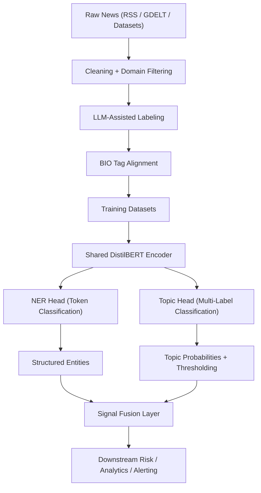
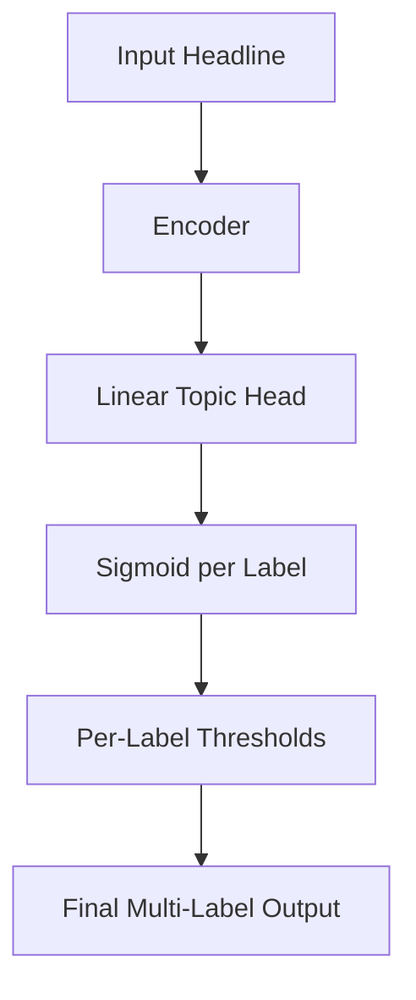

This research article unifies the work documented across the four internal drafts in `articles/` into one production-oriented narrative: from baseline NER, to domain expansion, to multi-label topic classification, and finally to a shared-encoder multi-task model suitable for real-time intelligence workflows.

---

## Model Lineage

The project evolved through four model milestones:

1. Baseline NER (`distilbert-energy-intelligence-multitask-v1`) to establish token-level extraction capability.
2. Expanded financial NER (`energy-intelligence-multitask-custom-ner`) with a larger domain taxonomy.
3. Multi-label topic classifier (`energy-news-classifier`) for routing and signal aggregation.
4. Joint model (`energy-news-classifier-ner-multitask`) combining NER and classification in one pass.

### Model Links

- [QuantBridge/energy-news-classifier-ner-multitask](https://huggingface.co/QuantBridge/energy-news-classifier-ner-multitask)
- [QuantBridge/energy-intelligence-multitask-custom-ner](https://huggingface.co/QuantBridge/energy-intelligence-multitask-custom-ner)
- [QuantBridge/distilbert-energy-intelligence-multitask](https://huggingface.co/QuantBridge/distilbert-energy-intelligence-multitask)
- [QuantBridge/energy-news-classifier](https://huggingface.co/QuantBridge/energy-news-classifier)

---

## Research Objective

The target was not generic NLP quality.  
The target was **operational intelligence extraction**:

- extract entities relevant to energy and geopolitics
- classify topic intent for routing (`macro`, `energy`, `trade`, `risk`, `politics`, `business`, etc.)
- run with low-latency inference suitable for production data pipelines
- preserve extensibility for taxonomy growth

---

## Unified System Architecture

The central design choice is the shared encoder.  
Entity extraction and topical understanding operate on the same semantic substrate; separate models added avoidable latency and inconsistency.

---

## Data Strategy

The training strategy blended:

- open corpora (CoNLL, WikiANN, WNUT for baseline signal)
- financial/news corpora (Reuters, AG News mappings, domain headlines)
- LLM-assisted weak supervision for missing domain coverage

The weak-supervision pipeline scaled annotation quickly, but introduced noise.  
As a result, strict validation (JSON schema + offset alignment + label allowlists) became mandatory.

---

## NER Evolution: V1 to Domain-Expanded NER

### V1 Strengths

- fast, stable baseline
- good on generic person/org/location extraction
- cheap enough to iterate on commodity hardware

### V1 Failures

- missed domain entities (`CENTRAL_BANK`, `SANCTION`, `TRADING_HUB`, `PIPELINE`)
- collapsed semantically distinct institutions into broad tags
- weak transfer to short, dense finance headlines

### Expanded NER Improvements

- expanded taxonomy (coarse to fine-grained domain labels)
- stronger domain coverage across macro, policy, and infrastructure entities
- improved utility for downstream graphing and risk workflows

---

## Multi-Label Classification Findings

Topic classification was necessary because entity extraction alone cannot answer intent-level questions like:

- Is this energy supply risk or routine business reporting?
- Is a headline macro-policy relevant or just corporate earnings noise?

Key challenge: **imbalanced and overlapping labels**.

Key operational insight: default threshold `0.5` underperformed.  
Per-label calibrated thresholds materially improved recall on sparse but high-value classes (`energy`, `risk`, `trade`).

---

## Failure Modes Observed

1. Dominant label collapse toward broad categories (`business`, `macro`).
2. Poor recall on rare domain labels due to sparse positive examples.
3. Boundary ambiguity in token spans for noisy short-form text.
4. Taxonomy drift as new geopolitical and market concepts emerged.
5. Weak semantic grounding for very short headlines without context.

---

## Production Design Recommendations

1. Keep typed contracts between labeling, preprocessing, and training artifacts.
2. Treat threshold tuning as part of the model, not post-processing.
3. Use confidence-aware routing for ambiguous predictions.
4. Track class-wise drift over time, not just aggregate F1.
5. Favor modular retraining where taxonomy and classifier heads can evolve rapidly.

---

## Practical Inference Flow

This keeps throughput high: one forward pass, two outputs, one structured artifact.

---

## Conclusion

The main result from this research cycle is architectural, not cosmetic:

- baseline NER alone was insufficient
- classification alone was ungrounded
- unified multi-task inference created the best tradeoff between cost, speed, and practical signal quality

For energy and geopolitical intelligence systems, this architecture forms a robust base for next steps such as hierarchical labeling, retrieval-augmented context expansion, and temporal event graph construction.
