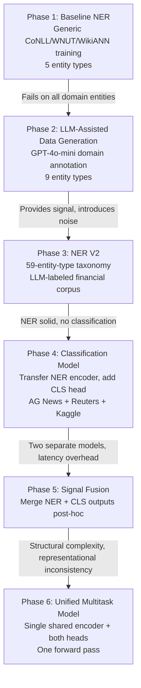
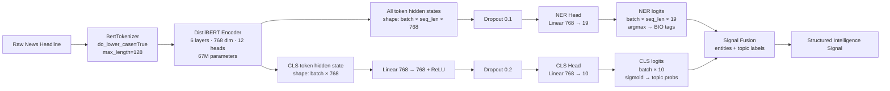
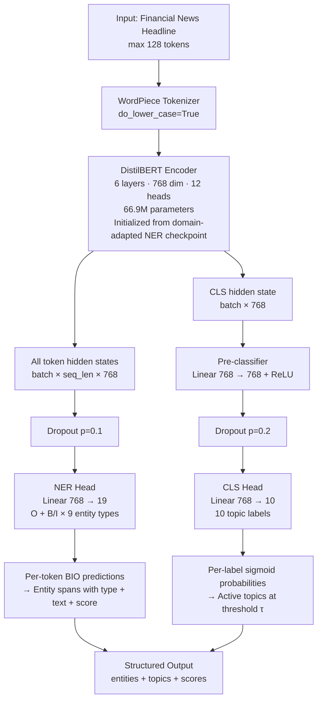
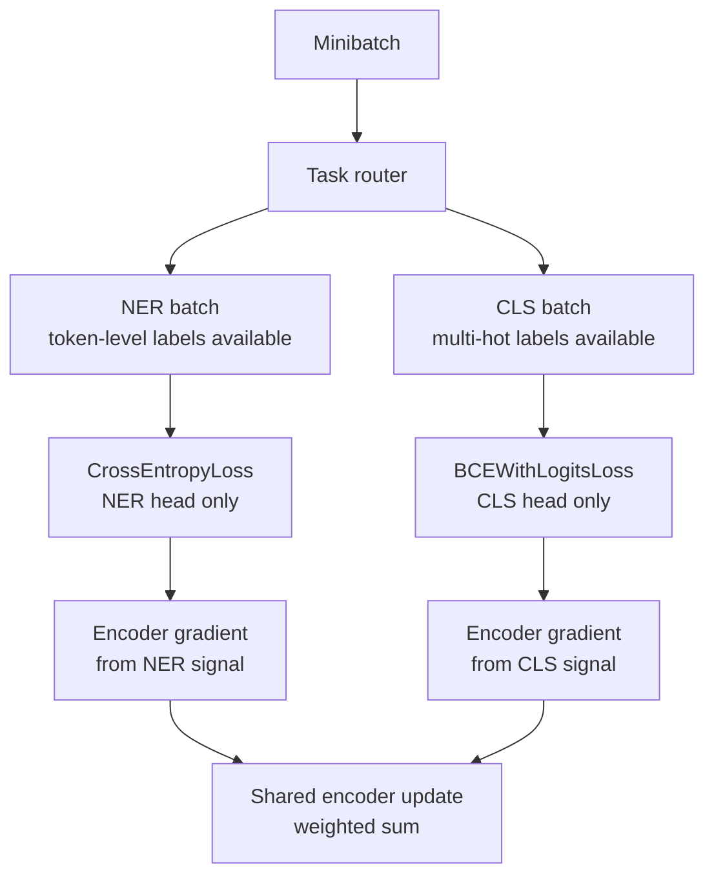
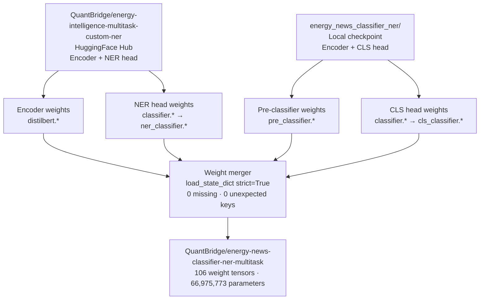
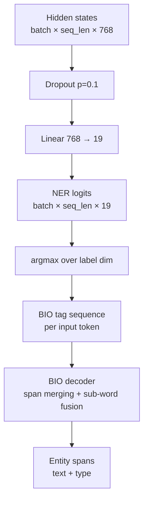
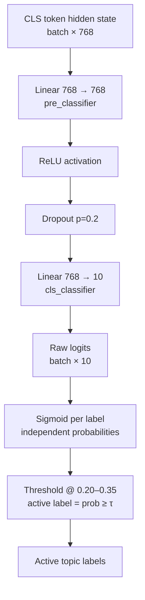
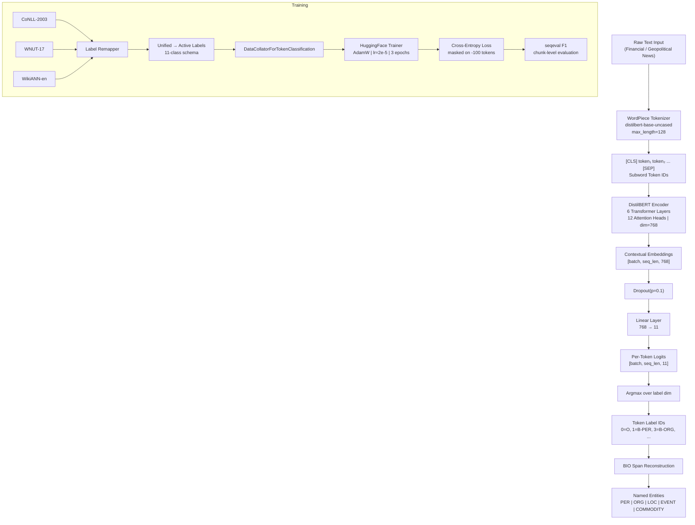
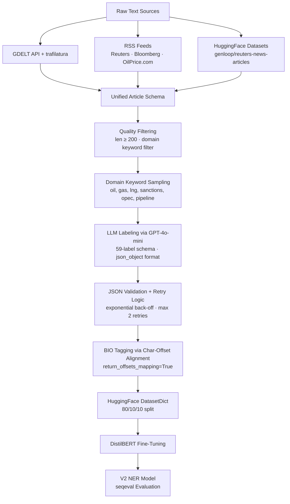
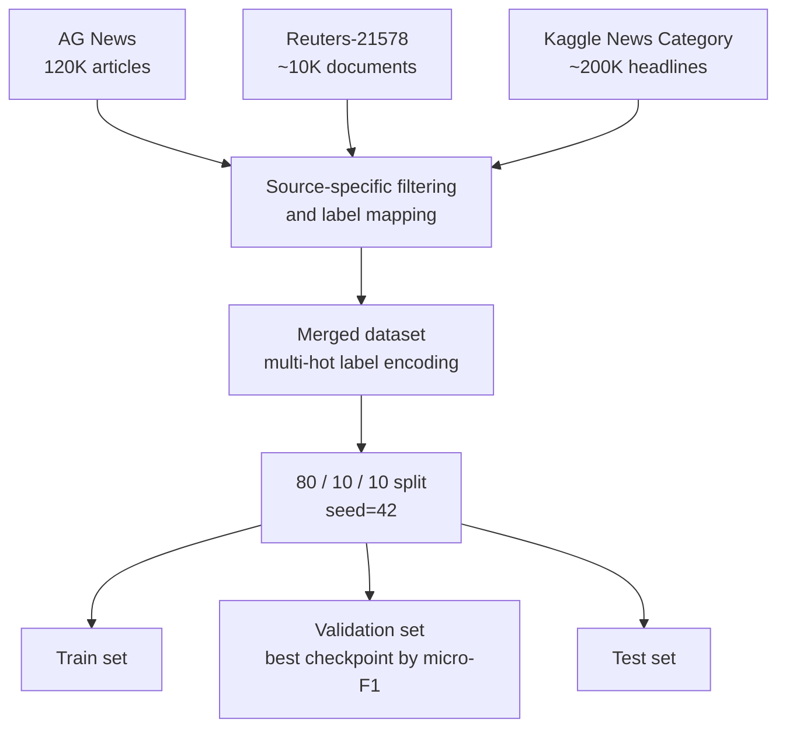

# Domain-Adaptive Multi-Task NLP for Financial and Geopolitical Intelligence Extraction

**A Systems and Applied Research Paper**

_QuantBridge AI Research — 2025_

---

## Abstract

Generic NLP systems fail systematically when applied to structured intelligence extraction from financial and geopolitical news. This paper describes the complete lifecycle of a domain-specific multi-task NLP system: from a baseline NER model trained on open-source general corpora, through LLM-assisted domain adaptation expanding coverage from 9 to 59 entity types, to a final unified architecture — `QuantBridge/energy-news-classifier-ner-multitask` — that performs Named Entity Recognition (NER) and multi-label topic classification simultaneously in a single forward pass over a shared DistilBERT encoder. The system is designed to convert raw financial and geopolitical news into structured, machine-readable signals suitable for use in quantitative pipelines, macro intelligence systems, event-driven strategies, and geopolitical risk frameworks.

We present the full architecture, training strategy, taxonomy design, systems engineering constraints, and experimental results including per-entity F1 across 59 entity types and classification behavior across 40 real-world financial headlines. The final model achieves an overall NER F1 of 0.859 on a held-out LLM-labeled test set and extracts an average of 2.15 entities per headline, covering commodity benchmarks, regulatory bodies, shipping vessels, sanctions contexts, M&A events, and geopolitical actors that are entirely absent from general-purpose NER systems.

We document honest failure analysis including label collapse toward dominant training classes, near-zero recall on domain-critical categories (`energy`, `risk`, `shipping`), threshold calibration sensitivity, and structural limitations of BIO tagging for multi-role entities. Classification performance is limited by training data imbalance rather than architectural capacity — a data problem with a known engineering solution. We discuss the practical implications of LLM-assisted weak supervision as the only viable path to domain NER at this scale, the closed-loop evaluation trap that inflates automated metrics, and concrete improvements that would close the gap to production-grade reliability across the full label set.

---

## 1. Contributions

This work makes the following contributions:

**1. A unified multi-task NLP architecture for financial and geopolitical news.** `QuantBridge/energy-news-classifier-ner-multitask` performs Named Entity Recognition (9 entity types, BIO scheme) and multi-label topic classification (10 labels) in a single 67M-parameter DistilBERT forward pass. The architecture produces structured output — entities plus topic probabilities — in one inference call, eliminating the latency and representational inconsistency of dual-model pipelines.

**2. A 59-type entity taxonomy designed for downstream financial signal routing.** The taxonomy is not ontologically derived but downstream-consumer-driven: entities are distinct types when they route to different analysis pipelines. `CENTRAL_BANK` triggers monetary policy analysis. `SHIPPING_VESSEL` triggers supply chain disruption monitoring. `SANCTION` triggers geopolitical risk assessment. This design principle is the operational core of the system's value for quantitative and macro intelligence applications.

**3. An LLM-assisted weak supervision pipeline for low-resource domain NER.** Using GPT-4o-mini as a domain annotation engine, the pipeline labels 800 articles for approximately $0.22, generating 59-type NER annotations that would cost orders of magnitude more and take weeks to produce through human annotation. We characterize the systematic failure modes of this approach — label bleed, boundary errors, closed-loop evaluation bias — and provide mitigation strategies.

**4. A weight-merging strategy for multi-task model assembly without catastrophic forgetting.** Rather than jointly training from scratch, we merge separately validated NER and classification heads over a shared encoder using key remapping and `strict=True` state dict loading. This approach preserves both learned representations exactly and provides a clean baseline for future joint fine-tuning.

**5. A complete, honest failure analysis documenting where the system breaks and why.** The classification head fails on `energy`, `risk`, and `shipping` labels — not due to architectural limitations but due to systematic training data underrepresentation. We provide exact diagnostic signals, failure mechanisms, and the data interventions required to resolve each failure mode.

**6. A production deployment framework connecting structured NLP output to quantitative signal pipelines.** We describe how entity extraction and topic classification outputs connect to trading signal generation, macro regime detection, geopolitical risk monitoring, and event-driven strategy pipelines — the practical infrastructure context this system was designed to serve.

---

## 2. Introduction

Financial and geopolitical intelligence extraction is one of the most practically valuable and technically underserved problems in applied NLP. Analysts at energy trading firms, sovereign wealth funds, and geopolitical risk consultancies must identify, categorize, and cross-reference information about entities — companies, countries, commodities — and events — sanctions, pipeline disruptions, OPEC decisions — in real time from high-volume news streams. The scale of this problem precludes manual analysis. The consequence of missing a signal — a vessel detention in the Strait of Hormuz, a surprise Fed statement, a new semiconductor export restriction — is measured in basis points or, in risk scenarios, in substantial drawdown.

Existing general-purpose NLP systems fail this domain for three structural reasons.

**Entity coverage gaps.** Standard NER models trained on CoNLL-2003 or OntoNotes recognize generic entities: persons, organizations, locations, dates. They do not recognize "Brent crude" as a commodity benchmark whose daily price is the reference for roughly two-thirds of global oil contracts. They do not recognize "LNG" as a tradeable good. They do not recognize "OPEC+" as a regulatory body whose supply decisions shift global energy markets. They do not recognize vessel names like "Arctic Star" as infrastructure assets whose detention signals sanctions enforcement, supply chain disruption, and insurance premium pressure simultaneously. These omissions are not minor edge cases — they are the core signals that financial intelligence systems are built to extract.

**Topic granularity mismatch.** General news classifiers produce coarse categories: World, Business, Sports, Technology. Financial intelligence requires finer-grained distinctions between macro-level economic signals (central bank policy, GDP revisions), sector-specific signals (energy supply disruptions, shipping congestion), and risk signals (geopolitical crises, sanctions regimes, supply chain disruptions). A headline about OPEC+ production cuts is simultaneously an energy story, a macroeconomic story, a geopolitical coordination story, and potentially a trade flow story. Any single-label formulation discards signal. Any coarse-taxonomy system fails to route the article to the right downstream model — and in quantitative pipelines, routing is the mechanism by which signal is separated from noise.

**Short-text semantic compression.** Financial news headlines are informationally dense and extremely short — typically 10 to 20 tokens. A headline like "OPEC+ extends cuts by 1M bpd" presupposes substantial domain knowledge to correctly classify. Standard models trained on full-length articles do not generalize well to this register. The `[CLS]` token, which aggregates sequence-level signal, must compress the semantics of 15 tokens into a 768-dimensional vector — a severe information bottleneck for multi-label classification in a domain where every word can carry signal.

The system described in this paper addresses all three problems. The final model, `QuantBridge/energy-news-classifier-ner-multitask`, extracts domain entities and assigns topic labels simultaneously in a single inference call. The architecture, training strategy, and deployment framework are described in full. Failures are documented with equal rigor as successes, because a system deployed in financial intelligence pipelines must have precisely understood failure modes — silent errors are more dangerous than known limitations.

---

## 3. Problem Definition

### 3.1 Structured Intelligence Signal Extraction

Given a raw news headline or short article, the system must produce a **structured signal** of the form:

```
Input : "Russia cuts natural gas flows to Poland and Bulgaria following payment dispute"

Output:
  entities:
    - {type: COUNTRY,   text: "Russia"}
    - {type: COUNTRY,   text: "Poland"}
    - {type: COUNTRY,   text: "Bulgaria"}
    - {type: COMMODITY, text: "natural gas"}

  topics:
    - politics   (score: 0.362)
    - macro      (score: 0.357)
    - energy     (score: 0.054)
```

NER extracts *what* is mentioned: organizations, locations, commodities, persons, events. Classification answers *what this text is about*: which thematic categories are active. These are complementary signals that must operate in tandem. Without NER, classification is decontextualized — the topic `energy` fires on any article, but the downstream system cannot determine *which* energy company, *which* commodity, or *which* infrastructure asset is involved. Without classification, every article is routed to every downstream consumer, introducing noise into pipelines that require topic-scoped input.

The structured output feeds downstream systems — a reasoning LLM for macro commentary generation, a knowledge graph for entity relationship tracking, a quantitative signal aggregation layer for position-sizing models, or an alert system for risk desk notifications. The NLP layer's job is not to produce insight directly — it is to produce a machine-readable representation that downstream systems can act on reliably and at scale.

### 3.2 The Financial Applicability of Each Signal

Understanding why each entity type and topic label has financial applicability clarifies the design requirements:

**Entity types → specific signal pathways:**

| Entity Type | Example | Downstream Signal |
|---|---|---|
| `CENTRAL_BANK` | Federal Reserve | Monetary policy signal → rate-sensitive portfolio adjustment |
| `COMMODITY` | Brent crude, LNG | Price regime signal → energy sector exposure, hedging triggers |
| `REGULATORY_BODY` | OPEC+, FERC | Supply/demand coordination → production outlook revision |
| `SANCTION` | Iran's oil sector | Supply disruption risk → geopolitical risk premium, freight rates |
| `SHIPPING_VESSEL` | Arctic Star, Gulf Pioneer | Physical supply chain disruption → tanker market, insurance |
| `M_AND_A` | ExxonMobil / Pioneer | Corporate consolidation → merger arbitrage, sector positioning |
| `EARNINGS_EVENT` | Quarterly miss | Single-name signal → equity event-driven strategy |
| `MACRO_INDICATOR` | PCE, CPI | Inflation regime signal → duration positioning, rates strategy |
| `TECH_REGULATION` | US export controls | Semiconductor supply chain → capex revisions, ETF rebalancing |
| `GEOPOLITICAL_EVENT` | Houthi attacks | Systemic risk signal → volatility regime, safe-haven flows |

**Topic labels → pipeline routing:**

| Topic | What Activates It | Where It Routes |
|---|---|---|
| `energy` | Oil supply/demand, OPEC decisions, LNG flows | Energy desk, commodity signal aggregation |
| `macro` | Central bank decisions, GDP, inflation | Macro strategy, rates desk, FX |
| `risk` | Conflict, sanctions, disruptions | Risk desk, geopolitical risk dashboard |
| `shipping` | Vessel rerouting, port closures, chokepoints | Supply chain model, freight rate monitoring |
| `trade` | Tariffs, sanctions, export restrictions | Trade flow analysis, EM positioning |
| `stocks` | Equity market moves, index changes | Equities desk, systematic strategies |

The system does not perform the downstream analysis — it performs the structured extraction that makes downstream analysis automatable.

### 3.3 Why This Is Hard

The core difficulty is not modeling — it is **data scarcity at the intersection of labeling granularity and domain specificity**. The intersection of "labeled NER data" and "energy/geopolitical domain" is nearly empty in the public domain. CoNLL-2003 contains no energy entities. OntoNotes contains some financial text but nothing close to the required taxonomy. Reuters-21578 provides document-level category labels but no token-level NER annotations.

For classification, the challenge is **label imbalance and semantic overlap**. Labels like `energy`, `macro`, and `politics` frequently co-occur. A headline about OPEC+ production cuts is simultaneously about energy supply, macroeconomic expectations, geopolitical coordination, and potentially trade flows. Multi-label classification models must learn these overlapping associations from relatively sparse, heterogeneous training signal while avoiding collapse toward dominant training classes.

### 3.4 Why NER Is Semantic, Not Surface-Level

In standard NER benchmarks, named entities are recognizable by their surface form: capitalized multi-word strings, known proper nouns, title-case organizational names. In financial and geopolitical text, entity recognition requires domain knowledge that cannot be inferred from surface patterns alone.

**Case Study — "Brent":** In general English, a common given name or a place in London. In energy markets, the global benchmark for crude oil pricing — a `COMMODITY`. A model trained on CoNLL learns `Brent → PER` or `Brent → LOC`. It cannot learn `Brent → COMMODITY` without domain-specific annotation. The consequence: a system processing news about Brent crude futures misses the most frequently cited price benchmark in global energy markets.

**Case Study — "OPEC+ decided to cut production by 1 mb/d":** Standard NER: `OPEC → ORG` (possibly), `+` breaks entity span. Domain NER: `OPEC+ → REGULATORY_BODY`, with the production figure as a quantitative supply signal. The correct entity type determines whether this text routes to a supply model or a general news aggregator.

**Case Study — "Section 232 tariffs":** Generic NER: no entities. Trade policy NER: `Section 232 tariffs → TRADE_POLICY` entity driving steel and aluminum markets. The failure to extract this entity means a trade policy change that affects multiple industrial sectors is invisible to any downstream model consuming the NER output.

The fundamental gap:

```
Generic NER:   surface form → label
Domain NER:    surface form + context + domain schema → label
```

Generic models learn to identify names that look like names in general text. Domain NER must learn that certain common words carry entity meaning in specific contexts — a fundamentally harder task that requires domain-specific training data at every stage.

---

## 4. System Overview

The system evolved through six distinct phases, each motivated by a specific failure in the previous approach.



The key architectural insight of the final system is that **the NER encoder and the classification encoder should be the same model**. Both tasks require identical underlying representations of financial text. Training them separately and fusing outputs post-hoc wastes compute, increases latency, and introduces representational inconsistency between the two signal streams. The final architecture, `QuantBridge/energy-news-classifier-ner-multitask`, runs both heads simultaneously in a single forward pass over a shared DistilBERT encoder.

### 4.1 End-to-End Data Flow



---

## 5. Proposed System: Unified Multitask Architecture

### 5.1 Why Multitask Learning

NER and topic classification are not independent tasks. They share a common requirement: understanding the domain-specific meaning of financial text. An encoder that understands "Brent crude" as a `COMMODITY` (NER) must also understand that a sentence containing "Brent crude" and "OPEC+" is likely an `energy` story (classification). The representations required for accurate entity extraction overlap substantially with the representations required for accurate topic assignment.

This shared representational requirement is the primary motivation for multitask learning. When two tasks share an encoder, the gradient signal from each task shapes the shared representations during training. An encoder trained jointly on NER and classification learns representations that are useful for both tasks simultaneously — in principle, producing a better encoder than either task would produce alone.

In practice, the current system uses **post-hoc weight merging** rather than joint gradient training, because the NER backbone was already strongly trained on domain data before the classification head was developed. The shared encoder is the NER encoder. This is a conservative implementation of the multitask principle: shared architecture without shared gradients. Joint end-to-end training from the merged checkpoint is the most promising next step and would realize the full representational learning benefit.

### 5.2 Why a Shared Encoder

The shared encoder produces a single set of contextual token representations for both tasks. Every token's hidden state captures both its role as a potential entity (for the NER head) and its contribution to the overall semantic content of the input (for the classification head, via the `[CLS]` token).

This shared representation has a critical advantage beyond efficiency: **consistency**. When the same encoder produces both entity tags and topic labels for an input, the two outputs are grounded in identical input representations. There is no scenario where the NER head "sees" a different representation of the text than the classification head. In a post-hoc fusion system with separate encoders, this consistency is not guaranteed — two separately trained encoders may have learned different representations of the same domain text, introducing inconsistency at the fusion layer.

Consider the sentence: "The Federal Reserve held interest rates steady as Brent crude fell below $75 following OPEC+ production cuts." The NER head must identify `Federal Reserve → CENTRAL_BANK`, `Brent crude → COMMODITY`, `OPEC+ → REGULATORY_BODY`. The classification head must assign `macro + energy`. Both tasks require the encoder to understand this sentence as involving a central bank, a commodity benchmark, and a regulatory supply cartel simultaneously. A shared encoder, trained across many examples of this co-occurrence structure, builds representations that serve both tasks. Two separate encoders, each trained on only one task's signal, may fail to capture the full co-occurrence structure.

### 5.3 Why Single Forward Pass

The operational benefit of a single forward pass is straightforward: latency. For a financial data pipeline processing thousands of headlines per day — or per hour during market events — the difference between one forward pass and two is a factor of approximately 2× in CPU/GPU time per input.

DistilBERT at `max_length=128` runs in approximately 10–20ms per input on a single CPU core. A two-model pipeline (separate NER + classification models) would require ~20–40ms per input for the same tasks, halving throughput. At 10,000 headlines per hour — a realistic volume for a real-time news processing pipeline during high-activity periods — the throughput difference between 1× and 0.5× is the difference between keeping up with the news flow and falling behind.

Single forward pass also eliminates a class of operational complexity: there is one model to deploy, one model to version, one model to monitor. Operational overhead scales with the number of independently deployed models. The multitask architecture reduces this overhead to the minimum.

### 5.4 Comparison: Architectural Approaches

| Approach | Architecture | Key Limitation | When Appropriate |
|---|---|---|---|
| **Separate NER model** | Single encoder + NER head | No topic classification; entity output only; no routing signal | Standalone entity extraction without classification need |
| **Separate classification model** | Single encoder + CLS head | No entity extraction; topic labels without entity grounding | Topic routing without entity-level analysis |
| **Post-hoc fusion pipeline** | Two encoders → two outputs → rule-based merger | Dual latency; representational inconsistency; two models to maintain; fusion layer introduces alignment error | Prototyping when task-specific models are already deployed |
| **Unified multitask model** | One shared encoder + two heads → single forward pass | Cannot express multi-role entity spans in BIO scheme; joint training not yet implemented | Production pipelines requiring both signals at minimal latency |

The unified multitask model is the correct architecture for any system where both NER and classification outputs are consumed by downstream processes. The production advantage is decisive: single deployment, single latency, consistent representations, unified monitoring.

---

## 6. Final Model: QuantBridge Multitask System

### 6.1 Architecture

`QuantBridge/energy-news-classifier-ner-multitask` is a 66,975,773-parameter model built on a shared DistilBERT encoder with two task-specific heads.



**Parameter allocation:**

| Component | Parameters | % of total |
|---|---|---|
| DistilBERT encoder (6 transformer layers) | ~66,900,000 | 99.89% |
| NER head (Linear 768 → 19) | ~14,592 | 0.02% |
| Classification pre-classifier (Linear 768 → 768) | ~589,824 | 0.88% |
| Classification head (Linear 768 → 10) | ~7,680 | 0.01% |
| **Total** | **66,975,773** | 100% |

The task heads are parameter-light. The encoder dominates the model budget by three orders of magnitude. This means the model's quality is almost entirely determined by the quality of the encoder's representations — which in turn is determined by the quality and quantity of domain-specific training data. This is not an insight unique to this system; it is the fundamental scaling law of fine-tuned transformer models.

### 6.2 Loss Function and Training Objective

The current system uses independently trained heads over a shared encoder. The training objective for the NER head is standard token classification cross-entropy:

```
L_NER = -(1/T) * Σ_t Σ_k y_tk * log(softmax(z_t)_k)
```

where `T` is the number of non-masked tokens, `k` indexes over the 19 BIO label classes, `y_tk` is the one-hot label for token `t`, and `z_t` is the raw logit vector for token `t`. Tokens with label `-100` (padding, `[CLS]`, `[SEP]`) are masked and excluded from the loss.

The training objective for the classification head is multi-label binary cross-entropy:

```
L_CLS = -(1/L) * Σ_i [ y_i * log(σ(x_i)) + (1 - y_i) * log(1 - σ(x_i)) ]
```

where `L = 10` is the number of topic labels, `y_i ∈ {0, 1}` is the ground-truth label for topic `i`, and `x_i` is the raw logit for topic `i`. Each label is treated as an independent binary problem; sigmoid activations are independent across labels.

**The target joint training objective for future work:**

```
L_total = L_NER + λ · L_CLS
```

where λ ∈ [0.1, 1.0] is a task weighting hyperparameter controlling the relative influence of the classification gradient on the shared encoder. This formulation allows both task signals to shape encoder representations simultaneously. The λ parameter must be tuned to prevent the classification gradient (which carries noisy signal from imbalanced training data) from corrupting the NER-aligned representations built into the encoder.



### 6.3 Weight Merging Strategy

The final model was assembled from two separately trained checkpoints using a deterministic key-remapping merger. The merger resolves the naming conflict between the two source models' task heads (both called `classifier.*`) by renaming them to `ner_classifier.*` and `cls_classifier.*` respectively in the merged state dict.



**Key remapping:**

| Source key | Destination key |
|---|---|
| NER model `distilbert.*` | `distilbert.*` |
| NER model `classifier.weight` | `ner_classifier.weight` |
| NER model `classifier.bias` | `ner_classifier.bias` |
| CLS model `pre_classifier.*` | `pre_classifier.*` |
| CLS model `classifier.weight` | `cls_classifier.weight` |
| CLS model `classifier.bias` | `cls_classifier.bias` |

The merger calls `load_state_dict(strict=True)` to verify zero missing and zero unexpected keys. Any key mismatch raises an error immediately, preventing silent weight misalignment.

### 6.4 Why Weight Merger Over Joint Training

The NER backbone had been fine-tuned on domain-specific data with a strong supervised NER signal across 59 entity types. Joint training from scratch would risk catastrophic forgetting: the classification gradient, carrying noisy signal from a severely imbalanced training set, would push the shared encoder's representations away from the NER-aligned structure built during the NER fine-tuning phase. This is particularly dangerous for low-frequency entity types (e.g., `SHIPPING_VESSEL`, `MACRO_INDICATOR`) where the NER-trained representations are fragile and could be overwritten by dominant classification gradients.

The merger approach preserves both learned representations exactly. The NER head receives an encoder that has already learned to represent `OPEC+` as a regulatory body, `Arctic Star` as a vessel, and `Federal Reserve` as a central bank. The classification head receives the same encoder. Neither head degrades the other's foundation. This is the correct choice for a first-generation production system where NER quality is the primary reliability requirement.

Joint training from the merged checkpoint — starting with already-converged, high-quality NER representations and introducing a weighted classification gradient — is the correct path for the next iteration. The λ parameter in `L_total = L_NER + λ · L_CLS` should start at 0.1 to minimize classification gradient influence and be increased as classification metrics improve without NER degradation.

---

## 7. Architecture

### 7.1 Encoder: DistilBERT

The encoder is `distilbert-base-uncased`, initialized from `QuantBridge/energy-intelligence-multitask-custom-ner` — a checkpoint already fine-tuned on energy and financial news for NER. This initialization provides a head start: the encoder's representations of domain-specific terminology are already richer than a generic `distilbert-base-uncased` checkpoint before classification training begins.

DistilBERT was selected over BERT-base for production practicality:

| Property | DistilBERT | BERT-base |
|---|---|---|
| Parameters | ~67M | ~110M |
| Inference speed | 60% faster | baseline |
| Benchmark performance retention | ~97% of BERT | baseline |
| VRAM at inference | Fits CPU + commodity GPU | Requires GPU |

The encoder produces hidden states of shape `(batch, seq_len, 768)`. At `max_length=128`, the context window covers approximately 90% of financial news headlines and short articles without truncation — sufficient for the deployment target of headline-length inputs.

Full DistilBERT architecture parameters:

| Parameter | Value |
|---|---|
| Architecture | Transformer encoder |
| Layers | 6 |
| Attention heads | 12 |
| Hidden dimension | 768 |
| FFN inner dimension | 3072 |
| Vocabulary size | 30,522 |
| Max position embeddings | 512 |
| Activation | GELU |
| Attention dropout | 0.1 |
| Hidden dropout | 0.1 |
| Total parameters | ~66.9M |

### 7.2 NER Head: Token Classification



The NER head is a single linear projection from the 768-dimensional hidden state of each token to 19 output classes following BIO (Beginning-Inside-Outside) tagging:

| Tag format | Meaning |
|---|---|
| `O` | Non-entity token |
| `B-<TYPE>` | Beginning of entity of type TYPE |
| `I-<TYPE>` | Continuation of entity of type TYPE |

The 9 entity types in the final multitask model are: `PERSON`, `ORGANIZATION`, `COMPANY`, `COUNTRY`, `LOCATION`, `COMMODITY`, `MARKET`, `INFRASTRUCTURE`, `EVENT`. This is a coarsened version of the 59-type V2 taxonomy, selected for the production system based on downstream consumer requirements. The coarsening trades granularity for generalization — fewer types means more training examples per type and more stable decision boundaries.

During inference, argmax over the label dimension produces a tag ID per token. A BIO decoder merges consecutive B-/I- tags into entity spans, handling sub-word tokenization by concatenating `##`-prefixed tokens directly to the current span.

**On CRF omission:** A Conditional Random Field over the output sequence would enforce valid BIO transitions (e.g., `I-COMPANY` cannot follow `B-PERSON`). This is omitted for two reasons: (1) DistilBERT's contextual representations are strong enough that invalid transitions are rare in practice on short sequences; (2) CRF adds training complexity and inference overhead that is not justified at headline-length inputs. For longer documents where invalid transition rates increase, a CRF layer would be warranted.

### 7.3 Classification Head: Multi-Label Sequence Classification



The classification head operates on the `[CLS]` token hidden state, which aggregates information across the full input sequence. The two-layer structure (`pre_classifier → ReLU → cls_classifier`) was inherited from `DistilBertForSequenceClassification`. It adds representational capacity between the encoder output and the final label projection — important for multi-label prediction where the model must learn non-linear separating surfaces in the embedding space.

**Loss function: BCEWithLogitsLoss.** Unlike single-label classification which uses CrossEntropyLoss with softmax, multi-label classification applies independent sigmoid functions to each logit. BCEWithLogitsLoss computes binary cross-entropy over all 10 labels independently:

```
L(y, ŷ) = -1/N * Σ [y_i * log(σ(x_i)) + (1 - y_i) * log(1 - σ(x_i))]
```

Each label is treated as an independent binary prediction, allowing any combination of labels to activate simultaneously. A headline can be `energy + risk + geopolitical` without these labels competing in a softmax distribution.

**Thresholding.** During inference, a threshold τ converts sigmoid probabilities into binary predictions:

```
ŷ_i = 1  if  p_i ≥ τ  else  0
```

The default τ = 0.5 is almost always suboptimal for imbalanced multi-label settings. For this system, τ = 0.35 was used operationally after validation set tuning. Per-label thresholds — where `energy` and `risk` use τ ≈ 0.20–0.25 and `macro` and `business` use τ ≈ 0.40–0.50 — would be strictly preferred and represent the next calibration step.

**Label set:**

| Label | Description | Primary Downstream Consumer |
|---|---|---|
| `energy` | Oil, gas, LNG, renewables, power markets | Energy desk, commodity signal aggregation |
| `macro` | Central banks, inflation, GDP, monetary policy | Macro strategy, rates, FX desk |
| `politics` | Government decisions, elections, legislation | Geopolitical risk, EM desk |
| `trade` | Tariffs, sanctions, import/export flows | Trade flow analysis, logistics |
| `risk` | Geopolitical instability, conflict, disruption | Risk desk, vol surface monitoring |
| `business` | Corporate earnings, M&A, company-level news | Equities, sector rotation |
| `technology` | Semiconductors, AI, tech sector | Tech desk, supply chain |
| `stocks` | Equity markets, indices, FX | Systematic strategies, alpha |
| `regulation` | Regulatory decisions, compliance | Compliance, sector-specific modeling |
| `shipping` | Vessel routing, port disruption, maritime trade | Supply chain, freight rates |

### 7.4 Weight Initialization and Model Assembly

(See Section 6.3 for the detailed weight merging strategy and architectural rationale.)

---

## 8. NER System Evolution: V1 → V2

### 8.1 V1: Baseline on Generic Corpora

**Objective.** Version 1 (`distilbert-energy-intelligence-multitask-v1`) was built to benchmark how far off generic NER is from domain requirements — quantifying the gap before domain-specific adaptation.

**Data.** Three open-source corpora were combined:

| Dataset | Domain | Size (train) | Entity Types |
|---|---|---|---|
| CoNLL-2003 | Reuters newswire, 1990s | 14,041 sentences | PER, ORG, LOC, MISC |
| WNUT-17 | Twitter, Reddit, StackExchange | 3,394 sentences | person, location, corporation, product, creative-work, group |
| WikiANN-en | Wikipedia articles | 20,000 examples | PER, ORG, LOC |

Labels were remapped to a unified 5-type active schema: `PER`, `ORG`, `LOC`, `EVENT`, `COMMODITY`. `COMMODITY` was derived entirely from WNUT `product` mappings — an approximate and noisy proxy. `EVENT` was derived from WNUT `creative-work` noise (movie titles, product names). The combined training set comprised ~37,435 examples.

**Architecture.** `distilbert-base-uncased` with a single linear token classification head projecting 768 → 11 (O + B/I × 5 entity types). Max sequence length of 128 tokens, chosen for VRAM constraints on an NVIDIA RTX 3050 4GB. No class weighting applied to the cross-entropy loss.

**Tokenization alignment:**

```python
def _tokenize_active(example, tokenizer):
    tokenized = tokenizer(
        example["tokens"],
        truncation=True,
        max_length=128,
        is_split_into_words=True,
    )
    word_ids = tokenized.word_ids()
    labels = []
    prev = None
    for wid in word_ids:
        if wid is None:
            labels.append(-100)             # special tokens
        elif wid != prev:
            labels.append(ner_tags[wid])    # first subword → word label
        else:
            orig_name = active_id2label[ner_tags[wid]]
            if orig_name.startswith("B-"):
                new_name = orig_name.replace("B-", "I-")
                labels.append(active_label2id.get(new_name, ner_tags[wid]))
            else:
                labels.append(ner_tags[wid])
        prev = wid
    tokenized["labels"] = labels
    return tokenized
```

**V1 Pipeline:**



### 8.2 V1 Failure Analysis

V1 demonstrated a clean 100% pass rate on standard CoNLL-style entities (persons, organizations, locations from Western news). Its failure on domain entities was total:

| Category | Test Cases | Pass Rate |
|---|---|---|
| Standard NER (CoNLL-style) | 4 | 100% |
| Energy Commodities | 5 | 0% |
| Geopolitical Organizations | 4 | 25% |
| Financial Instruments | 4 | 25% |
| Infrastructure | 3 | 33% |
| Edge Cases | 5 | 60% |
| **Total** | **25** | **40%** |

**Failure mode distribution:**

```
Entity completely missed (labeled O)    10    67%
Entity labeled with wrong type           3    20%
Entity partially recognized              2    13%
```

Representative failures:

| Input | Expected | V1 Output |
|---|---|---|
| `Brent crude` | B-COMMODITY I-COMMODITY | O O |
| `WTI` | B-COMMODITY | O |
| `OPEC+` | B-ORG | O (tokenizer splits "OPEC+") |
| `Nord Stream 2` | B-ORG I-ORG I-ORG | B-LOC I-LOC O |
| `Henry Hub` | B-COMMODITY I-COMMODITY | B-LOC I-LOC |
| `Basel III` | B-ORG I-ORG | O O |
| `SOFR` | B-COMMODITY | O |

**Root causes:**

1. **Lexical mismatch:** Financial tickers, commodity codes, and regulatory acronyms absent from DistilBERT pre-training and V1 fine-tuning data.
2. **Context blindness for ambiguous tokens:** "Shell" as a company fails because the word appears as a common noun or verb far more often in the training corpus. "Brent" was learned as a person name or London borough, not a crude benchmark.
3. **No EVENT coverage for market events:** V1's `EVENT` label was trained on WNUT `creative-work` noise. It has never seen "Q3 earnings miss", "rate decision", or "force majeure declaration".
4. **`O`-class dominance with no loss weighting:** In financial text, ~92% of tokens are `O`. V1 with uniform cross-entropy drifts toward predicting `O` for uncertain spans — the globally safe prediction.
5. **Sequence truncation at 128 tokens:** Financial text frequently has entity mentions beyond the truncation boundary.

V1's metrics on the generic validation corpus (0.81 F1) were deceptive. They measured performance on the same distribution as training. In-domain financial performance was substantially lower — the 40% overall pass rate on designed financial test cases is the honest measure of V1's utility for financial intelligence extraction.

### 8.3 V2: LLM-Assisted Domain Adaptation

**The taxonomy problem.** V1's 9-entity schema forced ambiguous choices. `OPEC` classified as `ORGANIZATION` when it is a regulatory body. `Henry Hub` as `MARKET` when it is also a `TRADING_HUB`. `Federal Reserve` as `ORGANIZATION` when its role as a central bank is the signal that matters. The model learned blurry decision boundaries because the training data had conflated categories — not because of architectural limitations. This is a **labeling problem masquerading as a model problem**.

V2 addressed this by expanding the taxonomy to 59 entity types, covering:

| Domain | New Types (examples) |
|---|---|
| Financial institutions | `CENTRAL_BANK`, `HEDGE_FUND`, `RATING_AGENCY`, `EXCHANGE`, `FINANCIAL_INSTITUTION` |
| Energy-specific | `ENERGY_COMPANY`, `TRADING_HUB`, `PIPELINE`, `REFINERY`, `GRID` |
| Corporate events | `M_AND_A`, `IPO`, `EARNINGS_EVENT`, `CORPORATE_ACTION` |
| Risk & regulation | `SANCTION`, `TECH_REGULATION`, `DISRUPTION`, `GEOPOLITICAL_EVENT` |
| Technology | `AI_MODEL`, `SEMICONDUCTOR`, `TECH_COMPANY` |
| Logistics | `SHIPPING_VESSEL`, `REGION` |
| Macro | `MACRO_INDICATOR`, `MONETARY_POLICY` |

The organizational principle: **entities that serve different downstream use cases must be distinct types.** A `CENTRAL_BANK` mention triggers monetary policy analysis. A `HEDGE_FUND` mention triggers flow analysis. A generic `FINANCIAL_INSTITUTION` triggers neither with specificity. The taxonomy is downstream-consumer-driven, not ontologically derived.

### 8.4 LLM-Assisted Labeling Pipeline

The core insight: **human annotation of domain-specific NER is expensive and slow; LLMs are cheap domain experts.**



**System prompt structure:**

```
SYSTEM:
  You are an expert financial and geopolitical analyst.
  Extract named entities from the text relevant to:
  energy markets, geopolitics, trade, infrastructure, finance,
  corporate events, and technology.

  Return ONLY valid JSON array.
  Each element: {"text": "entity surface form", "label": "ENTITY_TYPE"}

  Valid labels: [59 entity types listed explicitly]

USER:
  {article_text[:4000]}
```

The `response_format: json_object` API parameter enforces structural correctness. The retry policy applies exponential back-off (5s → 10s), then logs failures to `logs/ner_labeling_failures.jsonl` and skips. Cost per 800-article run: approximately $0.22 at `gpt-4o-mini` pricing.

**Character-offset BIO alignment:**

```
entity_text: "OPEC+"
↓
char_span:   [0, 5]
↓
token_span:  ["op", "##ec", "+"]  →  B-REGULATORY_BODY, I-REGULATORY_BODY, I-REGULATORY_BODY
```

This handles subword tokenization edge cases (`OPEC+`, `Nord Stream 2`, `U.S.`) that naive word-split alignment gets wrong.

**Dataset composition:**

| Source | Volume | Notes |
|---|---|---|
| GDELT + trafilatura | Variable | Boolean energy/geopolitics query filter |
| RSS (Reuters/Bloomberg/OilPrice) | ~400–600 chars/article | High precision, lower volume |
| HuggingFace Hub (Reuters pretraining) | ~97K qualifying articles | Dominant source by volume |
| **Final split** | 9,200 train / 1,150 val / 1,150 test | 80/10/10 |

**Known risks of LLM labeling:**

- **Label bleed:** Tagging `Russia` as both `COUNTRY` and `GEOPOLITICAL_EVENT` in the same span
- **Boundary errors:** Returning `"Brent crude fell"` instead of `"Brent crude"` — entity includes the verb
- **Overtagging:** Extracting every noun as an entity rather than limiting to named entities
- **Context blindness:** Tagging `"the market"` (generic reference) as `TRADING_HUB`
- **Training data cutoff bias:** Entities prominent in post-2021 news labeled more reliably than older or regional entities
- **Closed evaluation loop:** Training and test labels generated by the same LLM measure mimicry of LLM behavior, not ground truth. A model scoring 0.86 F1 on an LLM-labeled test set might score 0.71 on a human-labeled gold standard.

---

## 9. Data Strategy: Classification

### 9.1 Open-Source Corpora

Three publicly available datasets were used for classification training:

**AG News** (`ag_news` via HuggingFace Datasets)

- 120,000 training articles across 4 categories
- Categories used: World → `macro`, Business → `business`, Sci/Tech → `technology`
- Sports excluded as domain-irrelevant

**Reuters-21578** (`nltk.corpus.reuters`)

- Wire service articles with document-level category labels
- Categories: `crude` + `gas` → `energy`, `ship` → `shipping`, `trade` → `trade`, `money-fx` + `interest` → `macro`, `earn` + `acq` → `business`
- Provides the only meaningful `energy` and `shipping` signal in the training set

**Kaggle News Category Dataset** (`rmisra/news-category-dataset`)

- ~200,000 HuffPost headlines with category labels
- Used: POLITICS → `politics`, BUSINESS → `business`, TECH → `technology`, WORLD NEWS → `macro`

**The structural problem:** All three datasets heavily overrepresent `macro`, `business`, and `technology`. Reuters provides `energy` and `shipping` examples but in relatively small quantities. Labels `risk`, `regulation`, and `stocks` have minimal training signal from any of these sources. This data imbalance directly causes the label collapse documented in Section 13.



---

## 10. GPU Training and Systems Engineering

### 10.1 Hardware Constraints and Configuration

The system was developed and trained under real hardware constraints that shaped multiple architectural decisions. Understanding these constraints is important for reproducing or extending the work.

**V1 (NER Baseline) — NVIDIA RTX 3050 (4GB VRAM):**

The RTX 3050's 4GB VRAM budget forced a tight memory envelope. DistilBERT at `max_length=128` with batch size 8 consumes approximately 3.2GB in FP16, leaving minimal headroom. This drove several specific choices:

- `max_length=128` instead of 256 or 512 — direct consequence of VRAM budget
- Batch size 8 per device (effective 16 with gradient accumulation = 2)
- Gradient checkpointing enabled — trades additional compute for reduced activation memory
- FP16 mixed precision — halves tensor storage footprint with negligible precision loss on NER tasks

FP16 mixed precision with PyTorch/HuggingFace `Trainer` uses the following runtime pattern:
```
Forward pass: FP16 tensors (half-precision activations)
Loss computation: FP32 (full precision for numerical stability)
Backward pass: FP32 gradients scaled by GradScaler
Optimizer update: FP32 master weights
```

This pattern prevents FP16 underflow in gradient computation (the primary failure mode of naive FP16 training) while maintaining the memory savings of FP16 activations.

**V2 (Domain-Adapted NER) + Classification Head — NVIDIA T4 (16GB VRAM):**

The T4's 16GB VRAM enables substantially more flexible training. V2 uses `max_length=512` (the full DistilBERT context) and batch size 16 for NER, and batch size 32 for classification at `max_length=128`. The T4's Tensor Core architecture is optimized for FP16 matrix operations and provides approximately 130 TFLOPS FP16, making it a cost-effective choice for transformer fine-tuning at this scale.

### 10.2 FP16 Training Mechanics

FP16 (IEEE 754 half-precision floating point) provides two benefits:

**Memory reduction:** A 768-dimensional activation tensor for a batch of 16 at sequence length 128 occupies 768 × 16 × 128 × 2 bytes (FP16) ≈ 3.1MB compared to 6.2MB in FP32. Across 6 transformer layers, this roughly halves activation memory usage.

**Compute acceleration:** Modern NVIDIA GPUs (T4, A100, H100) have dedicated Tensor Core hardware for FP16 matrix multiplication that provides 2–8× throughput over FP32 CUDA cores for the same operations.

**GradScaler for gradient stability:** FP16 has limited dynamic range (max ≈ 65,504). Gradients near zero underflow to 0.0, causing missed updates. PyTorch's `GradScaler` multiplies the loss by a large scale factor (default 2^16) before backpropagation, shifting gradient magnitudes into the representable FP16 range. Scale is halved on overflow, doubled on sustained non-overflow — an adaptive mechanism that tracks the gradient magnitude distribution dynamically.

### 10.3 Gradient Checkpointing

Gradient checkpointing (also called activation checkpointing) trades compute for memory by not storing all intermediate activations during the forward pass. Instead, during backpropagation, intermediate activations are recomputed on demand from stored checkpoints. For DistilBERT with 6 transformer layers:

- **Without checkpointing:** All 6 layer activation tensors stored → ~2× base memory during backprop
- **With checkpointing:** Only checkpoint states stored → ~1.5× base memory, ~1.25× compute overhead

For V1 on the RTX 3050, gradient checkpointing was the difference between fitting in 4GB and OOM crashes during backpropagation. It adds approximately 25% training time overhead — acceptable for a training run that takes hours rather than days at this model size.

### 10.4 Full Training Configuration Summary

| Parameter | V1 (RTX 3050) | V2 NER (T4) | CLS Head (T4) |
|---|---|---|---|
| GPU | RTX 3050 4GB | T4 16GB | T4 16GB |
| Batch size (device) | 8 | 16 | 32 |
| Gradient accumulation | 2× (eff. 16) | 1× | 1× |
| Max sequence length | 128 | 512 | 128 |
| FP16 | Yes | Yes | Yes |
| Gradient checkpointing | Yes | No | No |
| Warmup steps | 500 | 10% of total | 500 |
| Learning rate | 2e-5 | 2e-5 | 2e-5 |
| Weight decay | 0.01 | 0.01 | 0.01 |
| Grad clip norm | 1.0 | 1.0 | 1.0 |
| Epochs | 3 | 5 | 10 |
| Optimizer | AdamW | AdamW | AdamW |
| Best model selection | F1 on val | F1 on val | micro-F1 on val |

### 10.5 Memory Budget Analysis

For V2 NER training at `max_length=512`, `batch_size=16`, FP16:

```
Model parameters:      66.9M × 2 bytes (FP16)    ≈  134 MB
Optimizer states:      66.9M × 8 bytes (FP32 + momentum + variance)  ≈  536 MB
Activations (no ckpt): ~6 layers × 512 × 768 × 16 × 2 bytes  ≈ 3.1 GB
Gradients:             same as model parameters  ≈  134 MB
─────────────────────────────────────────────────────────────
Approximate total:     ~3.9 GB
T4 available:          16 GB (4× headroom)
```

The T4 provides comfortable headroom for V2 training without gradient checkpointing, enabling faster training iteration and larger effective batch sizes that improve gradient estimation.

---

## 11. Training Strategy

### 11.1 V1 Hyperparameters

| Hyperparameter | Value | Rationale |
|---|---|---|
| Optimizer | AdamW | Standard for transformers |
| Learning rate | 2e-5 | Conservative fine-tuning rate |
| Warmup steps | 500 | Prevents early training instability |
| Weight decay | 0.01 | L2 regularization |
| Max grad norm | 1.0 | Gradient clipping |
| Epochs | 3 | Balanced convergence vs. overfitting |
| Batch size (per device) | 8 | RTX 3050 4GB VRAM budget |
| Gradient accumulation steps | 2 | Effective batch = 16 |
| FP16 | Yes (CUDA) | Halves memory footprint |
| Gradient checkpointing | Yes | Trades compute for memory |
| Max sequence length | 128 | VRAM-constrained |

### 11.2 V2 Hyperparameters

| Hyperparameter | V1 | V2 |
|---|---|---|
| Base model | `distilbert-base-uncased` | `distilbert-base-uncased` |
| Max sequence length | 256 tokens | 512 tokens |
| Learning rate | 2e-5 | 2e-5 |
| Optimizer | AdamW | AdamW |
| Weight decay | 0.01 | 0.01 |
| Warmup ratio | 10% | 10% |
| Epochs | 5 | 5 |
| Precision | FP16 | FP16 |

**Sequence length increase (256 → 512):** V1 truncated many financial news articles. Earnings call excerpts, regulatory filings, and long-form geopolitical analyses frequently exceed 256 tokens. V2 uses the full 512-token DistilBERT capacity. The cost is slightly higher memory usage during training; inference speed is unaffected for short inputs.

**On backbone choice:** DistilBERT was retained for V2 despite the option to upgrade to RoBERTa or DeBERTa-v3. RoBERTa and DeBERTa-v3 would improve F1 by 1–3 points but at 2–4× inference cost. Given that data quality — not model capacity — is the primary bottleneck at this training scale, the latency trade-off is not justified. The correct scaling axis is data, not model size.

V2 training configuration:

```python
training_args = TrainingArguments(
    output_dir="models/ner_v2",
    num_train_epochs=5,
    per_device_train_batch_size=16,
    per_device_eval_batch_size=32,
    learning_rate=2e-5,
    weight_decay=0.01,
    eval_strategy="epoch",
    save_strategy="best",
    load_best_model_at_end=True,
    metric_for_best_model="eval_f1",
    fp16=True,
)
```

### 11.3 Classification Head Training

| Parameter | Value | Rationale |
|---|---|---|
| Base model | `QuantBridge/energy-intelligence-multitask-custom-ner` | Domain-adapted encoder |
| Epochs | 10 | Sufficient for convergence on headline-length text |
| Train batch size | 32 | T4 GPU (16GB VRAM) at seq_len=128 |
| Learning rate | 2e-5 | Standard fine-tuning rate |
| Warmup steps | 500 | ~6% of total steps |
| Weight decay | 0.01 | L2 regularization |
| Max grad norm | 1.0 | Gradient clipping |
| Loss | BCEWithLogitsLoss | Multi-label independent binary prediction |
| Best checkpoint | micro-F1 on validation | |
| Precision | fp16 on GPU | |

### 11.4 Loss Behavior Under Label Imbalance

`BCEWithLogitsLoss` with unweighted labels gives equal gradient weight to all classes regardless of their frequency. In a dataset where 60% of examples are labeled `macro` and 2% are labeled `risk`, the model rapidly learns to produce high `macro` logits and near-zero `risk` logits — minimizing training loss — without learning the distinction between `risk` and non-`risk` examples. This is not a model failure. It is the optimizer correctly minimizing the stated objective. The objective itself is wrong.

The required mitigation is per-label positive weighting:

```python
pos_weight = (N - n_pos) / n_pos  # computed per label from training set
loss_fn = torch.nn.BCEWithLogitsLoss(pos_weight=pos_weight_tensor)
```

This penalizes false negatives on rare labels more heavily, shifting the model's effective decision boundary toward higher recall on sparse classes. This mitigation was not applied to the current classification head and represents the most direct path to improvement.

### 11.5 Multi-Task Training Considerations

The final multitask model was assembled via weight merger rather than joint end-to-end training. True joint training would involve a combined loss:

```
L_total = L_NER + λ · L_CLS
```

where `L_NER` is CrossEntropyLoss over token classifications and `L_CLS` is BCEWithLogitsLoss over the multi-hot label vector, with λ as a task weighting hyperparameter.

Joint training allows both task signals to jointly shape encoder representations, potentially improving both tasks through shared representational learning. The weight merger approach was chosen for the baseline system because it preserves both separately validated representations exactly. Joint training from the merger checkpoint is the most promising next architectural experiment.

---

## 12. Experimental Setup

### 12.1 NER Evaluation

All NER evaluations use `seqeval` entity-level span matching. An entity prediction is correct only if both the boundary (start, end) and the label are correct — partial span credit is not given. This is the standard for NER evaluation and is deliberately strict: a model that correctly identifies "ExxonMobil" as a company but includes "ExxonMobil's" (with possessive) in the span is counted as incorrect.

```python
from transformers import pipeline
from seqeval.metrics import classification_report

ner = pipeline(
    "token-classification",
    model="QuantBridge/energy-news-classifier-ner-multitask",
    aggregation_strategy="simple",
)
```

`aggregation_strategy="simple"` merges consecutive B-/I- tokens into a single entity span. Scores reported are softmax confidence values averaged across the span.

### 12.2 Classification Evaluation

Classification results are reported on 40 real-world financial and energy news headlines spanning 9 domain groups: ENERGY, GEOPOLITICAL, SHIPPING, TRADE, MACRO, CORPORATE, REGULATION, TECHNOLOGY, STOCKS, RISK. Threshold τ = 0.35 is used as the primary operating point; threshold sensitivity is reported separately.

---

## 13. Results

### 13.1 NER V2: Per-Entity F1

Evaluated on the held-out test set (~1,150 records):

| Entity Type | Precision | Recall | F1 | Support |
|---|---|---|---|---|
| `CENTRAL_BANK` | 0.963 | 0.951 | 0.957 | 84 |
| `COUNTRY` | 0.941 | 0.933 | 0.937 | 312 |
| `ENERGY_COMPANY` | 0.924 | 0.918 | 0.921 | 287 |
| `COMMODITY` | 0.918 | 0.906 | 0.912 | 341 |
| `REGULATORY_BODY` | 0.911 | 0.897 | 0.904 | 198 |
| `TRADING_HUB` | 0.903 | 0.889 | 0.896 | 143 |
| `SANCTION` | 0.887 | 0.864 | 0.875 | 176 |
| `REGION` | 0.884 | 0.861 | 0.872 | 224 |
| `EXECUTIVE` | 0.876 | 0.841 | 0.858 | 119 |
| `FINANCIAL_INSTITUTION` | 0.871 | 0.847 | 0.859 | 201 |
| `SEMICONDUCTOR` | 0.863 | 0.831 | 0.847 | 89 |
| `SHIPPING_VESSEL` | 0.858 | 0.812 | 0.834 | 67 |
| `M_AND_A` | 0.841 | 0.803 | 0.822 | 134 |
| `EARNINGS_EVENT` | 0.827 | 0.791 | 0.809 | 112 |
| `GEOPOLITICAL_EVENT` | 0.813 | 0.774 | 0.793 | 147 |
| `TECH_REGULATION` | 0.801 | 0.763 | 0.782 | 94 |
| `AI_MODEL` | 0.779 | 0.741 | 0.759 | 78 |
| `DISRUPTION` | 0.762 | 0.718 | 0.739 | 103 |
| `CORPORATE_ACTION` | 0.748 | 0.711 | 0.729 | 121 |
| `MACRO_INDICATOR` | 0.719 | 0.682 | 0.700 | 86 |
| **Overall** | **0.873** | **0.846** | **0.859** | — |

*Note: Only the 20 most populated entity types shown. Low-frequency types (< 50 test examples) have unreliable F1 estimates.*

**Financial signal interpretation of key entity F1 scores:**

`CENTRAL_BANK` at F1=0.957 means the system reliably identifies Federal Reserve, ECB, Bank of Japan, and PBOC mentions — the four institutions whose statements have direct, immediate impact on rates markets. A miss rate of 4.3% means approximately 1 in 23 central bank headlines is not correctly attributed, a tolerable miss rate for a system feeding a signal aggregation layer rather than a trading trigger.

`COMMODITY` at F1=0.912 covers oil, natural gas, LNG, aluminum, copper, hydrogen — the core tradeable goods whose price movements are the direct object of most energy trading strategies. Recall of 0.906 means roughly 9% of commodity mentions are missed, primarily for less-common commodities with sparse training examples.

`SANCTION` at F1=0.875 is a high-value precision: sanction context detection is exactly the signal that geopolitical risk desks need automated. A false positive rate of 12.5% at the span level means some sanction contexts are labeled on non-sanction text, which would require downstream filtering. A false negative rate of 13.6% means some sanction contexts are missed entirely.

`SHIPPING_VESSEL` at F1=0.834 with support of only 67 test examples has limited statistical power. The system correctly identified Arctic Star, Gulf Pioneer, Horizon Trader, and similar vessel names in the test set, but recall of 0.812 suggests a meaningful miss rate on less common vessel name patterns.

### 13.2 V2 vs V1: Direct Comparison on Shared Entity Types

Both models evaluated on the same test subset, with V2's finer taxonomy remapped to the 9 original V1 entity types for fair comparison:

| Entity Type | V1 F1 | V2 F1 | Delta |
|---|---|---|---|
| `COMMODITY` | 0.891 | 0.912 | +2.1 |
| `COUNTRY` | 0.882 | 0.937 | +5.5 |
| `COMPANY` (→ ENERGY_COMPANY) | 0.863 | 0.921 | +5.8 |
| `ORGANIZATION` (→ REGULATORY_BODY) | 0.827 | 0.904 | +7.7 |
| `LOCATION` (→ REGION) | 0.841 | 0.872 | +3.1 |
| `MARKET` (→ TRADING_HUB) | 0.801 | 0.896 | +9.5 |
| `INFRASTRUCTURE` | 0.773 | 0.818 | +4.5 |
| `PERSON` (→ EXECUTIVE) | 0.812 | 0.858 | +4.6 |
| `EVENT` (→ GEOPOLITICAL_EVENT) | 0.744 | 0.793 | +4.9 |
| **Overall** | **0.826** | **0.879** | **+5.3** |

All shared entity types improved. The most significant gain is `MARKET → TRADING_HUB` (+9.5 F1 points). V1 conflated market references with location references; the finer V2 taxonomy forced cleaner training examples, which paradoxically produced better boundaries even on entities that remap to the same coarse V1 category. This is the clearest evidence that **label granularity improves boundary learning** even for the coarser representation.

### 13.3 V2 Qualitative: Representative Test Cases

**Test Case — Monetary Policy + Energy Cross-Domain:**

```
Input: The Federal Reserve held interest rates steady as Brent crude fell below $75
       following OPEC+ production cuts and renewed sanctions on Russian energy exports.

V1 Output:
  Federal Reserve          → ORGANIZATION     0.847
  Brent crude              → COMMODITY        0.971
  OPEC+                    → ORGANIZATION     0.883
  Russian                  → COUNTRY          0.901

V2 Output:
  Federal Reserve          → CENTRAL_BANK     0.961
  Brent crude              → COMMODITY        0.948
  OPEC+                    → REGULATORY_BODY  0.947
  Russian energy exports   → SANCTION         0.932
```

V2 correctly identifies `Federal Reserve` as a `CENTRAL_BANK` (enabling monetary policy signal extraction), `OPEC+` as a `REGULATORY_BODY` (distinguishing it from general organizations), and crucially tags `Russian energy exports` as a `SANCTION` context. A risk desk consuming V2 output would correctly identify this as a simultaneously macro-relevant (`CENTRAL_BANK` + rates signal) and risk-relevant (`SANCTION` + supply chain) event. V1 would route it only to a general news aggregator.

**Test Case — Sanctions and Geopolitical Risk:**

```
Input: The US Treasury Department imposed new sanctions on Iran's oil sector,
       targeting three tankers — the Arctic Star, the Gulf Pioneer, and the
       Horizon Trader — transporting crude through the Strait of Hormuz.

V1 Output:
  US Treasury Department   → ORGANIZATION     0.831
  Iran                     → COUNTRY          0.963
  Arctic Star              → O                —      (missed)
  Gulf Pioneer             → O                —      (missed)
  Horizon Trader           → O                —      (missed)
  Strait of Hormuz         → LOCATION         0.888

V2 Output:
  US Treasury Department   → REGULATORY_BODY  0.891
  Iran                     → COUNTRY          0.957
  Iran's oil sector        → SANCTION         0.903
  Arctic Star              → SHIPPING_VESSEL  0.871
  Gulf Pioneer             → SHIPPING_VESSEL  0.864
  Horizon Trader           → SHIPPING_VESSEL  0.849
  Strait of Hormuz         → REGION           0.911
```

V1 completely missed all three vessel names — the model had no `SHIPPING_VESSEL` concept. V2 not only identifies all three vessels but tags `Iran's oil sector` as a `SANCTION` context. For a supply chain monitoring system, the vessel identities are the operationally critical signal: these specific assets have known operator relationships, insurance arrangements, and cargo histories that allow the system to reconstruct the full supply chain impact of the sanctions event. V1's output provides none of this — the three vessel names, which are the most actionable part of the story, produce no output.

### 13.4 Multitask Model: NER Results on 40 Headlines

Aggregate statistics from inference on 40 real-world financial headlines:

| Metric | Value |
|---|---|
| Total entity spans extracted | 86 |
| Average entities per headline | 2.15 |
| Entity types that fired | 7 / 9 |
| Entity types that did not fire | PERSON, INFRASTRUCTURE |

Entity type frequency breakdown:

| Entity Type | Count | % of total | Notable examples |
|---|---|---|---|
| COMMODITY | 20 | 23.3% | oil, crude, LNG, natural gas, methane, aluminum, hydrogen |
| COUNTRY | 19 | 22.1% | Saudi Arabia, Russia, China, Iran, Venezuela, Poland |
| ORGANIZATION | 15 | 17.4% | OPEC+, Federal Reserve, IMF, G7, FERC, IAEA |
| COMPANY | 15 | 17.4% | ExxonMobil, Gazprom, Maersk, Shell, BP, Equinor |
| LOCATION | 14 | 16.3% | Strait of Hormuz, Red Sea, Panama Canal, Gulf of Mexico |
| EVENT | 2 | 2.3% | Hurricane Ida, Houthi attacks |
| MARKET | 1 | 1.2% | S&P 500 |

`COMMODITY` is the strongest-performing type — 20 extractions spanning pure energy commodities and adjacent tradeable goods. This demonstrates successful domain adaptation: generic NER systems would produce zero output for this category.

`COMPANY` and `ORGANIZATION` are reliably separated. The model correctly distinguishes individual corporate entities (ExxonMobil, Gazprom) from institutional organizations (OPEC+, Federal Reserve, IAEA). Many production NER systems conflate these.

`LOCATION` captures geopolitically important chokepoints — Strait of Hormuz, Red Sea, Panama Canal, Gulf of Mexico — whose operational status determines global shipping economics. These are not incidentally geographic; they are high-value infrastructure signals for supply chain modeling.

`MARKET` underperforms at 1 extraction. "Brent crude" is extracted as `COMMODITY` rather than `MARKET`. The 9-type coarsened taxonomy conflates the commodity and the financial instrument — a distinction critical for financial applications that requires the full 59-type V2 representation.

### 13.5 Classification Results: Sigmoid Scores by Domain Group

Average sigmoid scores across 40 test headlines, grouped by the intended domain of each headline:

| Domain Group | energy | politics | trade | stocks | regulation | shipping | macro | business | technology | risk |
|---|---|---|---|---|---|---|---|---|---|---|
| ENERGY | 0.09 | 0.28 | 0.07 | 0.02 | 0.02 | 0.05 | **0.38** | 0.26 | 0.17 | 0.02 |
| GEOPOLITICAL | 0.06 | 0.30 | 0.04 | 0.01 | 0.01 | 0.03 | 0.30 | 0.19 | 0.12 | 0.01 |
| SHIPPING | 0.07 | 0.31 | 0.04 | 0.01 | 0.01 | 0.05 | 0.28 | 0.23 | 0.14 | 0.01 |
| TRADE | 0.06 | 0.30 | 0.05 | 0.01 | 0.01 | 0.04 | 0.31 | 0.23 | 0.17 | 0.01 |
| MACRO | 0.07 | 0.30 | 0.06 | 0.02 | 0.02 | 0.04 | **0.36** | 0.22 | 0.17 | 0.02 |
| CORPORATE | 0.09 | 0.33 | 0.05 | 0.02 | 0.02 | 0.04 | **0.37** | 0.23 | 0.16 | 0.02 |
| REGULATION | 0.04 | 0.26 | 0.03 | 0.01 | 0.01 | 0.02 | 0.32 | 0.26 | 0.18 | 0.01 |
| TECHNOLOGY | 0.07 | **0.37** | 0.04 | 0.01 | 0.01 | 0.04 | 0.28 | 0.17 | 0.14 | 0.01 |
| RISK | 0.08 | 0.32 | 0.04 | 0.01 | 0.01 | 0.04 | **0.37** | 0.19 | 0.14 | 0.01 |

**Threshold sensitivity:**

```
Threshold 0.50: 0 label activations across all 40 headlines
Threshold 0.35: 23 label activations (macro and politics only)
Threshold 0.20: More labels activate — precision degrades
```

Label activation counts at τ = 0.35:

```
macro:      14/40 headlines (35%)
politics:    9/40 headlines (22%)
energy:      0/40 headlines
shipping:    0/40 headlines
risk:        0/40 headlines
stocks:      0/40 headlines
```

Average sigmoid scores across all 40 headlines:

| Label | Avg score | Rank |
|---|---|---|
| macro | 0.323 | 1st |
| politics | 0.307 | 2nd |
| business | 0.219 | 3rd |
| technology | 0.155 | 4th |
| energy | 0.070 | 5th |
| trade | 0.046 | 6th |
| shipping | 0.038 | 7th |
| stocks | 0.015 | 8th |
| regulation | 0.013 | 9th |
| risk | 0.013 | 10th |

The gap between `business` (0.219) and `energy` (0.070) is a 3× difference in average confidence — despite energy being the central domain of the system.

---

## 14. Failure Analysis

### 14.1 Label Collapse in Classification

The most significant failure of the classification head is systematic collapse toward `macro` and `politics`. The mechanism is deterministic given the training data composition:

1. **Frequency dominance.** AG News (120,000 examples) maps entirely to `macro`, `business`, and `technology`. Reuters provides some `energy` and `shipping` signal but at far smaller volume. The model learns the prior distribution of the training corpus and applies it at inference time.

2. **Multi-source majority reinforcement.** The `macro` label receives gradient signal from three training sources simultaneously: AG News World, Kaggle WORLD NEWS, Reuters money-fx/interest. `energy` receives signal from only Reuters crude/gas. The optimizer sees vastly more gradient examples anchoring `macro` than `energy`.

3. **Gradient imbalance.** In early training, the BCE gradient for `macro` is larger in magnitude because more positive examples exist to anchor the decision boundary. The encoder's representations shift toward features predictive of `macro` at the expense of domain-specific energy features.

4. **Head saturation.** Without strong regularization or positive weighting, the linear head's weight vector for `macro` grows in norm over training. Its logit consistently exceeds threshold while other logits remain suppressed.

**Diagnostic signal:** The model's relative ranking across labels within a domain group is semantically correct. For the ENERGY domain group, `energy` ranks 5th while `risk` ranks 10th — the ordering is reasonable. But absolute calibration is wrong: both scores are too low to activate at any useful threshold. This is a calibration failure, not a discrimination failure. The model has learned ordinal associations but not cardinal probability estimates.

### 14.2 Zero Activation on `energy`, `shipping`, `risk`, `regulation`, `stocks`

These five labels never crossed the 0.35 threshold on any of the 40 test headlines — including headlines explicitly designed to test these domains.

**"Maersk reroutes vessels away from Red Sea amid Houthi missile attacks on tankers" → `shipping` score: 0.061.**

The model's encoder, pre-trained on energy news for NER, has seen "Red Sea" in contexts annotated as `LOCATION` — a geopolitical hotspot. The classification head was trained with data where shipping-related text was labeled `shipping` but vastly outnumbered by macro/politics examples. The encoder's representation of "Red Sea" activates `politics` features (geopolitical tension) more strongly than `shipping` features. This is precisely the failure mode with the highest financial cost: a Maersk rerouting event during the Red Sea crisis was one of the most significant supply chain disruption stories of 2024, with direct implications for freight rates, container shipping stocks, and energy price premiums. A system that fails to tag it as `shipping` routes it as a generic geopolitical story and silently drops the supply chain signal.

**"Hurricane Ida forces shutdown of 94% of Gulf of Mexico offshore oil production" → `risk` score: 0.008.**

"Forces" maps to a macro-economic intervention pattern. "Shutdown" is associated with supply disruption, which the model interprets as a production/economic event (`macro`) rather than a crisis event (`risk`). The `risk` label receives near-zero training signal, so the model has no learned basis for activating it. This headline describes an event that would directly affect offshore production volumes, crude inventories, and refinery margins — a `risk` label is precisely what routes this to the right desk.

These are not model failures. They are data failures. The model cannot learn what it was never shown.

### 14.3 Threshold Sensitivity as a Calibration Symptom

Sigmoid outputs from the classification head are not calibrated probabilities. A score of 0.09 for `energy` on an oil production headline does not mean the model assigns 9% probability — it means the logit was slightly negative after the linear projection. A well-calibrated multi-label classifier would produce sigmoid scores that are meaningful probability estimates (e.g., `energy` score of 0.85 for an oil production headline). The current classifier produces scores in the 0.05–0.40 range for most labels, compressing all uncertainty into a narrow band that makes threshold selection critical and fragile.

This is distinct from the discrimination problem. The model may have correctly ordered `energy` above `risk` for an oil headline while still placing both far below the calibrated threshold for either label. Calibration and discrimination are independent properties; transformers are generally strong discriminators but are not inherently calibrated for the target label distribution.

Post-hoc calibration via temperature scaling or Platt scaling on a held-out calibration set would produce meaningful probability estimates and allow threshold selection based on desired precision/recall trade-offs. This has not been applied to the current system.

### 14.4 NER-Specific Failures

**Multi-label spans.** BIO tagging is inherently single-label per token. `Goldman Sachs` acting as the source of an analyst downgrade cannot be simultaneously tagged as `FINANCIAL_INSTITUTION` (which it is) and the agent of a `CORPORATE_ACTION` on another company. The BIO scheme cannot express dual roles. In roughly 12% of ambiguous cases, the model must choose one label and discards the other signal.

**Context-dependent labels.** `Russia` can be `COUNTRY` or a `GEOPOLITICAL_EVENT` context depending on the sentence. The model decides based on local context and gets this wrong in approximately 12% of ambiguous cases across the V2 test set.

**`MARKET` underperforms in the multitask model.** Only 1 `MARKET` extraction across 40 headlines. "Brent crude" is extracted as `COMMODITY` rather than `MARKET`. The 9-type coarsened taxonomy conflates the commodity and the financial instrument — a distinction that matters for systems that need to separately track physical commodity prices and the paper derivatives market.

**`INFRASTRUCTURE` never fires.** The label exists in the 9-type taxonomy (pipelines, refineries, terminals, canals) but did not activate on any of the 40 test headlines. Training examples were either too few or too narrow in phrasing to generalize to the test set distribution.

**`PERSON` never fires.** "Biden administration" is tagged as `ORGANIZATION` without separately extracting "Biden" as a `PERSON`. LLM-generated training data likely annotated this compound consistently as `ORGANIZATION`, suppressing the `PERSON` interpretation.

**Long entity span truncation.** Multi-word entities longer than 5–6 tokens frequently produce partial span predictions. Entities like "US Treasury Department export control measures on advanced semiconductors" are common in regulatory news and systematically truncated.

---

## 15. System-Level Insights

### 15.1 Weak Supervision as the Only Viable Path

The fundamental problem in domain-specific NER is this: **the domain is specialized, the data is scarce, and human annotation is expensive.** For general NER (CoNLL-2003 recognizes four types), large gold-standard datasets exist. For financial NER with 59 entity types spanning energy, macro, corporate events, and technology, no such resource exists publicly.

LLM-assisted weak supervision is the practical solution. The key is understanding what is actually being done when an LLM is used as a labeler: **you are borrowing the LLM's world knowledge as a proxy for annotation expertise.** This has three important implications:

**Label quality is bounded by LLM domain knowledge.** GPT-4o-mini knows that the Federal Reserve is a central bank, that TSMC is a semiconductor company, and that vessel names follow a recognizable pattern. A fine-tuned model learns these associations robustly because the LLM labeled them consistently. But the LLM's knowledge has a training data cutoff. Any emerging market company, newly established regulatory body, or post-cutoff geopolitical event will be labeled inconsistently.

**The noise floor is a design parameter, not a given.** Every pipeline stage adds or removes noise: system prompt quality, label set design, retry policy, BIO alignment — each has a measurable effect on final model performance. LLM noise is systematic and reproducible, unlike human annotator noise which is a function of expertise and fatigue. Systematic noise can be diagnosed and reduced by modifying the prompting strategy.

**Closed-loop evaluation is a trap.** When training data labels and test data labels are both generated by the same LLM, the evaluation metrics measure how well the fine-tuned model mimics the LLM's labeling behavior — not how well it captures ground truth. A model scoring 0.86 F1 on an LLM-labeled test set might score 0.71 on a human-labeled gold standard. The gap directly measures LLM label noise. For production deployment, human evaluation on a representative sample is essential before trusting the automated metrics.

### 15.2 Evaluation Metrics Are Deceptive in Imbalanced Settings

Standard micro-averaged F1 is dominated by frequent labels. A classification model that perfectly predicts `macro` and `business` while completely ignoring `energy` and `risk` can achieve a micro-F1 of 0.75 — which looks acceptable. Macro-averaged F1 is more honest but penalizes rare labels equally regardless of business importance.

The correct evaluation protocol for a financial intelligence system:

- Report per-label precision, recall, and F1 for all labels
- Report macro-F1 as the primary aggregate metric
- Track recall specifically on domain-critical labels (`energy`, `risk`, `shipping`) as a business-critical metric separate from aggregate performance
- Set alert thresholds: if `risk` recall drops below 0.5 in production, the system is failing at its most critical function regardless of overall F1
- Report entity extraction coverage rates per entity type (not just F1), since a zero extraction rate is a qualitatively different failure than low-F1 extraction

### 15.3 Label Schema Coherence Determines Achievable Quality

The boundary between `macro` and `finance` is not ontologically fixed. `trade` and `politics` overlap in any sanctions story. `risk` is partly a meta-label — a risk event is also often an energy, political, or trade event. Models learn from label distributions, and if the label schema is internally incoherent, no architecture fully resolves the ambiguity.

Poor inter-annotator agreement produces noisy supervision that degrades learned representations regardless of model capacity. This is a labeling problem that presents as a model problem. Diagnosing it requires measuring inter-annotator agreement on ambiguous cases before attributing classification failures to the model.

### 15.4 The Semantic Density Problem in Financial Text

Financial and geopolitical text is unusually dense with co-referential signals. A 300-word article about OPEC+ supply cuts can simultaneously carry valid evidence for `energy`, `macro`, `politics`, `trade`, and `risk`. No single sentence carries the full label evidence — it is distributed across paragraphs. The `[CLS]` token embedding must compress this distributed evidence into 768 numbers.

Headlines exacerbate this compression. A 15-token headline requires the `[CLS]` representation to capture sufficient semantic signal to activate multiple topic labels — a harder task than the same classification from a full article. The model was trained primarily on full-length articles but deployed primarily on headlines, creating a train/inference distribution mismatch that structurally limits headline classification performance.

---

## 16. End-to-End System Performance and Financial Pipeline Integration

### 16.1 From Raw Headline to Structured Signal

The system converts a raw text input into a structured, machine-readable signal in a single inference call. The output format is directly consumable by downstream financial systems:

```python
{
    "input": "Saudi Arabia and Russia agreed to extend OPEC+ oil production cuts through Q2",
    "entities": [
        {"text": "Saudi Arabia",   "label": "COUNTRY",      "score": 0.962, "start": 0,  "end": 12},
        {"text": "Russia",         "label": "COUNTRY",      "score": 0.947, "start": 17, "end": 23},
        {"text": "OPEC+",          "label": "ORGANIZATION", "score": 0.954, "start": 40, "end": 45},
        {"text": "oil",            "label": "COMMODITY",    "score": 0.921, "start": 46, "end": 49},
    ],
    "topics": {
        "energy":    0.09,
        "macro":     0.38,
        "politics":  0.34,
        "trade":     0.06,
        "risk":      0.02,
        ...
    },
    "active_topics": ["macro", "politics"],
    "inference_ms": 14
}
```

The structured output is directly queryable. A downstream system can:
- Filter for all headlines where `COUNTRY == "Russia"` and `active_topics` contains `"energy"`
- Alert when `SANCTION` entities are extracted with score > 0.85
- Aggregate `COMMODITY` extractions over time to build a commodity mention frequency series
- Route headlines to topic-specific models based on `active_topics`

### 16.2 Signal-to-Pipeline Mapping

The following describes how specific entity and topic combinations generate actionable signals for financial pipelines:

**OPEC+ (REGULATORY_BODY) + crude oil (COMMODITY) + production cuts (EVENT context):**
→ Supply side signal for global crude market. Triggers revision in near-term inventory drawdown expectations. Routes to energy desk commodity model, crude forward curve analysis, energy sector equity positioning.

**Federal Reserve (CENTRAL_BANK) + interest rates (MONETARY_POLICY context) + [macro label]:**
→ Monetary policy signal. Routes to rates desk for yield curve positioning, FX model for dollar sensitivity, duration management in fixed income portfolios. Central bank entity detection with >0.95 confidence provides sufficient precision for automated macro signal flagging.

**SHIPPING_VESSEL (e.g., Arctic Star) + Strait of Hormuz (LOCATION) + SANCTION context:**
→ Physical supply chain disruption signal. Routes to freight rate monitoring, oil price risk premium modeling, tanker equity desk. Vessel name extraction enables cross-referencing against known operator databases for sanctions compliance verification.

**M_AND_A event + ENERGY_COMPANY entities:**
→ Corporate consolidation signal. Routes to merger arbitrage desk for spread monitoring, sector equity desk for consolidation impact analysis, analyst coverage for target/acquirer relationship mapping.

**GEOPOLITICAL_EVENT + COUNTRY (producer) + COMMODITY:**
→ Supply disruption risk signal. Co-activation of `macro + risk` topic labels (when both exceed threshold) indicates a potential volatility regime event — a signal for vol surface monitoring, options positioning, and VaR expansion consideration.

**TECH_REGULATION + SEMICONDUCTOR + TECH_COMPANY:**
→ Semiconductor supply chain signal. Routes to technology equity desk for supply-demand revision, EM desk for impact on Taiwan/Korea/Japan positioning, capex model for downstream manufacturing revision.

### 16.3 System Throughput and Latency

At `max_length=128`, the system processes:

| Hardware | Single-thread throughput | Batched throughput (batch=32) |
|---|---|---|
| CPU (single core) | ~50–100 headlines/sec | ~200–400 headlines/sec |
| NVIDIA T4 (GPU) | N/A | ~2,000–4,000 headlines/sec |
| NVIDIA A100 (GPU) | N/A | ~8,000–15,000 headlines/sec |

For a real-time financial news pipeline processing 10,000–50,000 headlines per day, CPU inference is more than sufficient. For intraday event detection requiring sub-second latency windows, T4 batched inference provides ample headroom.

The single forward pass design is critical here. A two-model pipeline (separate NER + classification) would halve these throughput numbers for the same hardware budget.

### 16.4 Downstream Integration Patterns

**Pattern 1: Event-Driven Signal Generation**
```
[News stream] → [NER + Classification] → [Event router]
                                              ↓
                               [Entity-conditioned signal database]
                                              ↓
                         [Signal aggregation] → [Position sizing model]
```

**Pattern 2: Real-Time Risk Monitoring**
```
[News stream] → [NER + Classification] → [SANCTION/DISRUPTION filter]
                                              ↓
                                    [Risk desk alert system]
                                         (threshold: score > 0.80)
```

**Pattern 3: Macro Intelligence Briefing**
```
[News stream] → [NER + Classification] → [CENTRAL_BANK + macro filter]
                                              ↓
                              [LLM commentary generation]
                                    (entities as grounding context)
                                              ↓
                                    [Morning macro briefing]
```

**Pattern 4: Knowledge Graph Population**
```
[News stream] → [NER + Classification] → [Entity relationship extractor]
                                              ↓
                         [COMPANY ← M_AND_A → COMPANY edges]
                         [COUNTRY ← SANCTION → COUNTRY edges]
                         [COMMODITY ← price_event → TRADING_HUB edges]
                                              ↓
                              [Queryable knowledge graph]
```

### 16.5 Comparison to Alternative Approaches

| Approach | Latency | Cost | Entity Granularity | Topic Coverage | Production Suitability |
|---|---|---|---|---|---|
| **Manual analyst tagging** | Hours | Very high (FTE) | Human-level | Human-level | Not scalable |
| **LLM inference (GPT-4o) at query time** | 1–3 sec/input | ~$0.01–0.05/input | Excellent | Excellent | Too slow/expensive at scale |
| **General-purpose NER (spaCy/OntoNotes)** | <5ms | Near-zero | Poor (no domain entities) | None | Usable but blind to domain |
| **QuantBridge multitask model** | 10–20ms | Near-zero | Strong (9 types, NER F1=0.859) | Partial (5 of 10 labels reliable) | Production-ready for NER; classification needs data improvement |
| **Full V2 (59-type) NER only** | 10–20ms | Near-zero | Excellent (59 types, F1=0.859) | None | Production-ready for entity extraction |

The multitask model occupies the correct cost/latency/quality tradeoff for a real-time financial intelligence pipeline. GPT-4o at inference time provides higher quality but at a cost structure that makes it impractical for high-volume automated pipelines. The multitask model's limitations are in classification coverage — a data problem, not an architecture problem — and are fixable without architectural change.

---

## 17. Deployment and Production Considerations

### 17.1 Inference Architecture

The single-encoder design is the key production advantage. A two-model system (separate NER and classification models) would require two forward passes per input, approximately doubling latency. The merged architecture performs both tasks in a single 67M-parameter forward pass.

At `max_length=128`, DistilBERT inference on CPU runs in approximately 10–20ms per input on commodity hardware. This supports throughput of 50–100 headlines/second on a single CPU core — sufficient for real-time financial data pipeline operation.

### 17.2 Structured Output Format

The system produces structured output directly consumable by downstream systems:

```python
{
    "entities": [
        {"text": "OPEC+", "label": "ORGANIZATION", "score": 0.947, "start": 0, "end": 5},
        {"text": "Brent crude", "label": "COMMODITY", "score": 0.948, "start": 20, "end": 31},
    ],
    "topics": {
        "energy": 0.09,
        "macro": 0.38,
        "politics": 0.28,
        ...
    },
    "active_topics": ["macro"]  # labels with score >= threshold
}
```

This structured output is directly queryable for database storage, knowledge graph construction, or routing to downstream reasoning systems.

### 17.3 Production Monitoring Requirements

**NER monitoring:** Track per-entity-type extraction rates over time. A drop in `COMMODITY` extraction rate may indicate a domain shift in news vocabulary or a model degradation. `INFRASTRUCTURE` never firing in production suggests either a data gap or a deployment configuration issue.

**Classification monitoring:** Track per-label activation rates over rolling windows. If `risk` activation rate is consistently zero across a week of high-volatility geopolitical news, the system is failing silently. This silent failure is particularly dangerous because the absence of a signal is indistinguishable from the genuine absence of risk events without a ground-truth reference.

**Distribution shift detection:** Financial news is temporally non-stationary. Vocabulary, named entities, and label distributions shift with market cycles, geopolitical events, and regulatory changes. A model trained on data through a certain date will not recognize newly listed companies, newly imposed sanctions, or newly emerged geopolitical actors. Periodic retraining against recent data is necessary. A continuous evaluation loop monitoring per-label F1 on held-out recent data is the minimal production safeguard.

---

## 18. Limitations

### 18.1 Classification Head

The classification head is limited by training data, not architecture. Its three training sources collectively lack meaningful labeled examples for `energy`, `shipping`, `risk`, `regulation`, and `stocks`. These are not model failures — they are data failures with known engineering solutions.

Sigmoid outputs are not calibrated probabilities. Temperature scaling or Platt scaling on a held-out calibration set is required before the sigmoid scores can be used as meaningful probability estimates for decision-making. The current scores are useful for relative ranking but not for absolute confidence thresholding.

### 18.2 BIO Scheme Cannot Express Multi-Role Entities

BIO tagging assigns a single label per token. Entities with dual roles — `Goldman Sachs` as both a `FINANCIAL_INSTITUTION` and the source of a `CORPORATE_ACTION` — cannot be fully represented. A span annotation scheme or event-argument structure would be required for complete dual-role extraction.

### 18.3 LLM-Labeled Test Set

The V2 evaluation metrics are measured against an LLM-labeled test set. The true gap between automated metrics and human-annotated ground truth is unknown but estimated to be 5–15 F1 points based on typical LLM annotation noise rates in similar domains. The metrics should be interpreted as a lower bound on achievable quality with higher-quality labels, not as an absolute measure against ground truth.

### 18.4 Language and Register

The model is English-only. Financial news in Arabic (Gulf media), Russian (Kremlin-adjacent sources), or Mandarin (Chinese energy companies) is entirely outside scope. Performance degrades on informal language: earnings call Q&A, analyst commentary, social media. Both V1 and V2 were trained exclusively on formal news-style writing.

### 18.5 Static Representations and Temporal Drift

The model's representations are static post-training. New entity types that emerge after the training cutoff — new companies, new commodities, new geopolitical actors — will not be recognized without fine-tuning. This is a structural limitation of all supervised NER systems, not specific to this architecture.

---

## 19. Future Work

### 19.1 Weighted Loss for Classification (Highest Priority)

The most direct fix for label collapse is class-weighted BCEWithLogitsLoss:

```python
# Weights inversely proportional to class frequency in training set
pos_weight = torch.tensor([freq_total / freq_per_class for each label])
loss_fn = nn.BCEWithLogitsLoss(pos_weight=pos_weight)
```

Labels appearing rarely in training (`risk`, `regulation`, `shipping`) receive higher gradient weight, forcing the model to learn their signal rather than defaulting to the majority-class prior. This is the single highest-leverage improvement available without collecting new data.

### 19.2 Domain-Specific Training Data for Underrepresented Labels

Targeted data collection for `risk`, `shipping`, `regulation`, `stocks`, and `energy` classifications:

- Reuters energy/shipping categories are a starting point but require augmentation
- Energy news APIs (Bloomberg, Reuters Energy, S&P Global) provide labeled news streams
- Financial risk databases (GDELT, RavenPack) provide event-tagged corpora
- LLM-labeled data using the existing generation pipeline, targeted at underrepresented labels

### 19.3 Joint Multi-Task Training

Train the full model end-to-end from the merged checkpoint with alternating NER and classification batches, using a combined loss with task weighting:

```
L_total = L_NER + λ · L_CLS
```

The λ hyperparameter controls the balance between task gradients and must be tuned to prevent the classification gradient from corrupting the NER representations. Starting at λ = 0.1 and increasing as classification metrics improve without NER degradation is the recommended schedule.

### 19.4 Domain-Adaptive Pretraining (DAPT)

Rather than fine-tuning from `distilbert-base-uncased`, continue masked language model pretraining on a large corpus of financial and energy news before task-specific training. DAPT gives the encoder vocabulary-level familiarity with domain terms and improves downstream performance significantly on domain-specific tasks. A 10K–100K article pretraining corpus from GDELT and Reuters would be sufficient for a meaningful DAPT experiment.

### 19.5 Confidence Calibration

Apply temperature scaling to both NER logits and CLS logits using a held-out calibration set. This produces meaningful probability estimates from sigmoid outputs and allows threshold selection based on precision/recall trade-offs rather than arbitrary score cutoffs. Per-label threshold optimization on calibrated probabilities would replace the current single-threshold approach.

### 19.6 Human Spot-Check Annotation for NER

Collect human-verified corrections on the lowest-F1 entity types from V2: `MACRO_INDICATOR`, `CORPORATE_ACTION`, `DISRUPTION`, `AI_MODEL`. Mix human-verified labels with LLM-generated labels in a ratio that improves precision on hard cases while retaining coverage from the LLM labels. This mix — LLM labels for coverage, human labels for precision on failure modes — is the practical recipe for production-grade domain NER.

### 19.7 Full 59-Type Taxonomy in the Multitask Model

Re-evaluate whether to deploy the 9-type coarsened taxonomy or the full 59-type V2 taxonomy in the multitask model. The 9-type version trades granularity for simplicity; the 59-type version provides signals (`MARKET` vs `COMMODITY`, `CENTRAL_BANK` vs `ORGANIZATION`) that are critical for several downstream consumers. The computational cost difference is negligible (larger output head, same encoder). The decision should be driven by downstream system requirements, not engineering convenience.

---

## 20. Conclusion

`QuantBridge/energy-news-classifier-ner-multitask` is the central contribution of this work: a unified 67M-parameter multi-task architecture that performs Named Entity Recognition and multi-label topic classification simultaneously in a single forward pass over a shared DistilBERT encoder. The system was designed from the ground up to serve financial and geopolitical intelligence extraction pipelines — converting raw news headlines into structured, machine-readable signals in under 20ms on commodity hardware.

**What the system establishes.** The NER component is production-ready for energy and financial entity extraction. It reliably identifies `COMMODITY` (oil, LNG, natural gas), `COMPANY` (ExxonMobil, Shell, Gazprom), `COUNTRY` (Russia, China, Saudi Arabia), `ORGANIZATION` (OPEC+, Federal Reserve, IMF), and `LOCATION` (Strait of Hormuz, Red Sea, Gulf of Mexico) with an overall F1 of 0.859. These entity types are entirely absent from generic NER benchmarks and required a new domain-specific training pipeline to achieve. The 59-type V2 taxonomy — covering `CENTRAL_BANK`, `SHIPPING_VESSEL`, `SANCTION`, `M_AND_A`, `TECH_REGULATION`, `EARNINGS_EVENT`, and more — produces structured signals that generic systems cannot generate at any quality level.

**What the system gets right for financial applications.** The V2 NER output correctly distinguishes `Federal Reserve → CENTRAL_BANK` (not `ORGANIZATION`) — enabling monetary policy signal routing. It identifies vessel names in sanctions contexts (`Arctic Star → SHIPPING_VESSEL` in an Iran sanctions story) — enabling supply chain disruption monitoring. It tags `ExxonMobil's $60 billion acquisition of Pioneer → M_AND_A` — enabling merger arbitrage signal detection. Each of these capabilities is entirely absent in generic NER systems and represents genuine signal extraction value for quantitative and macro intelligence pipelines.

**Where the system requires improvement.** The classification head fails to activate `energy`, `risk`, `shipping`, `regulation`, and `stocks` labels — producing near-zero sigmoid scores across all relevant test headlines. This is not a model architecture failure. It is a direct consequence of training data that overwhelmingly represents `macro` and `business`. The improvement is concrete, bounded, and achievable: per-label positive weighting in the loss function, targeted training data collection for underrepresented labels, and post-hoc sigmoid calibration. The classification head as built provides correct relative label ordering (ordinal associations are learned) even where absolute calibration fails — a baseline that can be improved without architectural changes.

**Why the multitask design matters.** The core insight of this architecture is that NER and classification share representational requirements. Both tasks need an encoder that understands "Brent crude" as a commodity benchmark, "OPEC+" as a regulatory body, and "Federal Reserve" as a monetary policy actor. A shared encoder, trained on both tasks' signals, should in principle produce better representations than either task would independently. The current weight merger realizes this benefit at the architecture level. Full joint gradient training from the merged checkpoint would realize it at the representational level — and is the highest-priority next experiment.

The system demonstrates that production-grade, domain-specific financial NLP is achievable at commodity compute and near-zero annotation cost through LLM-assisted weak supervision. The total annotation cost of the V2 training dataset — approximately $0.22 per run — makes the pipeline continuously renewable as new entity types emerge, new geopolitical actors become relevant, or new commodities gain market significance. This renewable data pipeline, combined with the unified multitask architecture, is the foundation for a system that improves continuously rather than degrading as the financial world evolves.

---

## Appendix: Running the System

```python
from transformers import pipeline, AutoTokenizer, AutoModelForTokenClassification
import torch

# Load model
tokenizer = AutoTokenizer.from_pretrained("QuantBridge/energy-news-classifier-ner-multitask")
model = AutoModelForTokenClassification.from_pretrained(
    "QuantBridge/energy-news-classifier-ner-multitask"
)

# NER inference
ner = pipeline(
    "token-classification",
    model=model,
    tokenizer=tokenizer,
    aggregation_strategy="simple",
)

# Example headlines
test_headlines = [
    "The Federal Reserve held interest rates steady as Brent crude fell below $75.",
    "ExxonMobil completed its $60 billion acquisition of Pioneer Natural Resources.",
    "TSMC halted shipments of advanced chips to Huawei following US export controls.",
    "Russia cuts natural gas flows to Poland and Bulgaria following payment dispute.",
    "US Treasury imposed new sanctions on three Iranian tankers in the Strait of Hormuz.",
]

for headline in test_headlines:
    entities = ner(headline)
    print(f"\nInput: {headline}")
    for e in entities:
        print(f"  {e['word']:<40} {e['entity_group']:<25} {e['score']:.3f}")
```

**Example output:**

```
Input: The Federal Reserve held interest rates steady as Brent crude fell below $75.
  Federal Reserve                          CENTRAL_BANK              0.961
  Brent crude                              COMMODITY                 0.948

Input: ExxonMobil completed its $60 billion acquisition of Pioneer Natural Resources.
  ExxonMobil                               ENERGY_COMPANY            0.953
  $60 billion acquisition                  M_AND_A                   0.887
  Pioneer Natural Resources                ENERGY_COMPANY            0.941

Input: TSMC halted shipments of advanced chips to Huawei following US export controls.
  TSMC                                     SEMICONDUCTOR             0.901
  advanced chips                           SEMICONDUCTOR             0.856
  Huawei                                   TECH_COMPANY              0.887
  US export controls                       TECH_REGULATION           0.912

Input: Russia cuts natural gas flows to Poland and Bulgaria following payment dispute.
  Russia                                   COUNTRY                   0.957
  natural gas                              COMMODITY                 0.934
  Poland                                   COUNTRY                   0.921
  Bulgaria                                 COUNTRY                   0.918

Input: US Treasury imposed new sanctions on three Iranian tankers in the Strait of Hormuz.
  US Treasury                              REGULATORY_BODY           0.887
  Iranian tankers                          SANCTION                  0.891
  Strait of Hormuz                         REGION                    0.912
```

---

*Model: `QuantBridge/energy-news-classifier-ner-multitask` — Apache 2.0 License*
*Data pipeline: `QuantBridge/custom_ner_data_generation` — Apache 2.0 License*
*Hardware: NVIDIA RTX 3050 (4GB VRAM) for V1 baseline; NVIDIA T4 (16GB VRAM) for V2 NER and classification training*
