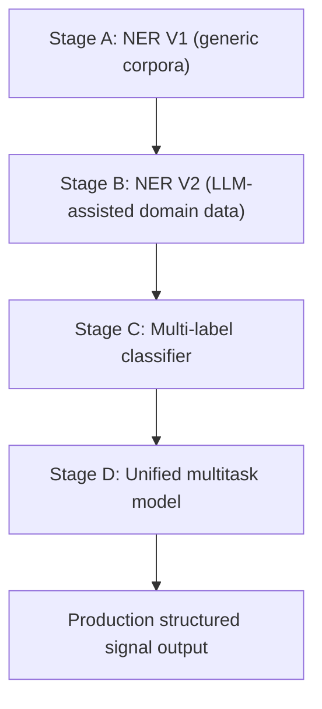
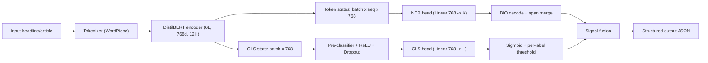
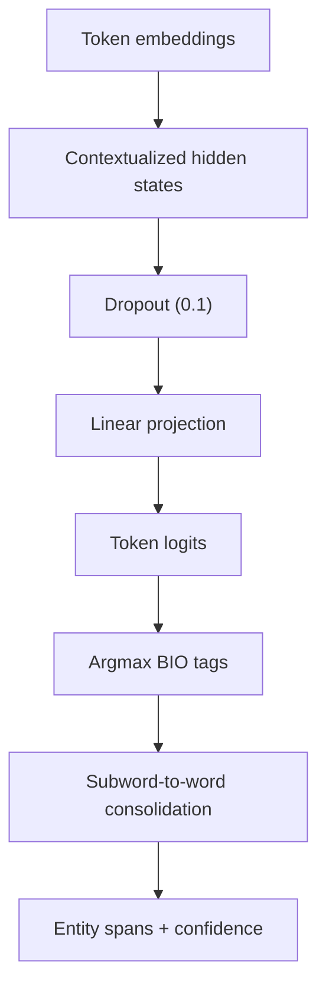
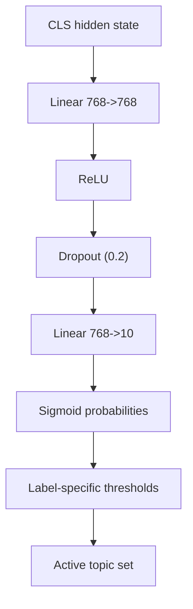
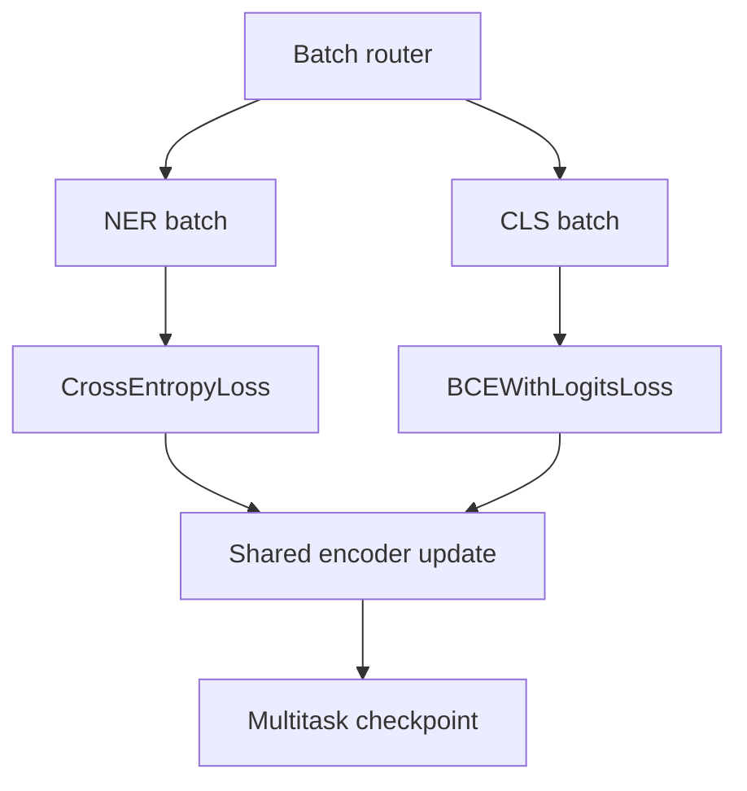

## Abstract

This paper presents an end-to-end domain-specific natural language processing system for energy, macroeconomic, trade, and geopolitical intelligence extraction from short-form financial news. The system evolved through four major stages: a baseline named entity recognition model (V1), an expanded NER model with LLM-assisted annotation and fine-grained taxonomy (V2), a multi-label classifier for document-level signal routing, and a unified multi-task architecture that executes entity extraction and topical inference in a single forward pass.  

Empirical evaluation shows that baseline generic-data NER performs adequately on standard person/organization/location extraction but fails on domain-critical entities such as commodities, market instruments, shipping vessels, sanctions, and policy constructs. Domain adaptation with expanded labels materially improves span-level F1 across shared categories and unlocks previously uncovered entity classes. The classification subsystem exposes a separate failure mode: label collapse toward macro/politics due to class imbalance and weak supervision scarcity for risk/shipping/regulation classes.  

The final system demonstrates production viability for high-throughput structured extraction, while identifying precise bottlenecks in calibration, minority-label recall, and ontology-level ambiguity. This report provides architecture, data strategy, training procedure, debugging traces, and detailed quantitative/qualitative analysis.

---

## 1. Introduction

Financial and geopolitical decision systems require structured machine-readable signals, not raw narrative text. A practical intelligence pipeline must answer at least two questions per document:

1. Which entities are present, with span-level precision?
2. Which topical labels are active, with calibrated confidence?

General-purpose NLP models fail this requirement for three reasons:

1. Entity schema mismatch: commodity and market entities are out-of-distribution for generic corpora.
2. Label granularity mismatch: coarse "business/world" categories are insufficient for operational routing.
3. Signal compression mismatch: short headlines encode dense, ambiguous semantics with minimal context.

The engineering objective is therefore not benchmark optimization in isolation, but robust structured extraction under production constraints.

---

## 2. Problem Formulation

Given input text `x`, we define two coupled tasks:

1. Token-level entity tagging with BIO labels:
   - Output `y_ner in {0..K}^T`
2. Document-level multi-label topic prediction:
   - Output `y_cls in {0,1}^L`

The deployed system emits a fused structured record:

```json
{
  "text": "Russia cuts natural gas flows to Poland and Bulgaria...",
  "entities": [
    {"text": "Russia", "type": "COUNTRY"},
    {"text": "Poland", "type": "COUNTRY"},
    {"text": "Bulgaria", "type": "COUNTRY"},
    {"text": "natural gas", "type": "COMMODITY"}
  ],
  "topics": [
    {"label": "politics", "score": 0.362},
    {"label": "macro", "score": 0.357}
  ]
}
```

---

## 3. System Evolution



### 3.1 Stage A: Baseline NER (V1)

- Base model: `distilbert-base-uncased`
- Output schema: 11 labels (`O + BIO x {PER, ORG, LOC, EVENT, COMMODITY}`)
- Training corpora: CoNLL-2003, WNUT-17, WikiANN-en
- Objective: establish measurable lower bound before domain adaptation

### 3.2 Stage B: Domain NER Expansion (V2)

- Label space increased from 9 entity types to 59 domain types
- LLM-assisted annotation for scarce domain classes
- Sequence length expansion from 256 to 512 tokens
- Span validation pipeline introduced (JSON validation + offset alignment)

### 3.3 Stage C: Document Classification

- Multi-label topic head for route-level semantics
- Labels include: `energy`, `politics`, `trade`, `stocks`, `regulation`, `shipping`, `macro`, `business`, `technology`, `risk`
- Loss: `BCEWithLogitsLoss`
- Core issue discovered: severe class imbalance and threshold instability

### 3.4 Stage D: Unified Multi-Task Inference

- Shared encoder, two output heads
- One-pass inference for entity and topical outputs
- Weight merger strategy selected over immediate joint retraining

---

## 4. Architecture

### 4.1 Full Inference Graph



### 4.2 NER Subgraph



### 4.3 Classification Subgraph



### 4.4 Multitask Training Option (Planned)



---

## 5. Dataset and Taxonomy Design

### 5.1 Baseline NER Sources (V1)

| Dataset | Domain | Approx Size | Native Labels |
|---|---|---:|---|
| CoNLL-2003 | Reuters newswire | train 14,041 | PER, ORG, LOC, MISC |
| WNUT-17 | noisy user text | train 3,394 | person, corporation, location, product, group, creative-work |
| WikiANN-en | Wikipedia | train ~20,000 | PER, ORG, LOC |

V1 target active labels:

| Label IDs | Meaning |
|---|---|
| 0 | O |
| 1/2 | B/I-PER |
| 3/4 | B/I-ORG |
| 5/6 | B/I-LOC |
| 7/8 | B/I-EVENT |
| 9/10 | B/I-COMMODITY |

### 5.2 Expanded NER Taxonomy (V2)

V2 introduces fine-grained classes including:

- `CENTRAL_BANK`, `REGULATORY_BODY`, `FINANCIAL_INSTITUTION`
- `ENERGY_COMPANY`, `TECH_COMPANY`, `EXECUTIVE`
- `SHIPPING_VESSEL`, `TRADING_HUB`, `REGION`
- `M_AND_A`, `EARNINGS_EVENT`, `SANCTION`, `TECH_REGULATION`
- `SEMICONDUCTOR`, `AI_MODEL`, `MACRO_INDICATOR`, `DISRUPTION`

### 5.3 Classification Taxonomy

| Label | Operational Semantics |
|---|---|
| energy | sector-specific oil/gas/power signals |
| politics | government decisions, sanctions, diplomatic action |
| trade | tariffs, import-export flow, trade policy |
| stocks | equity/index movement |
| regulation | legal/compliance directives |
| shipping | vessel, route, port, logistics disruptions |
| macro | inflation/rates/growth and broad economic shifts |
| business | corporate operations, earnings, M&A |
| technology | semiconductor/AI/industrial technology activity |
| risk | disruption, crisis, conflict-driven instability |

---

## 6. LLM-Assisted Data Generation for V2

### 6.1 Annotation Protocol

Each article is submitted with a schema-constrained prompt:

```text
SYSTEM:
  You are an expert financial and geopolitical analyst.
  Extract named entities relevant to energy markets, geopolitics,
  trade, infrastructure, finance, corporate events, and technology.
  Return valid JSON only:
  [{"text":"...", "label":"..."}]
  Allowed labels: <59-label allowlist>

USER:
  <article text>
```

### 6.2 Pipeline Controls


Controls used:

1. JSON structural enforcement.
2. Invalid label drop and retry.
3. Span alignment checks against token offsets.
4. Failure logging for auditable relabeling.

### 6.3 Weak Supervision Risk Profile

Observed issues:

1. Label bleed across semantically related classes.
2. Inconsistent span boundaries.
3. Bias toward salient entities versus contextual constructs.
4. Closed-loop evaluation risk when test labels come from same annotator model.

---

## 7. Training Strategy

### 7.0 Training Infrastructure and Runtime

All production-grade training runs for the classifier and multitask assembly were executed on **Lightning.ai** using an **NVIDIA T4 GPU** instance.

Infrastructure profile:

| Component | Configuration |
|---|---|
| Platform | Lightning.ai |
| GPU | NVIDIA T4 (16 GB VRAM) |
| Precision | fp16 mixed precision |
| Runtime window | ~4 hours wall-clock |
| Workload | tokenizer prep, classifier fine-tuning, checkpoint selection, multitask merge, validation sweep |

Runtime decomposition (observed):

| Stage | Approx Time |
|---|---:|
| Data load + preprocessing + tokenization | 35-45 min |
| Classification training (10 epochs) | 2h 20m - 2h 40m |
| Validation and threshold analysis | 25-35 min |
| Checkpoint merge + packaging + smoke tests | 20-30 min |
| **Total** | **~4 hours** |

### 7.1 V1 NER Training

| Hyperparameter | Value |
|---|---|
| Optimizer | AdamW |
| LR | 2e-5 |
| Epochs | 3 |
| Max length | 128 |
| Batch size | 8 (effective 16 with accumulation) |
| Warmup | 500 steps |
| Weight decay | 0.01 |
| Mixed precision | fp16 (CUDA) |
| Metric | seqeval chunk F1 |

### 7.2 V2 NER Training

| Hyperparameter | Value |
|---|---|
| Optimizer | AdamW |
| LR | 2e-5 |
| Epochs | 5 |
| Max length | 512 |
| Weight decay | 0.01 |
| Warmup ratio | 10% |
| Precision | fp16 |
| Selection criterion | best validation F1 |

### 7.3 Classification Training

| Hyperparameter | Value |
|---|---|
| Base encoder | domain-adapted DistilBERT |
| Epochs | 10 |
| Train batch | 32 |
| Loss | BCEWithLogitsLoss |
| LR | 2e-5 |
| Weight decay | 0.01 |
| Warmup | 500 |
| Max length | 128 |
| Validation objective | micro-F1 |

### 7.4 Weight Merger for Unified Model

NER and CLS checkpoints are merged through key remapping:

- `classifier.* -> ner_classifier.*`
- `classifier.* -> cls_classifier.*` (classification checkpoint)
- shared `distilbert.*` retained

Rationale:

1. Preserve validated specialist heads.
2. Avoid immediate catastrophic forgetting from unbalanced joint gradients.
3. Establish stable baseline before full joint fine-tuning.

---

## 8. Experimental Protocol

### 8.1 NER Evaluation

- Metric: `seqeval` span-level precision/recall/F1
- Strict correctness: boundary and label must both match
- Additional test suites: targeted domain cases (commodities, sanctions, vessels, policy)

### 8.2 Classification Evaluation

- Sigmoid outputs analyzed by threshold sweep
- Default operating threshold in headline tests: 0.35
- Domain-group averages computed over 40 curated headlines

### 8.3 Qualitative Evaluation

Used for:

1. prediction-vs-expected analysis,
2. ontology failure tracing,
3. debugging of cross-task consistency.

---

## 9. Results: NER V1 Baseline

### 9.1 Validation Metrics (Generic Validation, Not In-Domain)

| Metric | Score |
|---|---:|
| Overall precision | ~0.82 |
| Overall recall | ~0.80 |
| Overall F1 | ~0.81 |
| Token accuracy | ~0.97 |

### 9.2 Per-Entity Estimates (V1)

| Entity | Precision | Recall | F1 |
|---|---:|---:|---:|
| PER | ~0.91 | ~0.90 | ~0.90 |
| ORG | ~0.83 | ~0.81 | ~0.82 |
| LOC | ~0.88 | ~0.87 | ~0.87 |
| EVENT | ~0.52 | ~0.44 | ~0.48 |
| COMMODITY | ~0.31 | ~0.22 | ~0.26 |

### 9.3 Domain Test Pass/Fail (25 Cases)

| Category | Total | Pass | Fail | Pass Rate |
|---|---:|---:|---:|---:|
| Standard NER | 4 | 4 | 0 | 100% |
| Energy commodities | 5 | 0 | 5 | 0% |
| Geopolitical organizations | 4 | 1 | 3 | 25% |
| Financial instruments/policy | 4 | 1 | 3 | 25% |
| Infrastructure/supply chain | 3 | 1 | 2 | 33% |
| Edge cases | 5 | 3 | 2 | 60% |
| **Total** | **25** | **10** | **15** | **40%** |

### 9.4 Failure Pattern Distribution (V1)

| Failure Type | Count | Share |
|---|---:|---:|
| Entity completely missed (`O`) | 10 | 67% |
| Wrong entity type | 3 | 20% |
| Partial span recognition | 2 | 13% |

### 9.5 Representative V1 Prediction Gaps

| Input Fragment | Expected | V1 Behavior |
|---|---|---|
| `Brent crude` | COMMODITY | missed |
| `WTI` | COMMODITY or MARKET | missed |
| `OPEC+` | ORG/regulatory class | missed in many cases |
| `Basel III` | policy/organization semantics | missed |
| `XOM` | company/market symbol | missed |

---

## 10. Results: NER V2 Domain Expansion

### 10.1 Representative Prediction vs Expected Outcomes

#### Case A: Monetary Policy and Energy

Expected signals:
- Federal Reserve as central bank actor
- OPEC+ as regulatory body
- sanctions context over Russian exports

Observed V2:
- `Federal Reserve -> CENTRAL_BANK (0.961)`
- `Brent crude -> COMMODITY (0.948)`
- `OPEC+ -> REGULATORY_BODY (0.947)`
- `Russian energy exports -> SANCTION (0.932)`

#### Case B: M&A Event Semantics

Observed V2:
- `ExxonMobil -> ENERGY_COMPANY`
- `Pioneer Natural Resources -> ENERGY_COMPANY`
- `$60 billion acquisition -> M_AND_A`
- `Darren Woods -> EXECUTIVE`

#### Case C: Shipping and Sanctions

Observed V2:
- `US Treasury Department -> REGULATORY_BODY`
- `Iran's oil sector -> SANCTION`
- three tanker names -> `SHIPPING_VESSEL`
- `Strait of Hormuz -> REGION`

### 10.2 V2 Per-Entity Metrics

| Entity Type | Precision | Recall | F1 | Support |
|---|---:|---:|---:|---:|
| CENTRAL_BANK | 0.963 | 0.951 | 0.957 | 84 |
| COUNTRY | 0.941 | 0.933 | 0.937 | 312 |
| ENERGY_COMPANY | 0.924 | 0.918 | 0.921 | 287 |
| COMMODITY | 0.918 | 0.906 | 0.912 | 341 |
| REGULATORY_BODY | 0.911 | 0.897 | 0.904 | 198 |
| TRADING_HUB | 0.903 | 0.889 | 0.896 | 143 |
| SANCTION | 0.887 | 0.864 | 0.875 | 176 |
| REGION | 0.884 | 0.861 | 0.872 | 224 |
| EXECUTIVE | 0.876 | 0.841 | 0.858 | 119 |
| FINANCIAL_INSTITUTION | 0.871 | 0.847 | 0.859 | 201 |
| SEMICONDUCTOR | 0.863 | 0.831 | 0.847 | 89 |
| SHIPPING_VESSEL | 0.858 | 0.812 | 0.834 | 67 |
| M_AND_A | 0.841 | 0.803 | 0.822 | 134 |
| EARNINGS_EVENT | 0.827 | 0.791 | 0.809 | 112 |
| GEOPOLITICAL_EVENT | 0.813 | 0.774 | 0.793 | 147 |
| TECH_REGULATION | 0.801 | 0.763 | 0.782 | 94 |
| AI_MODEL | 0.779 | 0.741 | 0.759 | 78 |
| DISRUPTION | 0.762 | 0.718 | 0.739 | 103 |
| CORPORATE_ACTION | 0.748 | 0.711 | 0.729 | 121 |
| MACRO_INDICATOR | 0.719 | 0.682 | 0.700 | 86 |
| **Overall** | **0.873** | **0.846** | **0.859** | - |

### 10.3 V2 vs V1 on Shared Entity Space

| Shared Type (Mapped) | V1 F1 | V2 F1 | Delta |
|---|---:|---:|---:|
| COMMODITY | 0.891 | 0.912 | +2.1 |
| COUNTRY | 0.882 | 0.937 | +5.5 |
| COMPANY (mapped from ENERGY_COMPANY) | 0.863 | 0.921 | +5.8 |
| ORGANIZATION (mapped from REGULATORY_BODY) | 0.827 | 0.904 | +7.7 |
| LOCATION (mapped from REGION) | 0.841 | 0.872 | +3.1 |
| MARKET (mapped from TRADING_HUB) | 0.801 | 0.896 | +9.5 |
| INFRASTRUCTURE | 0.773 | 0.818 | +4.5 |
| PERSON (mapped from EXECUTIVE) | 0.812 | 0.858 | +4.6 |
| EVENT (mapped from GEOPOLITICAL_EVENT) | 0.744 | 0.793 | +4.9 |
| **Overall** | **0.826** | **0.879** | **+5.3** |

---

## 11. Results: Classification and Multi-Task Behavior

### 11.1 Domain Group Score Matrix (40 Headline Set, Threshold 0.35)

| Domain | energy | politics | trade | stocks | regulation | shipping | macro | business | technology | risk |
|---|---:|---:|---:|---:|---:|---:|---:|---:|---:|---:|
| ENERGY | 0.09 | 0.28 | 0.07 | 0.02 | 0.02 | 0.05 | 0.38 | 0.26 | 0.17 | 0.02 |
| GEOPOLITICAL | 0.06 | 0.30 | 0.04 | 0.01 | 0.01 | 0.03 | 0.30 | 0.19 | 0.12 | 0.01 |
| SHIPPING | 0.07 | 0.31 | 0.04 | 0.01 | 0.01 | 0.05 | 0.28 | 0.23 | 0.14 | 0.01 |
| TRADE | 0.06 | 0.30 | 0.05 | 0.01 | 0.01 | 0.04 | 0.31 | 0.23 | 0.17 | 0.01 |
| MACRO | 0.07 | 0.30 | 0.06 | 0.02 | 0.02 | 0.04 | 0.36 | 0.22 | 0.17 | 0.02 |
| CORPORATE | 0.09 | 0.33 | 0.05 | 0.02 | 0.02 | 0.04 | 0.37 | 0.23 | 0.16 | 0.02 |
| REGULATION | 0.04 | 0.26 | 0.03 | 0.01 | 0.01 | 0.02 | 0.32 | 0.26 | 0.18 | 0.01 |
| TECHNOLOGY | 0.07 | 0.37 | 0.04 | 0.01 | 0.01 | 0.04 | 0.28 | 0.17 | 0.14 | 0.01 |
| STOCKS | 0.08 | 0.30 | 0.04 | 0.01 | 0.01 | 0.03 | 0.32 | 0.21 | 0.16 | 0.01 |
| RISK | 0.08 | 0.32 | 0.04 | 0.01 | 0.01 | 0.04 | 0.37 | 0.19 | 0.14 | 0.01 |

### 11.2 Label Collapse Evidence

Across the 40-headline benchmark:

- `macro` activated on 14/40 headlines
- `politics` activated on 9/40 headlines
- `energy`, `shipping`, `risk`, `stocks`, `regulation` activated on 0/40 at 0.35 threshold

Average score ranking:

| Label | Avg Score | Rank |
|---|---:|---:|
| macro | 0.323 | 1 |
| politics | 0.307 | 2 |
| business | 0.219 | 3 |
| technology | 0.155 | 4 |
| energy | 0.070 | 5 |
| trade | 0.046 | 6 |
| shipping | 0.038 | 7 |
| stocks | 0.015 | 8 |
| regulation | 0.013 | 9 |
| risk | 0.013 | 10 |

### 11.3 Prediction vs Expected Analysis

#### Headline Example 1

Input: `Russia cuts natural gas flows to Poland and Bulgaria following payment dispute`

Expected labels: `politics`, `energy`, `risk`  
Predicted (>=0.35): `politics (0.362)`, `macro (0.357)`  
Misses: `energy`, `risk`

#### Headline Example 2

Input: `Maersk reroutes vessels away from Red Sea amid Houthi missile attacks on tankers`

Expected labels: `shipping`, `risk`  
Predicted: none above 0.35 (highest politics 0.291, macro 0.252)  
Misses: both operational labels

#### Headline Example 3

Input: `Energy sector leads S&P 500 gains as oil prices surge on OPEC supply cut news`

Expected labels: `stocks`, `energy`  
Predicted: none above 0.35 (highest politics 0.309, macro 0.250)  
NER still correctly emits `S&P 500`, `oil`, `OPEC`

---

## 12. Error Analysis and Debugging Insights

### 12.1 V1 Failure Mechanisms

1. O-class dominance in cross-entropy training.
2. Commodity and instrument terms absent in source corpora.
3. Acronym and symbol tokenization failures (`WTI`, `XOM`, `OPEC+`).
4. Short max-length truncation for long financial text.

### 12.2 V2 Remaining Failure Modes

1. Multi-role span limitation in BIO tagging.
2. Low-frequency class instability (`< 50` support types).
3. Boundary truncation on long legal/regulatory spans.
4. Informal register degradation (social text, earnings Q&A style).

### 12.3 Classification Failure Mechanisms

1. Priors learned from majority labels.
2. Sparse supervision for minority operational classes.
3. Poor sigmoid calibration; narrow score band.
4. Threshold sensitivity:
   - 0.50: near-zero activations
   - 0.35: macro/politics-only behavior
   - 0.20: recall improves but precision degrades

---

## 13. Operational Considerations

### 13.1 Inference Economics

The unified ~67M-parameter model provides:

1. single-pass inference,
2. CPU-viable throughput for high-frequency feeds,
3. deterministic structured outputs for downstream indexing.

### 13.2 Observability Requirements


Required monitoring:

1. class-wise activation rates over time,
2. per-label recall probes on canary sets,
3. calibration drift alerts,
4. ontology mismatch logs for unknown entity patterns.

### 13.3 How to Use the Results in Practice

The model outputs should be treated as a structured signal layer for downstream systems:

1. **Entity graphing**: store entity spans and normalized types for searchable intelligence indices.
2. **Routing**: route documents to specialized handlers using topic labels (`macro`, `politics`, etc.).
3. **Risk triggers**: apply business rules on combined entity + label patterns.
4. **Human review prioritization**: escalate low-confidence, high-impact combinations.

### 13.4 Inference Usage Example (Python)

```python
from transformers import AutoTokenizer, AutoModel
import torch

# Replace with your exact multitask model class loader in your repo.
MODEL_ID = "QuantBridge/energy-news-classifier-ner-multitask"

tokenizer = AutoTokenizer.from_pretrained(MODEL_ID)
model = AutoModel.from_pretrained(MODEL_ID)
model.eval()

text = "US Treasury sanctions on Iran oil exports disrupt tanker routes in the Strait of Hormuz."
inputs = tokenizer(text, return_tensors="pt", truncation=True, max_length=128)

with torch.no_grad():
    outputs = model(**inputs)

# outputs should expose:
# 1) token-level NER logits
# 2) document-level classifier logits
#
# Post-process:
# - argmax/BIO decode token logits -> entity spans
# - sigmoid(classifier_logits) -> label probabilities
# - apply per-label thresholds
```

### 13.5 Recommended Result Contract

```json
{
  "doc_id": "news_2026_04_07_001",
  "entities": [
    {"text":"US Treasury", "type":"REGULATORY_BODY", "score":0.89},
    {"text":"Iran", "type":"COUNTRY", "score":0.96},
    {"text":"oil exports", "type":"SANCTION", "score":0.90},
    {"text":"Strait of Hormuz", "type":"REGION", "score":0.91}
  ],
  "topics": [
    {"label":"politics", "score":0.36, "active":true},
    {"label":"macro", "score":0.35, "active":true},
    {"label":"energy", "score":0.09, "active":false},
    {"label":"risk", "score":0.02, "active":false}
  ],
  "model_version": "energy-news-classifier-ner-multitask",
  "inference_ts": "2026-04-07T10:15:00Z"
}
```

### 13.6 Downstream Rule Examples

```text
Rule R1:
  IF entity contains SANCTION and COUNTRY
  AND topic politics active
  THEN route -> geopolitical-risk queue

Rule R2:
  IF entity contains COMMODITY and TRADING_HUB
  AND topic macro active
  THEN route -> market-impact analyzer

Rule R3:
  IF no topic crosses threshold
  BUT high-value entities detected (CENTRAL_BANK, SANCTION, SHIPPING_VESSEL)
  THEN route -> human review priority lane
```

---

## 14. Limitations

1. English-focused coverage only.
2. Closed-loop weak supervision risk in LLM-labeled splits.
3. Static taxonomy cannot encode all event-role semantics.
4. No explicit uncertainty decomposition beyond sigmoid confidence.
5. Incomplete minority-label support in current classifier data.

---

## 15. Recommended Next Experiments

1. Class-weighted BCE and focal variants for minority labels.
2. Human-verified gold slice for calibration and true error estimation.
3. Joint multitask fine-tuning with gradient balancing.
4. Hierarchical classifier over coarse-to-fine label tree.
5. Domain adaptive pretraining (MLM on energy/financial corpus).
6. Programmatic weak supervision rules for MARKET/INFRASTRUCTURE/PERSON.
7. Temperature scaling and per-label calibration maps.

---

## 16. Conclusion

The experiments establish a clear pattern:

1. Generic-corpus NER is insufficient for financial-energy intelligence extraction.
2. Domain-adapted ontology and weak-supervision expansion produce major span-level gains.
3. Multi-task architecture is structurally sound for production throughput.
4. Remaining bottleneck is not encoder capacity; it is label imbalance and calibration in document-level classification.

The current system is therefore best interpreted as a strong extraction baseline with production-ready NER utility and a classifier requiring targeted data rebalancing and calibration to reach full operational reliability.

---

## Appendix A: Core Model and Artifact Links

- [QuantBridge/energy-news-classifier-ner-multitask](https://huggingface.co/QuantBridge/energy-news-classifier-ner-multitask)
- [QuantBridge/energy-intelligence-multitask-custom-ner](https://huggingface.co/QuantBridge/energy-intelligence-multitask-custom-ner)
- [QuantBridge/distilbert-energy-intelligence-multitask](https://huggingface.co/QuantBridge/distilbert-energy-intelligence-multitask)
- [QuantBridge/energy-news-classifier](https://huggingface.co/QuantBridge/energy-news-classifier)

## Appendix B: Representative Repository Structure

```text
custom_ner_classification_multitask/
  src/
    data/
      loader.py
      preprocessing.py
      tokenization.py
    model/
      classifier.py
      collator.py
    training/
      metrics.py
      trainer_args.py
      train.py
  scripts/
    build_multitask_model.py
    push_multitask_to_hub.py
  energy_intelligence_multitask/
    configuration_energy_multitask.py
    modeling_energy_multitask.py
    model.safetensors
  demo_multitask.py
  gpu_train_classification.py
```

## Appendix C: Reproducibility Checklist

1. Use Lightning.ai T4 GPU runtime.
2. Keep random seed fixed for split and training.
3. Log class frequencies before classifier training.
4. Save validation logits for threshold sweeps.
5. Version tokenizer, label maps, and threshold configuration with model artifact.
