# Harness Engineering — Mermaid Diagrams

All Mermaid diagrams from the article [`_implementations/harness-engineering.md`](../_implementations/harness-engineering.md) (published at `/engineering/harness-engineering/`), in article order, grouped by section. This file is generated from the article, so the two never drift apart. All 36 were render-checked with Mermaid 11 in headless Chrome: 30 flowcharts, 5 sequence diagrams, 1 state diagram, 0 errors.

Diagrams that depict a studied system (Mini-SWE-Agent, Claude Code, Codex, …) show mechanisms reported in the paper (*Harness Engineering*, arXiv:2609.00006). Diagrams in §XVIII onward depict the **proposed reference harness**, not any studied system.

## I. Introduction: The Agent Is Not the Model

### 1. Action-observation loop (user, harness, LLM, tools, environment)

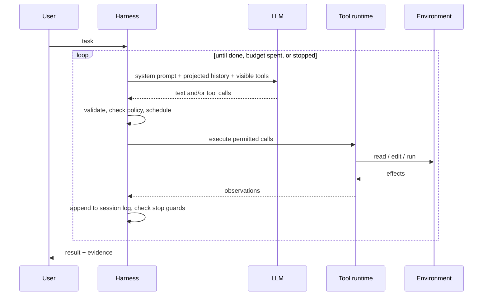
```mermaid
sequenceDiagram
    participant U as User
    participant H as Harness
    participant M as LLM
    participant T as Tool runtime
    participant E as Environment
    U->>H: task
    loop until done, budget spent, or stopped
        H->>M: system prompt + projected history + visible tools
        M-->>H: text and/or tool calls
        H->>H: validate, check policy, schedule
        H->>T: execute permitted calls
        T->>E: read / edit / run
        E-->>T: effects
        T-->>H: observations
        H->>H: append to session log, check stop guards
    end
    H-->>U: result + evidence
```

## III. The Seven-Subsystem Anatomy

### 2. Seven-subsystem harness anatomy

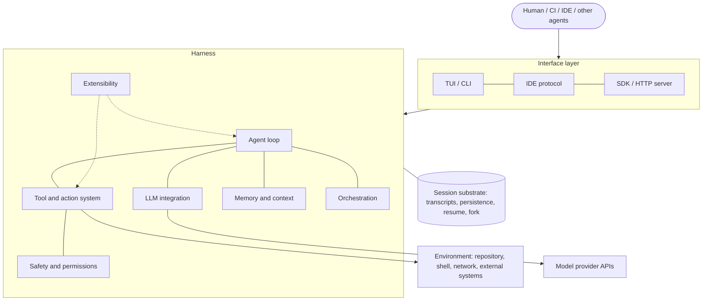
```mermaid
flowchart TD
    Human([Human / CI / IDE / other agents]) --> IF
    subgraph IF[Interface layer]
        direction LR
        TUI[TUI / CLI] --- IDE[IDE protocol] --- SDK[SDK / HTTP server]
    end
    IF --> H
    subgraph H[Harness]
        LOOP[Agent loop]
        LLM[LLM integration]
        TOOLS[Tool and action system]
        MEM[Memory and context]
        SAFE[Safety and permissions]
        ORCH[Orchestration]
        EXT[Extensibility]
        LOOP --- LLM
        LOOP --- TOOLS
        LOOP --- MEM
        TOOLS --- SAFE
        LOOP --- ORCH
        EXT -.-> TOOLS
        EXT -.-> LOOP
    end
    H --- SUB[(Session substrate: transcripts, persistence, resume, fork)]
    TOOLS --> ENV[Environment: repository, shell, network, external systems]
    LLM --> PROV[Model provider APIs]
```

### 3. Mini-SWE-Agent floor vs. what production code buys

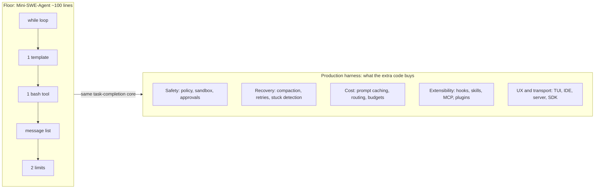
```mermaid
flowchart LR
    subgraph FLOOR["Floor: Mini-SWE-Agent ~100 lines"]
        A1[while loop] --> A2[1 template] --> A3[1 bash tool] --> A4[message list] --> A5[2 limits]
    end
    subgraph PROD["Production harness: what the extra code buys"]
        B1[Safety: policy, sandbox, approvals]
        B2[Recovery: compaction, retries, stuck detection]
        B3[Cost: prompt caching, routing, budgets]
        B4[Extensibility: hooks, skills, MCP, plugins]
        B5[UX and transport: TUI, IDE, server, SDK]
    end
    FLOOR -->|same task-completion core| PROD
```

## IV. Case Study #1 — Mini-SWE-Agent: The Minimum Viable Harness

### 4. Mini-SWE-Agent loop (sequence)

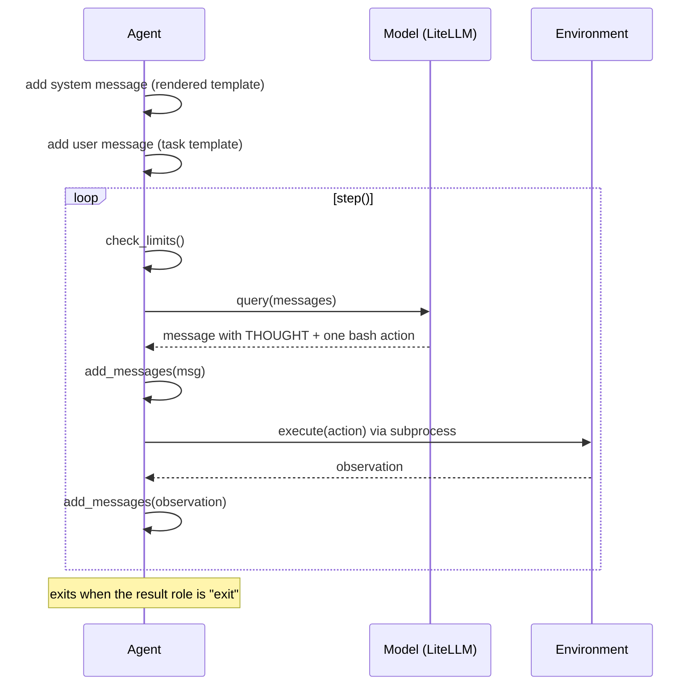
```mermaid
sequenceDiagram
    participant A as Agent
    participant M as Model (LiteLLM)
    participant E as Environment
    A->>A: add system message (rendered template)
    A->>A: add user message (task template)
    loop step()
        A->>A: check_limits()
        A->>M: query(messages)
        M-->>A: message with THOUGHT + one bash action
        A->>A: add_messages(msg)
        A->>E: execute(action) via subprocess
        E-->>A: observation
        A->>A: add_messages(observation)
    end
    Note over A: exits when the result role is "exit"
```

## V. Case Study #2 — Claude Code: Concurrency Semantics, Deferred Tools, and Cache-Aware Composition

### 5. Claude Code concurrency partition (sequence)

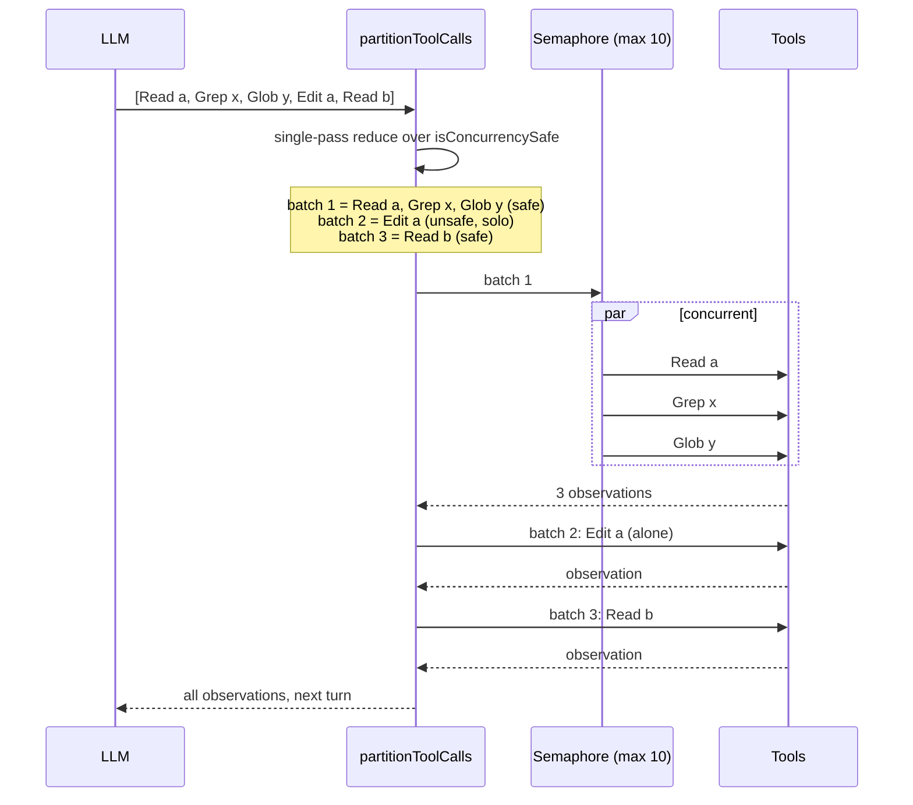
```mermaid
sequenceDiagram
    participant M as LLM
    participant P as partitionToolCalls
    participant S as Semaphore (max 10)
    participant T as Tools
    M->>P: [Read a, Grep x, Glob y, Edit a, Read b]
    P->>P: single-pass reduce over isConcurrencySafe
    Note over P: batch 1 = Read a, Grep x, Glob y (safe)<br/>batch 2 = Edit a (unsafe, solo)<br/>batch 3 = Read b (safe)
    P->>S: batch 1
    par concurrent
        S->>T: Read a
        S->>T: Grep x
        S->>T: Glob y
    end
    T-->>P: 3 observations
    P->>T: batch 2: Edit a (alone)
    T-->>P: observation
    P->>T: batch 3: Read b
    T-->>P: observation
    P-->>M: all observations, next turn
```

### 6. Claude Code coordinator-worker with context forking

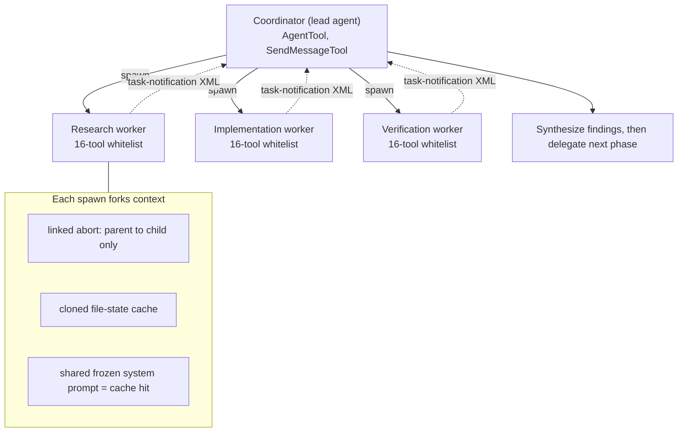
```mermaid
flowchart TD
    C["Coordinator (lead agent)<br/>AgentTool, SendMessageTool"]
    C -->|spawn| R["Research worker<br/>16-tool whitelist"]
    C -->|spawn| I["Implementation worker<br/>16-tool whitelist"]
    C -->|spawn| V["Verification worker<br/>16-tool whitelist"]
    R -.->|task-notification XML| C
    I -.->|task-notification XML| C
    V -.->|task-notification XML| C
    C --> S[Synthesize findings, then delegate next phase]
    subgraph FORK["Each spawn forks context"]
        F1[linked abort: parent to child only]
        F2[cloned file-state cache]
        F3[shared frozen system prompt = cache hit]
    end
    R --- FORK
```

## VI. Case Study #3 — Codex CLI: An Async Runtime With OS-Level Guarantees

### 7. Codex async runtime: Session, ToolCallRuntime, FuturesOrdered

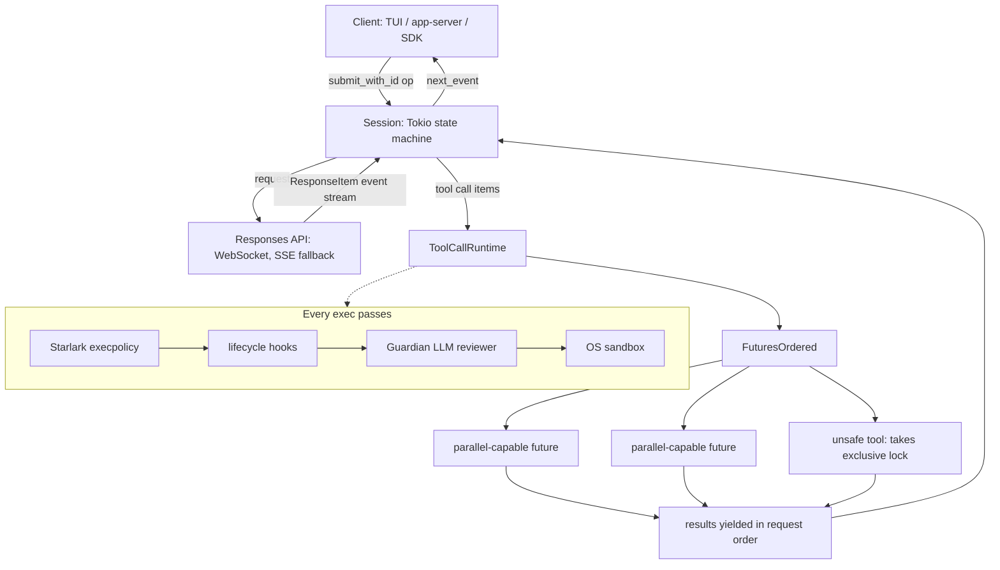
```mermaid
flowchart TD
    UI[Client: TUI / app-server / SDK] -->|submit_with_id op| SES[Session: Tokio state machine]
    SES -->|request| API[Responses API: WebSocket, SSE fallback]
    API -->|ResponseItem event stream| SES
    SES -->|tool call items| TCR[ToolCallRuntime]
    TCR --> FO[FuturesOrdered]
    FO --> P1[parallel-capable future]
    FO --> P2[parallel-capable future]
    FO --> X1[unsafe tool: takes exclusive lock]
    P1 --> RES[results yielded in request order]
    P2 --> RES
    X1 --> RES
    RES --> SES
    SES -->|next_event| UI
    subgraph SAFETY["Every exec passes"]
        L1[Starlark execpolicy] --> L2[lifecycle hooks] --> L3[Guardian LLM reviewer] --> L4[OS sandbox]
    end
    TCR -.-> SAFETY
```

## VII. Case Study #4 — Gemini CLI: A Tool State Machine and Two-Tier Loop Detection

### 8. Gemini CLI tool state machine

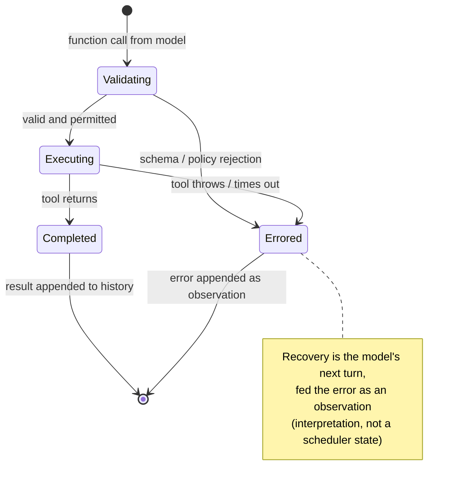
```mermaid
stateDiagram-v2
    [*] --> Validating: function call from model
    Validating --> Errored: schema / policy rejection
    Validating --> Executing: valid and permitted
    Executing --> Completed: tool returns
    Executing --> Errored: tool throws / times out
    Completed --> [*]: result appended to history
    Errored --> [*]: error appended as observation
    note right of Errored
        Recovery is the model's next turn,
        fed the error as an observation
        (interpretation, not a scheduler state)
    end note
```

### 9. Gemini CLI hybrid stuck detection

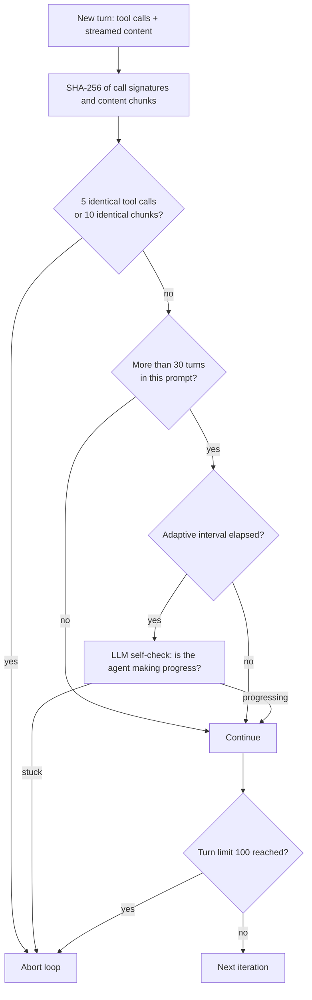
```mermaid
flowchart TD
    T[New turn: tool calls + streamed content] --> H[SHA-256 of call signatures and content chunks]
    H --> C1{"5 identical tool calls<br/>or 10 identical chunks?"}
    C1 -->|yes| ABORT[Abort loop]
    C1 -->|no| C2{"More than 30 turns<br/>in this prompt?"}
    C2 -->|no| CONT[Continue]
    C2 -->|yes| C3{Adaptive interval elapsed?}
    C3 -->|no| CONT
    C3 -->|yes| LLM[LLM self-check: is the agent making progress?]
    LLM -->|stuck| ABORT
    LLM -->|progressing| CONT
    CONT --> CAP{Turn limit 100 reached?}
    CAP -->|yes| ABORT
    CAP -->|no| NEXT[Next iteration]
```

## VIII. Case Study #5 — Aider: The Reflection Loop

### 10. Aider reflection loop

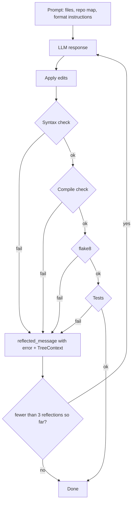
```mermaid
flowchart TD
    P[Prompt: files, repo map, format instructions] --> L[LLM response]
    L --> A[Apply edits]
    A --> S{Syntax check}
    S -->|fail| R[reflected_message with error + TreeContext]
    S -->|ok| C{Compile check}
    C -->|fail| R
    C -->|ok| F{flake8}
    F -->|fail| R
    F -->|ok| T{Tests}
    T -->|fail| R
    T -->|ok| D[Done]
    R --> N{"fewer than 3 reflections so far?"}
    N -->|yes| L
    N -->|no| D
```

## IX. Case Study #6 — OpenHands: Event Sourcing as the Session Substrate

### 11. OpenHands event-sourced architecture

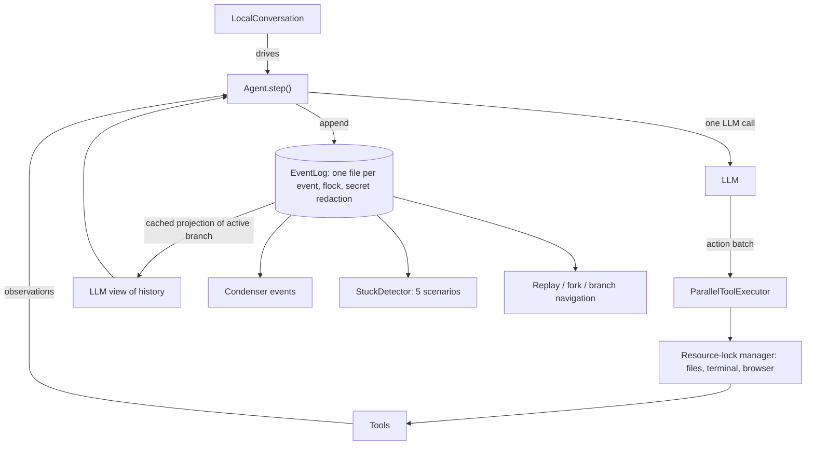
```mermaid
flowchart TD
    CONV[LocalConversation] -->|drives| STEP["Agent.step()"]
    STEP -->|one LLM call| LLM[LLM]
    LLM -->|action batch| PTE[ParallelToolExecutor]
    PTE --> LOCK[Resource-lock manager: files, terminal, browser]
    LOCK --> TOOLS[Tools]
    TOOLS -->|observations| STEP
    STEP -->|append| LOG[(EventLog: one file per event, flock, secret redaction)]
    LOG -->|cached projection of active branch| VIEW[LLM view of history]
    VIEW --> STEP
    LOG --> COND[Condenser events]
    LOG --> STUCK[StuckDetector: 5 scenarios]
    LOG --> REPLAY[Replay / fork / branch navigation]
```

### 12. OpenHands conversation tree (branching)

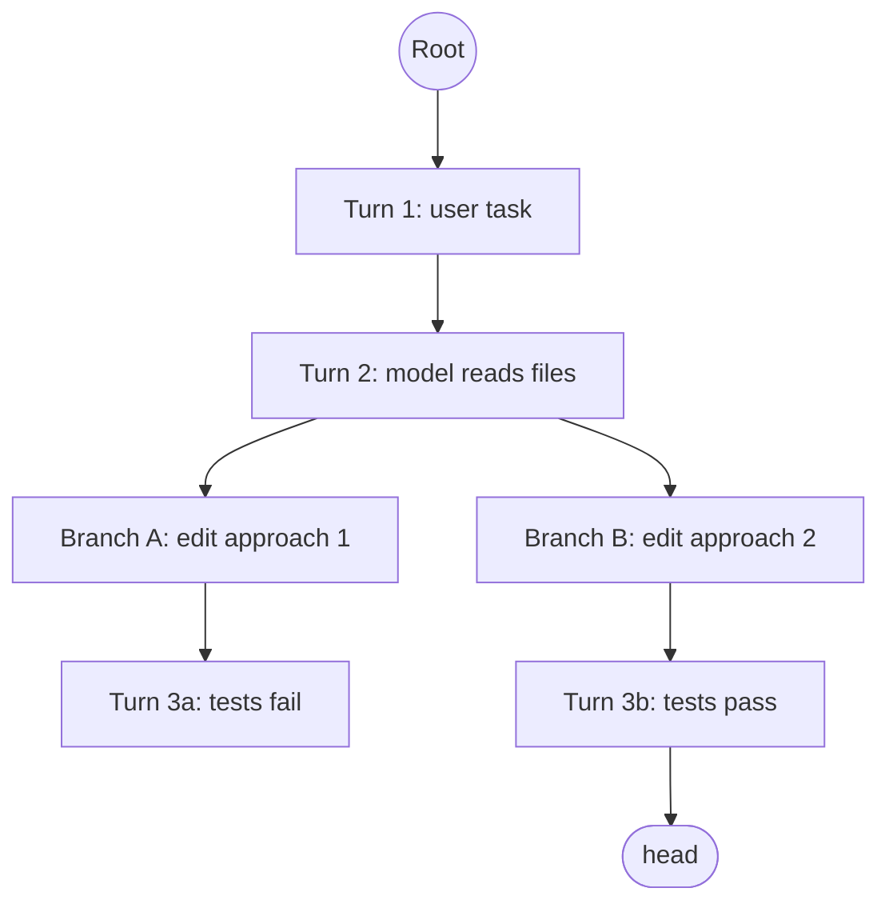
```mermaid
flowchart TD
    ROOT((Root)) --> T1[Turn 1: user task]
    T1 --> T2[Turn 2: model reads files]
    T2 --> BA[Branch A: edit approach 1]
    T2 --> BB[Branch B: edit approach 2]
    BA --> A3[Turn 3a: tests fail]
    BB --> B3[Turn 3b: tests pass]
    B3 --> HEAD([head])
```

## X. Case Study #7 — Hermes: Budgets, Stop Guards, and Verify-on-Stop

### 13. Hermes verify-on-stop guard

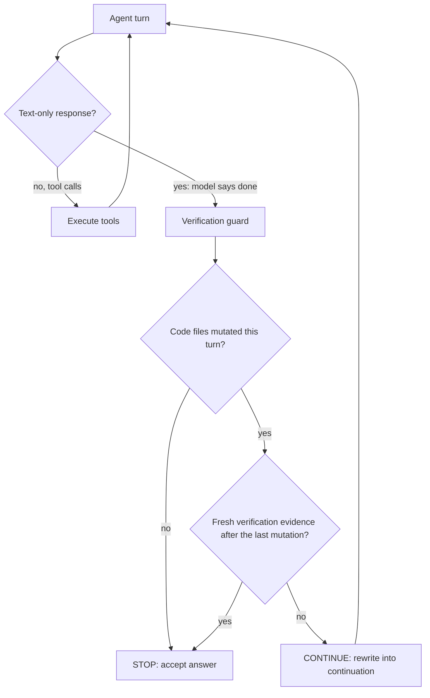
```mermaid
flowchart TD
    AG[Agent turn] --> RESP{Text-only response?}
    RESP -->|no, tool calls| TOOLS[Execute tools] --> AG
    RESP -->|yes: model says done| G[Verification guard]
    G --> M{Code files mutated this turn?}
    M -->|no| STOP[STOP: accept answer]
    M -->|yes| EV{Fresh verification evidence after the last mutation?}
    EV -->|yes| STOP
    EV -->|no| CONT[CONTINUE: rewrite into continuation]
    CONT --> AG
```

### 14. Hermes lineage compaction

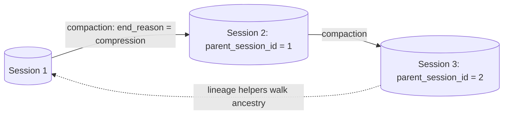
```mermaid
flowchart LR
    S1[(Session 1)] -->|"compaction: end_reason = compression"| S2[(Session 2: parent_session_id = 1)]
    S2 -->|compaction| S3[(Session 3: parent_session_id = 2)]
    S3 -.->|lineage helpers walk ancestry| S1
```

## XI. Case Study #8 — Pi: Minimal Core, Maximal Extensibility

### 15. Pi minimal core and extension host

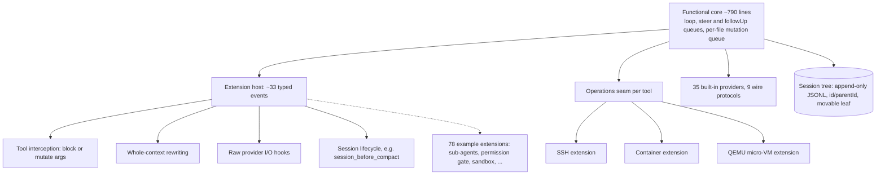
```mermaid
flowchart TD
    CORE["Functional core ~790 lines<br/>loop, steer and followUp queues, per-file mutation queue"]
    BUS["Extension host: ~33 typed events"]
    CORE --> BUS
    BUS --> TI[Tool interception: block or mutate args]
    BUS --> CTX[Whole-context rewriting]
    BUS --> PIO[Raw provider I/O hooks]
    BUS --> LIFE[Session lifecycle, e.g. session_before_compact]
    CORE --> OPS["Operations seam per tool"]
    OPS --> SSH[SSH extension]
    OPS --> CONT[Container extension]
    OPS --> VM[QEMU micro-VM extension]
    CORE --> PROV["35 built-in providers, 9 wire protocols"]
    CORE --> SESS[("Session tree: append-only JSONL, id/parentId, movable leaf")]
    BUS -.-> EXT["78 example extensions: sub-agents, permission gate, sandbox, ..."]
```

## XII. Case Study #9 — OpenCode: The Harness as a Server

### 16. OpenCode client/server harness

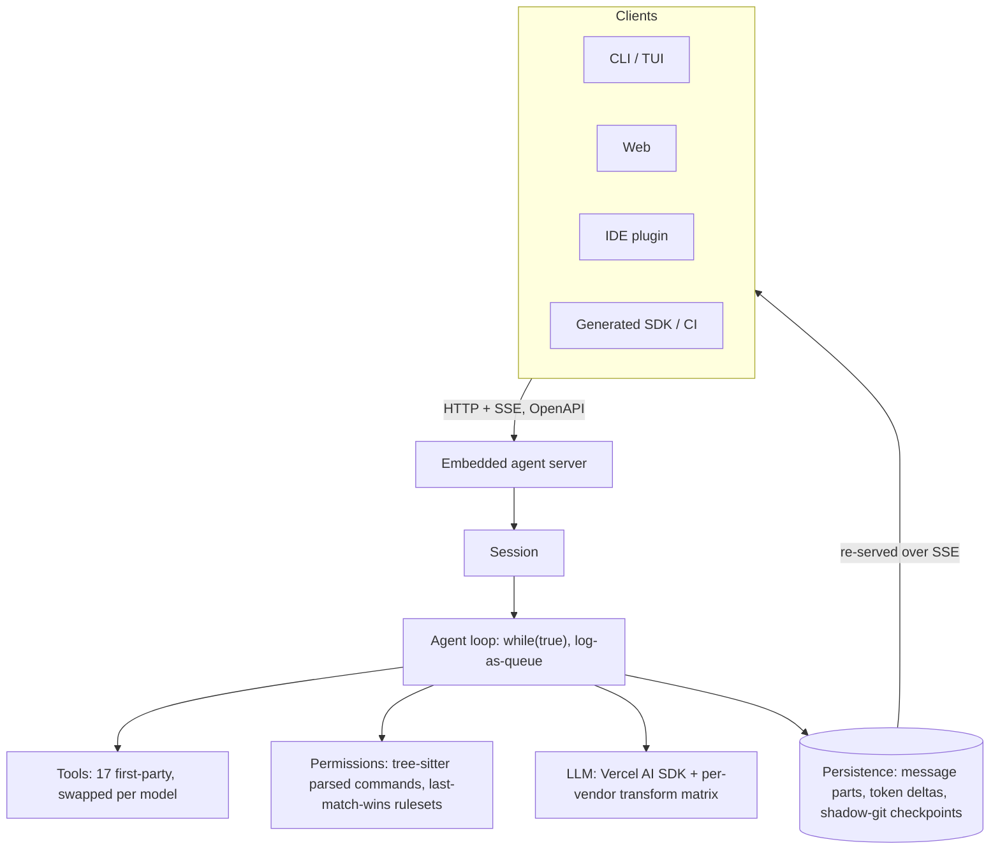
```mermaid
flowchart TD
    subgraph CLIENTS[Clients]
        TUI[CLI / TUI]
        WEB[Web]
        IDE[IDE plugin]
        SDKC[Generated SDK / CI]
    end
    CLIENTS -->|HTTP + SSE, OpenAPI| SRV[Embedded agent server]
    SRV --> SESSION[Session]
    SESSION --> LOOP["Agent loop: while(true), log-as-queue"]
    LOOP --> TOOLS[Tools: 17 first-party, swapped per model]
    LOOP --> PERM["Permissions: tree-sitter parsed commands, last-match-wins rulesets"]
    LOOP --> LLMS["LLM: Vercel AI SDK + per-vendor transform matrix"]
    LOOP --> PERSIST[(Persistence: message parts, token deltas, shadow-git checkpoints)]
    PERSIST -->|re-served over SSE| CLIENTS
```

## XIII. Case Study #10 — Mistral Vibe: Turn-Level Middleware

### 17. Mistral Vibe middleware pipeline

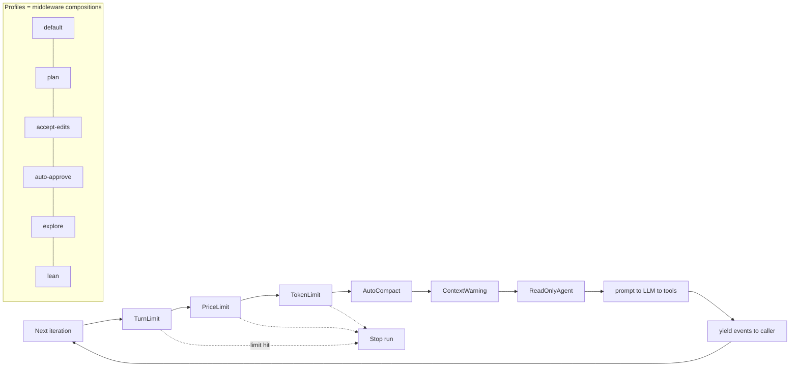
```mermaid
flowchart LR
    START[Next iteration] --> M1[TurnLimit] --> M2[PriceLimit] --> M3[TokenLimit] --> M4[AutoCompact] --> M5[ContextWarning] --> M6[ReadOnlyAgent]
    M6 --> CORE[prompt to LLM to tools]
    CORE --> EV[yield events to caller]
    EV --> START
    M1 -.->|limit hit| STOP[Stop run]
    M2 -.-> STOP
    M3 -.-> STOP
    subgraph PROFILES["Profiles = middleware compositions"]
        P1[default] --- P2[plan] --- P3[accept-edits] --- P4[auto-approve] --- P5[explore] --- P6[lean]
    end
```

## XIV. Case Study #11 — OpenClaw: The Harness Concept Beyond Coding

### 18. OpenClaw gateway delegation

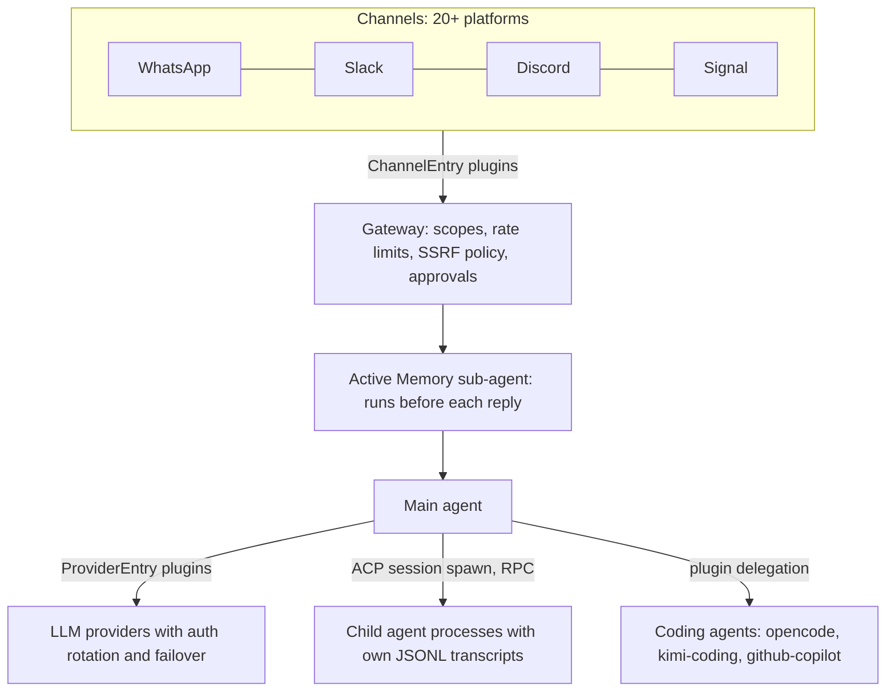
```mermaid
flowchart TD
    subgraph CH[Channels: 20+ platforms]
        WA[WhatsApp] --- SL[Slack] --- DC[Discord] --- SG[Signal]
    end
    CH -->|ChannelEntry plugins| GW["Gateway: scopes, rate limits, SSRF policy, approvals"]
    GW --> AM[Active Memory sub-agent: runs before each reply]
    AM --> AGENT[Main agent]
    AGENT -->|ProviderEntry plugins| PROV[LLM providers with auth rotation and failover]
    AGENT -->|ACP session spawn, RPC| SUBS[Child agent processes with own JSONL transcripts]
    AGENT -->|plugin delegation| SWE["Coding agents: opencode, kimi-coding, github-copilot"]
```

## XV. The Meta-Harness — Omnigent

### 19. Omnigent meta-harness over harnesses

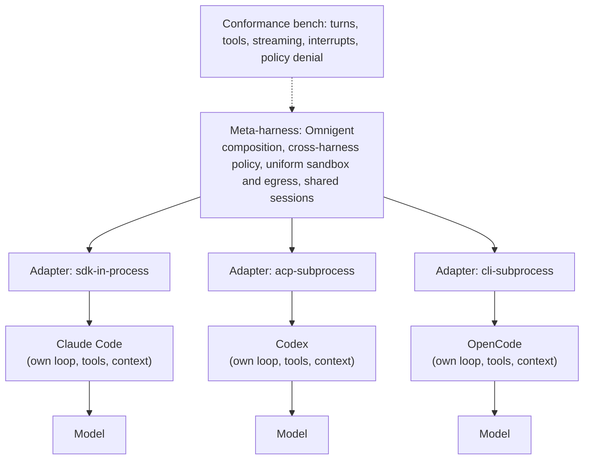
```mermaid
flowchart TD
    MH["Meta-harness: Omnigent<br/>composition, cross-harness policy, uniform sandbox and egress, shared sessions"]
    MH --> A1[Adapter: sdk-in-process]
    MH --> A2[Adapter: acp-subprocess]
    MH --> A3[Adapter: cli-subprocess]
    A1 --> H1["Claude Code<br/>(own loop, tools, context)"]
    A2 --> H2["Codex<br/>(own loop, tools, context)"]
    A3 --> H3["OpenCode<br/>(own loop, tools, context)"]
    H1 --> M1[Model]
    H2 --> M2[Model]
    H3 --> M3[Model]
    BENCH[Conformance bench: turns, tools, streaming, interrupts, policy denial] -.-> MH
```

## XVI. The Pattern Catalog: 29 Patterns, Seven Engineering Categories

### 20. Pattern taxonomy (29 patterns, 7 categories)

```mermaid
flowchart TD
    ROOT[29 harness patterns]
    ROOT --> CF[Control flow]
    ROOT --> CX[Context and memory]
    ROOT --> TL[Tools and editing]
    ROOT --> ST[State and sessions]
    ROOT --> LI[LLM integration]
    ROOT --> EX[Extensibility]
    ROOT --> SA[Safety]
    CF --> CF1[Middleware pipeline] & CF2[Reflection loop] & CF3[Outer verification loop] & CF4[Stuck detection] & CF5[Recursive composition] & CF6[Template method]
    CX --> CX1[JIT repo context] & CX2[LLM summarization] & CX3[Lineage compaction] & CX4[Context forking] & CX5[Agent-maintained memory]
    TL --> TL1[Deferred loading] & TL2[Polymorphic edits] & TL3[Protocol interfaces]
    ST --> ST1[Event sourcing] & ST2[Session-tree version control] & ST3[Turn-level checkpoint] & ST4[Client/server harness]
    LI --> LI1[Prompt caching] & LI2[Model-family prompt matrix] & LI3[Cache-dialect fanout] & LI4[Harness mimicry]
    EX --> EX1[Skills] & EX2[Conditional activation] & EX3[Self-improving skill loop] & EX4[Minimal core / extension host]
    SA --> SA1[Policy-as-code] & SA2[Syntax-aware command permissioning] & SA3[Untrusted-content delimiting]
```

## XVII. The Twin Absences: No Agentic Frameworks, No Code RAG

### 21. Deterministic retrieval mechanisms (twin absences)

```mermaid
flowchart LR
    Q[Agent needs code context] --> RG[ripgrep keyword search]
    Q --> GL[glob / fd file discovery]
    Q --> TS[tree-sitter symbols: Aider RepoMap with PageRank-style ranking]
    Q --> FS[On-demand file reads]
    Q --> MD[Auto-discovered Markdown context files]
    Q --> LSP[LSP diagnostics after edits: OpenCode, Hermes]
    T[Agent needs a tool] --> BM[BM25 over tool specs: Codex, Hermes]
    M[Agent needs past conversation] --> FTS[SQLite FTS5 + BM25: Hermes]
    M --> HYB[Hybrid embeddings + FTS5 over chat history: OpenClaw only]
```

## XVIII. Implementation — Building Our Own Harness

### 22. Reference harness architecture

```mermaid
flowchart TD
    U([User / CI / IDE]) --> IFC["Interface: cli.py, server.py"]
    IFC --> SM["Session manager: session.py + events.py"]
    SM --> LOOP["Agent loop: loop.py"]
    LOOP --> MW["Middleware: turn, token, cost limits; auto-compact; context warning"]
    LOOP --> LLMA["LLM adapter: provider.py, anthropic_provider.py, routing.py"]
    LOOP --> CTXM["Context manager: static/dynamic prompt, JIT repo context"]
    LOOP --> SCH["Tool scheduler: resource-aware batches"]
    SCH --> EXE["Tool executor: validate, hooks, policy, approval, audit, run"]
    EXE --> REG["Tool registry: typed tools, deferred discovery"]
    EXE --> PERM["Permission engine: modes, rules, hardline floor, grants"]
    EXE --> RUN["Command runner: exec, no shell, scrubbed env"]
    LOOP --> VER["Verification engine: validators + verify-on-stop"]
    LOOP --> STK[Stuck detector]
    CTXM --> MEMS["Memory: bounded frozen snapshot"]
    CTXM --> CMP["Compactor: incremental summaries"]
    LOOP --> ORC["Orchestrator: coordinator + workers"]
    ORC -.->|child harnesses| LOOP
    EXT["Extension manager: hooks, skills, plugins, MCP-style servers"] -.-> EXE
    EXT -.-> CTXM
    SM --> LOG[("Event log: JSONL, tree-shaped, redacted")]
```

## XXI. Implementation Step 3 — Concurrency-Aware Tool Execution

### 23. Concurrency-aware tool scheduling (worked example)

```mermaid
flowchart TD
    IN["Model emits: read a, read b, edit a, edit c, run tests, read c"] --> P[Single pass, in order]
    P --> B1["Batch 1: read a + read b (no conflict)"]
    B1 --> X1{"edit a writes path:a, conflicts with read a"}
    X1 --> B2["Batch 2: edit a + edit c (disjoint writes)"]
    B2 --> X2{"run tests declares no resources"}
    X2 --> B3["Batch 3: run tests (alone)"]
    B3 --> B4["Batch 4: read c (after the command)"]
    B4 --> OUT[Results returned in the model's original order]
```

## XXII. Implementation Step 4 — Context Engineering

### 24. Context management

```mermaid
flowchart TD
    subgraph PROMPT["System prompt per turn"]
        ST["Static prefix: identity, rules, tool notes<br/>byte-stable for the whole session"]
        DY["Dynamic suffix: env (date only), root AGENTS.md,<br/>frozen memory snapshot, skills index"]
    end
    HIST["History = projection of active branch,<br/>starting at latest COMPACTION event"]
    TOOLRES[Tool result] --> JIT{"Touched a file under a<br/>directory with AGENTS.md?"}
    JIT -->|yes, first time| APP[Append nested context to the tool result]
    JIT -->|no| PLAIN[Result as-is]
    BUD{"tokens >= window - buffer?"} -->|yes| CMP["Compactor: merge previous summary,<br/>keep verbatim tail, re-inject task"]
    CMP --> EVT[(COMPACTION event)]
    EVT --> HIST
    OVF[Provider overflow error] --> CMP
```

## XXIII. Implementation Step 5 — Safety

### 25. Safety pipeline (every tool call)

```mermaid
flowchart TD
    REQ[Tool request] --> SV{Schema validation}
    SV -->|invalid| ERR1[Error observation: human never asked]
    SV -->|valid| HK{PreToolUse hooks}
    HK -->|block| ERR2[Denied by hook, audited]
    HK -->|pass or rewrite args| PP{"Permission policy:<br/>parse, hardline floor, mode default, rules, grants"}
    PP -->|deny| ERR3[Denied, audited]
    PP -->|ask| AP{Approver}
    AP -->|refused| ERR3
    AP -->|approved, optionally always| RP
    PP -->|allow| RP{"Resource policy:<br/>path inside workspace, protected paths"}
    RP -->|escape| ERR4[PermissionError observation]
    RP -->|ok| SB["Command runner: exec without shell, scrubbed env,<br/>cwd confined, timeout, output cap"]
    SB --> EX[Execution]
    EX --> AUD[(Audit: PERMISSION_DECISION + TOOL_RESULT events)]
```

## XXIV. Implementation Step 6 — Verification

### 26. Verification and verify-on-stop

```mermaid
flowchart TD
    A[Agent] --> I[Implementation: edits, commands]
    I --> D["Model replies with no tool calls: I am done"]
    D --> G{"Changes since last verification?<br/>(logical clock)"}
    G -->|no| S[STOP: completed]
    G -->|yes| V[Run validators]
    V --> E[(Evidence events)]
    E --> P{All passed?}
    P -->|yes| S
    P -->|no| N{"Attempts left?"}
    N -->|yes| R["Inject verification-failed with the failing output"]
    R --> A
    N -->|no| U[STOP: status = unverified, never success]
```

## XXV. Implementation Step 7 — Event Sourcing

### 27. Event sourcing flow (sequence)

```mermaid
sequenceDiagram
    participant L as Loop
    participant X as Executor
    participant V as Verifier
    participant G as EventLog
    participant O as Observers
    L->>G: USER_MESSAGE
    L->>G: MODEL_RESPONSE
    X->>G: TOOL_CALL
    X->>G: PERMISSION_DECISION
    L->>G: TOOL_RESULT (request order)
    V->>G: VERIFICATION_RESULT
    L->>G: SESSION_COMPLETED
    G-->>O: every append is pushed to subscribers
    Note over G: redaction runs before the line hits disk
```

## XXVI. Implementation Step 8 — Sub-Agents

### 28. Multi-agent orchestration with limits

```mermaid
flowchart TD
    P["Parent harness: depth 0"] -->|spawn_agent| C[Coordinator]
    C --> L1{"worker cap, depth limit,<br/>parallelism semaphore"}
    L1 --> R1["Explorer worker: PLAN mode, read-only tools,<br/>DenyAll approver, runs in parallel"]
    L1 --> R2["Explorer worker: parallel"]
    L1 --> IM["Implementer worker: write tools,<br/>mode = stricter(spec, parent), parent approver, runs alone"]
    L1 --> VE["Verifier worker: run_command, no edit tools"]
    R1 -.->|task-result envelope| P
    R2 -.->|task-result envelope| P
    IM -.->|task-result envelope| P
    VE -.->|task-result envelope| P
    P -.->|cancel propagates down only| R1
    subgraph CHILD["Each worker = a full child harness"]
        CS[(Own session log, parent_id set)]
        CT["Tools = spec whitelist ∩ parent tools,<br/>no spawn_agent at depth limit"]
        CB[Own iteration budget]
    end
    R1 --- CHILD
```

## XXVII. Implementation Step 9 — Extensibility

### 29. Deferred tool discovery (sequence)

```mermaid
sequenceDiagram
    participant M as Model
    participant L as Loop
    participant R as Registry
    L->>M: tools = core tools + tool_search (deferred tools hidden)
    M->>L: deploy_preview()
    L-->>M: ERROR not loaded, call tool_search select:deploy_preview
    M->>L: tool_search("preview deploy")
    L->>R: BM25 over name + description + keywords
    R-->>L: deploy_preview (+ schema)
    L->>L: state.loaded_tools += deploy_preview
    L-->>M: loaded, callable from your next turn
    L->>M: tools = core + tool_search + deploy_preview
    M->>L: deploy_preview()
    L-->>M: deployed
```

## XXVIII. Production Architecture

### 30. Production view 1 — runtime

```mermaid
flowchart TD
    IFACE["Interface: CLI, HTTP server, SDK"] --> SESS["Session: log + state + projection"]
    SESS --> LOOP[Agent loop]
    LOOP --> MWS[Middleware stack]
    LOOP --> LLMX["LLM adapter + router"]
    LOOP --> TEX["Tool scheduler + executor"]
    LOOP --> GUARD["Stop guards: verify-on-stop, Stop hooks"]
    LOOP --> STUCKX[Stuck detector]
    LOOP --> CTXX[Context manager]
    LOOP --> ORCX[Orchestrator]
    SESS --> EVL[(Event store)]
    EVL --> OBS["Observability: subscribers, OTLP, replay CLI"]
```

### 31. Production view 2 — tool execution

```mermaid
flowchart LR
    CALLS[Tool calls from one response] --> TG{"Truncated response?"}
    TG -->|yes| FAILALL[Fail all calls unexecuted]
    TG -->|no| SD[Stuck detector]
    SD --> PLAN["Planner: order-preserving batches by declared resources"]
    PLAN --> BATCH["Batch k: gather under semaphore"]
    BATCH --> PIPE["Per-call pipeline: validate, hooks, policy, approval, audit, run, post-hooks, cap"]
    PIPE --> ORDER[Results in request order]
    ORDER --> LOGX[(TOOL_RESULT events)]
```

### 32. Production view 3 — context

```mermaid
flowchart TD
    STATIC["Static prefix: frozen per session"] --> REQ[Request]
    DYN["Dynamic suffix: env, root context, memory snapshot, skills index"] --> REQ
    TOOLSV["Visible tool schemas: core + loaded deferred, sorted"] --> REQ
    PROJ["Projected history from latest COMPACTION"] --> REQ
    JITX["JIT nested context + skill hints: inside tool results"] --> PROJ
    BUDGET{Threshold or overflow} --> COMPX[Compactor] --> PROJ
```

### 33. Production view 4 — multi-agent

```mermaid
flowchart TD
    PARENT[Parent loop] -->|spawn_agent tool or run_phases| COORD["Coordinator: caps, depth, semaphore"]
    COORD --> W1[Explorer: read-only, parallel]
    COORD --> W2[Implementer: writes, exclusive]
    COORD --> W3[Verifier: checks, no edits]
    W1 & W2 & W3 --> ENV["task-result envelopes"]
    ENV --> PARENT
    PARENT -.->|linked cancel| W1 & W2 & W3
    W1 & W2 & W3 --> CLOGS[("Child session logs with parent_id")]
```

### 34. Production view 5 — safety

```mermaid
flowchart TD
    MODE["Frozen mode: PLAN / DEFAULT / AUTO_EDIT / YOLO"] --> ENG[Policy engine]
    RULES["Rules as data, self-tested at load"] --> ENG
    FLOOR["Hardline floor: survives YOLO"] --> ENG
    GRANTS["Arity-scoped session grants"] --> ENG
    ENG --> DEC{allow / ask / deny}
    DEC -->|ask| APPR["Approver: console, scripted, DenyAll for background"]
    DEC --> AUDX[(PERMISSION_DECISION)]
    EXEC["Command runner: no shell, workspace cwd, env scrub"] --> OSB["Optional OS sandbox: bubblewrap argv"]
    UNTR["Untrusted content: scan + delimit"] --> CTXIN[Context and tool results]
```

### 35. Production view 6 — session and events

```mermaid
flowchart LR
    EV1[USER_MESSAGE] --> EV2[MODEL_RESPONSE] --> EV3[TOOL_CALL] --> EV4[PERMISSION_DECISION] --> EV5[TOOL_RESULT]
    EV5 --> EV6[VERIFICATION_RESULT] --> EV7[SESSION_COMPLETED]
    EV5 --> BR[checkout: new branch from any event]
    EV2 -.-> RED[redactor before disk]
    EV7 --> CONS["Consumers: replay, tree, HTTP clients, audit queries"]
```

## XXXI. Final Reference Architecture

### 36. Production AI Agent Harness — Reference Architecture

```mermaid
flowchart TD
    subgraph INTERFACE[Interface layer]
        CLI[CLI / TUI] --- HTTP[HTTP server] --- SDKI[SDK / ACP]
    end
    INTERFACE --> SESSION
    subgraph SESSION[Session substrate]
        LOGF[("Event log: append-only, tree, redacted")] --- PROJX[History projection] --- STATEX["State: budgets, clock, files"]
    end
    SESSION --> CORE
    subgraph CORE[Agent loop]
        MID[Middleware] --> CALLM[Model call] --> BRANCH{Tool calls?}
        BRANCH -->|no| STOPG[Stop guards: verify-on-stop, hooks]
        BRANCH -->|yes| TRUNC[Truncation guard + stuck detector]
    end
    CALLM --> LLMG["LLM integration: adapter, router, cache-stable prompt"]
    TRUNC --> TOOLSYS
    subgraph TOOLSYS[Tool and action system]
        SCHED[Resource-aware scheduler] --> EXECP[Executor pipeline] --> REGX[Typed registry + deferred search]
    end
    EXECP --> SAFETYX
    subgraph SAFETYX[Safety and permissions]
        POL["Policy engine: modes, rules, floor, grants"] --- APR[Approvals] --- RUNR["Runner: no shell, env scrub, optional OS sandbox"]
    end
    CORE --> CONTEXTX
    subgraph CONTEXTX[Memory and context]
        PRM[Static/dynamic prompt] --- JITC[JIT repo context] --- CMPX[Compaction] --- MEMX[Bounded memory]
    end
    STOPG --> VERX["Verification: validators, evidence, attempt cap"]
    CORE --> ORCHX["Orchestration: coordinator, workers, limits"]
    EXTX["Extensibility: hooks, skills, plugins, MCP servers"] -.-> TOOLSYS
    EXTX -.-> CONTEXTX
    LOGF --> OBSX["Observability: subscribers, replay, audit"]
    RUNR --> ENVX[(Repository / shell / external systems)]
```
