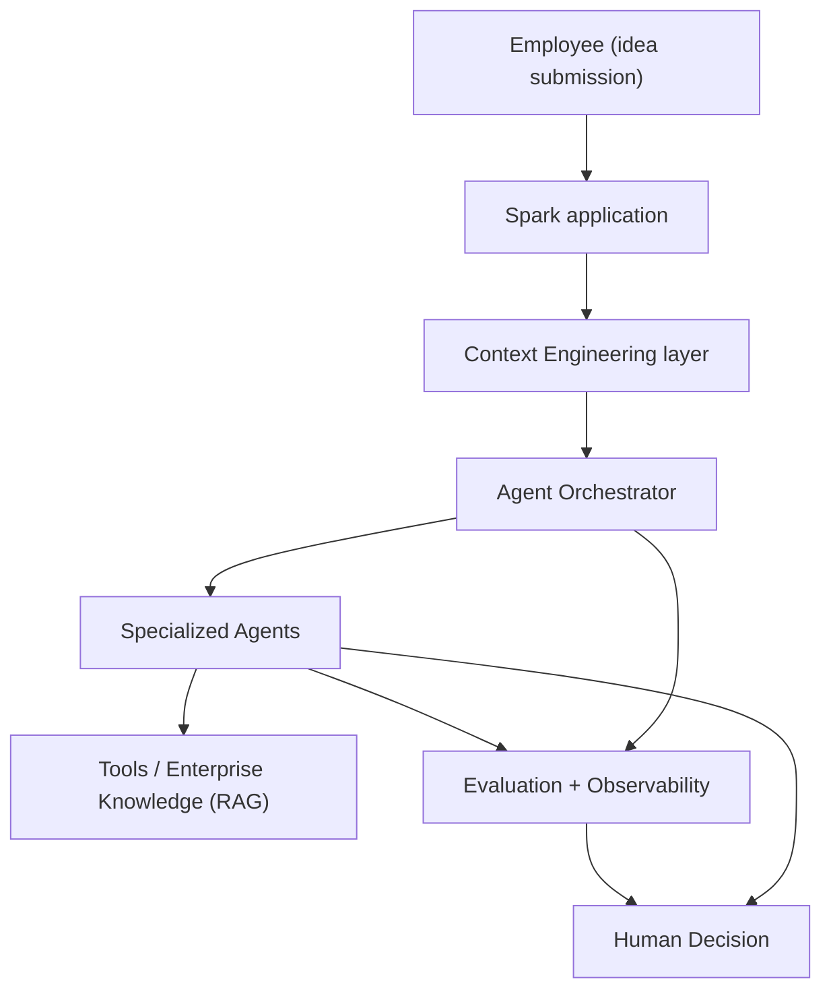
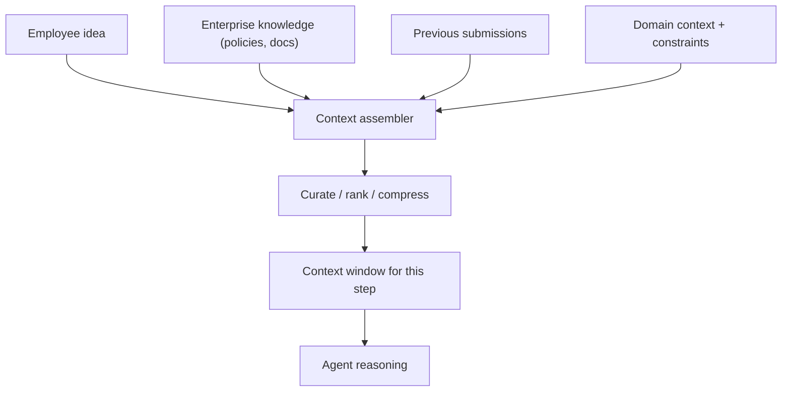
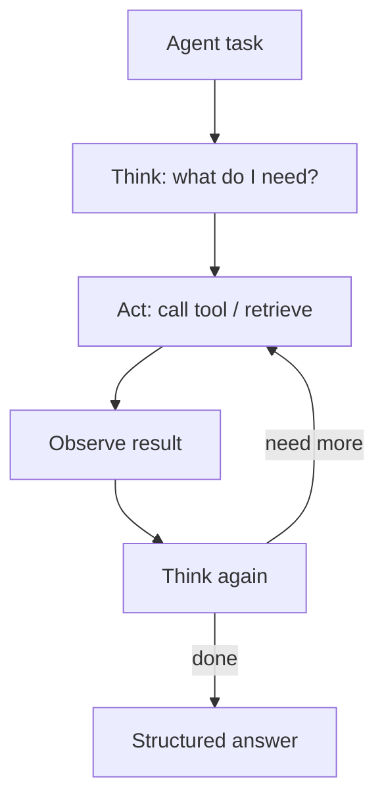
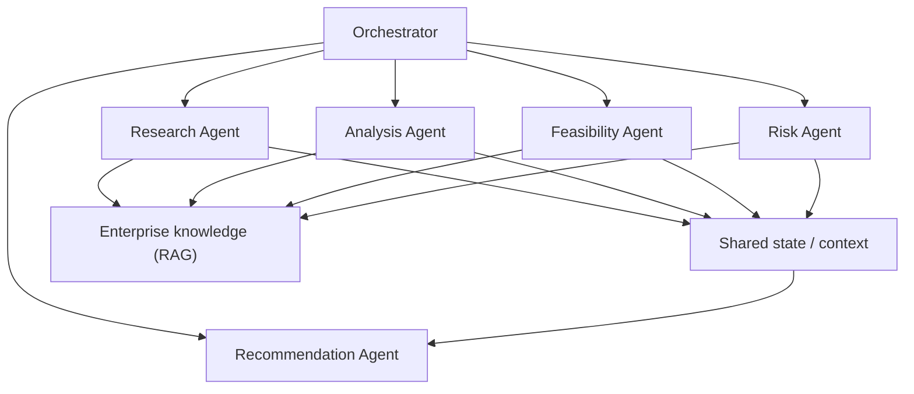
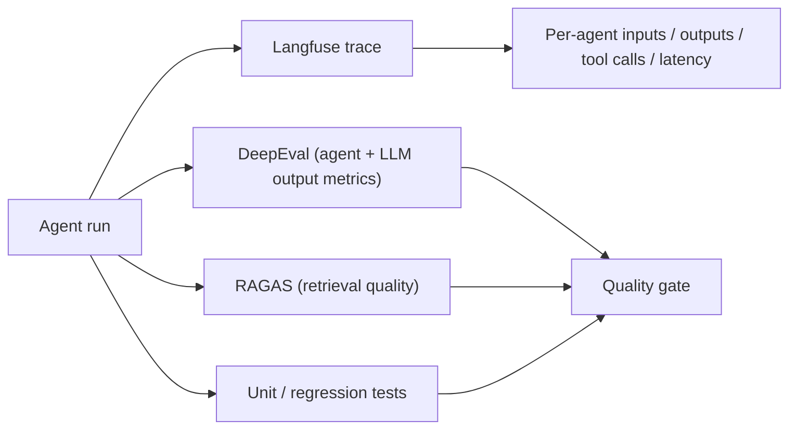

This is an engineering case study of **Centrica Spark** — an **internal AI innovation platform** I architected at Centrica, where LLMs and agentic workflows help employees develop ideas through structured **research, contextual analysis, feasibility assessment, risk analysis, and actionable recommendations**.

The interesting engineering is not "an LLM answers a prompt." It's that turning a raw employee idea into a grounded, feasibility-and-risk-assessed recommendation is a **multi-step, multi-agent reasoning problem** that has to be grounded in enterprise context, structured so its outputs are reliable, and evaluated so its recommendations can be trusted. This case study explains how each of those was built.

**Attribution convention.** Every non-obvious claim is tagged:

- **[Implemented]** — my documented engineering / architecture work on this platform.
- **[Concept]** — general explanation of how a technology works, included so the architecture is understandable.
- **[Interpretation]** — my engineering reasoning about *why* a decision was made.

I do not invent specific metrics, model sizes, or components beyond my documented work.

---

## What Centrica Spark Is

Spark is an internal platform where an employee submits an idea and the system helps develop it: it **researches** the space, **analyzes** the idea against enterprise context, assesses **feasibility**, surfaces **risks**, and produces an **actionable recommendation** — then hands a structured result to a human decision-maker. **[Implemented]**

### The Problem Being Solved

Good ideas die inside large organizations for boring reasons: nobody has time to research prior art, check it against policy and previous submissions, assess feasibility against real constraints, and write it up. Spark's job is to do that **structured development work** consistently, grounded in the organization's own knowledge, so promising ideas reach a human decision with the analysis already done. **[Interpretation]**

### Why a Normal LLM Chatbot Is Insufficient

A single chat call fails this task in specific ways: **[Interpretation]**

- It has **no grounding** in enterprise policy, prior submissions, or domain constraints — so it hallucinates plausible-but-wrong analysis.
- It **can't do multi-step work** reliably — research, then feasibility conditioned on that research, then risk conditioned on both.
- Its **output structure is a suggestion, not a contract** — feasibility scores, risk categories, and recommendations that downstream steps consume need guarantees.
- It **can't act** — it can't search a knowledge base, look up a policy, or call a tool mid-reasoning.

Spark is therefore an **agentic system**, not a chatbot: it plans, retrieves, reasons in structured steps, uses tools, and is evaluated. **[Interpretation]**

## The Layered Architecture

The single most important thing to get right in an interview about this system is the **vocabulary**: what is an LLM vs. a workflow vs. an agent vs. an orchestrator vs. memory/context vs. tools vs. evaluation. Spark is designed so these are *distinct layers*. **[Implemented]**

| Layer | What it is | What it is NOT |
|---|---|---|
| **LLM** | The reasoning engine (served via a provider abstraction) | Not the system — one component **[Concept]** |
| **Workflow** | A fixed sequence of steps with deterministic control flow | Not autonomous — the path is predetermined **[Concept]** |
| **Agent** | An LLM that reasons, chooses actions/tools, and adapts its steps | Not a single prompt **[Concept]** |
| **Orchestrator** | Coordinates multiple agents, routes work, manages shared state | Not itself the reasoner **[Implemented]** |
| **Memory / Context** | What the model sees now + what's retained across steps | Not the whole knowledge base dumped into a prompt **[Interpretation]** |
| **Tools** | Retrieval, enterprise-knowledge lookups, APIs the agents call | Not the model's parametric memory **[Concept]** |
| **Evaluation / Observability** | DeepEval/RAGAS metrics + Langfuse traces | Not "it looked right in a demo" **[Implemented]** |

### What Makes This Agentic Rather Than a Workflow

A **workflow** runs a fixed path: step 1 → step 2 → step 3, every time. An **agent** decides *what to do next* based on what it has learned — issuing a targeted search, calling a tool, or looping — and an **orchestrator** coordinates several such agents toward a goal. **[Concept]** Spark uses agentic reasoning where the path genuinely depends on the idea (research depth, which risks apply), and deterministic control where it doesn't. **[Interpretation]**

The honest counterpoint — **when *not* to use multiple agents**: if a task is a fixed, well-understood sequence, a deterministic workflow is cheaper, faster, and more reliable than an agent that re-derives the plan every run. Multi-agent shines when sub-tasks are genuinely distinct (research vs. risk vs. feasibility) and benefit from specialized context and separate evaluation; it hurts when it adds coordination overhead and non-determinism to something a `for` loop would nail. **[Interpretation]**

## Context Engineering: Enterprise Context Assembly

The quality ceiling of every downstream step is set by **what's in the context window at that moment**. Spark's context engineering layer assembles, per step, the right slice of enterprise knowledge rather than stuffing everything in. **[Interpretation]**

Spark combines the **employee's idea with enterprise knowledge, policies, previous submissions, domain context, and organizational constraints** — and the engineering is in *curation*: selecting, ranking, and compressing so the window holds high-signal context, not everything. **[Implemented]** Controlling context size matters for both **cost/latency** and **quality** — an overstuffed window is expensive and buries the signal. **[Interpretation]**

## DSPy: Why Structured LLM Programs

Spark's LLM calls are built as **DSPy programs**, not hand-tuned prompt strings. **[Implemented]** Two production problems drove this: **[Interpretation]**

1. **Prompts are coupled to models.** A prompt painstakingly tuned for one model regresses when the model ecosystem moves. DSPy separates the *task specification* from the *model-specific prompt*, so a model swap means re-optimizing, not rewriting. **[Concept]**
2. **Describing a constraint isn't enforcing it.** "Please return this JSON" is a request; a DSPy **Signature** with typed output fields is a contract the framework enforces via its adapter and type coercion — which matters because one agent's output is the next component's input. **[Concept]**

DSPy's separation maps cleanly onto Spark's needs:

| DSPy concept | Role in Spark |
|---|---|
| **Signature** | Declares each agent task's inputs/outputs/types (the contract) **[Implemented]** |
| **Module** | The execution strategy — `Predict`, `ChainOfThought`, and especially `ReAct` for tool-using agents **[Implemented]** |
| **Adapter** | Renders the signature into model messages and parses/coerces outputs **[Concept]** |
| **LM (via LiteLLM)** | Provider abstraction — swap models without touching program logic **[Concept]** |
| **Metric + Optimizer** | Define "good" and improve the program against it, rather than hand-editing prompts **[Concept]** |

Why this is the right posture for an enterprise platform: the stable engineering artifacts become the **task spec and the metric**, while the prompt becomes a *generated, optimizable* detail — so a model change is a re-optimization run, not a prompt-rewriting fire drill. **[Interpretation]**

## ReAct-Style Reasoning vs. Planning

These are often conflated; Spark uses both, for different jobs. **[Interpretation]**

- **Planning** decides *the shape of the work up front* — decompose "develop this idea" into research → analysis → feasibility → risk → recommendation.
- **ReAct** operates *within* a step: the agent reasons about what it needs, calls a tool (search, knowledge lookup), observes the result, and reasons again until it can answer. **[Concept]**

The distinction I'd give in an interview: **planning answers "what are the steps?"; ReAct answers "what should I do *right now* to make progress on this step?"** Planning is decomposition; ReAct is the reason-act-observe loop with tool use, bounded by a max-iterations safety limit. **[Concept]**

## Specialized Agents and Multi-Agent Orchestration

Spark engineers **specialized agents** — research, analysis, feasibility, risk assessment, recommendation — coordinated through an **orchestration layer**. **[Implemented]**

### Why Multi-Agent

Each agent has a **distinct job, distinct context, and distinct notion of "good."** A research agent optimizes for coverage and grounding; a feasibility agent reasons about constraints; a risk agent adopts an adversarial stance. Splitting them means each gets the **right context, right reasoning strategy, and its own evaluation** — and the recommendation agent synthesizes their structured outputs. **[Interpretation]** A single agent trying to be all of these at once dilutes context and makes failures un-attributable. **[Interpretation]**

### How Agents Share Context and How Context Size Is Controlled

Agents communicate through **shared, curated state** rather than by dumping full transcripts into each other. **[Implemented]** The orchestrator passes each agent the **compressed, relevant slice** it needs — the research agent's *findings*, not its entire reasoning trace. This is deliberate: **summarization between agents** is what keeps context (and cost/latency) bounded as the number of agents and steps grows. **[Interpretation]**

## Long-Running Agents and AWS AgentCore

Developing an idea is **long-running, multi-step, stateful** work — it doesn't complete in a single request. Spark uses **AWS AgentCore** to run these as **long-running autonomous agent workflows** with durable, multi-step execution. **[Implemented]**

### Why AWS AgentCore

The requirement is **stateful execution that survives beyond one request/response**: an agent pipeline that plans, retrieves, reasons across steps, and maintains state throughout — without me hand-rolling the durable state machine, checkpointing, and lifecycle management. AgentCore provides the runtime for stateful, multi-step agent execution so the engineering focus stays on the agents and orchestration, not the plumbing. **[Interpretation]** State (intermediate findings, plan progress, agent outputs) persists across steps so a long pipeline can resume and coordinate rather than restart. **[Implemented]**

## RAG and Enterprise Knowledge

Grounding is what separates Spark's analysis from a confident guess. Agents retrieve from **enterprise knowledge** — policies, prior submissions, domain documents — through a RAG/tool layer, so research and feasibility are anchored in the organization's actual context rather than the model's parametric memory. **[Implemented]** Tools (retrieval, knowledge lookups) are exposed to the ReAct agents as callable capabilities; the agent decides *when* to retrieve mid-reasoning. **[Concept]**

## Evaluation and Observability

An agentic system you can't measure is one you can't trust in production. Spark has an **end-to-end evaluation and observability framework**. **[Implemented]**

| Concern | How it's evaluated |
|---|---|
| **How do you evaluate an agent?** | DeepEval metrics over the **execution trace** — not just the final output, but planning, tool selection, and task completion **[Implemented]** |
| **How do you evaluate RAG?** | RAGAS-style context relevance/precision and faithfulness of answers to retrieved evidence **[Implemented]** |
| **How do you trace an agent?** | Langfuse captures each agent's inputs, outputs, tool calls, and latency across the run **[Implemented]** |
| **Regression safety** | Unit/regression tests lock in known-good behavior so prompt/model changes don't silently regress **[Implemented]** |

### How Hallucination and Agent Failure Are Handled

- **Grounding + faithfulness metrics** — RAG anchors claims in retrieved evidence; RAGAS faithfulness flags answers unsupported by that evidence. **[Interpretation]**
- **Structured contracts** — DSPy typed signatures make malformed/unexpected outputs a caught error, not silent corruption downstream. **[Concept]**
- **Trace-level attribution** — Langfuse makes it possible to see *which* agent/step failed rather than declaring "the system was wrong." **[Interpretation]**
- **Human-in-the-loop decision points** — Spark produces a structured recommendation for a **human decision**; the system informs, it doesn't unilaterally decide. **[Implemented]**
- **Bounded loops** — ReAct steps are capped so an agent can't loop indefinitely. **[Concept]**

## Reliability, Security, Cost, and Scalability

- **Reliability** — long-running agents on AgentCore with durable state; deterministic control flow where the task is fixed; bounded agent loops. **[Interpretation]**
- **Security** — an internal enterprise platform still faces the AI-specific trust boundaries (untrusted idea/text becoming instructions), so the same defence-in-depth discipline applies as on the broader platform: input scanning, role separation, and access control on knowledge. **[Interpretation]**
- **Cost / latency** — the biggest levers are **context size** (curate and compress, don't stuff), **model right-sizing** via DSPy portability + optimization (a smaller optimized model can beat an unoptimized larger one), and **summarization between agents** to keep the window small. **[Interpretation]**
- **Scalability** — specialized agents can scale independently; orchestration + shared state let the pipeline fan out; AgentCore handles stateful lifecycle. **[Interpretation]**

### How I'd Make It More Production-Grade / Scale It

- **Optimize under measurement** — use DSPy optimizers (metric-driven) to recover quality after model swaps instead of manual prompt tuning. **[Interpretation]**
- **Tier the context/memory** — hierarchical memory (recent detailed, distant compressed) to hold cost flat as pipelines lengthen. **[Interpretation]**
- **Harden the eval gate** — promote DeepEval/RAGAS thresholds into a CI quality gate so regressions block deploys. **[Interpretation]**
- **Parallelize independent agents** — run research/risk concurrently where they don't depend on each other, synthesizing at the recommendation step. **[Interpretation]**

## Key Architectural Trade-offs

| Trade-off | The decision |
|---|---|
| Chatbot vs. agentic system | **Agentic** — the task is multi-step, grounded, and needs tools; a chatbot can't do it reliably **[Interpretation]** |
| Single agent vs. multi-agent | **Multi-agent** where sub-tasks are genuinely distinct; deterministic workflow where the path is fixed — don't add agents for their own sake **[Interpretation]** |
| Hand-tuned prompts vs. DSPy | **DSPy** — task/metric are the stable artifacts; prompts are generated and optimizable; model swaps become re-optimization **[Implemented]** |
| Big context vs. curated context | **Curated + compressed** — protects cost, latency, and answer quality **[Interpretation]** |
| Custom durable state vs. AgentCore | **AgentCore** — stateful long-running execution without hand-rolling the state machine **[Implemented]** |
| Demo confidence vs. evaluation | **DeepEval + RAGAS + Langfuse + regression tests** — measured, traced, and gated **[Implemented]** |

## What I Personally Owned

I **architected the agentic AI workflows** (LLMs, DSPy, context engineering, ReAct-style reasoning, autonomous planning, multi-agent orchestration), designed the **context-aware LLM pipelines** that assemble enterprise context, engineered the **specialized agents and orchestration layer**, designed the **long-running agent workflows on AWS AgentCore**, and built the **end-to-end evaluation and observability framework** (DeepEval, RAGAS, unit/regression testing, Langfuse). **[Implemented]**

## Production Lessons

1. **Name the layers.** LLM ≠ workflow ≠ agent ≠ orchestrator ≠ context ≠ tools ≠ evaluation. Clear boundaries are what make the system reason-about-able.
2. **Agentic where the path varies; deterministic where it doesn't.** Multi-agent is a tool, not a default.
3. **Program, don't prompt.** DSPy makes the task spec and metric the durable artifacts and the prompt a generated detail — the answer to model coupling.
4. **Context engineering sets the quality ceiling.** Curate and compress; don't stuff the window.
5. **Summarize between agents.** It's how multi-agent context stays bounded.
6. **Evaluate the trace, not the demo.** DeepEval + RAGAS + Langfuse make agent quality measurable and debuggable.
7. **Keep a human at the decision.** Spark develops and recommends; a person decides.

The through-line: an agentic platform is an **engineering system of grounded, structured, coordinated, and measured LLM programs** — context engineering underneath, DSPy structuring the calls, an orchestrator coordinating specialized agents, AgentCore keeping long work stateful, and evaluation making the whole thing trustworthy. **[Interpretation]**
