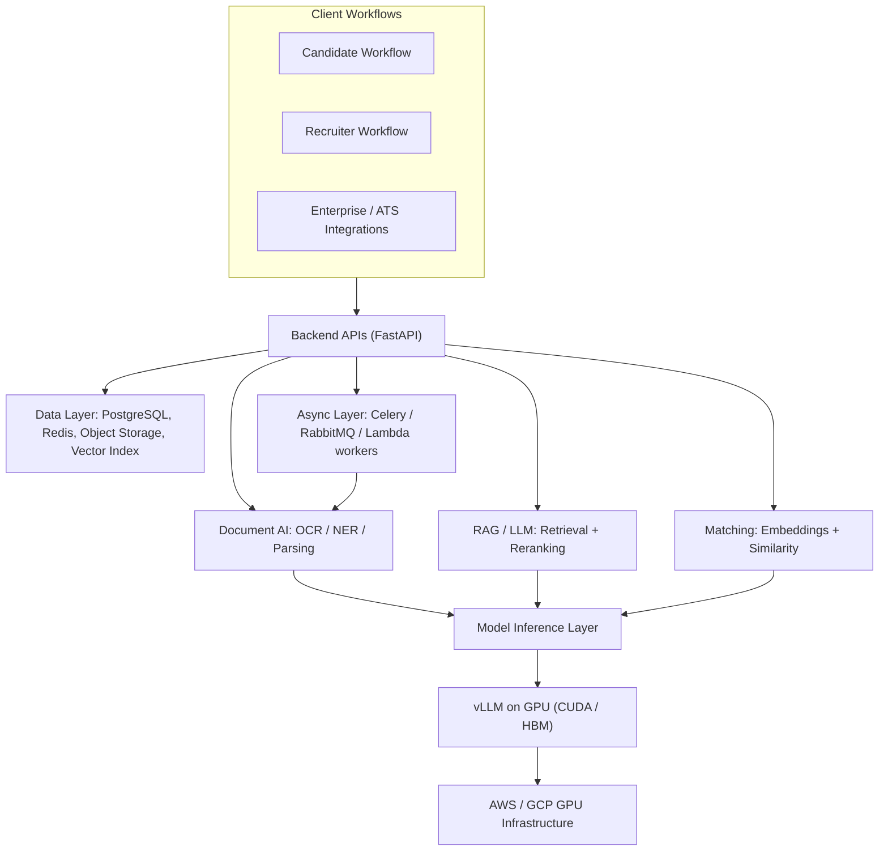
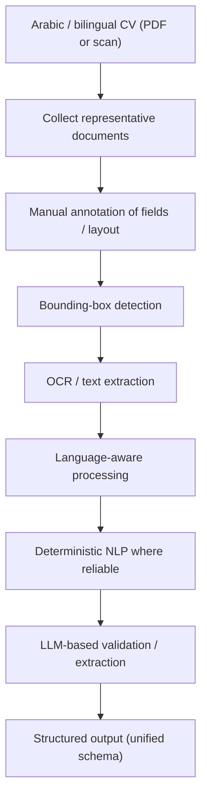
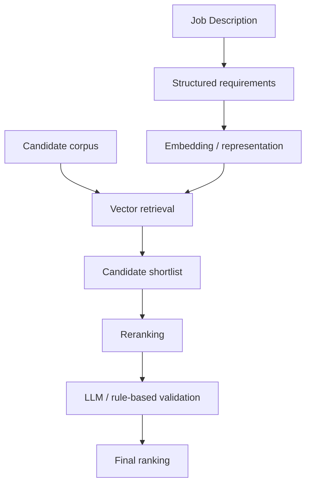
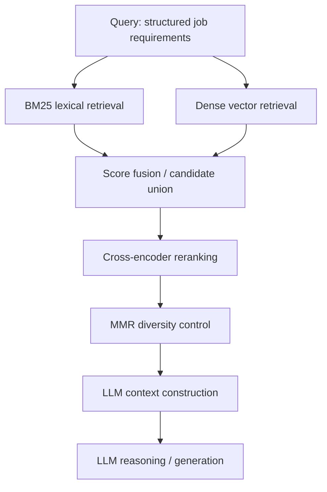
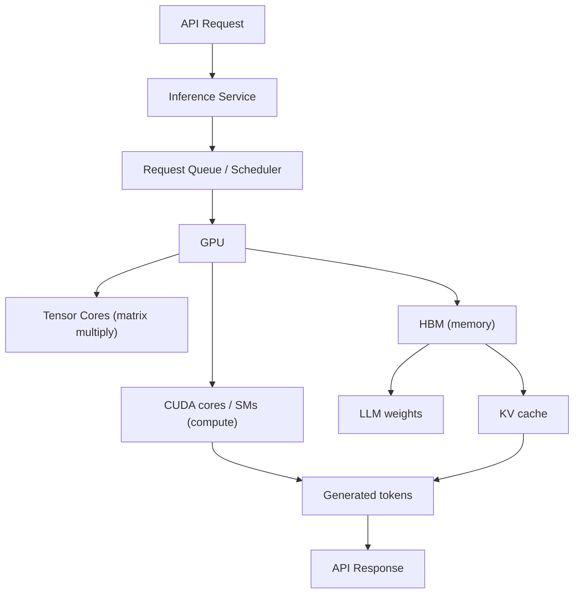
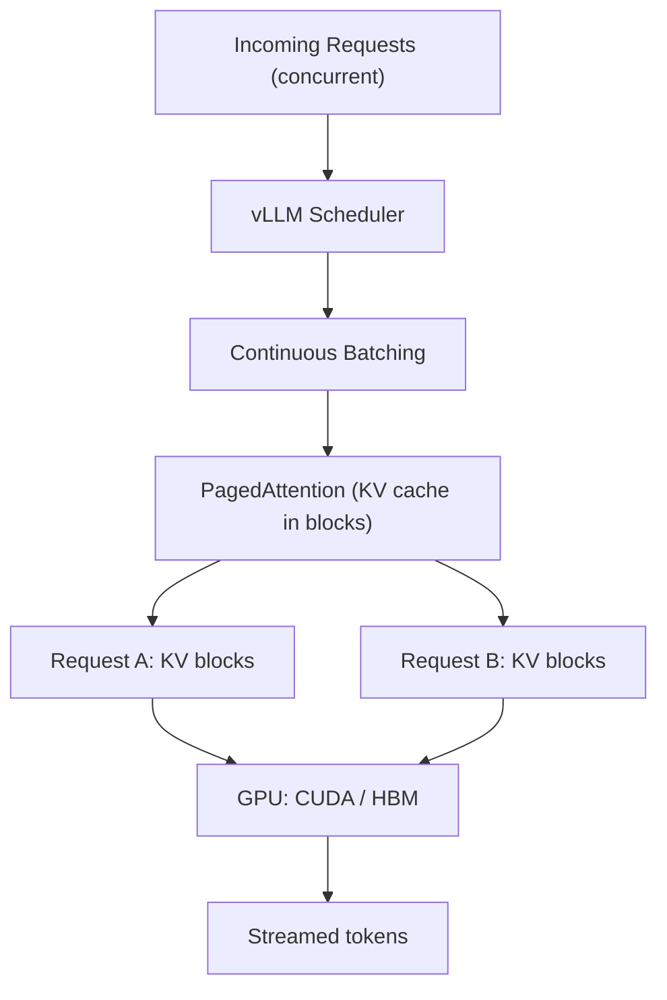
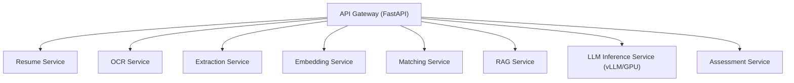
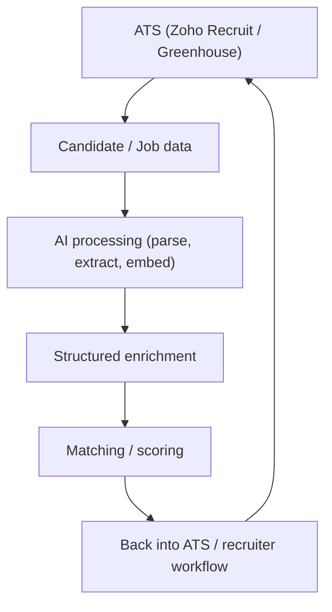
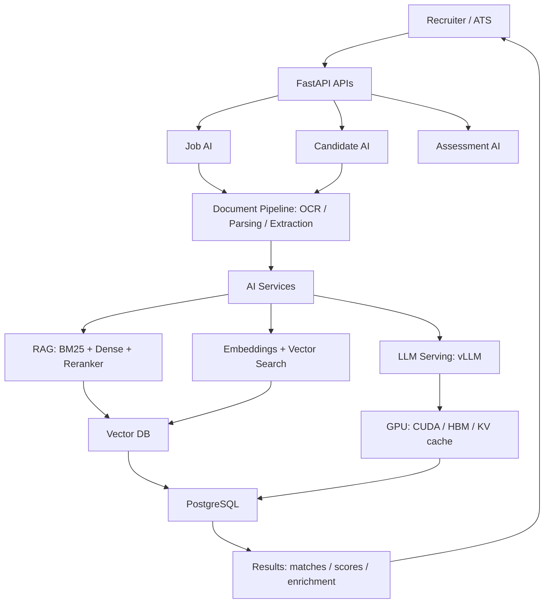

This is an engineering case study of the **production AI systems** I built at **Flipped.ai / Gaius Networks / ParseTalent** — a recruitment platform. It is deliberately _not_ a product tour and _not_ a résumé list. The goal is to go **underneath the product surface** and show how the AI actually worked in production: how real, messy, multilingual documents were turned into structured signal, retrieved semantically, reasoned over by LLMs, and served on GPUs under concurrent traffic.

The organizing idea: a recruiter sees a single button, but a **production AI system** is a pipeline of specialized stages. My work was engineering the infrastructure _around_ the models — document processing, retrieval, GPU inference, async orchestration, evaluation, and enterprise integration — not simply calling an LLM API.

**Attribution convention.** Because this article draws on three different sources, every non-obvious claim is tagged:

- **[Implemented]** — my documented engineering work on this platform.
- **[Product]** — a capability the current public [Flipped.ai](https://flipped.ai/) site presents. It establishes product context; it is **not** a claim that I personally built that exact feature.
- **[Concept]** — general technical explanation of how a technology works, included so the architecture is understandable.

Where the public product and my implementation history differ, the implementation history is the source of truth for what I built. I do not state exact model sizes, GPU counts, throughput, latency, or cost figures unless they are part of my documented work.

---

## From Product Feature to Production AI System

The public product presents a clean recruiting surface: **AI-assisted job creation, resume parsing and semantic matching, AI-graded MCQ/video/voice assessments, and AI-led interviews.** **[Product]** That is what a recruiter experiences.

What a recruiter *sees*:

```
Upload CV  →  candidate profile  →  match against job  →  shortlist
```

What the engineering system *does* underneath:

```
Document ingestion
   → OCR / text extraction
   → normalization
   → structured information extraction
   → embeddings
   → retrieval
   → reranking
   → LLM reasoning
   → validation
   → persistence
   → API response
```

Every arrow in the second diagram is a place where production reality intrudes — a scanned PDF, an Arabic layout, a skill phrased three different ways, a GPU that has to serve many requests at once. **[Interpretation]** The rest of this article walks each of those stages as I built them.

## Overall Production Architecture

The system is best read as layers: client workflows on top, a FastAPI orchestration layer, specialized AI services in the middle, GPU inference beneath that, and data/async infrastructure at the base.



This is not a generic cloud diagram — each middle node is a distinct workload with distinct scaling behavior, which is exactly why they were separated (see [microservices](#production-ai-microservices)). **[Implemented]**

## The Document Intelligence Pipeline

Turning a CV into a candidate profile is the backbone of the platform, and it is a **pipeline, not a single model call**. **[Implemented]**

```
CV / Resume
    ↓  upload
Document ingestion
    ↓
PDF / image processing
    ↓
OCR (when the document is scanned / image-based)
    ↓
Text extraction
    ↓
Layout / bounding-box information
    ↓
Section detection  (experience, education, skills, ...)
    ↓
Entity / skill extraction
    ↓
LLM validation / normalization
    ↓
Structured candidate profile
    ↓
Database  →  matching / search / recruiter workflows
```

The reason a pipeline is necessary: **resumes are not clean text.** In production they arrive as PDFs, scanned images, and exports with wildly different layouts — multi-column templates, tables, inconsistent section names, multilingual content, noisy OCR, mixed date formats, and the same skill written five different ways. **[Implemented]**

A single LLM call cannot reliably absorb all of that. The engineering principle I applied: **use deterministic processing and specialized models for the stages that can be solved reliably, and reserve the LLM for the stage where semantic reasoning genuinely helps** — validation and normalization of extracted fields. **[Implemented]**

## Arabic & Multilingual OCR

Off-the-shelf OCR and extraction pipelines were **insufficient for certain Arabic CVs** — the enterprise HR work for a Saudi client. This became a dedicated engineering effort rather than a config change. **[Implemented]**



The approach combined: collecting representative documents, manually annotating data, bounding-box-based document processing, OCR, language-aware handling, deterministic NLP where it was dependable, and LLM-based validation/extraction on top. The tooling drew on **PyTorch, Hugging Face Transformers, spaCy, OpenCV, and OCR engines** — not every component in every pipeline, but as the building blocks of the layout-and-language-aware stack. **[Implemented]**

The measurable result, from my documented implementation experience: the custom OCR/extraction work improved parsing accuracy from **approximately 80% to 95%+** on the target Arabic CVs. **[Implemented]** (I state this as documented experience, not a formal published benchmark with a fixed methodology.)

The lesson generalizes: **don't force an LLM to solve every stage.** Layout detection and OCR are better handled by specialized vision/OCR models; the LLM earns its place at semantic validation. **[Interpretation]**

## The Multilingual Pipeline

Arabic OCR sits inside a broader multilingual architecture whose job is to collapse many representations into **one unified candidate schema**. **[Implemented]**

```
Arabic / English / multilingual document
        ↓
Language detection
        ↓
OCR / text extraction
        ↓
Translation where required
        ↓
Structured extraction
        ↓
Normalization
        ↓
Unified candidate schema
```

Multilingual recruitment is hard because the *same* candidate information appears in different languages, scripts, date formats, job-title terminology, and skill names. **[Interpretation]** Downstream matching and search only work if all of that is normalized into a consistent representation first — so normalization is a first-class stage, not an afterthought. **[Implemented]**

## Job Description Intelligence

The job-description side mirrors the candidate side: raw text in, structured requirements out.

```
Raw Job Description
        ↓
Document / text extraction
        ↓
LLM / NLP analysis
        ↓
Skill extraction
        ↓
Experience requirements
        ↓
Education requirements
        ↓
Screening criteria
        ↓
Structured Job Representation
```

The public product describes job creation with automatic skill and screening extraction. **[Product]** Underneath, the structured job representation is what feeds matching and search — a job is reduced to comparable, machine-usable requirements rather than a wall of prose. **[Implemented]**

## Semantic Candidate Matching

Keyword matching is the obvious first attempt, and it fails on real data. Consider:

> **Job:** "Senior Backend Engineer with distributed systems, Python, PostgreSQL and Kubernetes."
>
> **Candidate CV:** "Built asynchronous microservices using FastAPI, RabbitMQ and containerized deployments…"

A lexical system misses the relationship — FastAPI *is* Python, containerized deployments *imply* Kubernetes-adjacent skills. **[Concept]** Production matching therefore used **semantic representations plus retrieval**, not string overlap. **[Implemented]**



## RAG: The Retrieval Architecture

RAG on this platform was not "we called retrieval-augmented generation." It was a retrieval **architecture** that evolved as the failure modes of each simpler version showed up. **[Implemented]**

```
Naive semantic search
        ↓
Dense retrieval
        ↓
BM25 + dense retrieval
        ↓
Hybrid retrieval
        ↓
Reranking
        ↓
Cross-encoder
        ↓
MMR / diversity control
        ↓
LLM context construction
```

Each stage exists because the previous one leaves a specific gap: **[Concept]**

- **Dense retrieval** gives strong *semantic* recall — it finds candidates whose meaning matches even when the words don't.
- **BM25** gives strong *lexical* matching — critical for exact skills, technologies, certifications, and terminology (a search for "Kubernetes" should not drift to "container orchestration in general").
- **Hybrid retrieval** combines the lexical and semantic signals so neither blind spot dominates.
- **Reranking** re-scores the retrieved set with a stronger relevance model than the first-pass retriever.
- A **cross-encoder** reranker jointly encodes the (query, document) pair and scores their relevance directly, rather than relying on the distance between two independently-computed embeddings — more accurate, more expensive, so it runs only on the shortlist.
- **MMR (Maximal Marginal Relevance)** reduces redundancy, so the shortlist isn't ten near-duplicate candidates but a diverse, useful set.

I present these as **components and iterations** of the retrieval architecture. They were not all switched on simultaneously in every pipeline — chunking, embeddings, and vector retrieval were the base; BM25/hybrid, reranking, and diversity control were the improvements layered on where retrieval quality demanded them. Document chunking and **metadata-aware chunking** fed all of it. **[Implemented]**

## Hybrid Retrieval, Concretely

The hybrid step is worth its own view, because it is where lexical and semantic signals are fused before reranking.



The point: BM25 and dense retrieval have **complementary failure modes**, so a union of their results — reranked and diversified — is more robust than either alone. **[Concept]**

## Evaluating Retrieval, Not Just Generation

A production RAG lesson that is easy to miss: **you cannot assume retrieval was good just because the LLM produced a plausible answer.** A fluent LLM will happily generate a confident answer over the *wrong* retrieved documents. **[Interpretation]**

So evaluation had to separate two questions: **[Implemented]**

```
Retriever quality      →  did we fetch the right documents / candidates?
        vs
Generation quality     →  given the context, was the LLM output correct?
```

This meant measuring retrieval metrics (relevance and context quality of what was fetched) alongside downstream answer quality — using evaluation tooling such as **DeepEval** where appropriate — rather than eyeballing demos. **[Implemented]** The engineering takeaway: **a strong LLM cannot fully compensate for retrieving the wrong context**, so the retriever needs its own evaluation loop. **[Interpretation]**

## LLM Selection & Benchmarking

Model selection was not "pick the biggest model." It was a **production trade-off** benchmarked across several axes, including open-weight models such as **Qwen, Mistral, and LLaMA** served on GPU. **[Implemented]**

| Axis | Why it mattered in production |
|---|---|
| Accuracy / extraction quality | The model has to get structured fields right, not just sound fluent |
| Latency | Interactive recruiter workflows have a patience budget |
| Throughput | Bulk document processing needs many docs/sec |
| Memory (HBM) footprint | Determines what fits on the GPU and how many can be batched |
| GPU cost | A marginally-better model that costs far more may lose |
| Context length | Long CVs and multi-document context need headroom |
| Multilingual performance | Arabic/English quality was a hard requirement |

The constraint that shaped everything: **a model that is slightly more accurate but dramatically slower or more expensive is often the wrong production model.** Open-weight models mattered here precisely because they gave cost and deployment flexibility that a closed API did not. **[Implemented]** Where task-specific quality needed a lift, **LoRA-based adaptation** was used to improve extraction on downstream recruiter workflows without the cost of full fine-tuning. **[Implemented]**

## GPU Inference

Once you serve open-weight LLMs yourself, GPU inference becomes a systems problem: large matrix operations, high memory-bandwidth demand, a **KV cache** that grows with sequence length, and concurrent requests that must be batched. **[Concept]**



The GPU/HBM mental model here is the same one that governs large-model *training* — the constraint is HBM capacity and bandwidth, and what physically sits in it. That is exactly the picture developed in the [ZeRO memory-partitioning implementation](/engineering/zero-memory-optimization-training-large-models/); here the pressure comes from **weights + KV cache + runtime buffers** competing for the same HBM during *inference*. **[Interpretation]**

## vLLM & PagedAttention

A naive Hugging Face `generate()` loop is fine for one request at a time, but under concurrent production traffic it wastes the GPU: requests queue up, the KV cache is allocated inefficiently, and the accelerator sits idle between steps. **[Concept]** The fix was serving with **vLLM**. **[Implemented]**

vLLM's two ideas that matter most:

- **Continuous batching** — instead of waiting for a fixed batch, the scheduler adds and retires requests token-by-token, keeping the GPU busy across many concurrent generations.
- **PagedAttention** — the KV cache is the problem child of LLM serving: it **grows with sequence length**, and naively allocating it as one contiguous block per request causes fragmentation and wasted HBM. PagedAttention manages the KV cache in fixed-size **blocks/pages**, so memory is allocated and reused on demand — much like virtual-memory paging — which raises utilization and lets more requests share the GPU. **[Concept]**



Why it matters in production, stated plainly: **serving one request at a time wastes GPU capacity; production has to keep the GPU busy across concurrent requests.** vLLM's batching + paging is what made self-hosted open-weight serving economical. **[Implemented]**

## GPU Memory & the KV Cache

Tying vLLM back to physical memory: three things compete for HBM during inference — **[Concept]**

$$
\text{HBM used} \;=\; \underbrace{\text{model weights}}_{\text{fixed}} \;+\; \underbrace{\text{KV cache}}_{\text{grows with tokens} \times \text{concurrency}} \;+\; \underbrace{\text{activations / buffers}}_{\text{transient}}
$$

The weights are a fixed cost. The **KV cache is the variable that explodes**: it scales with sequence length *and* with the number of concurrent users. That is precisely why PagedAttention's block-based management matters — for long contexts and many simultaneous requests, efficient KV-cache memory is the difference between serving 5 users and 50 on the same GPU. **[Concept]** (I don't quote exact memory numbers here — they depend on the specific model and GPU SKU.)

## The Cost / Performance Trade-off

Production AI optimization was never "maximize model quality." It was maximizing quality **subject to** latency, throughput, memory, and cost constraints at once:

```
Best production model  =  optimize( Quality )
                          subject to  Latency, Throughput, GPU memory, Cost
```

The levers I actually used to move along that frontier: **open-weight models** (deployment/cost flexibility), **model benchmarking** (pick the right size for the task), **vLLM batching** (throughput per GPU), **KV-cache-aware serving** (concurrency), and **async workloads** (decouple slow processing from interactive requests). **[Implemented]** I don't claim specific dollar savings — the point is the *shape* of the optimization, not a fabricated figure. **[Interpretation]**

## Asynchronous AI Pipelines

Document AI is mostly **long-running work that should not block an API request.** A user uploading a CV should get an immediate acknowledgment, not a 30-second hang while OCR and LLM extraction run. **[Interpretation]**

```
Upload CV
    ↓
API (returns immediately)
    ↓
Queue
    ↓
Worker
    ↓
OCR
    ↓
LLM extraction
    ↓
Embedding
    ↓
Database
    ↓
Matching
    ↓
Notification / result
```

The async backend was built with **FastAPI, Redis, RabbitMQ, Celery, and AWS Lambda, containerized with Docker and orchestrated on Kubernetes** — using the components appropriate to each pipeline, not all at once. **[Implemented]** The core principle: **long-running AI processing runs off the request path**, so the interactive API stays responsive. **[Interpretation]**

## Large-Scale Document Ingestion

The same async spine scales *horizontally* for bulk ingestion — processing large volumes of CVs by fanning work out across parallel workers. **[Implemented]**

```
Thousands of documents
        ↓
Object storage
        ↓
Event / queue
        ↓
Parallel workers  ──►  (scale out horizontally)
        ↓
OCR / extraction
        ↓
LLM processing
        ↓
Embeddings
        ↓
Database / vector index
        ↓
Search / matching
```

Because each document is independent, throughput scales with worker count — the queue absorbs bursts and concurrency controls keep the GPU and database from being overwhelmed. **[Implemented]**

## Production AI Microservices

Rather than a monolith, AI was split into **services with different scaling profiles** behind an API gateway. **[Implemented]**



The reason this matters is that the workloads scale differently: **[Interpretation]**

| Service | Dominant resource |
|---|---|
| OCR | CPU/GPU depending on the engine |
| LLM inference | GPU-intensive (HBM + compute) |
| Retrieval / matching | Database / vector-search intensive |
| Document orchestration | Queue / worker intensive |

Splitting them lets each scale on its own axis — you add GPU replicas for inference without over-provisioning the vector database, and vice versa. **[Implemented]**

## AI-Powered Assessments

The public platform describes MCQ, video, and voice assessments with AI grading and proctoring. **[Product]** At the architecture level, an assessment pipeline of this kind looks like:

```
Assessment
    ↓
Candidate response (text / audio / video)
    ↓
Audio / video / text processing
    ↓
Speech / NLP / LLM analysis
    ↓
Rubric-based evaluation
    ↓
Score
    ↓
Structured candidate signal
    ↓
Recruiter platform
```

I describe this at the architectural level and do not claim implementation details I did not build — the transferable pattern is **response → processing → rubric-based LLM/NLP evaluation → structured signal**, which is the same "produce structured signal for downstream workflows" shape as the CV pipeline. **[Interpretation]**

## AI-Led Interviews & Agents

The product also presents AI-led interviews. **[Product]** An agentic interview flow, conceptually, orchestrates rather than one-shots:

```
Interview configuration
        ↓
Candidate context
        ↓
Question generation / selection
        ↓
Candidate response
        ↓
LLM evaluation
        ↓
Rubric / skill assessment
        ↓
Structured feedback
```

The engineering distinction worth making: an "AI agent" here means **orchestration** — maintaining candidate context, selecting/generating the next question conditioned on prior answers, evaluating against a rubric — not a single prompt. I keep this conceptual and don't invent specific tools or agent frameworks I didn't use. **[Interpretation]**

## ATS Integration

None of this is useful if it lives in a research prototype. AI outputs had to flow into the enterprise systems recruiters already use — integrations with **Zoho Recruit and Greenhouse**, plus billing/auth systems. **[Implemented]**



The point: **AI had to integrate with existing enterprise systems**, closing the loop back into the recruiter's real workflow rather than producing outputs in isolation. **[Implemented]**

## End-to-End Production Architecture

Putting the important systems into one view — application → orchestration → document AI → retrieval → LLM → GPU inference → data → enterprise integration:



The loop closes where it started — back at the recruiter/ATS — which is the whole reason the AI exists. **[Implemented]**

## What I Actually Engineered

Rather than a technology list, the contributions are best framed as **problem → engineering response**: **[Implemented]**

| Problem | What I engineered |
|---|---|
| CVs are unstructured and multilingual | Document-intelligence pipeline: OCR + processing + extraction + LLM validation; custom Arabic OCR/extraction (~80% → 95%+) |
| Semantic matching can't rely on keywords | Hybrid retrieval (BM25 + dense) + embeddings + reranking + MMR + metadata-aware chunking |
| LLM inference is expensive | Open-weight model benchmarking + LoRA adaptation + GPU inference + vLLM + PagedAttention/KV-cache management |
| Document processing is long-running | FastAPI + Redis/RabbitMQ/Celery + Lambda workers + async, horizontally-scalable orchestration |
| RAG can look right while being wrong | Retrieval-vs-generation evaluation (retrieval metrics, DeepEval where appropriate) |
| Enterprise hiring systems already exist | ATS integrations (Zoho Recruit, Greenhouse) + structured APIs + production microservices |

This is the honest shape of the work: **"worked with Python, FastAPI, vLLM, RAG, AWS"** is a keyword list; the table above is the engineering. **[Interpretation]**

## Production Lessons

The durable takeaways, in the same spirit as the paper breakdowns elsewhere on this site:

1. **An LLM is one component of an AI system**, not the system. Most of the engineering is the pipeline around it.
2. **Retrieval quality matters as much as generation quality** in RAG — a fluent answer over wrong context is still wrong.
3. **Specialized models beat forcing an LLM to do everything** — OCR, layout, and language detection belong to purpose-built models.
4. **GPU memory is a systems constraint**, not a hardware footnote — the KV cache, not the weights, is what often limits concurrency.
5. **Model quality must be evaluated with latency, throughput, and cost**, never in isolation.
6. **Async architecture is essential** for large document workloads — slow AI work must leave the request path.
7. **Production AI requires evaluation, not just demos** — measure retrieval and generation separately.
8. **Enterprise AI requires integration** with the systems people already use.
9. **Multilingual document intelligence needs language- and layout-aware processing**, not a one-size text model.
10. **Open-weight models provide real cost and deployment flexibility** — the reason self-hosted serving with vLLM was worth the engineering.

The through-line: production AI is an **engineering discipline of systems around models** — ingestion, retrieval, serving, orchestration, evaluation, and integration — and that discipline is what turns a demo-able "AI feature" into a system that survives real, messy, multilingual, high-volume traffic. **[Interpretation]**
