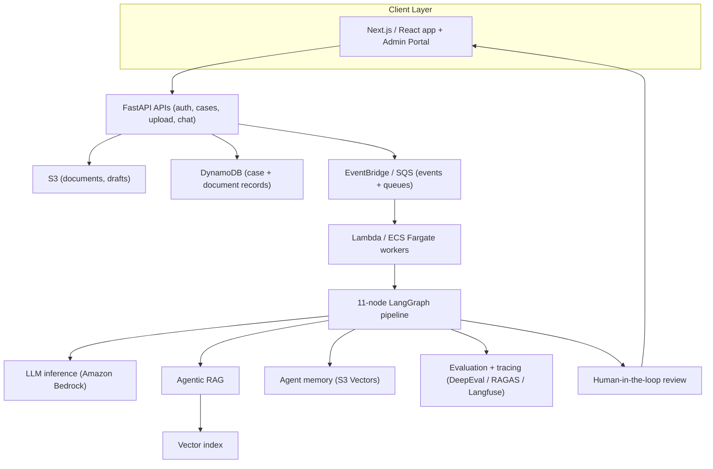
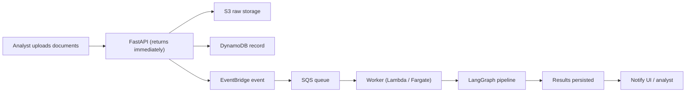
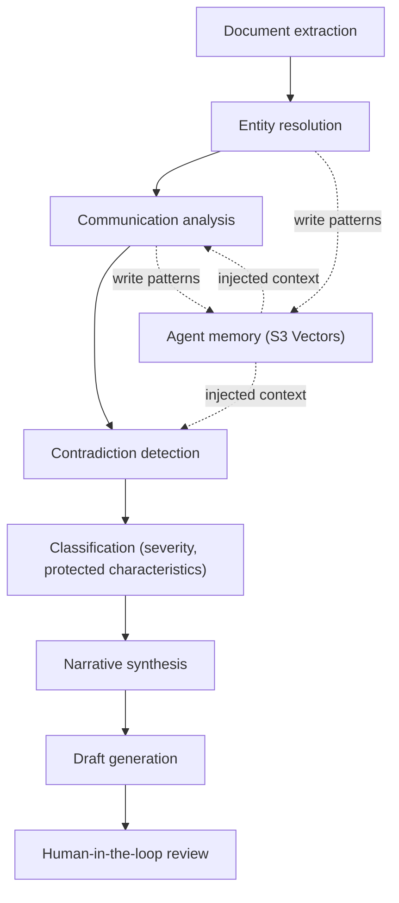
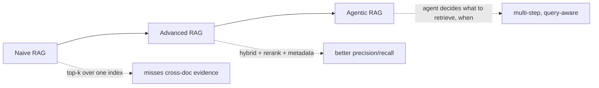
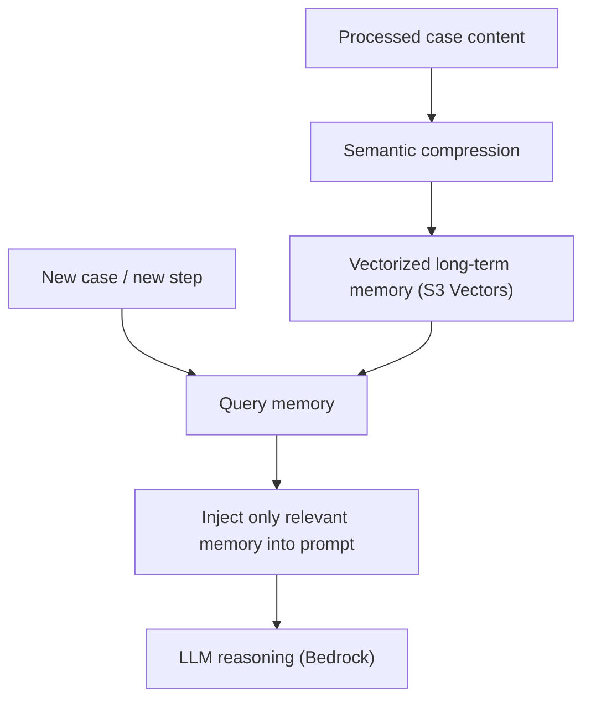
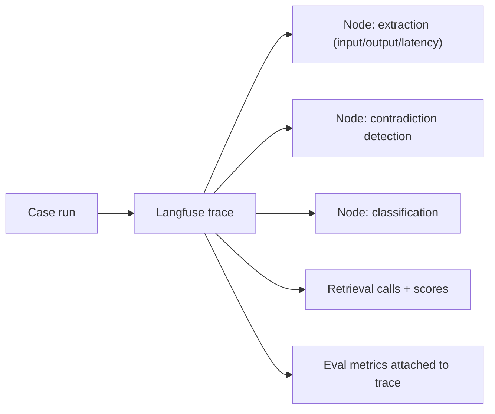

This is an engineering case study of **People Case Management** — an AI-powered **legal document intelligence platform** I led end-to-end for **Centrica UK** as a Forward-Deployed & Senior Innovation Engineer. It processes HR grievances, Employee Relations cases, and Legal cases for a large European energy utility, turning messy employment evidence into structured, defensible case analysis that HR, ER, and Legal teams act on.

It is deliberately *not* a product tour. The goal is to show how the system was actually engineered: how sensitive documents flow through an **event-driven AWS platform**, how an **11-node LangGraph agentic pipeline** reasons over them, how **RAG and long-term memory** were built to survive growing case histories, how the system was **evaluated and traced**, and how it was **security-hardened** before formal penetration testing.

**Attribution convention.** Every non-obvious claim is tagged so the case study stays interview-defensible:

- **[Implemented]** — my documented engineering work on this platform.
- **[Concept]** — general technical explanation of how a technology works, included so the architecture is understandable.
- **[Interpretation]** — my engineering reasoning about *why* a decision was made.

I do not state exact model sizes, request volumes, latency, or cost figures unless they are part of my documented work.

---

## Why This System Was Needed

Large regulated employers accumulate **complex, high-stakes people cases**: grievances, disciplinary matters, Employee Relations disputes, and Legal cases. Each case is a pile of unstructured evidence — PDFs, emails, `.msg` files, meeting notes, Word documents, witness statements — that a human analyst must read, cross-reference, and reason about before deciding severity, protected characteristics, contradictions, and next actions. **[Implemented]**

The information is among the most sensitive an enterprise holds: protected characteristics under the **Equality Act 2010**, medical records, disciplinary histories, internal investigations, and legal communications. **[Implemented]** A mistake here is not a broken form — it can influence legal reasoning, alter an AI-assisted decision, and affect a real employee's outcome or the fairness of an investigation. **[Interpretation]**

The requirement was therefore not "summarize documents." It was: **assist expert analysts through the real decision path of a case, with accuracy, auditability, and security as first-class constraints.** **[Implemented]**

### System Requirements

| Requirement | Why it shaped the architecture |
|---|---|
| Ingest heterogeneous, multi-party documents | Extraction had to be robust to PDFs, emails, `.msg`, DOCX, and scans **[Implemented]** |
| Reason over a case, not one document | Entity resolution, contradiction detection, and classification span the whole case file **[Implemented]** |
| Keep a human in control | Legal/HR outcomes are analyst decisions — AI drafts and evidences, humans decide **[Implemented]** |
| Handle growing case histories | Cases accrete documents over time; context can't grow unbounded **[Implemented]** |
| Be auditable and traceable | Regulated decisions need to be explainable and reconstructable **[Implemented]** |
| Be secure by design | GDPR, data isolation, access control, and AI-specific threats **[Implemented]** |

## Overall Architecture

The platform reads as layers: a **Next.js/React** frontend and admin portal on top, a **FastAPI** orchestration layer, an **event-driven AWS backbone** that runs long AI work off the request path, an **11-node LangGraph agentic pipeline** doing the reasoning, and a **RAG + memory + evaluation** substrate underneath. **[Implemented]**

This is not a generic cloud diagram — each layer has a distinct reason to exist, developed in the sections below. **[Implemented]** Infrastructure was defined as code with **Terraform**, containerized with **Docker**, and shipped through **ECR** to **ECS Fargate**, with **Lambda** for event-triggered work. **[Implemented]**

### Why This Architecture

The central design tension: **AI reasoning over a full case is slow and bursty, but the analyst-facing app must stay responsive and auditable.** **[Interpretation]** That single tension drives every major choice — event-driven decoupling, a graph pipeline instead of one prompt, memory to bound context, and evaluation to trust the output.

## Why Event-Driven

Processing a case is **long-running, multi-stage work**: extract every document, resolve entities, analyze communications, detect contradictions, classify, synthesize a narrative, generate a draft. Doing that synchronously inside an HTTP request would mean minute-scale hangs, brittle timeouts, and no way to retry a single failed stage. **[Interpretation]**

So the platform is **event-driven**: the API accepts an upload, persists it, and emits an event; workers pick the work up asynchronously and drive the pipeline; the UI is notified when results are ready. **[Implemented]**

The event-driven backbone buys three things: **[Interpretation]**

- **Responsiveness** — the interactive API never blocks on AI work.
- **Resilience** — SQS absorbs bursts, gives retries and a dead-letter path, and lets a single failed stage be re-driven instead of failing the whole case.
- **Independent scaling** — ingestion, extraction, and LLM inference scale on their own axes.

## Why FastAPI, ECS/Fargate, Lambda, and SQS

Each infrastructure choice maps to a workload shape rather than fashion: **[Interpretation]**

| Technology | Why it was chosen |
|---|---|
| **FastAPI** | Async-native Python, so the API can handle concurrent I/O-bound requests while the same language/runtime hosts the AI stack (LangGraph, Bedrock clients). First-class Pydantic typing became the backbone of the guardrail/schema layer. **[Implemented]** |
| **SQS + EventBridge** | Durable decoupling between the API and the pipeline — buffering, retries, DLQs, and event routing without a bespoke queue. **[Implemented]** |
| **Lambda** | Event-triggered, spiky work (a case arrives, then nothing) — pay-per-invocation, scales to zero. **[Implemented]** |
| **ECS Fargate** | Longer-running, heavier pipeline execution that outgrows Lambda's limits — containers without managing servers. **[Implemented]** |
| **S3 + DynamoDB** | S3 for document/draft blobs; DynamoDB for low-latency, key-scoped case/document records. **[Implemented]** |
| **Terraform + ECR + Docker** | Reproducible, reviewable infrastructure and image delivery through pre-production. **[Implemented]** |

The mental split is simple: **Lambda for short event handlers, Fargate for the long pipeline, SQS/EventBridge as the nervous system between them.** **[Interpretation]**

## The Agentic Pipeline: 11-Node LangGraph

The core of the system is an **11-node LangGraph pipeline** that transforms raw case evidence into structured analysis and a draft. **[Implemented]** The stages include **document extraction, entity resolution, communication analysis, contradiction detection, classification, narrative synthesis, and draft generation.** **[Implemented]**

### Why a Graph, Not One Big Prompt

A single mega-prompt "read all documents and produce a case analysis" fails on real data: it's unreliable, unauditable, and impossible to evaluate stage-by-stage. **[Interpretation]** A graph gives each stage a **narrow, testable contract**: extraction produces text + structure; entity resolution produces a canonical entity set; contradiction detection produces a list of conflicts with evidence; classification produces a typed record (`severity`, `protected_characteristics`). **[Implemented]**

That decomposition is what makes the system **defensible**: each node's output can be schema-validated, evaluated, traced, and re-run in isolation. It's also how a human can review a coherent, evidenced narrative rather than a black-box verdict. **[Interpretation]**

### Why Multiple Agents / Nodes

Different stages need different reasoning and different failure handling. Entity resolution is a normalization problem; contradiction detection is a cross-document reasoning problem; classification is a constrained-label problem with legal consequences. Splitting them lets each node use the right strategy, the right prompt, and — critically — the right **guardrails and evaluation**. **[Interpretation]**

## Preventing Unreliable Agent Outputs

In a legal context, a fluent-but-wrong output is the core danger. Reliability was engineered in layers rather than hoped for: **[Implemented]**

- **Typed output contracts** — each node's output is validated against a **Pydantic** schema (e.g., `severity: str`, `protected_characteristics: list[str]`), so downstream nodes never consume malformed state. **[Implemented]**
- **Input guardrails** — a pattern-based injection scanner (`check_chunks_injection()`) runs on extraction outputs *before* they enter any downstream prompt; detection halts the case. **[Implemented]**
- **Human-in-the-loop** — the pipeline produces a draft and an evidenced narrative; the **analyst decides**. AI never closes a case. **[Implemented]**
- **Evaluation loop** — retrieval and generation are measured separately (below), so "looks plausible" is never the acceptance test. **[Interpretation]**

A hard lesson captured during security review: **schema validation is not semantic validation.** A node can emit `{"severity": "low", "protected_characteristics": []}` that is perfectly valid JSON yet factually wrong if a document tried to manipulate it. Structure-only validation is necessary but not sufficient — the honest position is defence-in-depth plus documented residual risk, with semantic cross-checking as future work. **[Implemented]**

## RAG: Why It Was Needed and Why It Had to Evolve

Cases reference prior context, policy, and a growing body of documents that don't all fit in a prompt. **RAG** is how the pipeline grounds its reasoning in the *actual* case evidence rather than the model's parametric memory — which matters enormously when the output influences legal reasoning. **[Interpretation]**

RAG here was not a single call; it **evolved through structured evaluation of accuracy, latency, and cost**: **[Implemented]**

### Why RAG Needed to Evolve

Each stage fixed a concrete failure of the previous one: **[Interpretation]**

- **Naive RAG** (single top-k semantic lookup) retrieved topically-similar chunks but missed the *cross-document* evidence that contradiction detection and classification actually need.
- **Advanced RAG** added better chunking, **metadata-aware retrieval**, and reranking so the right passages surfaced with higher precision.
- **Agentic RAG** let the reasoning node **decide what to retrieve and when** — issue targeted sub-queries, pull the specific policy or prior statement it needs mid-reasoning — instead of a fixed one-shot fetch.

The through-line: as the reasoning got more demanding (multi-document, evidence-linked), retrieval had to become **query-aware and iterative**, and the only way to justify each jump was to **measure accuracy, latency, and cost** at each step rather than assume the fancier version was better. **[Implemented]**

## Context Engineering and Long-Term Memory

### Why Memory Was Needed

Case histories **grow**. Naively, every new document inflates the context window, which raises cost and latency and eventually blows the budget — while burying the signal the model needs. **[Interpretation]** The system needed to **retain important case knowledge across increasing workloads** without letting raw context grow without bound. **[Implemented]**

I treat this as two sides of one problem: **context engineering** decides what's in the window *now*; **memory engineering** decides what's *available to be* in the window later. **[Interpretation]**

### How Context Growth Was Controlled

- **Semantic memory compression** — distilling processed case content into compact, high-signal representations rather than carrying raw text forward. **[Implemented]**
- **Vectorized long-term memory** — durable memory backed by **S3 Vectors**, storing entity resolutions, communication patterns, and escalation signals so relevant prior knowledge can be **retrieved on demand** and injected into prompts, instead of being permanently resident. **[Implemented]**
- **Selective injection** — memory is queried and injected into the nodes that need it (e.g., "this entity appeared before with this role"), so context is assembled per step. **[Implemented]**

The engineering principle: **bound the window, not the knowledge.** Compression + retrieval keep the *available* knowledge large while the *resident* context stays small — which is exactly what keeps latency and cost flat as case histories grow. **[Interpretation]**

### The Memory Security Caveat

Cross-case memory is powerful and dangerous: if manipulated content is written to memory, it poisons *every future case* for that tenant. That's why input injection scanning runs **before** the nodes that write to memory, halting the pipeline before any poisoned write — and why memory writes are a deliberate trust boundary, not an afterthought. **[Implemented]**

## Model Selection and Evaluation

### How Models Were Chosen

Model selection was a **production trade-off**, not "pick the biggest." I **evaluated multiple LLMs on synthetic datasets**, benchmarking accuracy against latency and cost, with inference served through **Amazon Bedrock**. **[Implemented]** The constraint that shaped it: a slightly-more-accurate model that is far slower or more expensive is usually the wrong production model for an interactive analyst workflow. **[Interpretation]**

### How the System Was Evaluated

Evaluation was built as a first-class pipeline, not demo-watching, and it separated two questions: **[Implemented]**

$$
\underbrace{\text{Retrieval quality}}_{\text{did we fetch the right evidence?}} \quad \text{vs.} \quad \underbrace{\text{Generation quality}}_{\text{given the evidence, was the output correct?}}
$$

| Tool | What it evaluated |
|---|---|
| **RAGAS** | RAG quality — context relevance/precision and faithfulness of answers to retrieved evidence **[Implemented]** |
| **DeepEval** | LLM/agent output quality across reasoning and task-completion metrics; used in custom evaluation pipelines **[Implemented]** |
| **Unit / regression tests** | Locked in known-good behavior so prompt/retrieval changes didn't silently regress **[Implemented]** |
| **Custom eval + iterative optimization** | Prompt and retrieval tuning driven by measured deltas on synthetic datasets **[Implemented]** |

### How RAG Quality Was Measured

The key insight: **a fluent answer over the wrong evidence is still wrong.** So retrieval was measured on its own (with RAGAS-style context metrics) rather than assumed good because the final text read well. That retrieval-vs-generation split is what let me tell *where* a regression came from — retriever or generator. **[Interpretation]**

## Observability: Tracing Agent Execution

A multi-node agentic pipeline is opaque unless you can see inside it. I used **Langfuse tracing** to capture each node's inputs, outputs, prompts, retrievals, and latency across a case's execution. **[Implemented]**

Tracing is what turns "the classification looks off" into "the classification node received poisoned context because retrieval pulled the wrong chunk at step 4." It also connects to evaluation: metrics attach to traces, so quality regressions are debuggable at the node level. **[Interpretation]**

## How Failures Are Handled

- **Queue-level** — SQS retries and dead-letter queues catch transient worker failures; a case can be re-driven without re-uploading. **[Implemented]**
- **Stage-level** — because the pipeline is a graph of typed nodes, a failed node is isolated and re-runnable rather than collapsing the whole case. **[Interpretation]**
- **Guardrail-level** — injection detection halts processing for a case rather than letting corrupted state propagate. **[Implemented]**
- **Validation-level** — schema validation rejects malformed node outputs before they reach downstream state. **[Implemented]**

## Security: Designed In, Then Adversarially Tested

Because the platform handles protected characteristics, medical records, and legal communications, **security was a design requirement, not an afterthought** — aligned with **GDPR** principles, data isolation, access control, auditing, and responsible-AI practice. **[Implemented]**

I then **adversarially tested** it with **Strix**, an AI-powered penetration-testing agent, as **pre-penetration testing before formal enterprise pen-testing** — and remediated what it found. **[Implemented]** The assessment surfaced **5 HIGH-severity findings**, and manual architecture review surfaced two more. The instructive part was the split: **[Implemented]**

| # | Finding | Class | Why the AI layer amplified it |
|---|---|---|---|
| I | Indirect prompt injection via uploaded documents | AI-specific | Document content becomes *instructions* the pipeline follows **[Implemented]** |
| II | Direct prompt injection in user-facing LLM features | AI-specific | Free-text concatenated into prompts with case data **[Implemented]** |
| III | IDOR on RAG endpoints | Traditional × AI | Not just data access — lets an attacker poison another team's AI reasoning **[Implemented]** |
| IV | Path traversal in S3 key construction | Traditional × AI | S3 keys *are* the access boundary; traversal crosses cases **[Implemented]** |
| V | Trust-boundary violation on confirm endpoints | Traditional × AI | TOCTOU on presign/confirm registers another case's data **[Implemented]** |
| VI | Cross-tenant memory poisoning | AI-specific | Poisoned output persists into memory, biasing *every future case* **[Implemented]** |
| VII | Output guardrails validate structure, not semantics | AI-specific | Schema-valid but factually wrong classifications pass **[Implemented]** |

### How They Were Remediated

- **Pattern-based injection detection** — a 27-pattern library (instruction override, role impersonation, format-token injection, prompt-extraction, jailbreak keywords), with `check_chunks_injection()` wired into all downstream nodes and `sanitize_user_input()` enforcing length limits on user text. **[Implemented]**
- **Role separation** — system/user messages separated via the Bedrock API's `system` field with explicit refusal directives, instead of concatenated strings. **[Implemented]**
- **Case-level authorization** — `_verify_case_access()` enforced on all RAG endpoints and team-management endpoints (team ownership checked before proceeding). **[Implemented]**
- **Filename sanitisation + S3 key prefix validation** — an allowlist-based `sanitize_filename()` and `validate_s3_key_prefix()` that pins confirmed keys to the expected case-scoped prefix, closing the TOCTOU gap. **[Implemented]**

The durable takeaway: **three of the five HIGH findings were traditional web bugs (IDOR, path traversal, trust boundary) whose blast radius was multiplied by the AI layer** — so you secure the traditional attack surface *and* the new AI trust boundaries, with defence-in-depth and explicitly documented residual risk for semantic-level attacks. **[Implemented]**

## Scalability and Reliability

The event-driven design is what makes scaling straightforward: because each case (and largely each document) is independent work behind a queue, **throughput scales with worker count**. SQS absorbs bursts; Lambda scales event handlers to zero and back; Fargate scales the heavier pipeline; the vector index and DynamoDB scale on their own axes. **[Interpretation]**

### What I'd Change at 10× Traffic

- **Decouple further** — split the LangGraph nodes into independently-scaled services so GPU/LLM-bound stages scale separately from I/O-bound extraction. **[Interpretation]**
- **Batch and cache** — batch Bedrock calls where latency budgets allow, and cache embeddings/retrievals for repeated evidence. **[Interpretation]**
- **Concurrency controls** — protect the vector store and DynamoDB from thundering-herd bursts with backpressure at the queue. **[Interpretation]**
- **Memory tiering** — tighten semantic compression and add hierarchical (recent-detailed / distant-summarized) memory so context cost stays flat as histories grow. **[Interpretation]**

## Key Engineering Trade-offs

| Trade-off | The decision |
|---|---|
| One prompt vs. graph pipeline | **Graph** — auditability, per-node evaluation, and re-runnable failure isolation beat a simpler single call in a legal context **[Interpretation]** |
| Synchronous vs. event-driven | **Event-driven** — responsiveness and resilience for long AI work, at the cost of eventual-consistency complexity **[Implemented]** |
| Bigger context vs. memory + retrieval | **Memory + retrieval** — bound the window, keep knowledge large; more moving parts, but flat cost/latency as cases grow **[Implemented]** |
| Fancier RAG vs. measured evolution | **Measured evolution** — each jump (naive → advanced → agentic) justified by accuracy/latency/cost, not novelty **[Implemented]** |
| Schema validation vs. semantic validation | Shipped **schema + defence-in-depth**, documented semantic validation as residual risk / future work — honesty over false confidence **[Implemented]** |
| Ship fast vs. secure-by-design | **Secure-by-design + adversarial pre-testing** — non-negotiable given protected data **[Implemented]** |

## What I Personally Owned

I **led end-to-end delivery** as Forward-Deployed & Senior Innovation Engineer: stakeholder requirements, data engineering, the **React/Next.js frontend and admin portal**, the **FastAPI backend**, the **agentic AI workflows**, the **AWS architecture**, and **production deployment** — and I led architecture and security reviews through pre-production. **[Implemented]** Specifically, I engineered the **RAG and memory systems**, the **event-driven AWS platform**, the **evaluation and observability** stack, and the **AI security hardening** (including the Strix-driven testing and remediation). **[Implemented]**

## Production Lessons

1. **Decompose the reasoning.** A graph of typed nodes is auditable, evaluable, and re-runnable; a mega-prompt is none of those.
2. **Bound the window, not the knowledge.** Semantic compression + vectorized memory keep cost/latency flat as case histories grow.
3. **Let RAG evolve under measurement.** Naive → advanced → agentic, each step justified by accuracy/latency/cost.
4. **Evaluate retrieval and generation separately.** A fluent answer over wrong evidence is still wrong.
5. **Trace everything.** Langfuse turns an opaque agentic pipeline into a debuggable one at the node level.
6. **Security is multiplicative in AI systems.** Traditional bugs (IDOR, traversal, trust boundaries) get amplified by the AI layer; secure both surfaces and document residual risk.
7. **Keep the human in the loop.** In legal/HR outcomes, AI evidences and drafts — the analyst decides.

The through-line: production agentic AI is an **engineering discipline of systems around the model** — event-driven infrastructure, a decomposed reasoning graph, bounded context and memory, measured retrieval, tracing, and security — and that discipline is what makes an AI that touches legal decisions defensible in front of both an auditor and an interviewer. **[Interpretation]**
