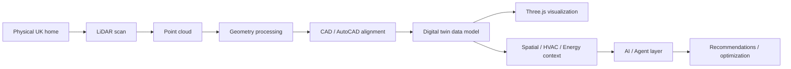
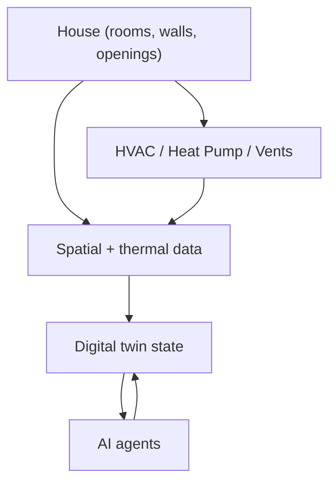
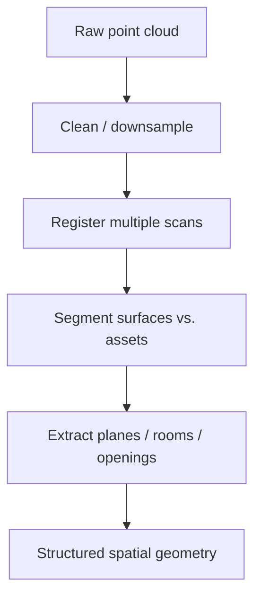
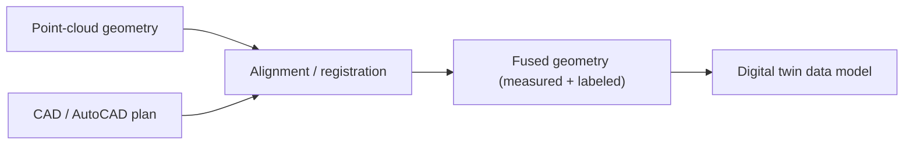
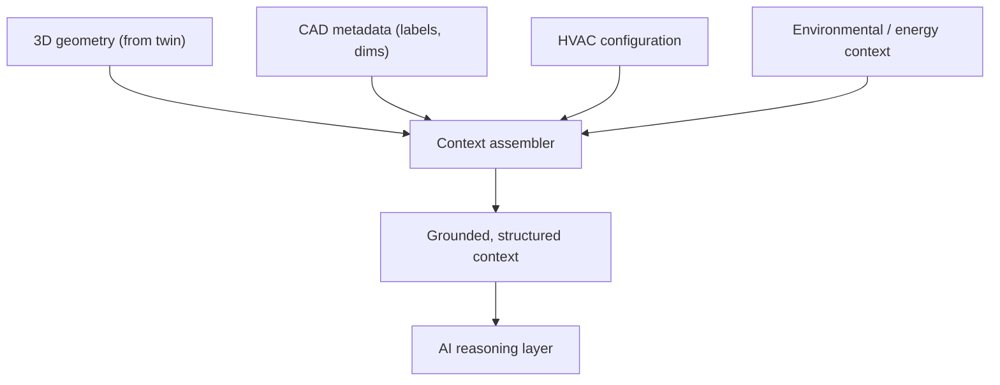
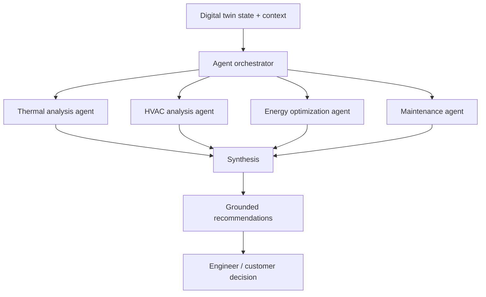

This is an engineering case study of **Project Blueprint** — an **AI-enabled residential digital-twin** system that combines mechanical engineering, LiDAR scanning, CAD/AutoCAD data, 3D visualization, and agentic AI to digitally represent UK homes and their **heating, cooling, and ventilation** infrastructure for **energy-aware optimization**.

Blueprint sits exactly at the intersection I care about: physical/mechanical engineering meets 3D reconstruction meets AI systems. This write-up explains the engineering pipeline stage-by-stage — how a physical home becomes a usable digital twin, and how an AI layer can reason over it.

### ⚠️ Status Convention (Read This First)

Blueprint is an **innovation / next-generation platform**, and this case study is precise about what stage each part is at. Every non-obvious claim is tagged:

- **[Implemented]** — built and working.
- **[Designed]** — architected/designed at engineering-decision level, not necessarily fully built.
- **[Proposed]** — a possible extension or capability, described as design intent — **not** claimed as deployed.
- **[Concept]** — general technical explanation so the architecture is understandable.
- **[Interpretation]** — my engineering reasoning about *why* a decision was made.

I do **not** claim any AI capability is deployed where my work is at the architecture/design stage. That distinction is the point of this document.

---

## Why This System Is Needed

The UK is decarbonizing home heating — heat pumps, ventilation upgrades, retrofits — and every home is physically different. To recommend the right HVAC/heat-pump/ventilation change for a specific house, you need an accurate **spatial and thermal model** of that house: its geometry, its existing systems, its constraints. **[Interpretation]**

A **digital twin** — a structured digital representation of the physical home and its systems — is the substrate that makes energy-aware reasoning possible: you can analyze, simulate, and optimize against the twin instead of the physical building. **[Concept]** Blueprint's goal is to build that twin from real capture data and then reason over it. **[Designed]**

## The End-to-End Pipeline

The system is a **capture → reconstruction → alignment → twin → visualization → context → AI** pipeline. Each stage is a distinct engineering problem. **[Designed]**

And the relationship between the physical assets and the reasoning layer:

## Stage 1 — LiDAR Scanning

### Why LiDAR

Photographs give you appearance; **LiDAR gives you geometry.** A LiDAR scanner measures distance by timing reflected light, producing accurate 3D spatial measurements of a space regardless of lighting or texture. For a digital twin, you need *metric* geometry — real dimensions of rooms, walls, ceiling heights, and the placement of physical assets — and that is exactly what LiDAR captures. **[Concept]**

### What a LiDAR Scan Provides

A scan yields a **point cloud**: a large set of 3D points $(x, y, z)$, often with intensity/color, sampling the surfaces of the space. **[Concept]** Practically, that gives room geometry, wall/floor/ceiling planes, openings (doors, windows), and the location and rough shape of installed equipment. **[Designed]**

## Stage 2 — Point-Cloud Representation and Geometry Processing

A raw point cloud is dense, noisy, and unstructured — it is *measurements*, not *meaning*. Turning it into usable geometry involves standard reconstruction steps: **[Concept]**

- **Cleaning / downsampling** — remove noise and reduce density to a workable resolution.
- **Registration** — align multiple scans into one coherent coordinate frame.
- **Segmentation** — separate structural surfaces (floors, walls, ceilings) from clutter and equipment.
- **Feature/plane extraction** — fit planes and detect openings to recover room structure.

The output is **structured spatial geometry** — rooms, boundaries, and asset locations — rather than an anonymous cloud of points. **[Designed]**

## Stage 3 — CAD / AutoCAD Integration and Alignment

Point clouds capture *what is actually there*; **CAD/AutoCAD floor plans capture design intent and semantics** — labeled rooms, dimensions, system layouts. Combining them gives a twin that is both **measured** (from LiDAR) and **semantically labeled** (from CAD). **[Interpretation]**

### Aligning Scanned Geometry with CAD Plans

The core problem is **registration between two coordinate systems**: the scan's frame and the CAD drawing's frame. Conceptually this means finding the rigid transform (scale, rotation, translation) that best overlays the scanned geometry onto the CAD plan using shared references — wall lines, corners, room boundaries — so the measured cloud and the designed plan describe the same space. **[Concept]** Where the scan and plan disagree, the scan is ground truth for *as-built* reality (homes rarely match their drawings exactly). **[Interpretation]**

## Stage 4 — The Digital-Twin Data Model

The twin is not a mesh; it's a **structured data model** of the home and its systems. **[Designed]** A defensible model represents: **[Interpretation]**

- **Spatial entities** — rooms, walls, floors, openings, with real dimensions.
- **Assets** — HVAC units, heat pumps, vents, radiators — as typed objects with properties (type, capacity, location) linked to their spatial position.
- **Relationships** — which vent serves which room, which room connects to which, how assets relate to the spaces they condition.
- **Context slots** — attachment points for thermal, energy, and (proposed) sensor data.

Representing physical assets digitally means each is a **typed node with attributes and spatial linkage**, so the twin can answer "which rooms does this heat pump serve, and how big are they?" — the kind of question energy reasoning depends on. **[Interpretation]**

## Stage 5 — Three.js Visualization

### Why Three.js

The twin needs an **interactive 3D representation in the browser** so engineers and customers can see the home, its HVAC layout, and proposed changes without specialist CAD software. **Three.js** is a mature, widely-supported WebGL library that renders 3D in any browser — the pragmatic choice for accessible, interactive visualization of residential spaces, HVAC systems, heat pumps, and ventilation layouts. **[Designed]** It keeps the twin **inspectable** to non-specialists, which matters for customer-facing energy conversations. **[Interpretation]**

## Stage 6 — Context Layers: Spatial, Thermal, Energy

The twin becomes *useful* when layered with context beyond geometry: **[Designed]**

| Context layer | What it holds |
|---|---|
| **Spatial** | Room geometry, volumes, adjacencies, asset placement **[Designed]** |
| **Thermal / HVAC** | Heating/cooling/ventilation configuration, heat-pump and vent characteristics **[Designed]** |
| **Energy** | Energy-relevant properties and constraints for optimization reasoning **[Designed]** |

## Stage 7 — Context Engineering and Multimodal AI

For an AI layer to reason about a home, it can't be handed a raw point cloud. **Context engineering** assembles a grounded, model-consumable representation from multiple modalities: **[Proposed]**

This is a **multimodal grounding** problem: combine 3D geometry, CAD metadata, HVAC configuration, and environmental context into a representation the AI can reason over to produce *grounded* recommendations rather than generic advice. **[Proposed]** The key engineering decision is that the AI reasons over a **structured twin state**, not raw geometry — the twin is the grounding. **[Interpretation]**

## Stage 8 — The Agent Layer (Design Intent)

The proposed AI layer is **agentic**: specialized agents reasoning over the twin state. **[Proposed]**

### Potential Specialized Agents

- **Thermal analysis** — reason about heat behavior across the home's spaces. **[Proposed]**
- **HVAC analysis** — reason about the existing heating/cooling/ventilation configuration. **[Proposed]**
- **Energy optimization** — propose energy-aware changes (e.g., heat-pump sizing/placement, ventilation adjustments). **[Proposed]**
- **Maintenance** — reason about upkeep of installed assets. **[Proposed]**

### The Critical Boundary: Deterministic Engineering vs. LLM Reasoning

This is the most important design principle, and the one an interviewer will push on: **not everything should be an LLM.** **[Interpretation]**

| Should be deterministic engineering | Should be LLM/agent reasoning |
|---|---|
| Geometry, dimensions, volumes, heat-load *calculations* | Interpreting results, explaining trade-offs |
| Physics/thermal formulas with known correct answers | Prioritizing options against customer constraints |
| Anything with a verifiable numeric answer | Synthesizing a recommendation narrative for a human |

Physical quantities have **correct answers** and belong to deterministic computation (the mechanical-engineering half of my background); the LLM's job is **interpretation, synthesis, and communication** on top of those trustworthy numbers — never re-deriving the physics. **[Interpretation]**

### How AI Recommendations Would Be Validated

Because recommendations affect real homes and money, validation is non-negotiable: **[Proposed]**

- **Ground every claim in the twin + deterministic calculations** — the LLM cites computed values, it doesn't invent them.
- **Human-in-the-loop** — an engineer/customer approves; the AI advises.
- **Evaluation** — the same discipline used elsewhere (metric-based evaluation, tracing) applied to recommendation quality and groundedness. **[Interpretation]**

## Human / Customer Interaction

The twin's Three.js view is the shared surface: an engineer or customer sees the home, its systems, and proposed changes, and a **human makes the decision**. The AI produces grounded options and explanations; it does not unilaterally act on a physical home. **[Designed]**

## Scaling, Consistency, and Security (Design Considerations)

### Scaling Across Thousands / Millions of Homes

- **Twin-per-home as data, not as a running process** — each home is a stored twin; processing (reconstruction, analysis) is batch/event-driven work that scales horizontally per home. **[Proposed]**
- **Reuse pipelines** — the capture→reconstruction→alignment pipeline is the same per home; only the data differs, so throughput scales with compute. **[Interpretation]**

### Handling Changing Physical State / Twin Consistency

A home changes (new heat pump, renovation), so the twin can drift from reality. The design answer is **re-capture and re-alignment** on change, treating the twin as a **versioned representation** rather than a one-time snapshot, with the latest scan as ground truth. **[Proposed]** Keeping twin and home consistent is fundamentally a **data-freshness** problem: define what triggers a re-scan and reconcile the new capture against the stored twin. **[Interpretation]**

### Securing Customer / Property Data

A home's geometry, systems, and location are sensitive personal/property data, so the same **secure-by-design** posture applies: access control scoped per customer/property, data isolation, and encryption — with the general principle that customer property data is treated as sensitive PII. **[Proposed]**

## Key Engineering Trade-offs

| Trade-off | The decision |
|---|---|
| Point cloud vs. structured twin | **Structured twin** — meaning, not measurements, is what AI and energy reasoning need **[Interpretation]** |
| LiDAR only vs. LiDAR + CAD | **Both** — LiDAR gives as-built truth, CAD gives semantics/labels; fuse them **[Interpretation]** |
| Native CAD viewer vs. Three.js | **Three.js** — browser-based, accessible to customers, no specialist software **[Designed]** |
| LLM does everything vs. deterministic + LLM | **Deterministic physics + LLM interpretation** — never let the model re-derive verifiable numbers **[Interpretation]** |
| One-time twin vs. versioned twin | **Versioned** — homes change; the twin must track physical state **[Proposed]** |
| Autonomous AI vs. human-in-the-loop | **Human-in-the-loop** — recommendations affect real homes; a person decides **[Designed]** |

## What I Personally Owned

I **architected the residential digital-twin workflow** combining mechanical engineering, 3D reconstruction, and AI engineering; **designed the LiDAR-to-digital-twin pipeline** (spatial scans + AutoCAD/CAD floor plans); **designed the interactive Three.js representation** of residential spaces, HVAC systems, heat pumps, and ventilation; **designed the agentic AI layer** for reasoning over spatial/HVAC/energy data; and applied **multimodal/context engineering** to combine 3D geometry, CAD metadata, HVAC configuration, and environmental context for grounded recommendations. **[Designed]** Consistent with the status convention above, the AI/agent reasoning is **design intent, not a deployed capability**. **[Interpretation]**

## Engineering Takeaways

1. **A digital twin is a data model, not a mesh.** Meaning (typed assets, relationships) is what makes it reason-about-able.
2. **LiDAR + CAD is measured truth + semantics.** Fuse as-built geometry with design labels; trust the scan where they disagree.
3. **Keep physics deterministic.** Verifiable numbers belong to computation; the LLM interprets and communicates.
4. **Ground the AI in the twin.** Multimodal context engineering turns geometry + metadata + HVAC config into something a model can reason over.
5. **Twins drift; version them.** Consistency with the physical home is a data-freshness problem, solved by re-capture and reconciliation.
6. **Keep a human at the decision.** Recommendations affect real homes — the AI advises, a person decides.

The through-line: an AI-enabled digital twin is a **layered engineering system** — accurate capture, structured reconstruction, semantic fusion, an inspectable twin, and an AI layer that reasons *over grounded state* while deterministic engineering keeps the physics honest. Blueprint's AI layer is **designed to that standard**, and this document is explicit about what is built versus designed versus proposed. **[Interpretation]**
