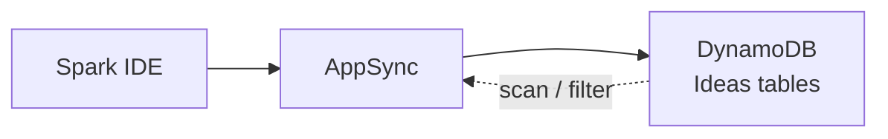
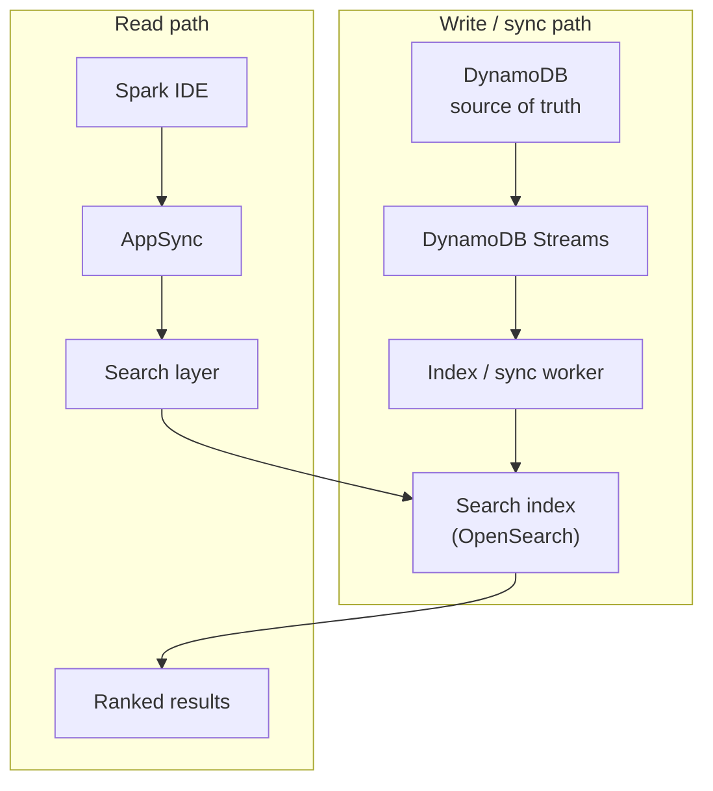
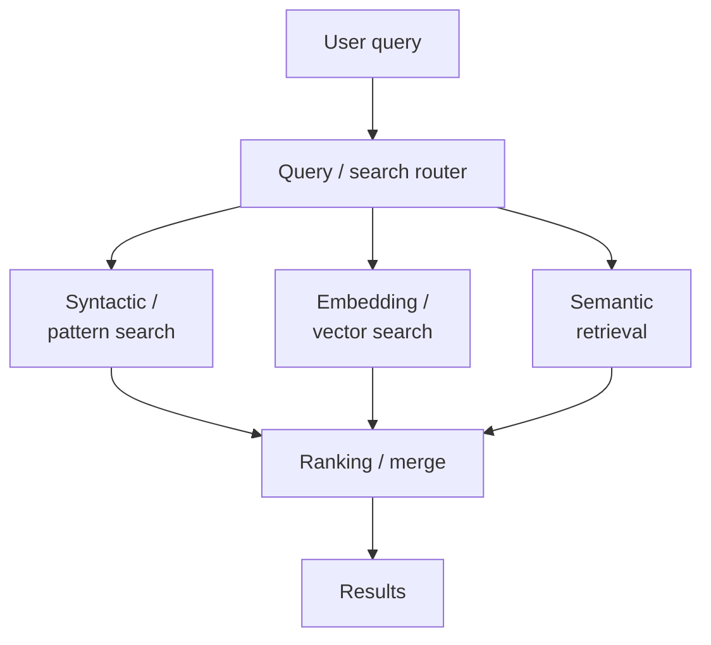
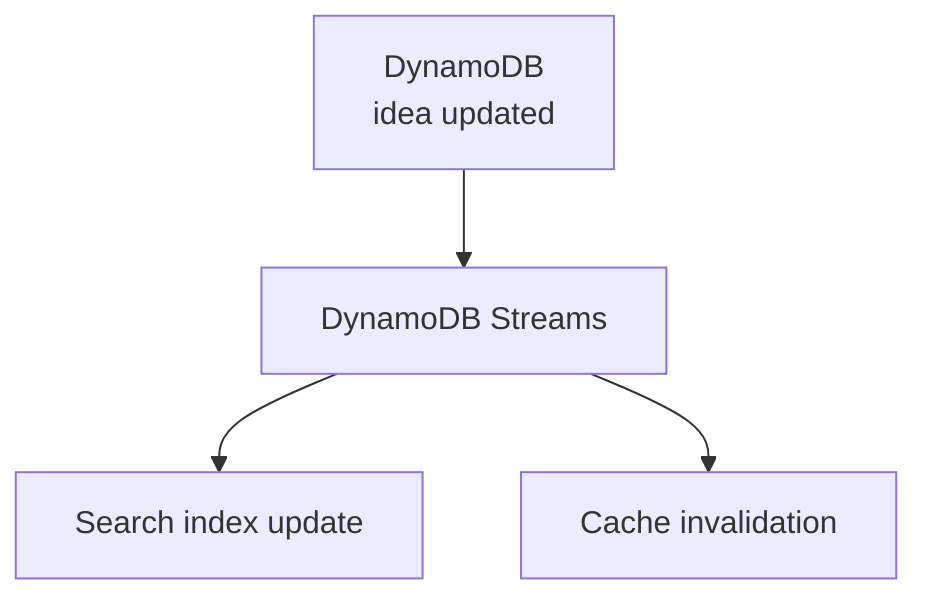
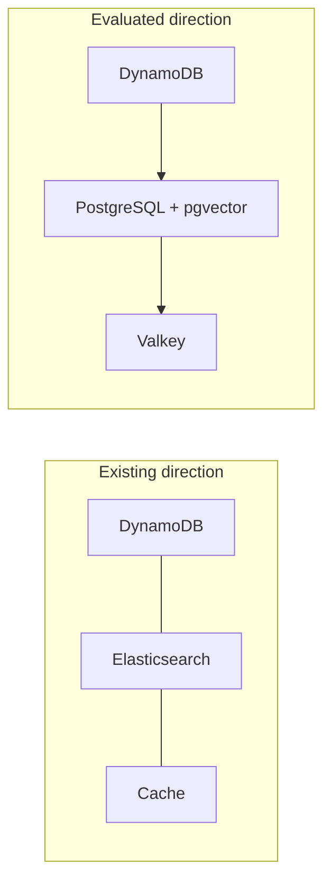
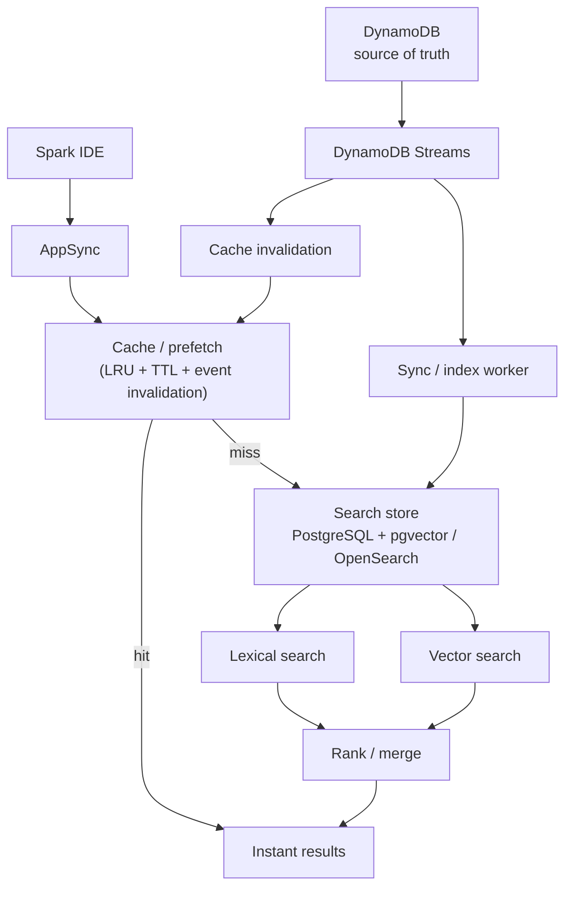

This is an engineering case study of how the **search architecture** behind **Spark** — the internal AI innovation platform I built for an enterprise client — evolved from a naïve read path into a deliberate, layered, low-latency search system. By the time this mattered, Spark held **more than 30,000 ideas**, and "find the right idea instantly" had quietly become one of the hardest engineering problems on the platform.

The interesting part is not "we added a search box." It's that **serving an interactive, search-heavy workload is a fundamentally different job than storing durable application data** — and the architecture had to grow, phase by phase, to reflect that. This case study walks through each phase: what we had, the problem we hit, what changed, and why it improved the system.

**Attribution convention.** Every non-obvious claim is tagged:

- **[Implemented]** — architecture / engineering decisions on this platform.
- **[Concept]** — general explanation of how a technology works, included so the architecture is understandable.
- **[Interpretation]** — my engineering reasoning about *why* a decision was made.
- **[Evaluation]** — a direction we assessed; **not** a claim that a migration is complete.

I do not invent latency numbers, benchmarks, throughput figures, costs, or components beyond the documented work and the architectural directions we actually evaluated.

<style>
.ss-hero{border:1px solid #e5e7eb;border-radius:16px;background:linear-gradient(135deg,#0f172a,#1e293b);padding:26px 22px 30px;margin:1.6rem 0;color:#e5e7eb;box-shadow:0 10px 30px rgba(15,23,42,.18)}
.ss-hero-bar{display:flex;align-items:center;gap:12px;background:#f8fafc;border:2px solid #3b82f6;border-radius:999px;padding:12px 20px;box-shadow:0 6px 18px rgba(59,130,246,.25)}
.ss-hero-icon{font-size:1.15rem;line-height:1}
.ss-hero-query{font-family:Georgia,serif;font-size:1.08rem;color:#1f2937;white-space:nowrap;overflow:hidden}
.ss-hero-cursor{color:#3b82f6;font-weight:700;margin-left:1px}
.ss-hero-cursor.ss-blink{animation:ssblink 1s step-end infinite}
@keyframes ssblink{50%{opacity:0}}
.ss-hero-state{margin:16px 4px 8px;font-size:.86rem;letter-spacing:.04em;text-transform:uppercase;color:#7dd3fc;min-height:1.1em;text-align:left}
.ss-hero-results{list-style:none;margin:0;padding:0;display:flex;flex-direction:column;gap:9px}
.ss-hero-results li{display:flex;align-items:center;gap:12px;background:rgba(148,163,184,.10);border:1px solid rgba(148,163,184,.20);border-radius:10px;padding:10px 14px;opacity:0;transform:translateY(8px);transition:opacity .35s ease,transform .35s ease}
.ss-hero-results li.ss-show{opacity:1;transform:none}
.ss-dot{width:11px;height:11px;border-radius:50%;background:#3b82f6;flex:none;box-shadow:0 0 10px rgba(59,130,246,.7)}
.ss-hero-results li .ss-label{font-family:Georgia,serif}
.ss-hero-results li .ss-rel{margin-left:auto;height:8px;border-radius:6px;background:linear-gradient(90deg,#3b82f6,#22d3ee)}

.ss-cache{border:1px solid #e5e7eb;border-radius:14px;padding:18px;margin:1.4rem 0;background:#ffffff}
.ss-cache-controls{display:flex;flex-wrap:wrap;gap:10px;margin-bottom:16px}
.ss-btn{font-family:Georgia,serif;cursor:pointer;border:1px solid #cbd5e1;background:#f8fafc;color:#1f2937;border-radius:10px;padding:9px 15px;font-size:.95rem;transition:background .2s,border-color .2s}
.ss-btn:hover{border-color:#3b82f6}
.ss-btn.ss-active{background:#3b82f6;border-color:#3b82f6;color:#fff}
.ss-cache-steps{list-style:none;display:flex;flex-wrap:wrap;gap:8px;padding:0;margin:0}
.ss-cache-steps li{flex:1;min-width:82px;text-align:center;border:1px solid #e5e7eb;border-radius:10px;padding:10px 6px;font-size:.82rem;color:#64748b;background:#f8fafc;transition:all .3s ease}
.ss-cache-steps li.ss-lit{background:#3b82f6;border-color:#3b82f6;color:#fff;box-shadow:0 4px 14px rgba(59,130,246,.35)}
.ss-cache-steps li.ss-skip{opacity:.35;text-decoration:line-through}
.ss-cache-verdict{margin-top:14px;font-family:Georgia,serif;font-size:.95rem;min-height:1.4em;color:#334155}
.ss-cache-verdict b{color:#2563eb}

.ss-tabs{border:1px solid #e5e7eb;border-radius:14px;padding:8px;margin:1.4rem 0;background:#ffffff}
.ss-tabbar{display:flex;flex-wrap:wrap;gap:6px;border-bottom:1px solid #e5e7eb;padding:4px 4px 10px}
.ss-tab{font-family:Georgia,serif;cursor:pointer;border:1px solid transparent;background:transparent;color:#64748b;border-radius:9px;padding:8px 13px;font-size:.92rem}
.ss-tab.ss-active{background:#eff6ff;color:#1d4ed8;border-color:#bfdbfe}
.ss-tabpanel{display:none;padding:14px 8px 8px;font-family:Georgia,serif}
.ss-tabpanel.ss-active{display:block}
.ss-tabpanel .ss-kw{color:#2563eb;font-weight:700}

.ss-phase{opacity:1}
.ss-reveal{opacity:0;transform:translateY(14px);transition:opacity .5s ease,transform .5s ease}
.ss-reveal.ss-in{opacity:1;transform:none}

body.dark-mode .ss-cache,body.dark-mode .ss-tabs{background:#1e293b;border-color:#374151}
body.dark-mode .ss-btn{background:#0f172a;border-color:#334155;color:#e5e7eb}
body.dark-mode .ss-cache-steps li{background:#0f172a;border-color:#334155;color:#94a3b8}
body.dark-mode .ss-cache-verdict{color:#cbd5e1}
body.dark-mode .ss-tab{color:#94a3b8}
body.dark-mode .ss-tab.ss-active{background:#1d283a;color:#93c5fd;border-color:#334155}
@media (max-width:600px){.ss-cache-steps li{min-width:64px;font-size:.74rem}.ss-hero-query{font-size:.95rem}}
@media (prefers-reduced-motion:reduce){
  .ss-hero-results li{opacity:1;transform:none;transition:none}
  .ss-hero-cursor.ss-blink{animation:none}
  .ss-reveal{opacity:1;transform:none;transition:none}
  .ss-cache-steps li{transition:none}
}
</style>

## Search, in one motion

Before the architecture, here is the experience we were engineering toward — a person types a question and the *right ideas* come back, ranked, without waiting.

<div id="ss-hero" class="ss-hero" markdown="0"><div class="ss-hero-bar"><span class="ss-hero-icon" aria-hidden="true">🔍</span><span class="ss-hero-query" id="ss-hero-query"></span><span class="ss-hero-cursor ss-blink" id="ss-hero-cursor" aria-hidden="true">&#124;</span></div><div class="ss-hero-state" id="ss-hero-state" role="status" aria-live="polite">Ready</div><ul class="ss-hero-results" id="ss-hero-results" aria-label="Search results"></ul></div>

Everything below is how we made that motion cheap, correct, and fast at 30,000+ ideas.

## Phase 1 — The original search path

The first version of Spark's search path was simple: the IDE queried through **AppSync**, which ultimately reached **DynamoDB**. **[Implemented]**



DynamoDB is an excellent **operational** database — durable, predictable, great for reading and writing an idea by key. **[Concept]** The problem was that we were increasingly asking it to serve an *interactive, search-heavy* workload on top of that. **[Interpretation]**

As Spark grew past 30,000 ideas, "search" stopped meaning one thing. Users wanted:

- exact text matching
- partial matching
- regex / pattern search
- relevance ranking
- similarity search
- semantic retrieval
- filtering
- vector search

Those are **information-retrieval** operations, not point reads. **[Concept]** Forcing a key–value/operational store to do all of them meant expensive scans and no real ranking — the workload had outgrown the datastore's job description. **[Interpretation]**

## Phase 2 — Separate the source of truth from the search read model

The key move was **not** "replace DynamoDB." It was to *separate concerns*: keep DynamoDB as the authoritative **source of truth**, and maintain a purpose-built **search read model** beside it. **[Implemented]**

We use **DynamoDB Streams** as the change feed. Every create/update to an idea emits a change event; an indexing/sync worker consumes it and updates a dedicated search index (a search engine such as **OpenSearch / Elasticsearch**). **[Implemented]**



The mental model is a classic distributed-systems pattern — **primary database → change stream → specialized read model**: **[Concept]**

- **DynamoDB** stays optimized for durable application data.
- **OpenSearch** is a *derived representation* optimized for searching that data.

Now a new idea propagates deterministically:


Nobody hand-maintains two databases from application code — the stream *is* the contract between the write model and the read model. **[Interpretation]** This is essentially a **CQRS / materialized-read-model** architecture adapted for search. **[Concept]**

## Phase 3 — Search is not one operation: multiple retrieval modes

Once retrieval lived in its own layer, it became obvious that different queries want different mechanisms. So the read path routes a query into the retrieval mode that fits it, then merges and ranks. **[Implemented]**



### Syntactic / pattern search

The most literal mode: match the actual characters, tokens, or patterns. When an engineer searches `KVCache`, they expect to hit the family of literal forms: **[Concept]**

```text
KVCache
kv_cache
KVCacheManager
PagedKVCache
```

It also covers regex/pattern queries like `gpu.*memory`. There is no *understanding* here — if a document says "GPU memory optimization" and the user types "graphics processor memory", pure syntactic search may miss the link. It is invaluable precisely *when the user already knows the terminology*. **[Interpretation]**

### Embedding / vector search

Instead of comparing strings, we convert text into vectors and compare *positions in space*. **[Concept]**

```text
Document -> embedding model -> [0.13, -0.82, 0.44, ...]
Query    -> embedding model -> [0.11, -0.79, 0.48, ...]
Vectors  -> nearest-neighbor search -> most similar documents
```

So a stored idea like *"Optimizing KV-cache memory utilization during long-context inference"* can be retrieved by a query like *"How can I reduce memory consumption when serving long prompts?"* — even with almost no shared words. **[Concept]**

### Semantic retrieval

Semantic retrieval asks the higher-level question: *which ideas are relevant to what the user means?* **[Concept]** A query like "What can make LLM inference faster?" can surface:

```text
KV-cache optimization
Continuous batching
PagedAttention
Tensor parallelism
GPU memory optimization
```

…none of which the user typed verbatim. In practice, **embedding search is often the mechanism that implements semantic retrieval** — these are not separate technologies so much as related layers. **[Concept]** The strongest read path is usually **hybrid**: run lexical and vector retrieval, then merge and rank the two together rather than picking only one. **[Interpretation]**

## Phase 4 — Caching: stop recomputing the same request

At 30,000+ ideas and an interactive IDE, the same effective request recurs constantly — *"Find ideas related to GPU inference optimization"* gets asked over and over. The first time, it runs the full pipeline; after that, we don't want to recompute everything. **[Interpretation]**

Try both paths — the first request is a **cache miss** (full pipeline), a repeated request is a **cache hit** (returned immediately):

<div id="ss-cache" class="ss-cache" markdown="0"><div class="ss-cache-controls"><button class="ss-btn ss-active" data-mode="miss" type="button">New query &mdash; cache MISS</button><button class="ss-btn" data-mode="hit" type="button">Repeat query &mdash; cache HIT</button></div><ol class="ss-cache-steps" id="ss-cache-steps"><li data-step="query">Query</li><li data-step="cache">Cache</li><li data-step="search">Search</li><li data-step="process">Process</li><li data-step="store">Store</li><li data-step="response">Response</li></ol><div class="ss-cache-verdict" id="ss-cache-verdict"></div></div>

Crucially, these are **not one generic cache** — different layers solve different latency problems: **[Concept]**

- **Query / result caching** — avoids running the same search again.
- **Embedding caching** — avoids recomputing embeddings for the same text.
- **Prompt / prefix caching** — for the LLM layer, avoids recomputing a large stable prompt prefix (system prompt + instructions + context) when only the user's question changes.
- **Response caching** — avoids invoking the LLM at all when a previous answer can be safely reused.

Prompt/prefix caching is worth calling out because its "validity" question is different: the cached prefix is reusable only while that prefix is unchanged, so you don't blindly apply an eviction policy to it. **[Concept]**

## Cache correctness: eviction ≠ expiration ≠ invalidation

The most common mistake is to say "we use LRU" and stop. LRU is the right *eviction* policy for a bounded cache, but eviction is not the same problem as correctness. **[Interpretation]** Three distinct mechanisms, three distinct questions:

<div class="ss-tabs" markdown="0"><div class="ss-tabbar" role="tablist"><button class="ss-tab ss-active" data-tab="lru" role="tab" type="button">LRU &middot; Eviction</button><button class="ss-tab" data-tab="ttl" role="tab" type="button">TTL &middot; Expiration</button><button class="ss-tab" data-tab="inv" role="tab" type="button">Change event &middot; Invalidation</button></div><div class="ss-tabpanel ss-active" id="ss-tab-lru" role="tabpanel"><span class="ss-kw">"We're out of cache space &mdash; what do we remove?"</span> Least-Recently-Used evicts the coldest entry when the cache is full. It decides what to <em>drop</em>, not what is <em>correct</em>. A hot-but-stale entry will survive LRU indefinitely.</div><div class="ss-tabpanel" id="ss-tab-ttl" role="tabpanel"><span class="ss-kw">"This entry is too old."</span> A time-to-live forces expiry after a fixed window regardless of how often it's read &mdash; the safety net LRU can't provide. Combine them: <em>LRU + TTL</em>.</div><div class="ss-tabpanel" id="ss-tab-inv" role="tabpanel"><span class="ss-kw">"The underlying data changed, so this entry is no longer valid."</span> We already have a change feed &mdash; DynamoDB Streams &mdash; so the <em>same</em> event that updates the search index can invalidate affected cache entries. Event-driven invalidation is the strongest of the three.</div></div>

Because the change stream already exists, invalidation is nearly free — one event fans out to both the index update and the cache: **[Interpretation]**



So the honest one-liner is: **LRU for eviction, TTL for expiration, and stream-driven events for invalidation** — combined, not substituted. **[Interpretation]**

## Phase 5 — Cost and infrastructure: an evaluated direction

Running a dedicated search cluster (OpenSearch / Elasticsearch) earns its complexity at very large scale, high search throughput, or sophisticated relevance needs. For a *moderate* search workload, we evaluated whether a simpler, consolidated stack could serve Spark's search at lower operational cost. **[Evaluation]**



The consolidation idea: **[Evaluation]**

- **PostgreSQL (RDS / Aurora)** as the primary searchable store — full-text and regex/pattern search built in.
- **pgvector** to store embeddings *inside* PostgreSQL and do vector similarity search — folding structured data, lexical search, and vector search into one system.
- **Valkey** in front as a low-latency cache/prefetch layer for hot results and embeddings.
- **DynamoDB can remain the source of truth**, with the same Streams-driven synchronization keeping the read model current.

The important caveat, stated plainly: **this is a direction we evaluated, not a completed migration, and I would not claim guaranteed savings.** Whether it is actually cheaper depends on query volume, data size, indexing and HA requirements, and the current deployment. **[Evaluation]**

### A scaling nuance worth being precise about

If Aurora Serverless enters the picture, it is tempting to describe it as "Lambda for databases." That mental model is wrong. **[Concept]** Aurora Serverless primarily gives **automatic compute-capacity scaling within the Aurora architecture** (compute and storage decoupled), not the near-unbounded, per-request horizontal fan-out that Lambda provides. A relational database still lives under real constraints — connections, transactions, locks, CPU/memory/IO, query concurrency, and the vector-search workload itself. **[Concept]** So "scales automatically" is true in a bounded, capacity-adjusting sense — not "one database becomes infinitely many." **[Interpretation]**

## The current, layered search architecture

Putting every phase together, the read path becomes deliberate rather than accidental — a cache in front, hybrid retrieval behind it, and a stream-fed read model underneath:



We attack latency at several independent points rather than betting on one trick: a **specialized read model** (not scanning the operational store), **hybrid retrieval** (the right index for the query), and **layered caching** (query, embedding, prompt/prefix, response) kept correct by **stream-driven invalidation**. **[Interpretation]**

## Key takeaways

- **Search is a different workload than storage.** The single most valuable move was refusing to make DynamoDB do two opposite jobs. **[Interpretation]**
- **A change stream is architecture, not plumbing.** DynamoDB Streams became the contract that keeps the read model current *and* invalidates the cache. **[Interpretation]**
- **"Search" is plural.** Syntactic, vector, and semantic retrieval each answer a different question; hybrid ranking beats picking one. **[Concept]**
- **Caching has three separate correctness questions.** Eviction (LRU), expiration (TTL), and invalidation (events) are not interchangeable. **[Interpretation]**
- **Consolidation is an evaluation, not a guarantee.** PostgreSQL + pgvector + Valkey is worth benchmarking against a dedicated search cluster — but savings depend entirely on the real workload. **[Evaluation]**

## Related work on this site

- [Spark — AI Innovation Platform](/projects/centrica-spark-ai-innovation-platform/) — the multi-agent platform this search engine serves.
- [vLLM / PagedAttention](/engineering/vllm-pagedattention-efficient-memory-management-for-llm-serving/) and [SGLang / RadixAttention](/engineering/sglang-radixattention-structured-lm-program-execution/) — the prefix/prompt-caching mechanisms referenced in Phase 4.
- [TurboQuant](/engineering/turboquant-near-optimal-vector-quantization-kv-cache-simplemem/) — near-optimal vector quantization, relevant to compressing the embedding index behind vector search.

<script>
(function(){
  var reduce = window.matchMedia && window.matchMedia("(prefers-reduced-motion: reduce)").matches;

  // ---- Hero typing + results reveal ----
  (function(){
    var q = document.getElementById("ss-hero-query");
    var state = document.getElementById("ss-hero-state");
    var list = document.getElementById("ss-hero-results");
    var cursor = document.getElementById("ss-hero-cursor");
    if(!q||!state||!list) return;
    var scenes = [
      {text:"Where is the idea for reducing GPU inference latency?",
       results:[["GPU inference optimization",100],["KV-cache optimization",84],["Continuous batching",66],["PagedAttention",52]]},
      {text:"How do we make LLM serving cheaper?",
       results:[["Quantization",100],["Prompt / prefix caching",80],["Continuous batching",70],["PagedAttention",55]]}
    ];
    function render(scene, animate){
      list.innerHTML = "";
      scene.results.forEach(function(r){
        var li = document.createElement("li");
        var dot = document.createElement("span"); dot.className="ss-dot";
        var lab = document.createElement("span"); lab.className="ss-label"; lab.textContent=r[0];
        var rel = document.createElement("span"); rel.className="ss-rel"; rel.style.width=(30+r[1]*0.9)+"px";
        li.appendChild(dot); li.appendChild(lab); li.appendChild(rel);
        if(!animate) li.classList.add("ss-show");
        list.appendChild(li);
      });
    }
    if(reduce){
      q.textContent = scenes[0].text; state.textContent="Ranked results";
      cursor.classList.remove("ss-blink"); render(scenes[0], false); return;
    }
    var si=0;
    function runScene(){
      var scene = scenes[si];
      q.textContent=""; state.textContent="Ready"; list.innerHTML="";
      var i=0;
      (function type(){
        if(i<=scene.text.length){
          q.textContent = scene.text.slice(0,i); i++;
          setTimeout(type, 45);
        } else {
          state.textContent="Searching / ranking…";
          setTimeout(function(){
            render(scene, true);
            var items = list.querySelectorAll("li");
            items.forEach(function(li,idx){ setTimeout(function(){ li.classList.add("ss-show"); }, 160*idx); });
            state.textContent="Ranked results";
            setTimeout(function(){ si=(si+1)%scenes.length; runScene(); }, 2600);
          }, 620);
        }
      })();
    }
    runScene();
  })();

  // ---- Cache hit/miss demo ----
  (function(){
    var wrap = document.getElementById("ss-cache");
    var stepsEl = document.getElementById("ss-cache-steps");
    var verdict = document.getElementById("ss-cache-verdict");
    if(!wrap||!stepsEl||!verdict) return;
    var steps = Array.prototype.slice.call(stepsEl.querySelectorAll("li"));
    var btns = wrap.querySelectorAll(".ss-btn");
    var timers = [];
    function clearTimers(){ timers.forEach(clearTimeout); timers=[]; }
    function reset(){ steps.forEach(function(s){ s.classList.remove("ss-lit","ss-skip"); }); }
    function run(mode){
      clearTimers(); reset(); verdict.innerHTML="";
      var order = mode==="hit" ? ["query","cache","response"] : ["query","cache","search","process","store","response"];
      if(mode==="hit"){ steps.forEach(function(s){ if(["search","process","store"].indexOf(s.dataset.step)>-1) s.classList.add("ss-skip"); }); }
      var delay = reduce ? 0 : 340;
      order.forEach(function(name,idx){
        timers.push(setTimeout(function(){
          var el = steps.filter(function(s){return s.dataset.step===name;})[0];
          if(el) el.classList.add("ss-lit");
          if(idx===order.length-1){
            verdict.innerHTML = mode==="hit"
              ? "<b>Cache HIT</b> &mdash; the cached result is returned immediately; search and compute are skipped."
              : "<b>Cache MISS</b> &mdash; the full pipeline runs once, then the result is stored so the next identical query becomes a HIT.";
          }
        }, delay*idx));
      });
    }
    btns.forEach(function(b){
      b.addEventListener("click", function(){
        btns.forEach(function(x){x.classList.remove("ss-active");});
        b.classList.add("ss-active");
        run(b.dataset.mode);
      });
    });
    run("miss");
  })();

  // ---- Invalidation tabs ----
  (function(){
    var tabs = document.querySelectorAll(".ss-tab");
    if(!tabs.length) return;
    tabs.forEach(function(t){
      t.addEventListener("click", function(){
        tabs.forEach(function(x){x.classList.remove("ss-active");});
        document.querySelectorAll(".ss-tabpanel").forEach(function(p){p.classList.remove("ss-active");});
        t.classList.add("ss-active");
        var panel = document.getElementById("ss-tab-"+t.dataset.tab);
        if(panel) panel.classList.add("ss-active");
      });
    });
  })();

  // ---- Scroll reveal for mermaid diagrams (subtle) ----
  (function(){
    if(reduce || !("IntersectionObserver" in window)) return;
    var targets = document.querySelectorAll(".post-content .mermaid-diagram, .lab-paper-detail-body .mermaid-diagram");
    targets.forEach(function(el){ el.classList.add("ss-reveal"); });
    var io = new IntersectionObserver(function(entries){
      entries.forEach(function(e){ if(e.isIntersecting){ e.target.classList.add("ss-in"); io.unobserve(e.target); } });
    }, {threshold:0.15});
    targets.forEach(function(el){ io.observe(el); });
  })();
})();
</script>
